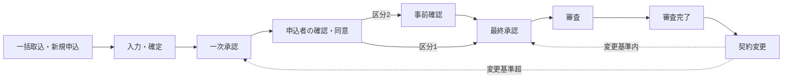

# 申込管理システム（JavaServletSample2）

申込の取込・入力から社内承認（一次・最終）、申込者の確認・同意、審査担当部門による事前確認・審査、審査完了後の契約変更までを 24 のステータス（取消を含む）で管理するシステムの設計・実装リポジトリ。

## 現在の状態

- 基本設計：版 0.10（[docs/README.md](docs/README.md)）。業務ルールの未決事項は [99. 未決事項](docs/basic-design/99-open-issues.md) で管理している。
- 実装：動作確認用のサンプル実装（版 0.2.0）。設計書の全画面（SC01〜SC16、AP01〜AP09）、外部 IF（IF01〜IF05）、バッチ（BT01／BT02）を実装し、Docker Compose で起動できる。申込に対する操作は申込メニュー（SC14）に集約し、申込全体の操作（契約変更・追加申込・メンテナンス）と手続きごとの領域（新規申込、契約変更 1、契約変更 2 …。折りたたみ可）に分けて表示する（タイルは固定で活性・非活性だけが変わる）。申込入力画面へは申込内容確認（SC05／SC09）の「修正」から進む。申込者は一次承認後に発行されるアカウントで申込者ページ（`/my/`）にログインできる。要件は変わる可能性があるため、業務ルールは設計書を正とし、実装はそれに追従させる。

## 技術スタック（確定）

| 分類 | 採用 |
| --- | --- |
| 言語・Web | Java 17、Servlet 4.0／JSP 2.3／JSTL 1.2（`javax.*`） |
| AP サーバ | Apache Tomcat 9.0 |
| DB | Microsoft SQL Server 2019（スキーマと初期データは起動時に Flyway で適用） |
| 画面 | Bootstrap 4.6（`src/main/webapp/static/vendor` に同梱）、jQuery 3.7 slim |
| ビルド | Maven（WAR パッケージ） |
| 開発環境 | Docker Compose（SQL Server 2019 ＋ Tomcat 9 ＋ Mailpit） |

## クイックスタート（Docker）

Docker Desktop または Docker Engine（compose v2）が必要。

```bash
docker compose up --build
```

初回は SQL Server の起動とデータベース作成（`db-init`）、WAR のビルドに数分かかる。`app` のログに「初期化が完了しました」と出たら利用できる。

| URL | 内容 |
| --- | --- |
| http://localhost:8080/emp/login | 申込受付会社向け画面（ログイン） |
| http://localhost:8080/my/login | 申込者向け画面（ログイン。ユーザー ID は申込者番号、初期パスワードは申込者アカウント通知のメールに記載） |
| http://localhost:8025 | Mailpit（送信された通知メールの確認。確認用 URL もここで見られる） |
| `localhost:1433` | SQL Server（`sa` ／ `SaPassw0rd!2026`、データベース `appmgmt`） |

ポートやパスワードを変える場合は `.env.example` を `.env` にコピーして編集する。データは Docker volume `mssql-data` に残る。初期化し直す場合は `docker compose down -v`。

### サンプルの社員（パスワードはすべて `password`）

| 社員番号 | 氏名 | 会社区分 | 部署 | 権限 |
| --- | --- | --- | --- | --- |
| A001 | 会社A 担当 太郎 | 会社A（事前確認なし） | 営業部（100） | 担当者 |
| A002 | 会社A 承認 一郎 | 会社A | 営業部（100） | 承認者 |
| A003 | 会社A 承認 二郎 | 会社A | 営業部（100） | 承認者 |
| A009 | 会社A 管理 花子 | 会社A | 管理部（900） | 管理者 |
| B001 | 会社B 担当 次郎 | 会社B（事前確認あり。申込に追加項目あり） | 営業部（200） | 担当者 |
| B002 | 会社B 承認 三郎 | 会社B | 営業部（200） | 承認者 |
| B003 | 会社B 承認 四郎 | 会社B | 営業部（200） | 承認者 |

会社B の申込は、申込内容に会社B だけの追加項目（法人番号・設置場所・窓口メモ。サンプル、任意）を入力する（項目を使った制御はない）。部署マスタ（SC16）には上表の 3 部署、承認ルートマスタには会社ごとに一次承認（承認者 1 名）と最終承認（承認者 2 名）のテンプレートが入っている。申込者は初期データに持たない。申込者名・連絡先は新規申込の登録時に申込データ（申込内容の版）として入力し、申込者ページのログイン用データ（申込者番号＝ユーザー ID、パスワード）は一次承認が通ったときに申込者アカウントとして発行する（申込者番号は C0000000001 から採番）。

### 動きを確認する手順（新規申込〜審査完了〜契約変更）

1. **A001** でログインし、「新規申込」で申込者情報（申込者名・メールアドレスなど）と金額を入力して「確認へ」→「確定」（10201 一次承認申請待ち）。この時点では申込者アカウントは未発行（申込者番号なし）。画面上部の「担当（申込受付会社）」で会社 > 部署 > 担当者を選べる（既定はログインユーザー。部署は担当者の所属と違ってよい。変更できるのは入力中だけで、担当者を別の社員にすると保存後はその社員だけが操作できる）。新規申込は同じ氏名・メールアドレスでも別の申込者として扱う。同じ申込者の申込は、審査完了した申込のメニューの「追加申込」で作る（アカウントを引き継ぎ、申込者情報・申込内容は複写した別データ）。
2. 一覧で申込を選ぶと申込メニュー（SC14）が開く。入力し直すときは「申込内容確認」→「修正」で入力中へ戻す（メニューに入力画面へのボタンはない。申込詳細 SC03 は末尾の開発者向けリンク）。「承認フロー」で回付先（初回はテンプレートの初期値 A002。2 回目以降は前回使った回付先が出る。最大 5 階層）を確認して「申請」（10202）。申請後も A001 は「承認フロー」で状況を確認できる（申請ボタンは非活性）。
3. **A002** でログインし、一覧の「自分の操作待ち」から申込を開いて「承認フロー」→「承認」（10301 申込内容確認待ち。申込者宛の確認依頼と、申込がアカウントに紐づいていなければアカウントを発行して申込者アカウント通知（ユーザー ID と初期パスワード）が通知に積まれる）。
4. 申込者として確認・同意する。方法は 2 つ。(a) 確認用 URL を開く（メニュー「開発支援 → 通知一覧」の「申込者向け画面を開く」か、Mailpit のメールのリンク）。(b) http://localhost:8080/my/login に申込者番号と初期パスワード（通知一覧または Mailpit で確認）でログインし、メニューの「内容確認・同意」から。どちらも「確定」→「同意する」（会社A は 10501 最終承認申請待ち、会社B は 10401 事前確認待ち）。申込者メニューは「お知らせ」タブと「メニュー」タブを切り替えられる。
5. **A001** の申込メニューで「承認フロー」（最終承認：A002 → A003）。**A002** が「承認」、**A003** が「審査申請」（10601 審査中。審査依頼が外部連携に積まれ、BT02 がモックへ送る）。
6. メニュー「開発支援 → 審査担当部門システム（モック）」で「BT02 を今すぐ実行」し、結果待ちの依頼に「COMPLETED（審査完了）」を返す（10701 審査完了）。
7. **A001** の申込メニューで「契約変更」（申込全体の操作）→ 金額を変更して「確認へ」→「確定」。メニューには「契約変更1」の領域が増え、その中の「契約変更内容確認」「承認フロー」などを使う。基準版の 1.5 倍以上なら 20201（一次承認からやり直し）、未満なら 20501（会社A）／20401（会社B）へ進む。以降は新規申込と同じ流れ。

会社B（B001）で同じ操作をすると、同意後に事前確認待ち（10401）になり、モックで「NG（修正必要）」を返すと修正対応待ち（10402）→「修正対応」で再依頼、という事前確認の流れを確認できる。一括取込は「一括取込」メニューに表示されるサンプル CSV を使う。申込メニューの「申込取消」は申込を取消（90101）にし、契約変更中は「契約変更の取消」として契約変更前の審査完了状態へ戻す。「メンテナンス」では申込者への通知の履歴を見られ、申込者ページのパスワードを初期化できる（新しい初期パスワードは通知一覧または Mailpit で確認）。全体修正で変えた項目は申込内容確認で赤字になる。

### 外部 IF を直接呼ぶ

審査結果の受信 IF（IF02／IF04）は HTTP でも呼べる。受付番号と依頼 ID はモック画面または申込詳細の外部連携に表示される。

```bash
curl -X POST http://localhost:8080/api/external/review-result \
  -H "Content-Type: application/json" \
  -d '{"externalReceiptNo":"MOCK-20261002181000-5","requestId":5,"result":"COMPLETED","resultAt":"2026-10-02T18:30:00+09:00"}'
```

`EXTAPI_INBOUND_API_KEY` を設定すると `X-API-Key` ヘッダの検証を行う（既定は検証なし）。

## Docker なしで起動する（組込み Tomcat ＋ H2）

JDK 17 以上と Maven があれば、SQL Server の代わりに H2 インメモリ DB（SQL Server 互換モード）で起動できる。DB は JVM 終了で消える。

```bash
mvn -Plocal            # http://localhost:8080/emp/login
mvn -Plocal -Dlocal.port=9090
```

メールはログ出力のみ（`mail.mode=log`）、審査担当部門システムはモック。確認用 URL は「開発支援 → 通知一覧」から開く。

## 設定

`src/main/resources/application.properties` の値を環境変数（`db.url` → `DB_URL` のようにドットとハイフンをアンダースコア、大文字にしたもの）またはシステムプロパティで上書きする。主なキー：

| キー | 既定値 | 内容 |
| --- | --- | --- |
| `db.url`／`db.user`／`db.password` | SQL Server（localhost） | JDBC 接続情報 |
| `app.applicant-base-url`／`app.employee-base-url` | http://localhost:8080 | 確認用 URL・申込者ページのログイン URL と申込詳細 URL のベース |
| `app.dev-tools.enabled` | true | 開発支援画面（通知一覧、審査担当部門システムモック、バッチ即時実行）の有効化。本番は false |
| `mail.mode` | log | `log`（送信せずログ）／`smtp`（SMTP 送信。`mail.smtp.*`） |
| `extapi.mode` | mock | `mock`（送信せず受付番号を採番）／`http`（`extapi.base-url` へ送信） |
| `extapi.inbound.api-key`／`extapi.inbound.allowed-ips` | （なし） | IF02／IF04 受信の API キーと接続元 IP 制限 |
| `batch.enabled`、`batch.*.interval-seconds` | true、15〜60 | WAR 内スケジューラの有効化と周期（[13. バッチ・通知設計](docs/basic-design/13-batch-notification.md) 2.5 節） |

## ビルドとテスト

```bash
mvn package            # 単体テストを実行して target/appmgmt.war を作る
mvn test               # 単体テストのみ（遷移条件、入力チェック、CSV、書式）
```

画面を通した確認は `e2e/flow.js`（Playwright）で行える。`npm install playwright && npx playwright install chromium` の後、アプリを起動した状態で `node e2e/flow.js` を実行すると、新規申込〜申込者ログイン・同意〜契約変更〜申込取消〜会社B の事前確認〜一括取込を一通り操作し、`e2e/shots/` にスクリーンショットを保存する。

## リポジトリ構成

```text
.
├── README.md                     このファイル
├── pom.xml                       Maven（WAR）
├── docker-compose.yml            開発環境（db / db-init / app / mail）
├── docker/                       Dockerfile と DB 初期化スクリプト
├── docs/                         設計ドキュメント（basic-design/、diagrams/）
├── e2e/                          画面の一括動作確認スクリプト（Playwright）
└── src/
    ├── main/java/com/example/appmgmt/
    │   ├── common/               設定、DataSource、トランザクション、例外、メッセージ、書式
    │   ├── domain/               エンティティと区分値（Codes、StatusCd）
    │   ├── dao/                  テーブル単位の DAO（PreparedStatement）
    │   ├── service/              業務サービス（transition = F14 ステータス遷移制御）
    │   ├── infra/                メール送信、審査担当部門システム API クライアント、スケジューラ
    │   └── web/                  Filter、Servlet（画面・外部 IF）、Form、EL 関数
    ├── main/resources/
    │   ├── application.properties  設定の既定値
    │   ├── messages.properties     メッセージ一覧
    │   ├── notification-templates.properties  通知メールの文面
    │   └── db/migration/           Flyway（V1 DDL、V2 初期データ、V3〜V7 の変更）、db/vendor/{sqlserver,h2}（DBMS 別の V1_1、V5_1、V5_3）
    ├── main/webapp/              web.xml、JSP（WEB-INF/views）、Bootstrap（static/vendor）
    └── test/java/                単体テストと LocalServer（組込み Tomcat 起動）
```

## 設計書との対応と未実装事項

- ステータス遷移はすべて `StatusTransitionService`（F14）を通り、遷移マスタ 74 行（取消 19 行を含む）・条件評価・操作主体の照合・後続処理を [10. 機能詳細](docs/basic-design/10-function-detail.md) のとおり実装している。
- 未実装・簡略化：ログイン失敗回数によるロック（99 No.30）、通知の送信エラーを再送する画面（No.31）、承認ルートの適用期間の重なり警告、社員無効化時の警告（SC11）、申込者自身によるパスワードの再発行（パスワードを忘れた場合）とロック（No.49。担当者・管理者による初期化は SC15 で実装済み）。回付先と承認ルートマスタの明細は最大 5 ステップ。
- 審査担当部門システムの API 仕様は未入手のため、送信電文・受信電文は [12. 外部インターフェース設計](docs/basic-design/12-external-interface.md) の仮仕様で実装している。

## ドキュメント

設計ドキュメントの一覧は [docs/README.md](docs/README.md) を参照。まず [システム概要](docs/basic-design/01-overview.md) と [ステータス定義・状態遷移](docs/basic-design/03-status-transition.md) を読むと全体像がつかめる。

## 業務フローの概要


