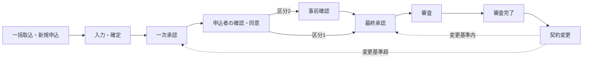

# 申込管理システム（JavaServletSample2）

申込の取込・入力から社内承認（一次・最終）、申込者の確認・同意、審査担当部門による事前確認・審査、審査完了後の契約変更までを 23 のステータスで管理するシステムの設計・実装リポジトリ。

## 現在の状態

基本設計を作成中（設計ドキュメントのドラフト版）。実装は基本設計の確定後に着手する。

## リポジトリ構成

```text
.
├── README.md                 このファイル
├── docs/
│   ├── README.md             設計ドキュメントの一覧と読み方
│   ├── basic-design/         基本設計書（Markdown）
│   └── diagrams/             draw.io の図（原本）と PNG エクスポート
└── src/                      ソースコード（実装フェーズで追加）
```

## 想定する技術スタック（仮、実装前に確定）

| 分類 | 想定 |
| --- | --- |
| 言語・Web | Java 17 以上、Jakarta Servlet／JSP |
| AP サーバ | Apache Tomcat 10.1 系 |
| DB | Microsoft SQL Server |
| ビルド | Maven |

## ドキュメント

設計ドキュメントの一覧は [docs/README.md](docs/README.md) を参照。まず [システム概要](docs/basic-design/01-overview.md) と [ステータス定義・状態遷移](docs/basic-design/03-status-transition.md) を読むと全体像がつかめる。

## 業務フローの概要


