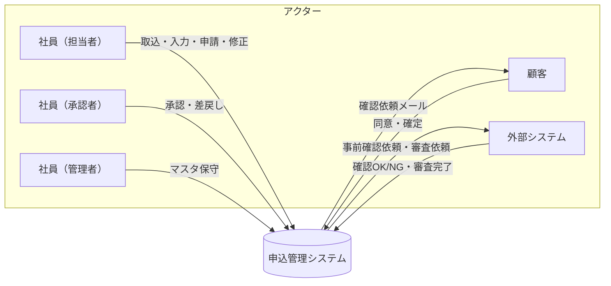

# 01. システム概要

| 項目 | 内容 |
| --- | --- |
| 文書名 | 申込管理システム 基本設計書 - システム概要 |
| 版 | 0.1（初版・ドラフト） |
| 作成日 | 2026-09-30 |

## 1. 目的

本システムは、申込の一括取込から社内承認・顧客同意・外部審査、審査完了後の契約変更までを、23 のステータスで一元管理する。
本書群は基本設計として、ステータス遷移・処理フロー・データ構造・機能・画面・外部インターフェースを定義し、後続の詳細設計と実装の共通基盤とする。

## 2. 対象範囲

| 区分 | 範囲 |
| --- | --- |
| 対象業務 | 申込の取込・入力、社内承認（一次／最終）、顧客の内容確認・同意、外部システムによる事前確認・審査、審査完了後の契約変更 |
| 対象システム | 申込管理システム（社員向け画面、顧客向け確認画面、外部システム連携 IF、バッチ） |
| 対象外 | 外部システム本体、社内認証基盤、メール配信基盤（利用はするが構築対象外） |

## 3. 登場人物（アクター）

| アクター | 役割 | 操作するステータス |
| --- | --- | --- |
| 社員（担当者） | 取込データの修正・確定、承認申請・引戻し、審査中の修正対応、契約変更の起票 | 0101、0102、0201、0401、0601、0701、0801、1001、1102、1202（および 0502／0504 の審査中修正） |
| 社員（承認者） | 承認、差戻し | 0202、0402、0802、1002 |
| 社員（管理者） | マスタメンテナンス | なし（ステータス操作はしない） |
| 顧客 | 申込内容への同意、同意内容の確定 | 0301、0302、0901、0902 |
| 外部システム | 外部事前確認（OK／NG）、外部審査（審査完了） | 0502、0504、1101、1201 |

## 4. 会社区分

社員は 2 つの会社区分のいずれかに属し、会社区分によって外部事前確認フローの有無が決まる。
申込は起票時点の担当社員の会社区分を保持し、以降の分岐はこの値で判定する。

| 会社区分（仮） | 外部事前確認フロー | 審査中（0502／0504）に修正した場合 |
| --- | --- | --- |
| 1 | あり | 条件に該当すれば事前確認待ち（1101／1201）へ遷移し、外部システムの確認 OK で審査中に戻る |
| 2 | なし | 事前確認待ちへ遷移せず、審査中のまま修正内容を外部システムへ再連携する |

区分値と「なし」側の動きは仮置きで、[99. 未決事項](99-open-issues.md) に挙げている。

## 5. 設計方針

1. **ステータス遷移の一元管理**
   ステータス遷移はステータス遷移マスタに定義し、画面・外部 IF・バッチはすべて共通の遷移制御（F14）を通して更新する。
2. **申込内容の版管理**
   申込内容は版で保持する。新規申込が第 1 版で、審査中修正と契約変更のたびに版を追加し、承認・顧客同意・外部連携は版に紐づける。
3. **承認ワークフローの共通化**
   一次承認・最終承認・契約変更承認・契約変更審査依頼承認の 4 つは承認種別で区別し、同じ承認ワークフロー機能（F04／F05）を使う。
4. **変更金額倍率の定義**
   変更金額倍率は「修正後の申込金額 ÷ 基準金額」とし、基準金額は外部審査を依頼した時点の申込金額とする（仮置き）。しきい値は会社区分マスタに持つ（既定 1.50）。
5. **証跡の保持**
   ステータス変更はすべてステータス履歴に記録する。承認・差戻し、顧客の同意・確定、外部連携の送受信も日時と操作者付きで残す。
6. **非同期処理の分離**
   メール通知・外部システムへの送信は通知キュー／外部連携テーブルに積み、バッチが送信する。画面操作のトランザクションは DB 更新までで完結させる。

## 6. 用語定義

| 用語 | 定義 |
| --- | --- |
| 申込 | 顧客 1 件ごとの申込。ステータスを 1 つ持つ |
| 版（申込内容） | 申込内容のスナップショット。新規申込・審査中修正・契約変更ごとに追加する |
| 現行版 | 編集中または承認・審査の対象になっている版。申込の現行版番号で指す |
| 審査完了版 | 直近で外部審査が完了した版。契約変更開始時の複写元 |
| 承認申請 | 承認ルートに沿った 1 回分の回付。差戻し・引戻しで終了し、再申請のたびに新しく作る |
| 回付先 | 承認ルートマスタから求めた承認者の並び。いない場合は承認をスキップして次のステータスへ進む |
| 最終承認者 | 承認ルート明細でステップ番号が最大の承認者 |
| 基準金額 | 変更金額倍率の分母。外部審査を依頼した時点の申込金額 |
| 外部事前確認 | 審査中の修正が一定条件を満たす場合に、外部審査へ再連携する前に外部システムへ確認を求める手続き |
| 確認用トークン | 顧客向け確認 URL に含める使い捨ての文字列。ハッシュ化して保持する |

## 7. 関連ドキュメント

ドキュメント一覧と読み方は [docs/README.md](../README.md) を参照。
