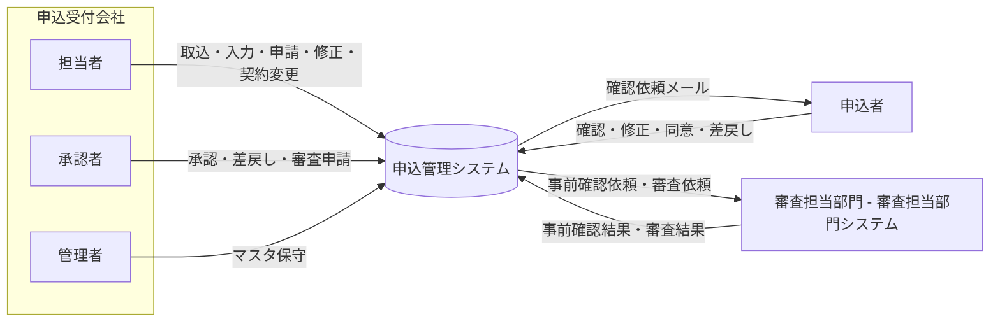
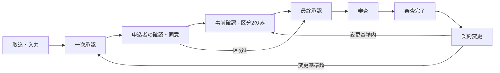

# 01. システム概要

| 項目 | 内容 |
| --- | --- |
| 文書名 | 申込管理システム 基本設計書 - システム概要 |
| 版 | 0.2（ステータス体系の改定を反映） |
| 作成日 | 2026-10-01 |

## 1. 目的

本システムは、申込の取込・入力から社内承認（一次承認・最終承認）、申込者による内容確認・同意、審査担当部門による事前確認・審査、審査完了後の契約変更までを、23 のステータスで一元管理する。
本書群は基本設計として、ステータス遷移・処理フロー・データ構造・機能・画面・外部インターフェースを定義し、後続の詳細設計と実装の共通基盤とする。

## 2. 対象範囲

| 区分 | 範囲 |
| --- | --- |
| 対象業務 | 申込の一括取込・画面入力、社内承認（一次／最終）、申込者の内容確認・修正・同意、審査担当部門による事前確認・審査、審査完了後の契約変更（複数回） |
| 対象システム | 申込管理システム（申込受付会社向け画面、申込者向け確認画面、審査担当部門システムとの連携 IF、バッチ） |
| 対象外 | 審査担当部門システム（審査管理画面を含む）本体、社内認証基盤、メール配信基盤 |

## 3. 登場人物（アクター）

| アクター | 役割 | 操作するステータス |
| --- | --- | --- |
| 申込受付会社（担当者） | 取込・新規申込・追加申込、入力・修正・確定、承認申請（回付先の設定）、引戻し、同意後の修正、契約変更の起票 | 10100、10101、10201、10402、10501、10701、20101、20201、20402、20501、20701（および 10301／10302／20301／20302 の引戻し） |
| 申込受付会社（承認者） | 承認、差戻し、審査申請（最終承認者） | 10202、10502、20202、20502 |
| 申込受付会社（管理者） | マスタメンテナンス、全申込の参照 | なし |
| 申込者 | 申込内容の確認・修正・確定、同意、差戻し | 10301、10302、20301、20302 |
| 審査担当部門 | 事前確認（問題なし／修正必要）、審査（審査完了／審査差戻し）。審査担当部門システム（外部システム）を通じて結果を連携する | 10401、10601、20401、20601 |

審査担当部門は本システムの画面を使わず、審査担当部門システム（本書では「外部システム」とも呼ぶ）の審査管理画面で事前確認・審査を行う。本システムは依頼を外部システムへ送り、結果を外部システムから受け取る。

## 4. 会社区分

申込受付会社の社員は 2 つの会社区分のいずれかに属し、会社区分によって審査担当部門による事前確認の有無が決まる。申込は起票時点の担当社員の会社区分を保持し、以降の分岐はこの値で判定する。

| 会社区分 | 外部事前確認 | 申込者の同意後 | 契約変更で変更基準内のとき |
| --- | --- | --- | --- |
| 1（会社A） | なし | 最終承認申請待ち（10501） | 最終承認申請待ち（20501） |
| 2（会社B） | あり | 事前確認待ち（10401）。問題なしで最終承認申請待ちへ | 事前確認待ち（20401） |

## 5. 業務の流れ（概要）

- 新規申込は「入力 → 一次承認 → 申込者確認 → （事前確認） → 最終承認 → 審査 → 審査完了」の順に進む。
- 契約変更は審査完了後に何度でも開始でき、変更が基準を超えるときは一次承認と申込者確認からやり直し、基準内のときは承認・確認を省略して最終承認（区分 2 は事前確認）へ進む。
- 差戻し（承認者・申込者・審査担当部門）と引戻し（担当者）で前の工程へ戻る。契約変更の審査差戻しは契約変更を取り消して、変更前の審査完了状態へ戻る。

## 6. 設計方針

1. **ステータス遷移の一元管理**
   ステータス遷移はステータス遷移マスタに定義し、画面・外部 IF・バッチはすべて共通の遷移制御（F14）を通して更新する。会社区分による分岐も遷移マスタで表す。
2. **申込内容の版管理**
   申込内容は版で保持する。申込者が同意した版と審査完了した版は「確定版」として変更せず、確定後の修正と契約変更では版を複写して変更する。承認申請・申込者同意・外部連携は版に紐づける。
3. **承認ワークフローの共通化**
   一次承認・最終承認・契約変更一次承認・契約変更最終承認の 4 つは承認種別で区別し、同じ承認ワークフロー機能（F04／F05）を使う。回付先は申請時に承認フロー画面で設定し、承認ルートマスタはその初期値（テンプレート）として使う。
4. **変更基準と基準版**
   申込者の同意後や契約変更で内容を変更したとき、「変更基準」を超えるかで承認・確認をやり直すかを決める。比較元を「基準版」として申込に保持し、金額項目（基本料金・オプション料金・事務手数料。名称はサンプル）の合計（申込金額合計）の倍率で判定し、基準版の 1.50 倍以上なら変更基準超とする。金額以外の項目の変更は対象外で、減額に特別な扱いはない。
5. **証跡の保持**
   ステータス変更はすべてステータス履歴に記録する。承認・差戻し、申込者の確定・同意・差戻し、外部連携の送受信も日時と操作者付きで残す。
6. **非同期処理の分離**
   メール通知・審査担当部門システムへの送信は通知キュー／外部連携テーブルに積み、バッチが送信する。画面操作のトランザクションは DB 更新までで完結させる。

## 7. 用語定義

| 用語 | 定義 |
| --- | --- |
| 申込受付会社 | 申込を受け付けて入力・承認・審査依頼を行う会社。社員は会社区分 1（会社A）または 2（会社B）に属する |
| 申込者 | 申込の当事者。確認用 URL または申込者ページから申込内容を確認・修正・同意する。システム上は申込者マスタで管理し、申込受付会社が新規申込を登録するとき（画面入力・一括取込）に登録する |
| 審査担当部門 | 事前確認と審査を行う部門。審査担当部門システム（外部システム）を通じて本システムと連携する |
| 申込 | 申込者 1 件ごとの申込。ステータスを 1 つ持つ |
| 追加申込 | 既存の申込を元に、同じ申込者の新しい申込を作成すること |
| 版（申込内容） | 申込内容のスナップショット。新規申込・同意後の修正・契約変更ごとに追加する |
| 現行版 | 編集中または承認・確認・審査の対象になっている版 |
| 確定版 | 申込者が同意した版、または審査完了した版。以降は変更しない |
| 基準版 | 変更基準の比較元になる版。申込者の同意時、契約変更の開始時に更新する |
| 審査完了版 | 直近で審査完了した版。契約変更の複写元 |
| 変更基準 | 承認・申込者確認をやり直す必要がある変更かを判定する基準。申込金額合計（金額項目の合計）の基準版に対する倍率で判定する |
| 承認申請 | 承認フロー画面で設定した回付先に沿った 1 回分の回付。差戻しで終了し、再申請のたびに新しく作る |
| 回付先 | 承認申請時に設定した承認者の並び。設定しない場合は承認を省略して次のステータスへ進む（一次承認のみ） |
| 最終承認者 | 回付先でステップ番号が最大の承認者。一次承認では「承認」、最終承認では「審査申請」でステータスを進める |
| 引戻し | 申込者確認中の申込を、申込受付会社が一次承認申請待ちへ戻す操作 |
| 事前確認 | 会社区分 2 の申込について、申込者の同意後に審査担当部門が内容を確認する工程 |
| 確認用トークン | 申込者向け確認 URL に含める使い捨ての文字列。ハッシュ化して保持する |

## 8. 関連ドキュメント

ドキュメント一覧と読み方は [docs/README.md](../README.md) を参照。
