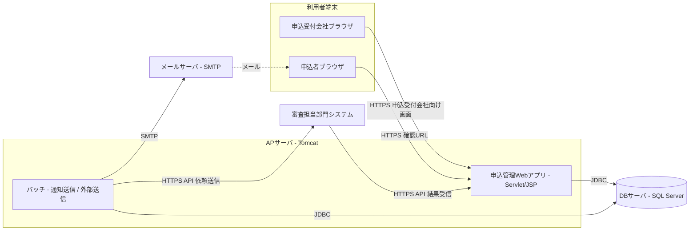
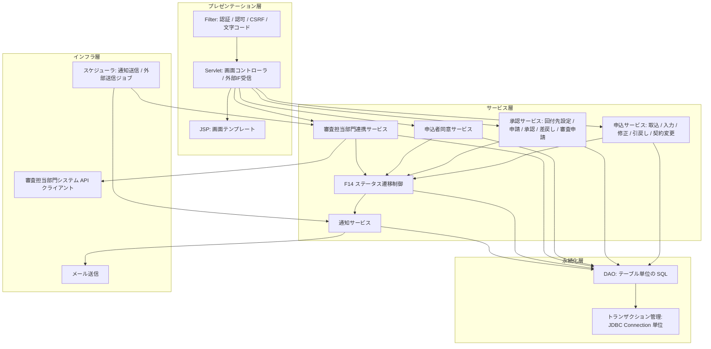

# 02. システム構成・アプリケーション構成

| 項目 | 内容 |
| --- | --- |
| 版 | 0.3（実行環境の確定を反映） |
| 前提 | 実行環境は Tomcat 9／SQL Server 2019／Java 17 で確定（2026-10-02）。開発環境は Docker Compose で構成する |

## 1. システム構成



| 構成要素 | 役割 | 備考 |
| --- | --- | --- |
| 申込受付会社ブラウザ | 申込受付会社向け画面（担当者・承認者・管理者）の利用 | 社内ネットワークからのアクセスを想定 |
| 申込者ブラウザ | 確認用 URL からの内容確認・修正・同意 | インターネット経由。確認用 URL 以外の画面には到達できない |
| AP サーバ（Tomcat） | Web アプリとバッチの実行 | バッチは同一 WAR 内のスケジューラで実行する（仮）。分離する場合は同じコードを別プロセスで起動する |
| DB サーバ（SQL Server） | 全データの永続化 | 物理型は [07. テーブル定義](07-table-definition.md) の型対応表を参照 |
| メールサーバ | 申込者・社員へのメール送信 | 既存基盤を利用。SMTP で接続 |
| 審査担当部門システム | 審査担当部門が事前確認・審査を行う外部システム。審査管理画面はこちら側 | 連携方式は REST／JSON over HTTPS を仮置き（[12. 外部インターフェース設計](12-external-interface.md)） |

## 2. 技術スタック

| 分類 | 採用 | 備考 |
| --- | --- | --- |
| 言語 | Java 17（LTS） | コンパイルは `--release 17` |
| Web | Servlet 4.0 / JSP 2.3 / JSTL 1.2（`javax.*` 名前空間） | Apache Tomcat 9.0 系 |
| 画面 | Bootstrap 4.6、jQuery 3.7（slim） | CDN に依存せず WAR に同梱する |
| DB アクセス | JDBC（Microsoft JDBC Driver for SQL Server 12）＋ HikariCP | O/R マッパは使わず、DAO で SQL を管理する |
| DB | SQL Server 2019 | スキーマと初期データは Flyway 9 で起動時に適用する（`db/migration`、DBMS 別は `db/vendor`） |
| メール | javax.mail 1.6（JavaMail） | SMTP。`mail.mode=log` で送信せずログ出力にできる |
| JSON | Jackson | 外部 IF の入出力 |
| ログ | SLF4J + Logback | アプリログ・バッチログ |
| ビルド | Maven（WAR パッケージ） | |
| テスト | JUnit 5、Playwright（画面の一括動作確認） | 遷移条件・入力チェックの単体テストと、主要フローのブラウザ操作 |
| 開発環境 | Docker Compose（SQL Server 2019、Tomcat 9、Mailpit） | ローカルでは組込み Tomcat ＋ H2（SQL Server 互換モード）でも起動できる |

## 3. アプリケーション内部構成

### 3.1 レイヤ構成



| レイヤ | 責務 | 備考 |
| --- | --- | --- |
| プレゼンテーション層 | リクエストの受付、入力値の型変換・形式チェック、画面の描画 | 業務判断は持たない。1 画面（1 機能）につき 1 Servlet を基本とする |
| サービス層 | 業務ロジック、トランザクション境界、ステータス遷移制御の呼出 | ステータス更新は必ず F14 を通す |
| 永続化層 | SQL の発行、行のマッピング、楽観排他の反映 | テーブル 1 本につき 1 DAO |
| インフラ層 | メール・外部 API・スケジューラなど外部資源とのやり取り | サービス層からはインターフェース経由で利用し、テストで差し替えられるようにする |

### 3.2 パッケージ構成

```text
com.example.appmgmt
├── web
│   ├── AppInitializer  起動時の初期化（設定、DataSource、Flyway、サービスの組み立て）
│   ├── filter        文字コード・セキュリティヘッダ・社員認証／認可・CSRF・API 認証の Filter
│   ├── servlet       画面ごとの Servlet（ログイン、申込、取込、マスタ、開発支援、申込者向け）
│   ├── api           外部 IF 受信用 Servlet（IF02／IF04）
│   ├── form          画面入力の受け渡しと入力チェック
│   └── view          JSP の EL 関数（日付・金額・区分名の書式）
├── service
│   ├── Services      サービスと DAO の組み立て（手動 DI）
│   ├── application   申込の検索・詳細、入力・修正・契約変更、一括取込
│   ├── approval      承認申請・承認・差戻し・審査申請
│   ├── consent       申込者同意（トークン発行、確認・同意・差戻し）
│   ├── external      審査担当部門連携（送信電文の組み立て、結果受信）
│   ├── transition    F14 ステータス遷移制御・条件評価・後続処理
│   ├── notification  通知の登録（テンプレート展開）
│   ├── auth          ログイン
│   └── master        マスタメンテナンス
├── domain            エンティティ、区分値（Codes）、ステータスコード（StatusCd）
├── dao               テーブル単位の DAO（PreparedStatement、楽観排他）
├── infra
│   ├── mail          メール送信（log／smtp）
│   ├── extapi        審査担当部門システム API クライアント（mock／http）
│   └── scheduler     スケジューラと通知送信・外部送信ジョブ
└── common            設定、DataSource、トランザクション、例外、メッセージ、書式、ハッシュ
```

### 3.3 リクエスト処理の基本形

1. Filter で文字コード設定、認証チェック（社員セッション／申込者トークン／外部 API 認証）、権限チェック、CSRF トークン検証を行う。
2. Servlet が入力値を Form に詰め、形式チェックを行う。エラーは同じ画面に戻して表示する。
3. Servlet がサービスを呼び出す。サービスは 1 リクエスト 1 トランザクションで DB を更新し、ステータス更新は F14 を通す。
4. F14 は遷移先に応じて通知キュー・外部連携レコードを同一トランザクションで登録する。実際の送信はスケジューラが行う。
5. Servlet は結果を JSP に渡して描画する。更新系はリダイレクト（PRG パターン）で二重送信を防ぐ。

## 4. 実行環境

| 環境 | 用途 | 構成 |
| --- | --- | --- |
| 開発（Docker） | 開発者ローカル | `docker compose up --build`。db（SQL Server 2019）、db-init（DB・ログイン作成）、app（Tomcat 9、WAR を ROOT 配置）、mail（Mailpit。通知メールの確認） |
| 開発（Docker なし） | 動作確認 | `mvn -Plocal`。組込み Tomcat 9 ＋ H2 インメモリ DB（SQL Server 互換モード）。メールはログ出力、審査担当部門システムはモック |
| 検証 | 結合テスト・受入テスト | 審査担当部門システムは開発支援画面のモック、または `extapi.mode=http` でスタブ API に接続 |
| 本番 | 実運用 | 未定（AP サーバ台数、SMTP、審査担当部門システムの接続情報は [99. 未決事項](99-open-issues.md)） |

設定は `application.properties` の既定値を環境変数で上書きする（README の設定一覧）。開発支援画面（通知一覧、審査担当部門システムモック、バッチ即時実行）は `app.dev-tools.enabled=true` のときだけ有効にし、本番では無効にする。
