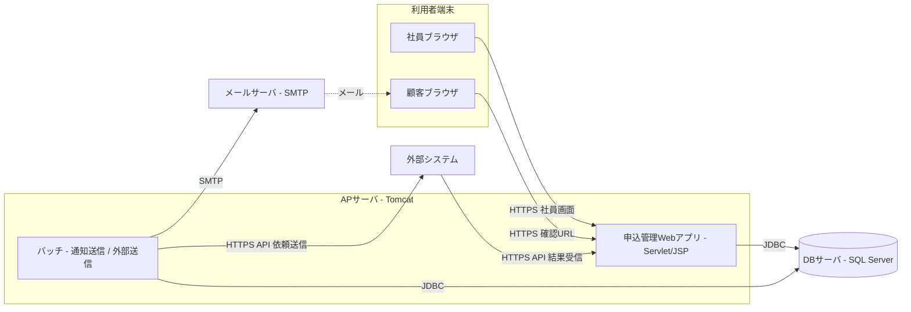
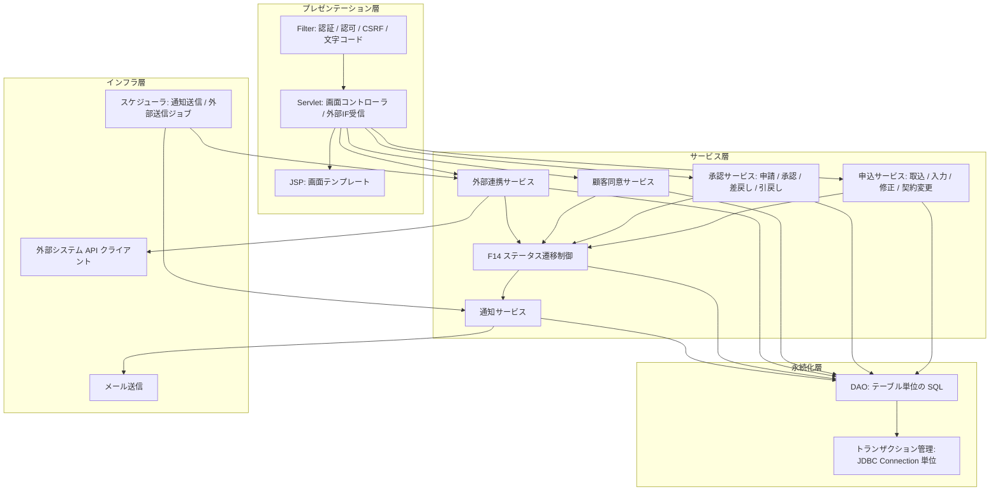

# 02. システム構成・アプリケーション構成

| 項目 | 内容 |
| --- | --- |
| 版 | 0.1（初版・ドラフト） |
| 前提 | 実行環境は実装前に確定する。本書の技術スタックは現時点の想定（Servlet／Tomcat／SQL Server）で記載し、確定後に更新する |

## 1. システム構成（仮）



| 構成要素 | 役割 | 備考 |
| --- | --- | --- |
| 社員ブラウザ | 社員向け画面の利用 | 社内ネットワークからのアクセスを想定 |
| 顧客ブラウザ | 確認用 URL からの内容確認・同意 | インターネット経由。確認用 URL 以外の画面には到達できない |
| AP サーバ（Tomcat） | Web アプリとバッチの実行 | バッチは同一 WAR 内のスケジューラで実行する（仮）。分離する場合は同じコードを別プロセスで起動する |
| DB サーバ（SQL Server） | 全データの永続化 | 物理型は [07. テーブル定義](07-table-definition.md) の型対応表を参照 |
| メールサーバ | 顧客・社員へのメール送信 | 既存基盤を利用。SMTP で接続 |
| 外部システム | 事前確認・審査の実施 | 連携方式は REST／JSON over HTTPS を仮置き（[12. 外部インターフェース設計](12-external-interface.md)） |

## 2. 技術スタック（仮）

| 分類 | 採用候補 | 備考 |
| --- | --- | --- |
| 言語 | Java 17 以上 | LTS |
| Web | Jakarta Servlet 6.0 / JSP 3.1 / JSTL 3.0 | Tomcat 10.1 系 |
| DB アクセス | JDBC（Microsoft JDBC Driver for SQL Server） | O/R マッパは使わず、DAO で SQL を管理する |
| DB | SQL Server 2019 以上 | 実装前に確定 |
| メール | Jakarta Mail | SMTP |
| JSON | Jackson | 外部 IF の入出力 |
| ログ | SLF4J + Logback | アプリログ・監査ログ |
| ビルド | Maven（WAR パッケージ） | |
| テスト | JUnit 5 | サービス層・遷移制御の単体テストを重視 |

## 3. アプリケーション内部構成

### 3.1 レイヤ構成



| レイヤ | 責務 | 備考 |
| --- | --- | --- |
| プレゼンテーション層 | リクエストの受付、入力値の型変換・形式チェック、画面の描画 | 業務判断は持たない。1 画面（1 機能）につき 1 Servlet を基本とする |
| サービス層 | 業務ロジック、トランザクション境界、ステータス遷移制御の呼出 | ステータス更新は必ず F14 を通す |
| 永続化層 | SQL の発行、行のマッピング、楽観排他の反映 | テーブル 1 本につき 1 DAO |
| インフラ層 | メール・外部 API・スケジューラなど外部資源とのやり取り | サービス層からはインターフェース経由で利用し、テストで差し替えられるようにする |

### 3.2 パッケージ構成案

```text
com.example.appmgmt                ← ルートパッケージ（名称は仮）
├── web
│   ├── filter        認証・認可・CSRF・文字コードの Filter
│   ├── servlet       画面ごとの Servlet（社員向け / 顧客向け）
│   ├── api           外部 IF 受信用 Servlet
│   └── form          画面入力の受け渡し用クラス
├── service
│   ├── application   申込サービス（取込・入力・修正・契約変更）
│   ├── approval      承認サービス
│   ├── consent       顧客同意サービス
│   ├── external      外部連携サービス
│   ├── transition    F14 ステータス遷移制御・条件評価
│   └── notification  通知サービス
├── domain            エンティティ・区分値の列挙型
├── dao               テーブル単位の DAO
├── infra
│   ├── mail          メール送信
│   ├── extapi        外部システム API クライアント
│   └── scheduler     通知送信・外部送信ジョブ
└── common            例外・メッセージ・ユーティリティ
```

### 3.3 リクエスト処理の基本形

1. Filter で文字コード設定、認証チェック（社員セッション／顧客トークン／外部 API 認証）、権限チェック、CSRF トークン検証を行う。
2. Servlet が入力値を Form に詰め、形式チェックを行う。エラーは同じ画面に戻して表示する。
3. Servlet がサービスを呼び出す。サービスは 1 リクエスト 1 トランザクションで DB を更新し、ステータス更新は F14 を通す。
4. F14 は遷移先に応じて通知キュー・外部連携レコードを同一トランザクションで登録する。実際の送信はスケジューラが行う。
5. Servlet は結果を JSP に渡して描画する。更新系はリダイレクト（PRG パターン）で二重送信を防ぐ。

## 4. 実行環境（仮）

| 環境 | 用途 | 備考 |
| --- | --- | --- |
| 開発 | 開発者ローカル | Tomcat 組込み起動、SQL Server はコンテナまたはローカルインスタンス |
| 検証 | 結合テスト・受入テスト | 外部システムはスタブ（モック API）で代替 |
| 本番 | 実運用 | 実装前に構成を確定 |
