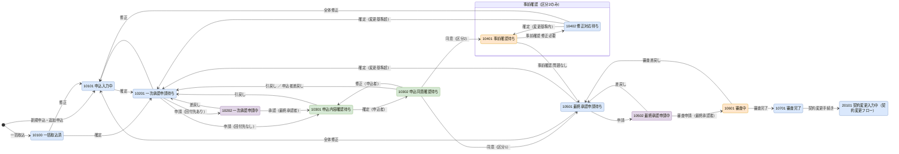

# 03. ステータス定義・状態遷移

| 項目 | 内容 |
| --- | --- |
| 版 | 0.5（申込者の照合に申込者ページのログインを追加。版 0.4：申込取消のステータスと遷移を追加） |
| 入力 | 業務側から提示されたステータス一覧（23 ステータス）と、会社区分別のステータス遷移表（会社区分 1：事前確認なし、会社区分 2：事前確認あり） |
| 関連 | [08. コード定義](08-code-definition.md)、[10. 機能詳細 F14](10-function-detail.md#1-f14-ステータス遷移制御共通)、[docs/diagrams/status-transition.drawio](../diagrams/status-transition.drawio)（全体遷移図） |

## 1. ステータス一覧

ステータスは業務側から提示された 23 個に、実装時に追加した申込取消（90101）を加えた 24 個。ステータスマスタ（M_STATUS）の初期データになる。コードは 5 桁で、1 桁目が大分類（1：新規申込、2：契約変更、9：取消）、2〜3 桁目が中分類（工程）、4〜5 桁目が小分類（工程内の段階）を表す。

| No | コード | 申込受付会社向け表示名 | 申込者向け表示名 | 大分類 | 中分類 | 小分類 | 操作主体 | 編集可 | 状態 |
| --- | --- | --- | --- | --- | --- | --- | --- | --- | --- |
| 1 | 10100 | 一括取込済 | （なし） | 1 新規申込 | 01 入力中 | 00 一括取込済 | 1 担当者 | 1 | 申込情報を一括取込した直後の状態 |
| 2 | 10101 | 申込入力中 | （なし） | 1 新規申込 | 01 入力中 | 01 入力中 | 1 担当者 | 1 | 新規申込を一時保存した状態、または一括取込した申込情報を補正して一時保存した状態 |
| 3 | 10201 | 一次承認申請待ち | （なし） | 1 新規申込 | 02 一次承認中 | 01 一次承認申請待ち | 1 担当者 | 0 | 申込入力が完了し、承認経路が設定されていない状態 |
| 4 | 10202 | 一次承認申請中 | （なし） | 1 新規申込 | 02 一次承認中 | 02 一次承認申請中 | 2 承認者 | 0 | 一次承認の完了を待っている状態 |
| 5 | 10301 | 申込内容確認待ち | 内容確認中 | 1 新規申込 | 03 申込者確認中 | 01 内容確認待ち | 3 申込者 | 2 | 申込者による申込内容の確認または修正を待っている状態 |
| 6 | 10302 | 申込同意確認待ち | 同意確認待ち | 1 新規申込 | 03 申込者確認中 | 02 同意確認待ち | 3 申込者 | 0 | 申込者による申込内容への同意を待っている状態 |
| 7 | 10401 | 事前確認待ち | 審査中 | 1 新規申込 | 04 事前確認中 | 01 事前確認待ち | 4 審査担当部門 | 0 | 審査担当部門による事前確認を待っている状態 |
| 8 | 10402 | 修正対応待ち | 審査中 | 1 新規申込 | 04 事前確認中 | 02 修正対応待ち | 1 担当者 | 1 | 審査担当部門からの指摘に対する修正を待っている状態 |
| 9 | 10501 | 最終承認申請待ち | 審査中 | 1 新規申込 | 05 最終承認中 | 01 最終承認申請待ち | 1 担当者 | 1 | 申込者による同意が完了し、審査依頼前の承認経路設定を待っている状態 |
| 10 | 10502 | 最終承認申請中 | 審査中 | 1 新規申込 | 05 最終承認中 | 02 最終承認申請中 | 2 承認者 | 0 | 審査依頼前の最終承認を申請している状態 |
| 11 | 10601 | 審査中 | 審査中 | 1 新規申込 | 06 審査受付中 | 01 審査中 | 4 審査担当部門 | 0 | 審査担当部門からの審査結果を待っている状態 |
| 12 | 10701 | 審査完了 | 審査完了 | 1 新規申込 | 07 審査完了 | 01 審査完了 | 1 担当者 | 0 | 審査担当部門から審査結果を受領した状態 |
| 13 | 20101 | 【契約変更】入力中 | 審査完了 | 2 契約変更 | 01 入力中 | 01 入力中 | 1 担当者 | 1 | 契約変更手続きを開始した直後、または契約変更内容を入力中の状態 |
| 14 | 20201 | 【契約変更】一次承認申請待ち | 審査完了 | 2 契約変更 | 02 一次承認中 | 01 一次承認申請待ち | 1 担当者 | 0 | 契約変更内容の入力が完了し、承認経路が設定されていない状態 |
| 15 | 20202 | 【契約変更】一次承認申請中 | 審査完了 | 2 契約変更 | 02 一次承認中 | 02 一次承認申請中 | 2 承認者 | 0 | 契約変更に対する一次承認の完了を待っている状態 |
| 16 | 20301 | 【契約変更】内容確認待ち | 内容確認中 | 2 契約変更 | 03 申込者確認中 | 01 内容確認待ち | 3 申込者 | 0 | 申込者による契約変更内容の確認を待っている状態 |
| 17 | 20302 | 【契約変更】同意確認待ち | 同意確認待ち | 2 契約変更 | 03 申込者確認中 | 02 同意確認待ち | 3 申込者 | 0 | 申込者による契約変更内容への同意を待っている状態 |
| 18 | 20401 | 【契約変更】事前確認待ち | 審査中 | 2 契約変更 | 04 事前確認中 | 01 事前確認待ち | 4 審査担当部門 | 0 | 審査担当部門による契約変更内容の事前確認を待っている状態 |
| 19 | 20402 | 【契約変更】修正対応待ち | 審査中 | 2 契約変更 | 04 事前確認中 | 02 修正対応待ち | 1 担当者 | 1 | 審査担当部門からの指摘に対する契約変更内容の修正を待っている状態 |
| 20 | 20501 | 【契約変更】最終承認申請待ち | 審査中 | 2 契約変更 | 05 最終承認中 | 01 最終承認申請待ち | 1 担当者 | 0 | 申込者による同意が完了し、契約変更審査依頼前の承認経路設定を待っている状態 |
| 21 | 20502 | 【契約変更】最終承認申請中 | 審査中 | 2 契約変更 | 05 最終承認中 | 02 最終承認申請中 | 2 承認者 | 0 | 契約変更審査依頼前の最終承認を申請している状態 |
| 22 | 20601 | 【契約変更】審査中 | 審査中 | 2 契約変更 | 06 審査受付中 | 01 審査中 | 4 審査担当部門 | 0 | 審査担当部門から契約変更の審査結果を待っている状態 |
| 23 | 20701 | 【契約変更】審査完了 | 審査完了 | 2 契約変更 | 07 審査完了 | 01 審査完了 | 1 担当者 | 0 | 審査担当部門から契約変更の審査結果を受領した状態 |
| 24 | 90101 | 申込取消 | 取消 | 9 取消 | 01 取消 | 01 取消 | 9 なし | 0 | 申込受付会社（担当者）が申込を取り消した状態。以降の操作はできない（追加申込の元にもできない） |

- 操作主体は、そのステータスで次の操作を行う主体。1：申込受付会社（担当者）、2：申込受付会社（承認者）、3：申込者、4：審査担当部門。承認者は申込受付会社の社員で、承認申請の回付先に設定された者。
- 編集可：1 = 申込受付会社（担当者）が申込内容を編集できる、2 = 申込者が申込内容を編集できる、0 = 編集不可。10401／20401 と 10601／20601 は審査担当部門の結果待ちで編集できない。
- 申込者向け表示名は申込者向け画面に表示する名称。「（なし）」は申込者がまだ関与していない段階で、申込者向け画面は存在しない。
- 10401／10402／20401／20402（事前確認中）は、会社区分が「事前確認あり」の申込だけが通る。
- 表示順は No と同じ。

## 2. 会社区分とフローの違い

| 会社区分 | 外部事前確認 | 申込者同意後の遷移先 | 契約変更で変更基準内のとき |
| --- | --- | --- | --- |
| 1 | なし | 10302 → 10501 最終承認申請待ち | 20101 → 20501 最終承認申請待ち |
| 2 | あり | 10302 → 10401 事前確認待ち | 20101 → 20401 事前確認待ち |

区分の値は提示された遷移表に従う（1 = 事前確認なし、2 = 事前確認あり）。

## 3. 遷移の共通ルール

1. **回付先あり／なし**：承認申請時に申込受付会社（担当者）が承認フロー画面で回付先（承認者と順序）を設定する。承認ルートマスタはその初期値（テンプレート）として使う。一次承認は回付先なしで申請でき、その場合は承認を省略して申込者確認へ進む。最終承認は回付先を必ず設定する（最終承認者の「審査申請」で審査へ進むため）。
2. **最終承認者**：承認明細でステップ番号が最大の承認者。最終承認者以外の承認はステータスを変えず、承認明細を更新して次の承認者へ回す。
3. **差戻し（承認者）**は申請待ち（10201／10501／20201／20501）へ戻し、進行中の承認申請を終了させる。再申請のたびに新しい承認申請を作る。差戻し後に内容を直す場合は、担当者が「修正」で入力中へ戻す。
4. **引戻し**は、申込者確認中（10301／10302／20301／20302）の申込を申込受付会社（担当者）が一次承認申請待ちへ戻す操作。申込者の確認用 URL は無効になる。
5. **申込者の操作**：内容確認待ちでは申込内容の確認・修正と「確定」、同意確認待ちでは「同意する」「差戻し」「修正」（内容確認待ちへ戻る）ができる。申込者の差戻しは一次承認申請待ちへ戻る。
6. **変更基準**：申込者の同意後、または契約変更の入力で申込内容を変更したとき、変更が「所定の変更基準」を超えるかで遷移先が分かれる。変更基準は金額倍率のみで、「現行版の申込金額合計（金額項目の合計）÷ 基準版の申込金額合計 が会社区分マスタのしきい値（既定 1.50）以上」になることを変更基準超とする。減額は常に基準内。金額以外の項目（商品コード、契約期間、備考）の変更は変更基準の対象外。基準版は 5 章。
7. **全体修正と一部修正**：最終承認申請待ち（10501）と修正対応待ち（10402）では、担当者が申込内容全体を修正し直すために入力中（10101）へ戻せる（全体修正。申込者の同意を取り直す）。最終承認申請待ちでは金額項目だけを修正する一部修正もでき、変更基準内ならステータスは変わらない。契約変更では一次承認申請待ち（20201）と最終承認申請待ち（20501）から入力中（20101）へ戻せる。
8. **審査差戻し**：審査中（10601）の審査差戻しは最終承認申請待ち（10501）へ戻る。契約変更の審査差戻し（20601）は契約変更を取り消し、契約変更前の審査完了状態へ戻る（初回の契約変更なら 10701、2 回目以降なら 20701）。
9. **条件の評価順**：同一の遷移元・操作に複数の遷移行がある場合は、評価順の若い行から条件を評価し、最初に成立した行の遷移先を採用する。条件「00 なし」の行は評価順を最後にし、既定の遷移先として使う。
10. **会社区分による有効行**：遷移マスタの事前確認区分が 0 の行は事前確認なしの会社区分だけ、1 の行は事前確認ありの会社区分だけで有効。9 は共通。
11. 一時保存（入力途中の保存）はステータス遷移ではない。履歴にも記録しない。ただし新規作成時の一時保存は申込を作成するため 10101 として履歴に記録する。
12. **取消**：担当者は申込メニューから申込を取り消せる（操作コード 15）。新規申込フローでは一括取込済〜最終承認申請待ちのうち、承認申請中（10202／10502）・事前確認待ち（10401）・審査中（10601）を除くステータスから 90101 申込取消へ遷移する。契約変更中（20101〜20501 の同じ範囲）の取消は申込自体ではなく契約変更を取り消し、契約変更で作った版を取消にして契約変更前の審査完了状態（10701／20701）へ戻す（F13 と同じ復元）。審査完了（10701／20701）の申込は取り消せない。

## 4. 状態遷移図

取消（遷移 ID 56〜74、6.5 節）は図に含めない。全 23 ステータスを 1 枚にまとめた図は [docs/diagrams/status-transition.drawio](../diagrams/status-transition.drawio) を参照。ここではフロー別に示す。

凡例：青 = 申込受付会社（担当者）、紫 = 申込受付会社（承認者）、緑 = 申込者、橙 = 審査担当部門。「区分 1」「区分 2」は会社区分による分岐。

### 4.1 新規申込フロー

### 4.2 契約変更フロー

```mermaid
stateDiagram-v2
    direction LR
    classDef owner fill:#dae8fc,stroke:#6c8ebf
    classDef approver fill:#e1d5e7,stroke:#9673a6
    classDef applicant fill:#d5e8d4,stroke:#82b366
    classDef reviewer fill:#ffe6cc,stroke:#d79b00

    S10701 : 10701 審査完了（新規申込フロー）
    S20101 : 20101 契約変更入力中
    S20201 : 20201 契約変更一次承認申請待ち
    S20202 : 20202 契約変更一次承認申請中
    S20301 : 20301 契約変更内容確認待ち
    S20302 : 20302 契約変更同意確認待ち
    S20501 : 20501 契約変更最終承認申請待ち
    S20502 : 20502 契約変更最終承認申請中
    S20601 : 20601 契約変更審査中
    S20701 : 20701 契約変更審査完了

    S10701 --> S20101 : 契約変更手続き
    S20701 --> S20101 : 契約変更手続き（2回目以降）
    S20101 --> S20201 : 確定（変更基準超）
    S20101 --> S20501 : 確定（変更基準内・区分1）
    S20201 --> S20101 : 修正
    S20201 --> S20202 : 申請（回付先あり）
    S20201 --> S20301 : 申請（回付先なし）
    S20202 --> S20201 : 差戻し
    S20202 --> S20301 : 承認（最終承認者）
    S20301 --> S20201 : 引戻し
    S20301 --> S20302 : 確定（申込者）
    S20302 --> S20201 : 引戻し ／ 申込者差戻し
    S20302 --> S20501 : 同意（区分1）
    S20501 --> S20101 : 修正
    S20501 --> S20502 : 申請
    S20502 --> S20501 : 差戻し
    S20502 --> S20601 : 審査申請（最終承認者）
    S20601 --> S20701 : 審査完了
    S20601 --> S10701 : 審査差戻し（初回の契約変更）
    S20601 --> S20701 : 審査差戻し（2回目以降）

    state 契約変更の事前確認（区分2のみ） {
        S20401 : 20401 契約変更事前確認待ち
        S20402 : 20402 契約変更修正対応待ち
        S20401 --> S20402 : 事前確認 修正必要
        S20402 --> S20401 : 確定（変更基準内）
    }
    S20101 --> S20401 : 確定（変更基準内・区分2）
    S20302 --> S20401 : 同意（区分2）
    S20401 --> S20501 : 事前確認 問題なし
    S20402 --> S20201 : 確定（変更基準超）

    class S10701,S20101,S20201,S20402,S20501,S20701 owner
    class S20202,S20502 approver
    class S20301,S20302 applicant
    class S20401,S20601 reviewer
```

## 5. 版と基準版

申込内容は版で管理する。変更基準の判定は「現行版」と「基準版」の比較で行う。

| 項目 | 定義 |
| --- | --- |
| 現行版 | 編集中、または承認・確認・審査の対象になっている版（T_APPLICATION.CURRENT_VERSION_NO） |
| 基準版 | 変更基準の比較元になる版（T_APPLICATION.BASE_VERSION_NO）。申込者が「同意する」を押した時点で同意した版を基準版にする。契約変更手続きの開始時は複写元の審査完了版を基準版にする |
| 審査完了版 | 直近で審査完了した版（T_APPLICATION.REVIEWED_VERSION_NO）。契約変更の複写元 |
| 確定版 | 申込者が同意した版、および審査完了した版。確定版は変更しない（T_APPLICATION_VERSION.FIXED_FLG = 1）。確定版の内容を変更する操作では、現行版を複写した新しい版を作って変更する |

版が作られる契機：

| 契機 | 版種別 | 備考 |
| --- | --- | --- |
| 新規作成（一括取込、画面入力、追加申込） | 1 新規申込 | 第 1 版 |
| 同意後の修正（10501 の修正、10402 の修正対応、10501／10402 からの全体修正） | 2 新規申込の修正 | 現行版（確定版）を複写 |
| 契約変更手続きの開始（10701／20701 → 20101） | 3 契約変更 | 審査完了版を複写 |
| 契約変更での同意後の修正（20402 の修正対応） | 4 契約変更の修正 | 現行版（確定版）を複写 |
| 同意前の修正（10101、10301 の申込者修正、20101、20201／20501 からの修正）、同意前の修正対応（20402 で未同意のとき） | （版は増えない） | 現行版をそのまま更新 |

契約変更の審査差戻しでは、契約変更で作った版を取消（CANCELED_FLG = 1）にし、現行版を審査完了版に戻す。

## 6. ステータス遷移マスタ 初期データ

ステータス遷移マスタ（M_STATUS_TRANSITION）の初期データ。業務側の遷移表に対応する 55 行（6.1〜6.4 節）と、実装時に追加した取消の 19 行（6.5 節）。「区分」は事前確認区分（9：共通、0：事前確認なしの会社区分のみ、1：事前確認ありの会社区分のみ）。「遷移表 No」は提示された遷移表の No（区分 1 の表／区分 2 の表）。

### 6.1 新規申込（新規作成〜申込者確認）

| 遷移ID | 遷移元 | 操作 | 条件 | 評価順 | 遷移先 | 操作主体 | 区分 | 遷移表 No | 備考 |
| --- | --- | --- | --- | --- | --- | --- | --- | --- | --- |
| 1 | 10100 | 01 修正 | 00 なし | 1 | 10101 | 1 担当者 | 9 | 2-1／2-1 | 申込内容確認画面の「修正」 |
| 2 | 10100 | 02 確定 | 00 なし | 1 | 10201 | 1 担当者 | 9 | 2-2／2-2 | 申込内容確認画面の「確定」 |
| 3 | 10101 | 02 確定 | 00 なし | 1 | 10201 | 1 担当者 | 9 | 3／3 | |
| 4 | 10201 | 01 修正 | 00 なし | 1 | 10101 | 1 担当者 | 9 | 4-1／4-1 | |
| 5 | 10201 | 03 申請 | 11 回付先あり | 1 | 10202 | 1 担当者 | 9 | 4-2／4-2 | 承認申請（一次承認）を作成 |
| 6 | 10201 | 03 申請 | 12 回付先なし | 2 | 10301 | 1 担当者 | 9 | 4-3／4-3 | 承認申請を承認済で記録 |
| 7 | 10202 | 05 差戻し | 00 なし | 1 | 10201 | 2 承認者 | 9 | 5-1／5-1 | コメント必須 |
| 8 | 10202 | 04 承認 | 00 なし | 1 | 10301 | 2 承認者 | 9 | 5-2／5-2 | 最終承認者の承認。それ以外の承認は遷移なし |
| 9 | 10301 | 06 引戻し | 00 なし | 1 | 10201 | 1 担当者 | 9 | 6-1／6-1 | 確認用 URL を無効化 |
| 10 | 10301 | 02 確定 | 00 なし | 1 | 10302 | 3 申込者 | 9 | 6-2／6-2 | 申込者が内容を確認・修正して確定 |
| 11 | 10302 | 06 引戻し | 00 なし | 1 | 10201 | 1 担当者 | 9 | 7-1／7-1 | 確認用 URL を無効化 |
| 12 | 10302 | 08 申込者差戻し | 00 なし | 1 | 10201 | 3 申込者 | 9 | 7-2／7-2 | 差戻し理由を記録 |
| 13 | 10302 | 01 修正 | 00 なし | 1 | 10301 | 3 申込者 | 9 | 7-3／7-3 | 申込者が内容確認へ戻る |
| 14 | 10302 | 07 同意 | 00 なし | 1 | 10501 | 3 申込者 | 0 | 7-4／－ | 基準版を更新。版を確定版にする |
| 15 | 10302 | 07 同意 | 00 なし | 1 | 10401 | 3 申込者 | 1 | －／7-4 | 同上。事前確認依頼を登録 |

### 6.2 新規申込（事前確認〜審査完了）

| 遷移ID | 遷移元 | 操作 | 条件 | 評価順 | 遷移先 | 操作主体 | 区分 | 遷移表 No | 備考 |
| --- | --- | --- | --- | --- | --- | --- | --- | --- | --- |
| 16 | 10401 | 10 事前確認OK | 00 なし | 1 | 10501 | 4 審査担当部門 | 1 | －／8-1 | 結果「問題なし」 |
| 17 | 10401 | 11 事前確認NG | 00 なし | 1 | 10402 | 4 審査担当部門 | 1 | －／8-2 | 結果「修正必要」。指摘内容を記録 |
| 18 | 10402 | 02 確定 | 21 変更基準超 | 1 | 10201 | 1 担当者 | 1 | －／9-2 | 新しい版を作成。一次承認からやり直し |
| 19 | 10402 | 02 確定 | 00 なし | 2 | 10401 | 1 担当者 | 1 | －／9-1 | 新しい版を作成。事前確認を再依頼 |
| 20 | 10402 | 01 修正 | 00 なし | 1 | 10101 | 1 担当者 | 1 | －／9-3 | 全体修正。新しい版を作成 |
| 21 | 10501 | 03 申請 | 11 回付先あり | 1 | 10502 | 1 担当者 | 9 | 8-1／10-1 | 承認申請（最終承認）を作成。回付先なしは不可 |
| 22 | 10501 | 01 修正 | 00 なし | 1 | 10101 | 1 担当者 | 9 | 8-2／10-2 | 全体修正。新しい版を作成 |
| 23 | 10501 | 02 確定 | 21 変更基準超 | 1 | 10201 | 1 担当者 | 9 | 8-3／10-3 | 申込修正画面の確定。新しい版を作成 |
| 24 | 10501 | 02 確定 | 00 なし | 2 | 10501 | 1 担当者 | 9 | （補足） | 変更基準内の修正はステータスを変えない。新しい版を作成し、履歴に記録 |
| 25 | 10502 | 05 差戻し | 00 なし | 1 | 10501 | 2 承認者 | 9 | 9-1／11-1 | コメント必須 |
| 26 | 10502 | 09 審査申請 | 00 なし | 1 | 10601 | 2 承認者 | 9 | 9-2／11-2 | 最終承認者の審査申請。審査依頼を登録 |
| 27 | 10601 | 12 審査完了 | 00 なし | 1 | 10701 | 4 審査担当部門 | 9 | 10-1／12-1 | 審査完了版を更新。版を確定版にする |
| 28 | 10601 | 13 審査差戻し | 00 なし | 1 | 10501 | 4 審査担当部門 | 9 | 10-2／12-2 | 差戻し理由を記録 |
| 29 | 10701 | 14 契約変更開始 | 00 なし | 1 | 20101 | 1 担当者 | 9 | 11／13 | 審査完了版を複写した版を作成。基準版を更新 |

### 6.3 契約変更（入力〜申込者確認）

| 遷移ID | 遷移元 | 操作 | 条件 | 評価順 | 遷移先 | 操作主体 | 区分 | 遷移表 No | 備考 |
| --- | --- | --- | --- | --- | --- | --- | --- | --- | --- |
| 30 | 20101 | 02 確定 | 21 変更基準超 | 1 | 20201 | 1 担当者 | 9 | 12-1／14-1 | 一次承認・申込者確認を経る |
| 31 | 20101 | 02 確定 | 00 なし | 2 | 20501 | 1 担当者 | 0 | 12-2／－ | 変更基準内。承認・確認を省略 |
| 32 | 20101 | 02 確定 | 00 なし | 2 | 20401 | 1 担当者 | 1 | －／14-2 | 変更基準内。事前確認依頼を登録 |
| 33 | 20201 | 01 修正 | 00 なし | 1 | 20101 | 1 担当者 | 9 | 13-1／15-1 | |
| 34 | 20201 | 03 申請 | 11 回付先あり | 1 | 20202 | 1 担当者 | 9 | 13-2／15-2 | 承認申請（契約変更一次承認）を作成 |
| 35 | 20201 | 03 申請 | 12 回付先なし | 2 | 20301 | 1 担当者 | 9 | 13-3／15-3 | |
| 36 | 20202 | 05 差戻し | 00 なし | 1 | 20201 | 2 承認者 | 9 | 14-1／16-1 | コメント必須 |
| 37 | 20202 | 04 承認 | 00 なし | 1 | 20301 | 2 承認者 | 9 | 14-2／16-2 | 最終承認者の承認 |
| 38 | 20301 | 06 引戻し | 00 なし | 1 | 20201 | 1 担当者 | 9 | 15-1／17-1 | 確認用 URL を無効化 |
| 39 | 20301 | 02 確定 | 00 なし | 1 | 20302 | 3 申込者 | 9 | 15-2／17-2 | |
| 40 | 20302 | 06 引戻し | 00 なし | 1 | 20201 | 1 担当者 | 9 | 16-1／18-1 | 確認用 URL を無効化 |
| 41 | 20302 | 08 申込者差戻し | 00 なし | 1 | 20201 | 3 申込者 | 9 | 16-2／18-2 | 差戻し理由を記録 |
| 42 | 20302 | 07 同意 | 00 なし | 1 | 20501 | 3 申込者 | 0 | 16-3／－ | 基準版を更新。版を確定版にする |
| 43 | 20302 | 07 同意 | 00 なし | 1 | 20401 | 3 申込者 | 1 | －／18-3 | 同上。事前確認依頼を登録 |

### 6.4 契約変更（事前確認〜審査完了）

| 遷移ID | 遷移元 | 操作 | 条件 | 評価順 | 遷移先 | 操作主体 | 区分 | 遷移表 No | 備考 |
| --- | --- | --- | --- | --- | --- | --- | --- | --- | --- |
| 44 | 20401 | 10 事前確認OK | 00 なし | 1 | 20501 | 4 審査担当部門 | 1 | －／19-1 | |
| 45 | 20401 | 11 事前確認NG | 00 なし | 1 | 20402 | 4 審査担当部門 | 1 | －／19-2 | 指摘内容を記録 |
| 46 | 20402 | 02 確定 | 21 変更基準超 | 1 | 20201 | 1 担当者 | 1 | －／20-2 | 一次承認・申込者確認を経る |
| 47 | 20402 | 02 確定 | 00 なし | 2 | 20401 | 1 担当者 | 1 | －／20-1 | 事前確認を再依頼 |
| 48 | 20501 | 01 修正 | 00 なし | 1 | 20101 | 1 担当者 | 9 | 17-1／21-1 | |
| 49 | 20501 | 03 申請 | 11 回付先あり | 1 | 20502 | 1 担当者 | 9 | 17-2／21-2 | 承認申請（契約変更最終承認）を作成 |
| 50 | 20502 | 05 差戻し | 00 なし | 1 | 20501 | 2 承認者 | 9 | 18-1／22-1 | コメント必須 |
| 51 | 20502 | 09 審査申請 | 00 なし | 1 | 20601 | 2 承認者 | 9 | 18-2／22-2 | 審査依頼を登録 |
| 52 | 20601 | 12 審査完了 | 00 なし | 1 | 20701 | 4 審査担当部門 | 9 | 19-1／23-1 | 審査完了版を更新。版を確定版にする |
| 53 | 20601 | 13 審査差戻し | 41 初回の契約変更 | 1 | 10701 | 4 審査担当部門 | 9 | 19-3／23-3 | 契約変更の版を取消し、現行版を審査完了版に戻す |
| 54 | 20601 | 13 審査差戻し | 42 2回目以降の契約変更 | 2 | 20701 | 4 審査担当部門 | 9 | 19-2／23-2 | 同上 |
| 55 | 20701 | 14 契約変更開始 | 00 なし | 1 | 20101 | 1 担当者 | 9 | 20／24 | 2 回目以降の契約変更 |

- 条件 41／42 は審査完了版の版種別で判定する。同意後の修正を経て審査完了した版（版種別 2）は新規申込系として 41、契約変更の修正を経て審査完了した版（版種別 4）は契約変更系として 42 に該当する（[08. 7 章](08-code-definition.md#7-条件コードcondition_cd)）。

### 6.5 取消（実装時に追加）

| 遷移ID | 遷移元 | 操作 | 条件 | 評価順 | 遷移先 | 操作主体 | 区分 | 備考 |
| --- | --- | --- | --- | --- | --- | --- | --- | --- |
| 56〜62 | 10100、10101、10201、10301、10302、10402（事前確認ありの会社区分のみ）、10501 | 15 取消 | 00 なし | 1 | 90101 | 1 担当者 | 9（10402 は 1 = 事前確認あり） | 申込取消。進行中の申込者同意を無効にする |
| 63〜74 | 20101、20201、20301、20302、20402（事前確認ありの会社区分のみ）、20501 | 15 取消 | 41 初回の契約変更／42 2回目以降 | 1／2 | 10701／20701 | 1 担当者 | 9（20402 は 1 = 事前確認あり） | 契約変更の取消。契約変更で作った版を取消にし、現行版・基準版を審査完了版へ戻す（F13 と同じ） |

遷移 ID の割り当て：56 = 10100、57 = 10101、58 = 10201、59 = 10301、60 = 10302、61 = 10402、62 = 10501、63／64 = 20101、65／66 = 20201、67／68 = 20301、69／70 = 20302、71／72 = 20402、73／74 = 20501（奇数が条件 41、偶数が条件 42）。

新規作成（遷移表 No 1-1〜1-3）は遷移元がないため遷移マスタには載せず、操作コード 00 新規作成としてステータス履歴にだけ記録する（10100：一括取込、10101：画面からの新規申込・追加申込）。

## 7. 変更基準の判定

| 判定箇所 | 遷移ID | 比較する版 | 変更基準超のとき | 変更基準内のとき |
| --- | --- | --- | --- | --- |
| 修正対応待ちでの確定（10402） | 18、19 | 現行版（修正後） と 基準版（同意した版） | 10201 一次承認申請待ち | 10401 事前確認待ち |
| 最終承認申請待ちでの修正確定（10501） | 23、24 | 同上 | 10201 一次承認申請待ち | 10501 のまま |
| 契約変更入力の確定（20101） | 30〜32 | 現行版（契約変更内容） と 基準版（審査完了版） | 20201 一次承認申請待ち | 20501（区分 1）／20401（区分 2） |
| 契約変更修正対応待ちでの確定（20402） | 46、47 | 現行版 と 基準版（審査完了版、または同意済みならその版） | 20201 一次承認申請待ち | 20401 事前確認待ち |

- 変更基準超 = 現行版の申込金額合計 ÷ 基準版の申込金額合計 ≧ 会社区分マスタの金額倍率しきい値（既定 1.50）。基準版は申込者が直近で同意した版（契約変更の開始直後は審査完了版）。減額（倍率 1.0 未満）は常に基準内で、特別な扱いはしない。
- 申込金額合計は金額項目（基本料金・オプション料金・事務手数料。名称・個数はサンプル）の合計。金額以外の項目の変更は判定に影響しない。
- 判定結果（変更金額倍率）は現行版に記録する。

## 8. 操作主体と操作者の照合

| 操作主体 | 照合方法 | 不一致時 |
| --- | --- | --- |
| 1 担当者 | ログイン社員 ID = 申込の担当社員 ID | 権限エラー |
| 2 承認者 | ログイン社員 ID = 進行中の承認申請の現在ステップの承認者社員 ID。承認（遷移 ID 8、37）と審査申請（26、51）は現在ステップが最終ステップであること | 権限エラー |
| 3 申込者 | 確認用 URL：トークンのハッシュが申込者同意に存在し、有効期限内で、無効化されておらず、同意対象の版が申込の現行版。申込者ページ：ログイン中の申込者アカウントが申込に紐づいていて（T_APPLICATION.APPLICANT_ID）、進行中の申込者同意がある | 確認用 URL はトークンエラー画面、申込者ページは権限エラー |
| 4 審査担当部門 | 審査担当部門システム（外部システム）からの受信で IF 認証が成功し、外部受付番号で連携レコードを特定できる | 認証エラー／受付番号エラーを応答 |

管理者（ROLE_CD = 09）は参照のみ可能で、ステータス操作の代行はしない。
