# 03. ステータス定義・状態遷移

| 項目 | 内容 |
| --- | --- |
| 版 | 0.1（初版・ドラフト） |
| 関連 | [08. コード定義](08-code-definition.md)、[10. 機能詳細 F14](10-function-detail.md#1-f14-ステータス遷移制御共通)、[docs/diagrams/status-transition.drawio](../diagrams/status-transition.drawio)（全体遷移図） |

## 1. ステータス一覧

ステータスは 23 個。ステータスマスタ（M_STATUS）の初期データになる。

| コード | ステータス名 | フロー区分 | 操作主体 | 編集可 | 表示順 | 操作 → 遷移先 |
| --- | --- | --- | --- | --- | --- | --- |
| 0101 | 一括取込済 | 1 新規申込 | 1 担当者 | 1 | 10 | 修正 → 0102 |
| 0102 | 入力中 | 1 新規申込 | 1 担当者 | 1 | 20 | 確定 → 0201 |
| 0201 | 一次承認申請待ち | 1 新規申込 | 1 担当者 | 0 | 30 | 申請 → 0202（回付先あり）／0301（回付先なし） |
| 0202 | 一次承認申請中 | 1 新規申込 | 2 承認者 | 0 | 40 | 承認 → 0202（最終承認者以外）／0301（最終承認者）、差戻し → 0102、引戻し → 0201（申請者が操作） |
| 0301 | 内容確認待ち | 1 新規申込 | 3 顧客 | 0 | 50 | 同意 → 0302 |
| 0302 | 同意確認待ち | 1 新規申込 | 3 顧客 | 0 | 60 | 確定 → 0401 |
| 0401 | 最終承認申請待ち | 1 新規申込 | 1 担当者 | 0 | 70 | 申請 → 0402（回付先あり）／0502（回付先なし） |
| 0402 | 最終承認申請中 | 1 新規申込 | 2 承認者 | 0 | 80 | 承認 → 0402（最終承認者以外）／0502（最終承認者）、差戻し → 0102、引戻し → 0401（申請者が操作） |
| 0502 | 外部審査中 | 1 新規申込 | 4 外部システム | 1 | 90 | 審査完了 → 0601。担当者の修正・確定 → 1101（しきい値超 または その他修正）／0502（それ以外・再連携） |
| 0601 | 審査完了 | 1 新規申込 | 1 担当者 | 0 | 100 | 契約変更開始 → 0701 |
| 1101 | 外部事前確認待ち | 2 外部事前確認 | 4 外部システム | 0 | 110 | 確認OK → 0502、確認NG → 1102 |
| 1102 | 修正対応待ち | 2 外部事前確認 | 1 担当者 | 1 | 120 | 修正・確定 → 1101（しきい値超）／0502（しきい値以下） |
| 0701 | 契約変更入力中 | 3 契約変更 | 1 担当者 | 1 | 130 | 確定 → 0801 |
| 0801 | 契約変更承認申請待ち | 3 契約変更 | 1 担当者 | 0 | 140 | 申請 → 0802（回付先あり）／0901（回付先なし） |
| 0802 | 契約変更承認申請中 | 3 契約変更 | 2 承認者 | 0 | 150 | 承認 → 0802（最終承認者以外）／0901（最終承認者）、差戻し → 0701、引戻し → 0801（申請者が操作） |
| 0901 | 契約変更内容確認待ち | 3 契約変更 | 3 顧客 | 0 | 160 | 同意 → 0902 |
| 0902 | 契約変更同意確認待ち | 3 契約変更 | 3 顧客 | 0 | 170 | 確定 → 1001 |
| 1001 | 契約変更審査依頼申請待ち | 3 契約変更 | 1 担当者 | 0 | 180 | 申請 → 1002（回付先あり）／0504（回付先なし） |
| 1002 | 契約変更審査依頼申請中 | 3 契約変更 | 2 承認者 | 0 | 190 | 承認 → 1002（最終承認者以外）／0504（最終承認者）、差戻し → 0701、引戻し → 1001（申請者が操作） |
| 0504 | 契約変更審査中 | 3 契約変更 | 4 外部システム | 1 | 200 | 審査完了 → 0602。担当者の修正・確定 → 1201（しきい値超）／0504（それ以外・再連携） |
| 0602 | 契約変更審査完了 | 3 契約変更 | 9 なし | 0 | 210 | 終了（以降の操作なし） |
| 1201 | 契約変更事前確認待ち | 4 契約変更時の事前確認 | 4 外部システム | 0 | 220 | 確認OK → 0504、確認NG → 1202 |
| 1202 | 契約変更修正対応待ち | 4 契約変更時の事前確認 | 1 担当者 | 1 | 230 | 修正・確定 → 1201（しきい値超）／0504（しきい値以下） |

- 「編集可」は、社員が申込内容を編集できるステータス（編集可フラグ）。0502／0504 は審査中修正のため編集可とする。
- コードの上 2 桁は工程（01 取込・入力、02 一次承認、03 顧客確認、04 最終承認、05 外部審査、06 完了、07〜10 契約変更、11〜12 事前確認）、下 2 桁は工程内の段階を表す。

## 2. 遷移の共通ルール

1. **回付先あり**：承認ルートマスタに、申込の会社区分・部署・承認種別・当日に合うルートがあり、承認者が 1 人以上いる場合。複数のルートが該当する場合は適用開始日が最も新しいものを使う。
2. **最終承認者**：承認ルート明細でステップ番号が最大の承認者。承認申請作成時に最終ステップ番号として複写する。
3. **差戻し・引戻し**は進行中の承認申請を終了させる。再申請のたびに新しい承認申請を作る。
4. **1101／1102／1201／1202 へ遷移するのは、会社区分が「外部事前確認あり」の申込だけ**とする。遷移マスタの事前確認限定フラグで制御する。
5. 顧客操作と外部システム操作のステータスでは、社員は申込内容を編集できない（0502／0504 の審査中修正を除く）。
6. **条件の評価順**：同一の遷移元・操作に複数の遷移行がある場合は、評価順の若い行から条件を評価し、最初に成立した行の遷移先を採用する。条件「00 なし」の行は評価順を最後にし、既定の遷移先として使う。
7. **遷移先が遷移元と同じ**行（0202 承認（最終承認者以外）、0502 修正・確定（既定）など）も遷移として扱い、ステータス履歴に記録する。
8. 一時保存（入力途中の保存）はステータス遷移ではない。履歴にも記録しない。

## 3. 状態遷移図

全 23 ステータスを 1 枚にまとめた図は [docs/diagrams/status-transition.drawio](../diagrams/status-transition.drawio) を参照。ここではフロー別に示す。

凡例：青 = 担当者、紫 = 承認者、緑 = 顧客、橙 = 外部システム、灰 = 終了

### 3.1 新規申込フロー（外部事前確認フローを含む）

```mermaid
stateDiagram-v2
    direction LR
    classDef owner fill:#dae8fc,stroke:#6c8ebf
    classDef approver fill:#e1d5e7,stroke:#9673a6
    classDef customer fill:#d5e8d4,stroke:#82b366
    classDef external fill:#ffe6cc,stroke:#d79b00

    S0101 : 0101 一括取込済
    S0102 : 0102 入力中
    S0201 : 0201 一次承認申請待ち
    S0202 : 0202 一次承認申請中
    S0301 : 0301 内容確認待ち
    S0302 : 0302 同意確認待ち
    S0401 : 0401 最終承認申請待ち
    S0402 : 0402 最終承認申請中
    S0502 : 0502 外部審査中
    S0601 : 0601 審査完了
    S0701 : 0701 契約変更入力中（契約変更フロー）

    [*] --> S0101 : 一括取込
    S0101 --> S0102 : 修正
    S0102 --> S0201 : 確定
    S0201 --> S0202 : 申請（回付先あり）
    S0201 --> S0301 : 申請（回付先なし）
    S0202 --> S0202 : 承認（最終承認者以外）
    S0202 --> S0301 : 承認（最終承認者）
    S0202 --> S0102 : 差戻し
    S0202 --> S0201 : 引戻し
    S0301 --> S0302 : 同意
    S0302 --> S0401 : 確定
    S0401 --> S0402 : 申請（回付先あり）
    S0401 --> S0502 : 申請（回付先なし）
    S0402 --> S0402 : 承認（最終承認者以外）
    S0402 --> S0502 : 承認（最終承認者）
    S0402 --> S0102 : 差戻し
    S0402 --> S0401 : 引戻し
    S0502 --> S0601 : 審査完了
    S0502 --> S0502 : 修正・確定（しきい値以下・金額のみ）再連携
    S0601 --> S0701 : 契約変更開始

    state 外部事前確認フロー {
        S1101 : 1101 外部事前確認待ち
        S1102 : 1102 修正対応待ち
        S1101 --> S1102 : 確認NG
        S1102 --> S1101 : 修正・確定（しきい値超）
    }
    S0502 --> S1101 : 修正・確定（しきい値超 または その他修正）
    S1101 --> S0502 : 確認OK
    S1102 --> S0502 : 修正・確定（しきい値以下）

    class S0101,S0102,S0201,S0401,S0601,S1102,S0701 owner
    class S0202,S0402 approver
    class S0301,S0302 customer
    class S0502,S1101 external
```

- 最終承認（0402）の差戻しは 0102 入力中へ戻るため、顧客同意（0301・0302）からやり直しになる。
- 外部事前確認フローの 1101・1102 は、確認 OK、または変更金額しきい値以下での修正・確定で 0502 に戻る。
- 会社区分が「外部事前確認なし」の申込は、0502 での修正・確定は条件にかかわらず 0502 のまま（再連携）とする。

### 3.2 契約変更フロー（契約変更時の事前確認フローを含む）

```mermaid
stateDiagram-v2
    direction LR
    classDef owner fill:#dae8fc,stroke:#6c8ebf
    classDef approver fill:#e1d5e7,stroke:#9673a6
    classDef customer fill:#d5e8d4,stroke:#82b366
    classDef external fill:#ffe6cc,stroke:#d79b00
    classDef finished fill:#f5f5f5,stroke:#666666

    S0601 : 0601 審査完了（新規申込フロー）
    S0701 : 0701 契約変更入力中
    S0801 : 0801 契約変更承認申請待ち
    S0802 : 0802 契約変更承認申請中
    S0901 : 0901 契約変更内容確認待ち
    S0902 : 0902 契約変更同意確認待ち
    S1001 : 1001 契約変更審査依頼申請待ち
    S1002 : 1002 契約変更審査依頼申請中
    S0504 : 0504 契約変更審査中
    S0602 : 0602 契約変更審査完了

    S0601 --> S0701 : 契約変更開始
    S0701 --> S0801 : 確定
    S0801 --> S0802 : 申請（回付先あり）
    S0801 --> S0901 : 申請（回付先なし）
    S0802 --> S0802 : 承認（最終承認者以外）
    S0802 --> S0901 : 承認（最終承認者）
    S0802 --> S0701 : 差戻し
    S0802 --> S0801 : 引戻し
    S0901 --> S0902 : 同意
    S0902 --> S1001 : 確定
    S1001 --> S1002 : 申請（回付先あり）
    S1001 --> S0504 : 申請（回付先なし）
    S1002 --> S1002 : 承認（最終承認者以外）
    S1002 --> S0504 : 承認（最終承認者）
    S1002 --> S0701 : 差戻し
    S1002 --> S1001 : 引戻し
    S0504 --> S0602 : 審査完了
    S0504 --> S0504 : 修正・確定（しきい値以下）再連携
    S0602 --> [*]

    state 契約変更時の事前確認フロー {
        S1201 : 1201 契約変更事前確認待ち
        S1202 : 1202 契約変更修正対応待ち
        S1201 --> S1202 : 確認NG
        S1202 --> S1201 : 修正・確定（しきい値超）
    }
    S0504 --> S1201 : 修正・確定（しきい値超）
    S1201 --> S0504 : 確認OK
    S1202 --> S0504 : 修正・確定（しきい値以下）

    class S0601,S0701,S0801,S1001,S1202 owner
    class S0802,S1002 approver
    class S0901,S0902 customer
    class S0504,S1201 external
    class S0602 finished
```

- 流れは新規申込と同じで、差戻し先が 0701 契約変更入力中になる。
- 審査中の修正で事前確認（1201）へ回るのは変更金額しきい値超の場合だけで、「その他修正」の条件はない。

## 4. ステータス遷移マスタ 初期データ

ステータス遷移マスタ（M_STATUS_TRANSITION）の初期データ。全 47 行。
「限定」は事前確認限定フラグ（1 = 外部事前確認ありの会社区分だけで有効）。

### 4.1 新規申込フロー

| 遷移ID | 遷移元 | 操作 | 条件 | 評価順 | 遷移先 | 操作主体 | 限定 | 備考 |
| --- | --- | --- | --- | --- | --- | --- | --- | --- |
| 1 | 0101 | 01 修正 | 00 なし | 1 | 0102 | 1 担当者 | 0 | |
| 2 | 0102 | 02 確定 | 00 なし | 1 | 0201 | 1 担当者 | 0 | 版に確定日時を記録 |
| 3 | 0201 | 03 申請 | 11 回付先あり | 1 | 0202 | 1 担当者 | 0 | 承認申請（一次承認）を作成 |
| 4 | 0201 | 03 申請 | 12 回付先なし | 2 | 0301 | 1 担当者 | 0 | 承認申請を承認済で記録 |
| 5 | 0202 | 04 承認 | 22 最終承認者 | 1 | 0301 | 2 承認者 | 0 | |
| 6 | 0202 | 04 承認 | 21 最終承認者以外 | 2 | 0202 | 2 承認者 | 0 | 現在ステップを進める |
| 7 | 0202 | 05 差戻し | 00 なし | 1 | 0102 | 2 承認者 | 0 | コメント必須 |
| 8 | 0202 | 06 引戻し | 00 なし | 1 | 0201 | 1 担当者 | 0 | 申請者のみ |
| 9 | 0301 | 07 同意 | 00 なし | 1 | 0302 | 3 顧客 | 0 | |
| 10 | 0302 | 02 確定 | 00 なし | 1 | 0401 | 3 顧客 | 0 | |
| 11 | 0401 | 03 申請 | 11 回付先あり | 1 | 0402 | 1 担当者 | 0 | 承認申請（最終承認）を作成 |
| 12 | 0401 | 03 申請 | 12 回付先なし | 2 | 0502 | 1 担当者 | 0 | 基準金額を更新し外部審査を依頼 |
| 13 | 0402 | 04 承認 | 22 最終承認者 | 1 | 0502 | 2 承認者 | 0 | 基準金額を更新し外部審査を依頼 |
| 14 | 0402 | 04 承認 | 21 最終承認者以外 | 2 | 0402 | 2 承認者 | 0 | |
| 15 | 0402 | 05 差戻し | 00 なし | 1 | 0102 | 2 承認者 | 0 | コメント必須 |
| 16 | 0402 | 06 引戻し | 00 なし | 1 | 0401 | 1 担当者 | 0 | 申請者のみ |
| 17 | 0502 | 08 審査完了 | 00 なし | 1 | 0601 | 4 外部システム | 0 | 審査完了版番号を更新 |
| 18 | 0502 | 02 確定 | 32 倍率しきい値超 | 1 | 1101 | 1 担当者 | 1 | 審査中修正。新しい版を作成 |
| 19 | 0502 | 02 確定 | 33 その他修正あり | 2 | 1101 | 1 担当者 | 1 | 審査中修正。新しい版を作成 |
| 20 | 0502 | 02 確定 | 00 なし | 3 | 0502 | 1 担当者 | 0 | 審査中修正。新しい版を作成し再連携 |
| 21 | 0601 | 11 契約変更開始 | 00 なし | 1 | 0701 | 1 担当者 | 0 | 審査完了版を複写した版を作成 |

### 4.2 外部事前確認フロー

| 遷移ID | 遷移元 | 操作 | 条件 | 評価順 | 遷移先 | 操作主体 | 限定 | 備考 |
| --- | --- | --- | --- | --- | --- | --- | --- | --- |
| 22 | 1101 | 09 確認OK | 00 なし | 1 | 0502 | 4 外部システム | 1 | 現行版を再連携 |
| 23 | 1101 | 10 確認NG | 00 なし | 1 | 1102 | 4 外部システム | 1 | NG理由を保存し担当者へ通知 |
| 24 | 1102 | 02 確定 | 32 倍率しきい値超 | 1 | 1101 | 1 担当者 | 1 | 同じ版を修正 |
| 25 | 1102 | 02 確定 | 00 なし | 2 | 0502 | 1 担当者 | 1 | 同じ版を修正し再連携 |

### 4.3 契約変更フロー

| 遷移ID | 遷移元 | 操作 | 条件 | 評価順 | 遷移先 | 操作主体 | 限定 | 備考 |
| --- | --- | --- | --- | --- | --- | --- | --- | --- |
| 26 | 0701 | 02 確定 | 00 なし | 1 | 0801 | 1 担当者 | 0 | 版に確定日時を記録 |
| 27 | 0801 | 03 申請 | 11 回付先あり | 1 | 0802 | 1 担当者 | 0 | 承認申請（契約変更承認）を作成 |
| 28 | 0801 | 03 申請 | 12 回付先なし | 2 | 0901 | 1 担当者 | 0 | |
| 29 | 0802 | 04 承認 | 22 最終承認者 | 1 | 0901 | 2 承認者 | 0 | |
| 30 | 0802 | 04 承認 | 21 最終承認者以外 | 2 | 0802 | 2 承認者 | 0 | |
| 31 | 0802 | 05 差戻し | 00 なし | 1 | 0701 | 2 承認者 | 0 | コメント必須 |
| 32 | 0802 | 06 引戻し | 00 なし | 1 | 0801 | 1 担当者 | 0 | 申請者のみ |
| 33 | 0901 | 07 同意 | 00 なし | 1 | 0902 | 3 顧客 | 0 | |
| 34 | 0902 | 02 確定 | 00 なし | 1 | 1001 | 3 顧客 | 0 | |
| 35 | 1001 | 03 申請 | 11 回付先あり | 1 | 1002 | 1 担当者 | 0 | 承認申請（契約変更審査依頼承認）を作成 |
| 36 | 1001 | 03 申請 | 12 回付先なし | 2 | 0504 | 1 担当者 | 0 | 基準金額を更新し契約変更審査を依頼 |
| 37 | 1002 | 04 承認 | 22 最終承認者 | 1 | 0504 | 2 承認者 | 0 | 基準金額を更新し契約変更審査を依頼 |
| 38 | 1002 | 04 承認 | 21 最終承認者以外 | 2 | 1002 | 2 承認者 | 0 | |
| 39 | 1002 | 05 差戻し | 00 なし | 1 | 0701 | 2 承認者 | 0 | コメント必須 |
| 40 | 1002 | 06 引戻し | 00 なし | 1 | 1001 | 1 担当者 | 0 | 申請者のみ |
| 41 | 0504 | 08 審査完了 | 00 なし | 1 | 0602 | 4 外部システム | 0 | 審査完了版番号を更新 |
| 42 | 0504 | 02 確定 | 32 倍率しきい値超 | 1 | 1201 | 1 担当者 | 1 | 審査中修正。新しい版を作成 |
| 43 | 0504 | 02 確定 | 00 なし | 2 | 0504 | 1 担当者 | 0 | 審査中修正。新しい版を作成し再連携 |

### 4.4 契約変更時の事前確認フロー

| 遷移ID | 遷移元 | 操作 | 条件 | 評価順 | 遷移先 | 操作主体 | 限定 | 備考 |
| --- | --- | --- | --- | --- | --- | --- | --- | --- |
| 44 | 1201 | 09 確認OK | 00 なし | 1 | 0504 | 4 外部システム | 1 | 現行版を再連携 |
| 45 | 1201 | 10 確認NG | 00 なし | 1 | 1202 | 4 外部システム | 1 | NG理由を保存し担当者へ通知 |
| 46 | 1202 | 02 確定 | 32 倍率しきい値超 | 1 | 1201 | 1 担当者 | 1 | 同じ版を修正 |
| 47 | 1202 | 02 確定 | 00 なし | 2 | 0504 | 1 担当者 | 1 | 同じ版を修正し再連携 |

## 5. 審査中修正の遷移先マトリクス

担当者が審査中（0502／0504）または修正対応待ち（1102／1202）で修正・確定したときの遷移先。遷移 ID 18〜20、24〜25、42〜43、46〜47 の判定を表にしたもの。

| 修正時のステータス | しきい値超 | しきい値以下・その他修正あり | しきい値以下・金額のみ修正 | 修正なしで確定 |
| --- | --- | --- | --- | --- |
| 0502 外部審査中 | 1101 | 1101 | 0502 のまま（再連携） | 0502 のまま（再連携） |
| 1102 修正対応待ち | 1101 | 0502 | 0502 | 0502 |
| 0504 契約変更審査中 | 1201 | 0504 のまま（再連携） | 0504 のまま（再連携） | 0504 のまま（再連携） |
| 1202 契約変更修正対応待ち | 1201 | 0504 | 0504 | 0504 |

- 会社区分が「外部事前確認なし」の申込は、どの条件でも審査中のまま（再連携）とする（仮置き）。
- 「その他修正」は金額以外の項目（商品コード、契約開始日、契約終了日、備考）のいずれかが直前の版と異なる場合。
- 「修正なしで確定」は運用上想定しないが、遷移としては既定行に従い審査中のままとする。画面では変更がない場合に確定を抑止する（[11. 画面設計](11-screen-design.md)）。

## 6. 操作主体と操作者の照合

| 操作主体 | 照合方法 | 不一致時 |
| --- | --- | --- |
| 1 担当者 | ログイン社員 ID = 申込の担当社員 ID。引戻しはさらに ログイン社員 ID = 承認申請の申請社員 ID | 権限エラー |
| 2 承認者 | ログイン社員 ID = 進行中の承認申請の現在ステップの承認者社員 ID | 権限エラー |
| 3 顧客 | 確認用トークンのハッシュが顧客同意に存在し、有効期限内で、同意対象の版が申込の現行版 | トークンエラー画面 |
| 4 外部システム | IF 認証が成功し、外部受付番号で外部連携レコードを特定できる | 認証エラー／受付番号エラーを応答 |

管理者（ROLE_CD = 09）は参照のみ可能で、ステータス操作の代行はしない。
