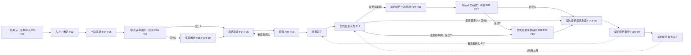
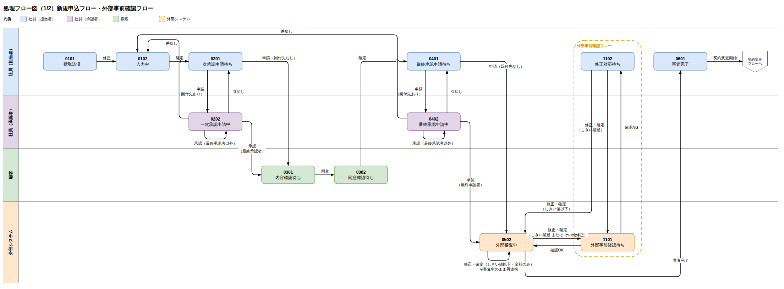
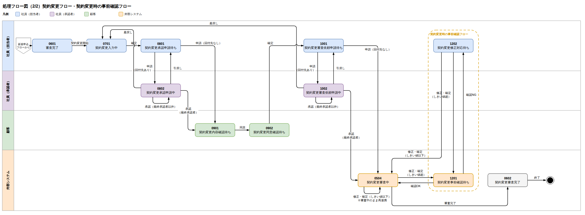

# 04. 処理フロー図

| 項目 | 内容 |
| --- | --- |
| 版 | 0.3（版・同意の対応表に申込取消・アカウント発行を追加。版 0.2：ステータス体系の改定を反映） |
| 図の原本 | [process-flow-new-application.drawio](../diagrams/process-flow-new-application.drawio)、[process-flow-contract-change.drawio](../diagrams/process-flow-contract-change.drawio)（draw.io 形式。PNG は [diagrams/png](../diagrams/png/) にエクスポート） |
| 関連 | [03. ステータス定義・状態遷移](03-status-transition.md)、[10. 機能詳細](10-function-detail.md) |

処理フローは新規申込と契約変更の 2 枚で、どちらも「入力 → 一次承認 → 申込者確認・同意 → （事前確認） → 最終承認 → 審査」の形をとる。事前確認は会社区分 2 の申込だけが通る工程で、各図の破線枠に含めている。

図はスイムレーン形式で、レーンが操作主体（申込受付会社（担当者）、申込受付会社（承認者）、申込者、審査担当部門）、箱がステータス、矢印が操作（遷移）を表す。「区分 1」「区分 2」は会社区分による分岐。

## 1. 全体の流れ（工程レベル）

## 2. 新規申込フロー

| 工程 | 操作主体 | ステータス | 操作 | 遷移先 | 機能 |
| --- | --- | --- | --- | --- | --- |
| 取込・新規作成 | 担当者 | （なし） | 一括取込 | 10100 一括取込済 | F01 |
| 取込・新規作成 | 担当者 | （なし） | 新規申込・追加申込（一時保存または確認へ） | 10101 申込入力中 | F03 |
| 入力 | 担当者 | 10100 | 修正 | 10101 | F03 |
| 入力 | 担当者 | 10100、10101 | 確定 | 10201 一次承認申請待ち | F03 |
| 一次承認 | 担当者 | 10201 | 修正 | 10101 | F03 |
| 一次承認 | 担当者 | 10201 | 申請（回付先あり） | 10202 一次承認申請中 | F04 |
| 一次承認 | 担当者 | 10201 | 申請（回付先なし） | 10301 申込内容確認待ち | F04 |
| 一次承認 | 承認者 | 10202 | 差戻し | 10201 | F05 |
| 一次承認 | 承認者 | 10202 | 承認（最終承認者） | 10301 | F05 |
| 申込者確認 | 担当者 | 10301、10302 | 引戻し | 10201 | F11 |
| 申込者確認 | 申込者 | 10301 | 内容の確認・修正、確定 | 10302 申込同意確認待ち | F07 |
| 申込者確認 | 申込者 | 10302 | 修正 | 10301 | F07 |
| 申込者確認 | 申込者 | 10302 | 差戻し | 10201 | F07 |
| 申込者確認 | 申込者 | 10302 | 同意する | 10501 最終承認申請待ち（区分 1）／10401 事前確認待ち（区分 2） | F07 |
| 事前確認（区分 2） | 審査担当部門 | 10401 | 事前確認 問題なし | 10501 | F08、F09 |
| 事前確認（区分 2） | 審査担当部門 | 10401 | 事前確認 修正必要 | 10402 修正対応待ち | F08、F09 |
| 事前確認（区分 2） | 担当者 | 10402 | 修正対応の確定 | 10401（変更基準内）／10201（変更基準超） | F10 |
| 事前確認（区分 2） | 担当者 | 10402 | 全体修正 | 10101 | F10 |
| 最終承認 | 担当者 | 10501 | 申請（回付先あり） | 10502 最終承認申請中 | F04 |
| 最終承認 | 担当者 | 10501 | 修正の確定 | 10201（変更基準超）／10501 のまま（変更基準内） | F10 |
| 最終承認 | 担当者 | 10501 | 全体修正 | 10101 | F10 |
| 最終承認 | 承認者 | 10502 | 差戻し | 10501 | F05 |
| 最終承認 | 承認者 | 10502 | 審査申請（最終承認者） | 10601 審査中 | F05 |
| 審査 | 審査担当部門 | 10601 | 審査完了 | 10701 審査完了 | F08、F09 |
| 審査 | 審査担当部門 | 10601 | 審査差戻し | 10501 | F08、F09 |
| 完了 | 担当者 | 10701 | 契約変更手続き | 20101 契約変更入力中（契約変更フローへ） | F12 |

- 差戻し（承認者）は申請待ちへ戻る。内容を直すときは担当者が「修正」で入力中へ戻す。
- 申込者の同意後に内容を変更すると、変更基準を超える場合は一次承認と申込者確認からやり直す。
- 10401 に到達するたびに事前確認依頼（IF01）、10601 に到達するたびに審査依頼（IF03）が送られる。

## 3. 契約変更フロー

| 工程 | 操作主体 | ステータス | 操作 | 遷移先 | 機能 |
| --- | --- | --- | --- | --- | --- |
| 契約変更開始 | 担当者 | 10701 審査完了／20701 契約変更審査完了 | 契約変更手続き | 20101 契約変更入力中 | F12 |
| 入力 | 担当者 | 20101 | 確定（変更基準超） | 20201 契約変更一次承認申請待ち | F12 |
| 入力 | 担当者 | 20101 | 確定（変更基準内） | 20501 契約変更最終承認申請待ち（区分 1）／20401 契約変更事前確認待ち（区分 2） | F12 |
| 一次承認 | 担当者 | 20201 | 修正 | 20101 | F12 |
| 一次承認 | 担当者 | 20201 | 申請（回付先あり） | 20202 契約変更一次承認申請中 | F04 |
| 一次承認 | 担当者 | 20201 | 申請（回付先なし） | 20301 契約変更内容確認待ち | F04 |
| 一次承認 | 承認者 | 20202 | 差戻し | 20201 | F05 |
| 一次承認 | 承認者 | 20202 | 承認（最終承認者） | 20301 | F05 |
| 申込者確認 | 担当者 | 20301、20302 | 引戻し | 20201 | F11 |
| 申込者確認 | 申込者 | 20301 | 確定 | 20302 契約変更同意確認待ち | F07 |
| 申込者確認 | 申込者 | 20302 | 差戻し | 20201 | F07 |
| 申込者確認 | 申込者 | 20302 | 同意する | 20501（区分 1）／20401（区分 2） | F07 |
| 事前確認（区分 2） | 審査担当部門 | 20401 | 事前確認 問題なし | 20501 | F08、F09 |
| 事前確認（区分 2） | 審査担当部門 | 20401 | 事前確認 修正必要 | 20402 契約変更修正対応待ち | F08、F09 |
| 事前確認（区分 2） | 担当者 | 20402 | 修正対応の確定 | 20401（変更基準内）／20201（変更基準超） | F10 |
| 最終承認 | 担当者 | 20501 | 修正 | 20101 | F12 |
| 最終承認 | 担当者 | 20501 | 申請（回付先あり） | 20502 契約変更最終承認申請中 | F04 |
| 最終承認 | 承認者 | 20502 | 差戻し | 20501 | F05 |
| 最終承認 | 承認者 | 20502 | 審査申請（最終承認者） | 20601 契約変更審査中 | F05 |
| 審査 | 審査担当部門 | 20601 | 審査完了 | 20701 契約変更審査完了 | F08、F09 |
| 審査 | 審査担当部門 | 20601 | 審査差戻し | 10701（初回の契約変更）／20701（2 回目以降） | F09、F13 |

- 契約変更の入力確定時に変更基準内なら、一次承認と申込者確認を省略して最終承認（区分 2 は事前確認）へ進む。
- 契約変更の審査差戻しは契約変更を取り消し、変更前の審査完了状態へ戻る。契約変更で作った版は取消として残る。
- 契約変更審査完了（20701）から再度の契約変更手続きができる。

## 4. 版・承認申請・申込者同意・外部連携の対応

処理フローの各工程で、どのレコードが作られるかの対応。

| 工程 | 申込内容（版） | 承認申請 | 申込者同意 | 外部連携 |
| --- | --- | --- | --- | --- |
| 一括取込・新規申込・追加申込 | 第 1 版（版種別 1）を作成 | | | |
| 一次承認・最終承認 | | 申請ごとに作成（承認種別 01／02） | | |
| 申込者確認 | 申込者の修正は現行版を更新 | | 10301 到達時に作成。同意で確定版化・基準版更新。申込がアカウントに紐づいていなければ申込者アカウントも発行（F17） | |
| 事前確認（区分 2） | | | | 10401 到達時に作成（連携種別 1） |
| 修正対応・同意後の修正 | 変更がある場合は新しい版（版種別 2）を作成（修正対応で変更がなければ版を作らない） | | | 10401 へ戻るとき連携種別 1 を再作成 |
| 審査 | | | | 10601 到達時に作成（連携種別 2）。審査完了で確定版化 |
| 契約変更開始 | 審査完了版を複写した版（版種別 3）を作成。基準版 = 審査完了版 | | | |
| 契約変更一次承認・最終承認 | | 申請ごとに作成（承認種別 03／04） | | |
| 契約変更の申込者確認 | | | 20301 到達時に作成 | |
| 契約変更事前確認（区分 2） | 修正対応は新しい版（版種別 4）を作成 | | | 20401 到達時に作成（連携種別 3） |
| 契約変更審査 | | | | 20601 到達時に作成（連携種別 4） |
| 申込取消（90101）・契約変更の取消（10701／20701 へ） | 契約変更の取消では契約変更で作った版を取消にし、現行版・基準版を審査完了版へ戻す | | 進行中の申込者同意を無効にする | |
| 契約変更の審査差戻し | 契約変更の版を取消。現行版を審査完了版に戻す | | | |
