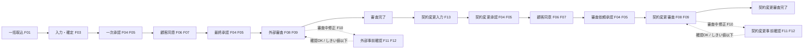

# 04. 処理フロー図

| 項目 | 内容 |
| --- | --- |
| 版 | 0.1（初版・ドラフト） |
| 図の原本 | [process-flow-new-application.drawio](../diagrams/process-flow-new-application.drawio)、[process-flow-contract-change.drawio](../diagrams/process-flow-contract-change.drawio)（draw.io 形式。PNG は [diagrams/png](../diagrams/png/) にエクスポート） |
| 関連 | [03. ステータス定義・状態遷移](03-status-transition.md)、[10. 機能詳細](10-function-detail.md) |

処理フローは新規申込と契約変更の 2 枚で、どちらも「入力 → 社内承認 → 顧客同意 → 社内承認 → 外部審査」の同じ形をとる。外部事前確認フローは各図の破線枠に含めている。

図はスイムレーン形式で、レーンが操作主体（社員（担当者）、社員（承認者）、顧客、外部システム）、箱がステータス、矢印が操作（遷移）を表す。

## 1. 全体の流れ（工程レベル）

## 2. 新規申込フロー・外部事前確認フロー

| 工程 | 操作主体 | ステータス | 操作 | 遷移先 | 機能 |
| --- | --- | --- | --- | --- | --- |
| 取込 | 担当者 | （なし） | 一括取込 | 0101 一括取込済 | F01 |
| 入力 | 担当者 | 0101 | 修正（保存） | 0102 入力中 | F03 |
| 入力 | 担当者 | 0102 | 確定 | 0201 一次承認申請待ち | F03 |
| 一次承認 | 担当者 | 0201 | 申請 | 0202 一次承認申請中（回付先あり）／0301（回付先なし） | F04 |
| 一次承認 | 承認者 | 0202 | 承認 | 0202（最終承認者以外）／0301 内容確認待ち（最終承認者） | F05 |
| 一次承認 | 承認者 | 0202 | 差戻し | 0102 入力中 | F05 |
| 一次承認 | 担当者 | 0202 | 引戻し | 0201 | F04 |
| 顧客同意 | 顧客 | 0301 | 同意 | 0302 同意確認待ち | F06、F07 |
| 顧客同意 | 顧客 | 0302 | 確定 | 0401 最終承認申請待ち | F07 |
| 最終承認 | 担当者 | 0401 | 申請 | 0402 最終承認申請中（回付先あり）／0502（回付先なし） | F04 |
| 最終承認 | 承認者 | 0402 | 承認 | 0402（最終承認者以外）／0502 外部審査中（最終承認者） | F05 |
| 最終承認 | 承認者 | 0402 | 差戻し | 0102 入力中 | F05 |
| 最終承認 | 担当者 | 0402 | 引戻し | 0401 | F04 |
| 外部審査 | 外部システム | 0502 | 審査完了 | 0601 審査完了 | F08、F09 |
| 外部審査 | 担当者 | 0502 | 修正・確定 | 1101 外部事前確認待ち（しきい値超 または その他修正）／0502 のまま（再連携） | F10 |
| 外部事前確認 | 外部システム | 1101 | 確認OK | 0502 | F11 |
| 外部事前確認 | 外部システム | 1101 | 確認NG | 1102 修正対応待ち | F11 |
| 外部事前確認 | 担当者 | 1102 | 修正・確定 | 1101（しきい値超）／0502（しきい値以下） | F12 |
| 完了 | 担当者 | 0601 | 契約変更開始 | 0701 契約変更入力中（契約変更フローへ） | F13 |

- 最終承認（0402）の差戻しは 0102 入力中へ戻るため、顧客同意（0301・0302）からやり直しになる。
- 破線枠の 1101・1102 は、確認 OK、または変更金額しきい値以下での修正・確定で 0502 に戻る。会社区分が「外部事前確認なし」の申込は破線枠に入らず、0502 のまま再連携する。
- 0502 に到達するたび（承認完了、再連携）に外部審査依頼（IF01）が送られる。

## 3. 契約変更フロー・契約変更時の事前確認フロー

| 工程 | 操作主体 | ステータス | 操作 | 遷移先 | 機能 |
| --- | --- | --- | --- | --- | --- |
| 契約変更開始 | 担当者 | 0601 審査完了 | 契約変更開始 | 0701 契約変更入力中 | F13 |
| 入力 | 担当者 | 0701 | 確定 | 0801 契約変更承認申請待ち | F13 |
| 契約変更承認 | 担当者 | 0801 | 申請 | 0802 契約変更承認申請中（回付先あり）／0901（回付先なし） | F04 |
| 契約変更承認 | 承認者 | 0802 | 承認 | 0802（最終承認者以外）／0901 契約変更内容確認待ち（最終承認者） | F05 |
| 契約変更承認 | 承認者 | 0802 | 差戻し | 0701 | F05 |
| 契約変更承認 | 担当者 | 0802 | 引戻し | 0801 | F04 |
| 顧客同意 | 顧客 | 0901 | 同意 | 0902 契約変更同意確認待ち | F06、F07 |
| 顧客同意 | 顧客 | 0902 | 確定 | 1001 契約変更審査依頼申請待ち | F07 |
| 審査依頼承認 | 担当者 | 1001 | 申請 | 1002 契約変更審査依頼申請中（回付先あり）／0504（回付先なし） | F04 |
| 審査依頼承認 | 承認者 | 1002 | 承認 | 1002（最終承認者以外）／0504 契約変更審査中（最終承認者） | F05 |
| 審査依頼承認 | 承認者 | 1002 | 差戻し | 0701 | F05 |
| 審査依頼承認 | 担当者 | 1002 | 引戻し | 1001 | F04 |
| 契約変更審査 | 外部システム | 0504 | 審査完了 | 0602 契約変更審査完了（終了） | F08、F09 |
| 契約変更審査 | 担当者 | 0504 | 修正・確定 | 1201 契約変更事前確認待ち（しきい値超）／0504 のまま（再連携） | F10 |
| 契約変更事前確認 | 外部システム | 1201 | 確認OK | 0504 | F11 |
| 契約変更事前確認 | 外部システム | 1201 | 確認NG | 1202 契約変更修正対応待ち | F11 |
| 契約変更事前確認 | 担当者 | 1202 | 修正・確定 | 1201（しきい値超）／0504（しきい値以下） | F12 |

- 流れは新規申込と同じで、差戻し先が 0701 契約変更入力中になる。
- 審査中の修正で事前確認（1201）へ回るのは変更金額しきい値超の場合だけで、「その他修正」の条件はない。
- 0602 契約変更審査完了は終了ステータスで、以降の操作はない（2 回目以降の契約変更は [99. 未決事項](99-open-issues.md)）。

## 4. 版・承認申請・外部連携の対応

処理フローの各工程で、どのレコードが作られるかの対応。

| 工程 | 申込内容（版） | 承認申請 | 顧客同意 | 外部連携 |
| --- | --- | --- | --- | --- |
| 一括取込 | 第 1 版（版種別 1）を作成 | | | |
| 一次承認・最終承認 | | 申請ごとに作成（承認種別 01／02） | | |
| 顧客同意 | | | 0301 到達時に作成 | |
| 外部審査 | | | | 0502 到達時に作成（連携種別 2） |
| 審査中修正 | 新しい版（版種別 2）を作成 | | | 1101 で連携種別 1、0502 で連携種別 2 |
| 修正対応 | 同じ版を更新 | | | 同上 |
| 契約変更開始 | 審査完了版を複写した版（版種別 3）を作成 | | | |
| 契約変更承認・審査依頼承認 | | 申請ごとに作成（承認種別 03／04） | | |
| 契約変更同意 | | | 0901 到達時に作成 | |
| 契約変更審査 | | | | 0504 到達時に作成（連携種別 4） |
| 契約変更審査中修正 | 新しい版（版種別 4）を作成 | | | 1201 で連携種別 3、0504 で連携種別 4 |
