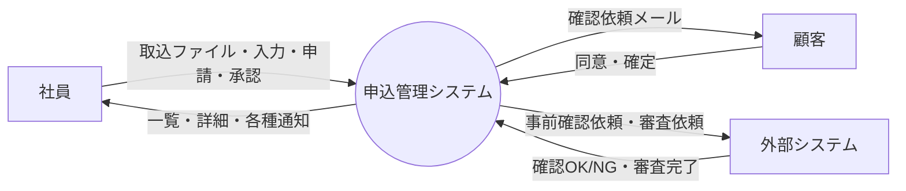

# 05. データフロー図

| 項目 | 内容 |
| --- | --- |
| 版 | 0.1（初版・ドラフト） |
| 図の原本 | [dfd.drawio](../diagrams/dfd.drawio)（draw.io 形式。PNG は [diagrams/png/dfd.png](../diagrams/png/dfd.png)） |
| 関連 | [09. 機能一覧](09-function-list.md)、[07. テーブル定義](07-table-definition.md) |

## 1. コンテキスト図（レベル 0）

## 2. データフロー図（レベル 1）

社員・顧客・外部システムからの入力は P1〜P4 の 4 つの処理が受け、どの処理もステータス遷移制御（P5 = F14）を通して申込のステータスを更新し、同時にステータス履歴を残す。P5 は遷移先に応じて顧客同意・外部連携・通知のレコードを登録し、実際のメール送信・外部送信は P6（BT01）と P4 内のバッチ（BT02）が行う。

承認ルートやステータス遷移などマスタの参照と、P2〜P4 による申込内容（D1）の参照のみの流れは図から省いている。

### 2.1 外部実体

| 記号 | 外部実体 | 入力（→ システム） | 出力（システム →） |
| --- | --- | --- | --- |
| 社員 | 担当者・承認者・管理者 | 取込ファイル、入力内容、申請・承認・差戻し・引戻し | 一覧・詳細、取込結果、承認状況、各種通知メール |
| 顧客 | 申込の顧客 | 同意、確定 | 確認依頼メール、申込内容（確認画面） |
| 外部システム | 事前確認・審査を行うシステム | 確認OK／NG、審査完了 | 事前確認依頼、審査依頼 |

### 2.2 処理

| 記号 | 処理 | 対応する機能 | 概要 |
| --- | --- | --- | --- |
| P1 | 申込登録・修正・照会 | F01、F02、F03、F10、F12、F13 | 申込と版の登録・更新・照会。取込結果の記録 |
| P2 | 承認ワークフロー | F04、F05 | 承認ルートの判定、承認申請・承認明細の登録・更新 |
| P3 | 顧客確認・同意 | F07 | トークン検証、同意・確定の記録 |
| P4 | 外部連携 | F08、F09、F11、BT02 | 外部連携レコードの送信（BT02）と結果の受信 |
| P5 | ステータス遷移制御 | F14 | 遷移判定、操作者照合、ステータス更新、履歴登録、後続処理（同意・外部連携・通知の登録） |
| P6 | 通知送信 | F06、BT01 | 通知キューからメールを送信 |

### 2.3 データストア

| 記号 | データストア | 対応するテーブル |
| --- | --- | --- |
| D1 | 申込・申込内容（版） | T_APPLICATION、T_APPLICATION_VERSION |
| D2 | 承認申請・承認明細 | T_APPROVAL_REQUEST、T_APPROVAL_STEP |
| D3 | 顧客同意 | T_CUSTOMER_CONSENT |
| D4 | 外部連携 | T_EXTERNAL_LINK |
| D5 | 通知 | T_NOTIFICATION |
| D6 | ステータス履歴 | T_STATUS_HISTORY |
| D7 | 一括取込・取込エラー | T_IMPORT_BATCH、T_IMPORT_ERROR |

### 2.4 データフロー一覧

| 発生元 | 宛先 | データ | 備考 |
| --- | --- | --- | --- |
| 社員 | P1 | 取込ファイル、入力内容 | SC04、SC05 |
| P1 | 社員 | 一覧・詳細、取込結果 | SC02、SC03、SC05 |
| 社員 | P2 | 申請、承認、差戻し、引戻し | SC03 |
| P2 | 社員 | 承認状況 | SC03 |
| 顧客 | P3 | 同意、確定 | CU01、CU02 |
| P3 | 顧客 | 申込内容（確認画面） | CU01 |
| 外部システム | P4 | 確認OK／NG、審査完了 | IF02、IF04 |
| P4 | 外部システム | 事前確認依頼、審査依頼 | IF01、IF03（BT02 が送信） |
| P6 | 顧客 | 確認依頼メール | 通知種別 01 |
| P6 | 社員 | 承認依頼・差戻し・確認NG・審査完了の通知 | 通知種別 02〜06 |
| P1 | D1 | 申込・版の登録・更新・参照 | |
| P1 | D7 | 取込結果、エラー行 | |
| P2 | D2 | 承認申請・承認明細の登録・更新 | |
| P3 | D3 | 同意・確定の記録（日時、IP） | |
| P4 | D4 | 送信状態・受付番号・結果の更新 | |
| P6 | D5 | 未送信の取得、送信結果の更新 | |
| P1〜P4 | P5 | 遷移要求（申込ID、操作コード、操作者、コメント、経路情報） | |
| P5 | D1 | ステータス、基準金額、審査完了版の更新 | |
| P5 | D6 | 履歴登録 | |
| P5 | D3 | 同意レコード作成（トークン発行） | 0301／0901 到達時 |
| P5 | D4 | 外部連携レコード作成 | 0502／0504／1101／1201 到達時 |
| P5 | D5 | 通知登録 | 通知種別 01〜05 |
| P2〜P4 | D1 | 申込内容の参照 | 図では省略 |
