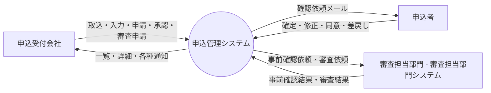

# 05. データフロー図

| 項目 | 内容 |
| --- | --- |
| 版 | 0.2（ステータス体系の改定を反映） |
| 図の原本 | [dfd.drawio](../diagrams/dfd.drawio)（draw.io 形式。PNG は [diagrams/png/dfd.png](../diagrams/png/dfd.png)） |
| 関連 | [09. 機能一覧](09-function-list.md)、[07. テーブル定義](07-table-definition.md) |

## 1. コンテキスト図（レベル 0）

## 2. データフロー図（レベル 1）

申込受付会社・申込者・審査担当部門からの入力は P1〜P4 の 4 つの処理が受け、どの処理もステータス遷移制御（P5 = F14）を通して申込のステータスを更新し、同時にステータス履歴を残す。P5 は遷移先に応じて申込者同意・外部連携・通知のレコードを登録し、実際のメール送信・外部送信は P6（BT01）と P4 内のバッチ（BT02）が行う。

承認ルートやステータス遷移などマスタの参照と、P2〜P4 による申込内容（D1）の参照のみの流れは図から省いている。

### 2.1 外部実体

| 記号 | 外部実体 | 入力（→ システム） | 出力（システム →） |
| --- | --- | --- | --- |
| 申込受付会社 | 担当者・承認者・管理者 | 取込ファイル、入力内容、修正内容、回付先設定、申請・承認・差戻し・審査申請、引戻し | 一覧・詳細、取込結果、承認状況、各種通知メール |
| 申込者 | 申込の当事者 | 確定、修正、同意、差戻し | 確認依頼メール、申込内容（確認画面） |
| 審査担当部門 | 事前確認・審査を行う部門（審査担当部門システム経由） | 事前確認結果（問題なし／修正必要）、審査結果（審査完了／審査差戻し） | 事前確認依頼、審査依頼 |

### 2.2 処理

| 記号 | 処理 | 対応する機能 | 概要 |
| --- | --- | --- | --- |
| P1 | 申込登録・修正・照会 | F01、F02、F03、F10、F11、F12 | 申込と版の登録・更新・照会、引戻し、契約変更の入力 |
| P2 | 承認ワークフロー | F04、F05 | 回付先の設定、承認申請・承認明細の登録・更新、承認・差戻し・審査申請 |
| P3 | 申込者確認・同意 | F07 | トークン検証、申込者の確定・修正・同意・差戻しの記録 |
| P4 | 審査担当部門連携 | F08、F09、F13、BT02 | 外部連携レコードの送信（BT02）と結果の受信、契約変更の審査差戻しの復元 |
| P5 | ステータス遷移制御 | F14 | 遷移判定、操作者照合、ステータス更新、履歴登録、後続処理（同意・外部連携・通知の登録、版の操作） |
| P6 | 通知送信 | F06、BT01 | 通知キューからメールを送信 |

### 2.3 データストア

| 記号 | データストア | 対応するテーブル |
| --- | --- | --- |
| D1 | 申込・申込内容（版） | T_APPLICATION、T_APPLICATION_VERSION |
| D2 | 承認申請・承認明細 | T_APPROVAL_REQUEST、T_APPROVAL_STEP |
| D3 | 申込者同意 | T_APPLICANT_CONSENT |
| D4 | 外部連携 | T_EXTERNAL_LINK |
| D5 | 通知 | T_NOTIFICATION |
| D6 | ステータス履歴 | T_STATUS_HISTORY |
| D7 | 一括取込・取込エラー | T_IMPORT_BATCH、T_IMPORT_ERROR |

### 2.4 データフロー一覧

| 発生元 | 宛先 | データ | 備考 |
| --- | --- | --- | --- |
| 申込受付会社 | P1 | 取込ファイル、入力内容、修正内容、引戻し、契約変更内容 | SC04、SC05、SC07〜SC10 |
| P1 | 申込受付会社 | 一覧・詳細、取込結果 | SC02、SC03、SC10 |
| 申込受付会社 | P2 | 回付先設定、申請、承認、差戻し、審査申請 | SC06 |
| P2 | 申込受付会社 | 承認状況 | SC03、SC06 |
| 申込者 | P3 | 確定、修正、同意、差戻し | AP01〜AP03 |
| P3 | 申込者 | 申込内容（確認画面） | AP01 |
| 審査担当部門 | P4 | 事前確認結果、審査結果 | IF02、IF04 |
| P4 | 審査担当部門 | 事前確認依頼、審査依頼 | IF01、IF03（BT02 が送信） |
| P6 | 申込者 | 確認依頼メール | 通知種別 01 |
| P6 | 申込受付会社 | 承認依頼・差戻し・申込者差戻し・事前確認結果・審査結果・送信エラーの通知 | 通知種別 02〜07 |
| P1 | D1 | 申込・版の登録・更新・参照 | |
| P1 | D7 | 取込結果、エラー行 | |
| P2 | D2 | 承認申請・承認明細の登録・更新 | |
| P3 | D3 | 確定・同意・差戻しの記録（日時、IP、理由） | |
| P4 | D4 | 送信状態・受付番号・結果の更新 | |
| P6 | D5 | 未送信の取得、送信結果の更新 | |
| P1〜P4 | P5 | 遷移要求（申込ID、操作コード、操作者、コメント、経路情報） | |
| P5 | D1 | ステータス、基準版、審査完了版、版（複写・確定版化・取消）の更新 | |
| P5 | D6 | 履歴登録 | |
| P5 | D3 | 同意レコード作成（トークン発行）、無効化 | 10301／20301 到達時、引戻し時 |
| P5 | D4 | 外部連携レコード作成 | 10401／10601／20401／20601 到達時 |
| P5 | D5 | 通知登録 | 通知種別 01〜06 |
| P2〜P4 | D1 | 申込内容の参照 | 図では省略 |
