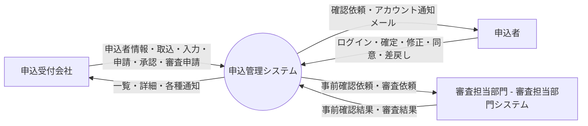
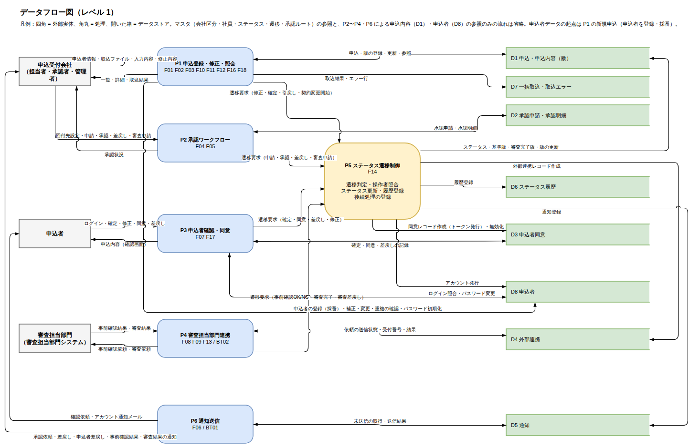
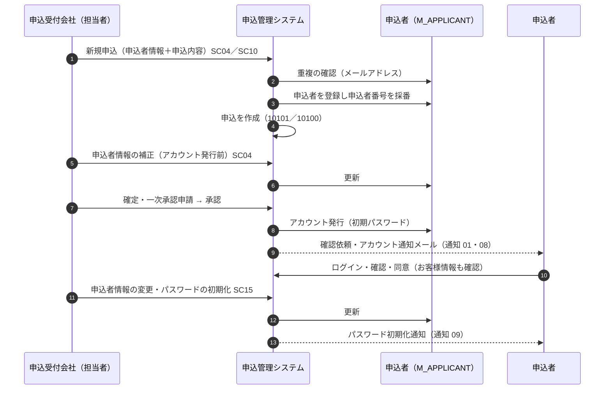

# 05. データフロー図

| 項目 | 内容 |
| --- | --- |
| 版 | 0.3（申込者データの起点を申込受付会社の新規申込に変更。申込者（D8）と申込者ポータルの流れを追加） |
| 図の原本 | [dfd.drawio](../diagrams/dfd.drawio)（draw.io 形式。PNG は [diagrams/png/dfd.png](../diagrams/png/dfd.png)） |
| 関連 | [09. 機能一覧](09-function-list.md)、[07. テーブル定義](07-table-definition.md) |

## 1. コンテキスト図（レベル 0）

## 2. データフロー図（レベル 1）

申込者データの起点は申込受付会社による新規申込の登録（P1）で、申込者情報は申込と同時に申込者（D8）へ登録される（3 章）。申込受付会社・申込者・審査担当部門からの入力は P1〜P4 の 4 つの処理が受け、どの処理もステータス遷移制御（P5 = F14）を通して申込のステータスを更新し、同時にステータス履歴を残す。P5 は遷移先に応じて申込者同意・外部連携・通知のレコードを登録し、実際のメール送信・外部送信は P6（BT01）と P4 内のバッチ（BT02）が行う。

承認ルートやステータス遷移などマスタの参照と、P2〜P4 による申込内容（D1）・申込者（D8）の参照のみの流れは図から省いている。

### 2.1 外部実体

| 記号 | 外部実体 | 入力（→ システム） | 出力（システム →） |
| --- | --- | --- | --- |
| 申込受付会社 | 担当者・承認者・管理者 | 申込者情報（新規申込・取込・補正・変更）、取込ファイル、入力内容、修正内容、回付先設定、申請・承認・差戻し・審査申請、引戻し、パスワードの初期化 | 一覧・詳細、取込結果、承認状況、申込者への通知の履歴、各種通知メール |
| 申込者 | 申込の当事者（申込受付会社が登録する） | ログイン、パスワード変更、確定、修正、同意、差戻し | 確認依頼メール、アカウント通知・パスワード初期化通知、申込内容とお客様情報（確認画面） |
| 審査担当部門 | 事前確認・審査を行う部門（審査担当部門システム経由） | 事前確認結果（問題なし／修正必要）、審査結果（審査完了／審査差戻し） | 事前確認依頼、審査依頼 |

### 2.2 処理

| 記号 | 処理 | 対応する機能 | 概要 |
| --- | --- | --- | --- |
| P1 | 申込登録・修正・照会 | F01、F02、F03、F10、F11、F12、F16、F18 | 申込者の登録（採番）・補正・変更、申込と版の登録・更新・照会、引戻し、取消、契約変更の入力、パスワードの初期化（SC15） |
| P2 | 承認ワークフロー | F04、F05 | 回付先の設定、承認申請・承認明細の登録・更新、承認・差戻し・審査申請 |
| P3 | 申込者確認・同意 | F07、F17 | トークン検証または申込者ログイン、申込者の確定・修正・同意・差戻しの記録、パスワード変更 |
| P4 | 審査担当部門連携 | F08、F09、F13、BT02 | 外部連携レコードの送信（BT02）と結果の受信、契約変更の審査差戻しの復元 |
| P5 | ステータス遷移制御 | F14 | 遷移判定、操作者照合、ステータス更新、履歴登録、後続処理（同意・外部連携・通知の登録、版の操作、申込者アカウントの発行） |
| P6 | 通知送信 | F06、BT01 | 通知キューからメールを送信 |

### 2.3 データストア

| 記号 | データストア | 対応するテーブル |
| --- | --- | --- |
| D1 | 申込・申込内容（版） | T_APPLICATION、T_APPLICATION_VERSION |
| D2 | 承認申請・承認明細 | T_APPROVAL_REQUEST、T_APPROVAL_STEP |
| D3 | 申込者同意 | T_APPLICANT_CONSENT |
| D4 | 外部連携 | T_EXTERNAL_LINK |
| D5 | 通知 | T_NOTIFICATION |
| D6 | ステータス履歴 | T_STATUS_HISTORY |
| D7 | 一括取込・取込エラー | T_IMPORT_BATCH、T_IMPORT_ERROR |
| D8 | 申込者 | M_APPLICANT（申込者情報と申込者ページのアカウント） |

### 2.4 データフロー一覧

| 発生元 | 宛先 | データ | 備考 |
| --- | --- | --- | --- |
| 申込受付会社 | P1 | 申込者情報（新規の申込者・登録済みの申込者番号）、取込ファイル、入力内容、修正内容、引戻し、取消、契約変更内容、申込者情報の変更、パスワードの初期化 | SC04、SC05、SC07〜SC10、SC14、SC15 |
| P1 | 申込受付会社 | 一覧・詳細、取込結果、重複の警告（W003）、申込者への通知の履歴 | SC02、SC03、SC04、SC10、SC15 |
| 申込受付会社 | P2 | 回付先設定、申請、承認、差戻し、審査申請 | SC06 |
| P2 | 申込受付会社 | 承認状況 | SC03、SC06 |
| 申込者 | P3 | ログイン、パスワード変更、確定、修正、同意、差戻し | AP01〜AP03、AP06〜AP09 |
| P3 | 申込者 | 申込内容とお客様情報（確認画面）、お知らせ | AP01、AP07、AP08 |
| 審査担当部門 | P4 | 事前確認結果、審査結果 | IF02、IF04 |
| P4 | 審査担当部門 | 事前確認依頼、審査依頼 | IF01、IF03（BT02 が送信） |
| P6 | 申込者 | 確認依頼メール、申込者アカウント通知、パスワード初期化通知 | 通知種別 01、08、09 |
| P6 | 申込受付会社 | 承認依頼・差戻し・申込者差戻し・事前確認結果・審査結果・送信エラーの通知 | 通知種別 02〜07 |
| P1 | D1 | 申込・版の登録・更新・参照 | |
| P1 | D7 | 取込結果、エラー行 | |
| P1 | D8 | 申込者の登録（申込者番号を採番）、補正（アカウント発行前）、変更（SC15）、重複の確認（メールアドレス）、パスワードの初期化 | 3 章 |
| P1 | D5 | パスワード初期化通知の登録 | 通知種別 09 |
| P3 | D8 | ログインの照合、パスワード変更 | AP06、AP09 |
| P5 | D8 | 申込者アカウントの発行（初期パスワード） | 10301／20301 到達時に未発行なら |
| P2 | D2 | 承認申請・承認明細の登録・更新 | |
| P3 | D3 | 確定・同意・差戻しの記録（日時、IP、理由） | |
| P4 | D4 | 送信状態・受付番号・結果の更新 | |
| P6 | D5 | 未送信の取得、送信結果の更新 | |
| P1〜P4 | P5 | 遷移要求（申込ID、操作コード、操作者、コメント、経路情報） | |
| P5 | D1 | ステータス、基準版、審査完了版、版（複写・確定版化・取消）の更新 | |
| P5 | D6 | 履歴登録 | |
| P5 | D3 | 同意レコード作成（トークン発行）、無効化 | 10301／20301 到達時、引戻し時 |
| P5 | D4 | 外部連携レコード作成 | 10401／10601／20401／20601 到達時 |
| P5 | D5 | 通知登録 | 通知種別 01〜06、08 |
| P2〜P4 | D1 | 申込内容の参照 | 図では省略 |
| P3、P4、P6 | D8 | 申込者情報（宛先・電文）の参照 | 図では省略 |

## 3. 申込者データの流れ

申込者データの起点は、申込受付会社が新規申込を登録すること（画面入力 SC04、一括取込 SC10）である。申込者情報は申込の作成と同じトランザクションで申込者（D8 = M_APPLICANT）に登録し、申込者番号をシステムが採番する。初期データに申込者は持たない。

### 3.1 段階ごとの扱い

| 段階 | 契機・画面 | 申込者データの処理 | 変更できる人・画面 |
| --- | --- | --- | --- |
| 登録 | 新規申込の最初の一時保存／確認へ（SC04）、一括取込（SC10） | 「新規の申込者を登録する」は申込者情報を入力し、申込の作成と同時に登録・採番する。「登録済みの申込者を指定する」は申込者番号で既存の申込者に紐づける（同じ申込者の 2 件目以降）。追加申込は元の申込の申込者を引き継ぐ | 担当者 |
| 重複の確認 | 登録・メールアドレスの変更時 | 同じメールアドレス（大文字・小文字を区別しない）の申込者がいれば、画面では W003 で警告し、登録済みの申込者を指定するか「別の申込者として登録する」を確認してから登録する。一括取込ではエラー行にする（申込者番号の指定を促す） | － |
| 補正 | 入力中（10101。SC05 の「修正」で戻した 10201 も含む） | 申込者の関与前（申込者ページのアカウント未発行で、この申込だけで使われている申込者）は SC04 で申込内容と一緒に補正できる | 担当者（SC04） |
| 確認 | 確定前（SC05）、申込者の確認（AP01） | SC05 で宛先（メールアドレス）を含む申込者情報を確認してから確定する。申込者は AP01 の「お客様情報」で自分の情報を確認し、誤りは差戻しの理由で伝える | － |
| アカウント発行 | 一次承認が通って内容確認待ちになったとき（F14 後続処理） | 申込者ページのアカウント（ユーザー ID = 申込者番号、初期パスワード）を発行し、通知 08 を登録する | － |
| 変更 | アカウント発行後、または他の申込でも使われている申込者 | SC15 で申込者情報を変更する（申込者番号は変更不可。変更はその申込者のすべての申込に反映）。確認中にメールアドレスを変えたら確認依頼メールを再送する（W004） | 担当者・管理者（SC15） |
| パスワードの初期化 | 申込者からの依頼など | SC15 で新しい初期パスワードを発行し、通知 09 を登録する | 担当者・管理者（SC15） |
