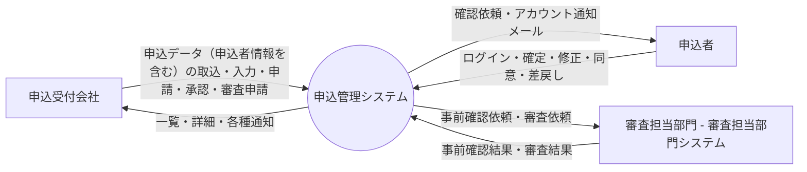
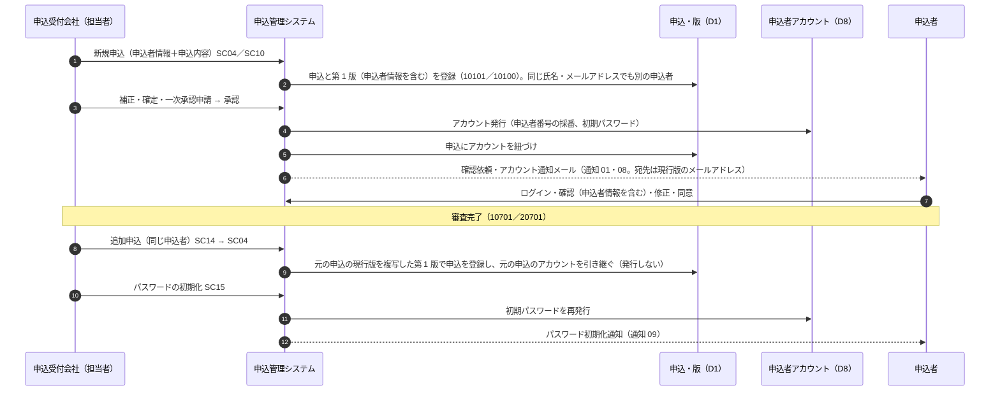

# 05. データフロー図

| 項目 | 内容 |
| --- | --- |
| 版 | 0.5（新規申込は常に別の申込者、同じ申込者は追加申込でアカウントを引き継ぐ。版 0.4：申込者情報を D1 の版に持ち、ログイン用データを D8 に分離） |
| 図の原本 | [dfd.drawio](../diagrams/dfd.drawio)（draw.io 形式。PNG は [diagrams/png/dfd.png](../diagrams/png/dfd.png)） |
| 関連 | [09. 機能一覧](09-function-list.md)、[07. テーブル定義](07-table-definition.md) |

## 1. コンテキスト図（レベル 0）

## 2. データフロー図（レベル 1）

申込者データの起点は申込受付会社による新規申込の登録（P1）である。申込者名・連絡先などの申込者情報は申込データとして申込内容の版（D1）に入り、申込者がログインに必要なデータ（ユーザー ID・パスワード）は一次承認が通ったときに P5 が申込者アカウント（D8）として発行する（3 章）。申込受付会社・申込者・審査担当部門からの入力は P1〜P4 の 4 つの処理が受け、どの処理もステータス遷移制御（P5 = F14）を通して申込のステータスを更新し、同時にステータス履歴を残す。P5 は遷移先に応じて申込者同意・外部連携・通知のレコードを登録し、実際のメール送信・外部送信は P6（BT01）と P4 内のバッチ（BT02）が行う。

承認ルートやステータス遷移などマスタの参照と、P2〜P4・P6 による申込内容（D1。申込者情報を含む）・申込者アカウント（D8）の参照のみの流れは図から省いている。

### 2.1 外部実体

| 記号 | 外部実体 | 入力（→ システム） | 出力（システム →） |
| --- | --- | --- | --- |
| 申込受付会社 | 担当者・承認者・管理者 | 入力内容（申込者情報を含む申込データ）、追加申込、取込ファイル、修正内容、回付先設定、申請・承認・差戻し・審査申請、引戻し、パスワードの初期化 | 一覧・詳細、取込結果、承認状況、申込者への通知の履歴、各種通知メール |
| 申込者 | 申込の当事者（申込受付会社が申込データとして登録する） | ログイン、パスワード変更、確定、修正（申込者情報を含む）、同意、差戻し | 確認依頼メール、アカウント通知・パスワード初期化通知、申込内容（申込者情報を含む。確認画面） |
| 審査担当部門 | 事前確認・審査を行う部門（審査担当部門システム経由） | 事前確認結果（問題なし／修正必要）、審査結果（審査完了／審査差戻し） | 事前確認依頼、審査依頼 |

### 2.2 処理

| 記号 | 処理 | 対応する機能 | 概要 |
| --- | --- | --- | --- |
| P1 | 申込登録・修正・照会 | F01、F02、F03、F10、F11、F12、F16 | 申込と版（申込者情報を含む）の登録・更新・照会、追加申込（元の申込のアカウントを引き継ぐ）、引戻し、取消、契約変更の入力、パスワードの初期化（SC15） |
| P2 | 承認ワークフロー | F04、F05 | 回付先の設定、承認申請・承認明細の登録・更新、承認・差戻し・審査申請 |
| P3 | 申込者確認・同意 | F07、F17 | トークン検証または申込者ログイン、申込者の確定・修正・同意・差戻しの記録、パスワード変更 |
| P4 | 審査担当部門連携 | F08、F09、F13、BT02 | 外部連携レコードの送信（BT02）と結果の受信、契約変更の審査差戻しの復元 |
| P5 | ステータス遷移制御 | F14 | 遷移判定、操作者照合、ステータス更新、履歴登録、後続処理（同意・外部連携・通知の登録、版の操作、申込者アカウントの発行） |
| P6 | 通知送信 | F06、BT01 | 通知キューからメールを送信 |

### 2.3 データストア

| 記号 | データストア | 対応するテーブル |
| --- | --- | --- |
| D1 | 申込・申込内容（版） | T_APPLICATION、T_APPLICATION_VERSION（申込者名・申込者名カナ・メールアドレス・電話番号・住所を版ごとに持つ） |
| D2 | 承認申請・承認明細 | T_APPROVAL_REQUEST、T_APPROVAL_STEP |
| D3 | 申込者同意 | T_APPLICANT_CONSENT |
| D4 | 外部連携 | T_EXTERNAL_LINK |
| D5 | 通知 | T_NOTIFICATION |
| D6 | ステータス履歴 | T_STATUS_HISTORY |
| D7 | 一括取込・取込エラー | T_IMPORT_BATCH、T_IMPORT_ERROR |
| D8 | 申込者アカウント | M_APPLICANT_ACCOUNT（申込者ページのログインに必要なデータ：ユーザー ID = 申込者番号、パスワード） |

### 2.4 データフロー一覧

| 発生元 | 宛先 | データ | 備考 |
| --- | --- | --- | --- |
| 申込受付会社 | P1 | 入力内容（申込者情報を含む）、追加申込、取込ファイル、修正内容、引戻し、取消、契約変更内容、パスワードの初期化 | SC04、SC05、SC07〜SC10、SC14、SC15 |
| P1 | 申込受付会社 | 一覧・申込メニュー・内容確認、取込結果、申込者への通知の履歴 | SC02、SC14、SC05、SC09、SC10、SC15、SC03（開発者向け） |
| 申込受付会社 | P2 | 回付先設定、申請、承認、差戻し、審査申請 | SC06 |
| P2 | 申込受付会社 | 承認状況 | SC06、SC14 |
| 申込者 | P3 | ログイン、パスワード変更、確定、修正、同意、差戻し | AP01〜AP03、AP06〜AP09 |
| P3 | 申込者 | 申込内容（申込者情報を含む。確認画面）、お知らせ | AP01、AP07、AP08 |
| 審査担当部門 | P4 | 事前確認結果、審査結果 | IF02、IF04 |
| P4 | 審査担当部門 | 事前確認依頼、審査依頼 | IF01、IF03（BT02 が送信） |
| P6 | 申込者 | 確認依頼メール、申込者アカウント通知、パスワード初期化通知 | 通知種別 01、08、09 |
| P6 | 申込受付会社 | 承認依頼・差戻し・申込者差戻し・事前確認結果・審査結果・送信エラーの通知 | 通知種別 02〜07 |
| P1 | D1 | 申込・版（申込者情報を含む）の登録・更新・参照。追加申込は元の申込の現行版を複写し、アカウント（APPLICANT_ID）を引き継ぐ | |
| P1 | D7 | 取込結果、エラー行 | |
| P1 | D8 | パスワードの初期化 | SC15 |
| P1 | D5 | パスワード初期化通知の登録 | 通知種別 09 |
| P3 | D8 | ログインの照合、パスワード変更 | AP06、AP09 |
| P5 | D8 | 申込者アカウントの発行（申込者番号の採番、初期パスワード） | 10301／20301 到達時に申込がアカウントに紐づいていなければ（新規申込は常に新しく発行） |
| P2 | D2 | 承認申請・承認明細の登録・更新 | |
| P3 | D3 | 確定・同意・差戻しの記録（日時、IP、理由） | |
| P3 | D1 | 申込者の修正（申込者情報を含む現行版の更新） | AP02（10301 のみ） |
| P4 | D4 | 送信状態・受付番号・結果の更新 | |
| P6 | D5 | 未送信の取得、送信結果の更新 | |
| P1〜P4 | P5 | 遷移要求（申込ID、操作コード、操作者、コメント、経路情報） | |
| P5 | D1 | ステータス、基準版、審査完了版、版（複写・確定版化・取消）の更新、発行したアカウントの紐づけ | |
| P5 | D6 | 履歴登録 | |
| P5 | D3 | 同意レコード作成（トークン発行）、無効化 | 10301／20301 到達時、引戻し時 |
| P5 | D4 | 外部連携レコード作成 | 10401／10601／20401／20601 到達時 |
| P5 | D5 | 通知登録 | 通知種別 01〜06、08 |
| P2〜P4、P6 | D1 | 申込内容・申込者情報（宛先・電文）の参照 | 図では省略 |

## 3. 申込者データの流れ

申込者データの起点は、申込受付会社が新規申込を登録すること（画面入力 SC04、一括取込 SC10）である。申込者に関するデータは次の 2 つに分けて持つ（[10. 18 章](10-function-detail.md#18-申込者情報と申込者アカウント)）。

- 申込データ：申込者名、申込者名カナ、メールアドレス、電話番号、住所。申込内容と同じく申込内容の版（D1 = T_APPLICATION_VERSION）に持ち、申込と一緒に登録・修正・確認・同意・審査の対象になる。
- ログインに必要なデータ：申込者番号（ユーザー ID）、パスワード。申込者アカウント（D8 = M_APPLICANT_ACCOUNT）に持ち、一次承認が通ったときに発行して申込に紐づける。初期データには持たない。

### 3.1 段階ごとの扱い

| 段階 | 契機・画面 | 申込者データの処理 | 変更できる人・画面 |
| --- | --- | --- | --- |
| 登録（新規申込） | 新規申込の最初の一時保存／確認へ（SC04）、一括取込（SC10） | 申込者情報を申込内容と一緒に入力し、申込の第 1 版に登録する。申込者名・メールアドレスは確認へ・確定・取込で必須。同じ氏名・メールアドレスの申込があっても別の申込者として扱い、重複の確認はしない | 担当者 |
| 登録（追加申込） | 元の申込が審査完了（10701／20701）のとき、SC14「追加申込」→ SC04 | 同じ申込者の新しい申込。元の申込の現行版（申込者情報を含む）を複写した値を初期値にして登録する（変更可。元の申込とは別データ）。申込者アカウントは元の申込のものを引き継ぐ | 担当者 |
| 補正 | 入力中（10100、10101。SC05 の「修正」で戻した 10201 も含む） | 申込内容と同じく SC04 で現行版を更新する | 担当者（SC04） |
| 確認 | 確定前（SC05）、申込者の確認（AP01） | SC05 で宛先（メールアドレス）を含む申込者情報を確認してから確定する。申込者は AP01 で申込内容と一緒に確認する | － |
| アカウント発行 | 一次承認が通って内容確認待ちになったとき（F14 後続処理） | 申込がアカウントに紐づいていなければ（新規申込）申込者アカウント（ユーザー ID = 申込者番号、初期パスワード）を発行して紐づけ、通知 08 を登録する。追加申込は引き継いだアカウントのまま | － |
| 申込者の修正 | 内容確認待ち（10301） | AP02 で申込者情報を含む現行版を修正する（契約変更中は差戻しで伝える） | 申込者（AP02） |
| 申込者の関与後の変更 | 全体修正（10501／10402 から）、契約変更 | 申込内容と同じく新しい版を作って変更する。変更した項目は SC05／SC09 で赤字にする。アカウント（申込者番号・パスワード）は変わらない | 担当者（SC04、SC08） |
| パスワードの初期化 | 申込者からの依頼など | SC15 で新しい初期パスワードを発行し、通知 09 を現行版のメールアドレスへ登録する | 担当者・管理者（SC15） |
