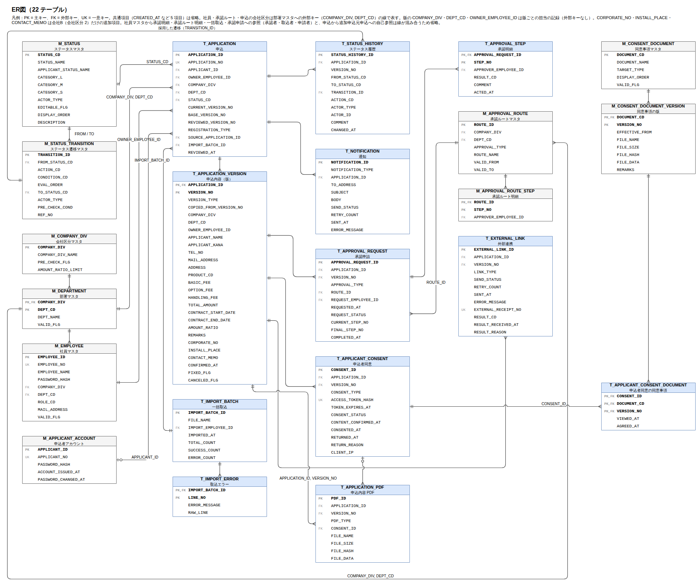
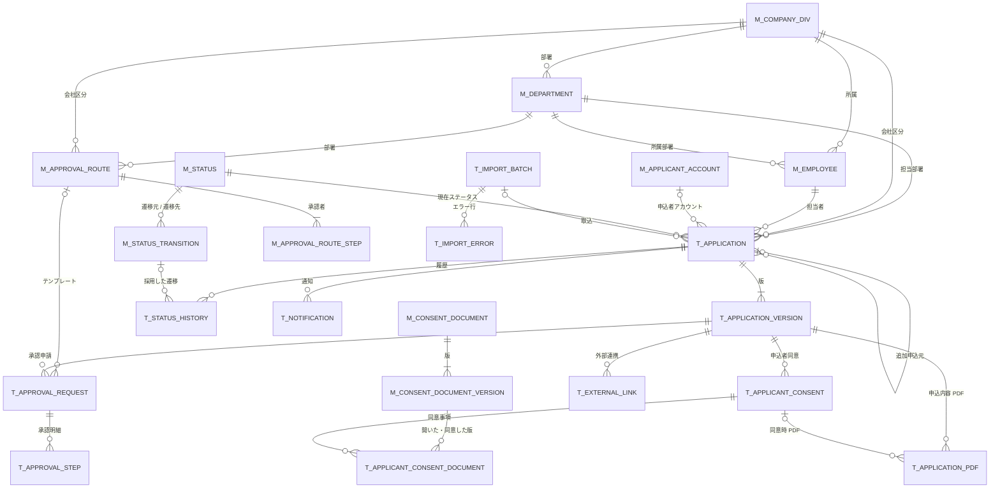

# 06. ER図

| 項目 | 内容 |
| --- | --- |
| 版 | 0.7（同意事項マスタ・同意事項の版・申込者同意の同意事項・申込内容 PDF を追加。版 0.6：版に会社B だけの追加項目（法人番号・設置場所・窓口メモ）を追加。版 0.5：部署マスタ M_DEPARTMENT を追加し、版に担当（会社区分・部署・担当社員）を記録。版 0.4：申込者アカウントを複数の申込で共有するのは追加申込だけ。版 0.3：申込者情報を申込内容（版）へ移し、申込者マスタをログイン用の申込者アカウントに変更） |
| 図の原本 | [er-diagram.drawio](../diagrams/er-diagram.drawio)（draw.io 形式。PNG は [diagrams/png/er-diagram.png](../diagrams/png/er-diagram.png)） |
| 関連 | [07. テーブル定義](07-table-definition.md)、[08. コード定義](08-code-definition.md) |

申込（T_APPLICATION）が中心で、申込内容は版として子テーブルに持ち、承認申請・申込者同意・外部連携は版に紐づく。テーブルはマスタ 10 本、トランザクション 12 本の計 22 本。

## 1. ER図（全体）

社員マスタから承認明細・承認ルート明細・一括取込・承認申請への参照（承認者、取込者、申請者）と、申込から追加申込元申込への自己参照は、線が混み合うため図から省いている。社員・承認ルート・申込から会社区分マスタへの参照は、部署マスタへの複合外部キー（COMPANY_DIV, DEPT_CD）の線で表している。各テーブルの項目は [07. テーブル定義](07-table-definition.md) を参照。

## 2. ER図（概要：エンティティと関連のみ）

## 3. リレーション一覧

| No | 親 | 子 | 外部キー | 多重度 | 備考 |
| --- | --- | --- | --- | --- | --- |
| 1 | M_COMPANY_DIV | M_EMPLOYEE | COMPANY_DIV | 1 : 0..n | |
| 2 | M_COMPANY_DIV | M_APPROVAL_ROUTE | COMPANY_DIV | 1 : 0..n | |
| 3 | M_COMPANY_DIV | T_APPLICATION | COMPANY_DIV | 1 : 0..n | 申込の担当会社（既定は入力した社員の会社区分。入力中だけ変更できる） |
| 4 | M_EMPLOYEE | T_APPLICATION | OWNER_EMPLOYEE_ID | 1 : 0..n | 申込の担当者（操作できる社員。既定は入力した社員。入力中だけ変更できる） |
| 5 | M_APPLICANT_ACCOUNT | T_APPLICATION | APPLICANT_ID | 0..1 : 0..n | 新規申込は一次承認が通ったときにアカウントを発行して紐づける。追加申込は元の申込のアカウントを引き継ぐ。未発行の申込は空 |
| 6 | M_STATUS | T_APPLICATION | STATUS_CD | 1 : 0..n | 現在ステータス |
| 7 | M_STATUS | M_STATUS_TRANSITION | FROM_STATUS_CD、TO_STATUS_CD | 1 : 0..n（2 本） | |
| 8 | M_APPROVAL_ROUTE | M_APPROVAL_ROUTE_STEP | ROUTE_ID | 1 : 1..n | 識別関係（複合主キー） |
| 9 | M_APPROVAL_ROUTE | T_APPROVAL_REQUEST | ROUTE_ID | 0..1 : 0..n | 回付先の初期値に使ったテンプレート |
| 10 | T_IMPORT_BATCH | T_IMPORT_ERROR | IMPORT_BATCH_ID | 1 : 0..n | 識別関係 |
| 11 | T_IMPORT_BATCH | T_APPLICATION | IMPORT_BATCH_ID | 0..1 : 0..n | 一括取込の申込のみ |
| 12 | T_APPLICATION | T_APPLICATION | SOURCE_APPLICATION_ID | 0..1 : 0..n | 追加申込の元申込（自己参照） |
| 13 | T_APPLICATION | T_APPLICATION_VERSION | APPLICATION_ID | 1 : 1..n | 識別関係。第 1 版は必ず存在 |
| 14 | T_APPLICATION | T_STATUS_HISTORY | APPLICATION_ID | 1 : 1..n | 新規作成時の履歴が必ず存在 |
| 15 | T_APPLICATION | T_NOTIFICATION | APPLICATION_ID | 1 : 0..n | |
| 16 | T_APPLICATION_VERSION | T_APPROVAL_REQUEST | APPLICATION_ID、VERSION_NO | 1 : 0..n | 申請対象の版 |
| 17 | T_APPROVAL_REQUEST | T_APPROVAL_STEP | APPROVAL_REQUEST_ID | 1 : 0..n | 識別関係。回付先なしは 0 件 |
| 18 | T_APPLICATION_VERSION | T_APPLICANT_CONSENT | APPLICATION_ID、VERSION_NO | 1 : 0..n | 確認対象の版 |
| 19 | T_APPLICATION_VERSION | T_EXTERNAL_LINK | APPLICATION_ID、VERSION_NO | 1 : 0..n | 依頼対象の版 |
| 20 | M_STATUS_TRANSITION | T_STATUS_HISTORY | TRANSITION_ID | 0..1 : 0..n | 新規作成時は空 |
| 21 | M_COMPANY_DIV | M_DEPARTMENT | COMPANY_DIV | 1 : 0..n | 識別関係（複合主キー） |
| 22 | M_DEPARTMENT | M_EMPLOYEE | COMPANY_DIV、DEPT_CD | 1 : 0..n | 所属部署 |
| 23 | M_DEPARTMENT | M_APPROVAL_ROUTE | COMPANY_DIV、DEPT_CD | 1 : 0..n | テンプレートの部署 |
| 24 | M_DEPARTMENT | T_APPLICATION | COMPANY_DIV、DEPT_CD | 1 : 0..n | 申込の担当部署。担当者の所属部署と異なってよい |
| 25 | M_CONSENT_DOCUMENT | M_CONSENT_DOCUMENT_VERSION | DOCUMENT_CD | 1 : 1..n | 識別関係。版は追加のみ |
| 26 | M_CONSENT_DOCUMENT_VERSION | T_APPLICANT_CONSENT_DOCUMENT | DOCUMENT_CD、VERSION_NO | 1 : 0..n | 申込者が開いた版・同意した版 |
| 27 | T_APPLICANT_CONSENT | T_APPLICANT_CONSENT_DOCUMENT | CONSENT_ID | 1 : 0..n | 識別関係。同意（確認依頼）ごと |
| 28 | T_APPLICATION_VERSION | T_APPLICATION_PDF | APPLICATION_ID、VERSION_NO | 1 : 0..n | PDF に載せた版 |
| 29 | T_APPLICANT_CONSENT | T_APPLICATION_PDF | CONSENT_ID | 0..1 : 0..n | 同意時 PDF のみ。審査完了時 PDF は空 |
| （省略） | M_EMPLOYEE | M_APPROVAL_ROUTE_STEP、T_APPROVAL_STEP、T_APPROVAL_REQUEST、T_IMPORT_BATCH | APPROVER_EMPLOYEE_ID、REQUEST_EMPLOYEE_ID、IMPORT_EMPLOYEE_ID | 1 : 0..n | 図では省略 |

## 4. データモデルの要点

### 4.1 申込と版

- 申込（T_APPLICATION）は 1 件につき 1 行で、現在ステータス・現行版番号・基準版番号・審査完了版番号を持つ。
- 申込内容（T_APPLICATION_VERSION）は版ごとに 1 行。新規申込が第 1 版で、申込者同意後の修正・契約変更・契約変更の修正のたびに版を追加する。申込者が同意した版と審査完了した版は確定版（FIXED_FLG = 1）として変更しない。
- 契約変更の審査差戻しで取り消した版は取消（CANCELED_FLG = 1）として残す。
- 承認申請・申込者同意・外部連携は「どの版に対する操作か」を残すため版に紐づける。ステータス履歴と通知は申込に紐づけ、履歴には変更時点の版番号を持つ。

### 4.2 承認

- 承認申請（T_APPROVAL_REQUEST）は申請 1 回につき 1 行。差戻しで終了し、再申請では新しい行を作る。
- 承認明細（T_APPROVAL_STEP）は申請時に承認フロー画面で設定した回付先を保持する。承認ルートマスタはその初期値（テンプレート）で、後から変更しても進行中の申請には影響しない。

### 4.3 申込者同意

- 申込者同意（T_APPLICANT_CONSENT）は確認依頼のたびに 1 行作り、確認用トークンのハッシュと同意状態を持つ。再送・引戻し・全体修正で旧行は無効にする。
- 内容確定日時・同意日時・差戻し日時を分けて持ち、10301→10302、10302→10501／10401、10302→10201 の証跡にする。

### 4.4 申込者

- 申込者名・申込者名カナ・メールアドレス・電話番号・住所は申込データとして申込内容（T_APPLICATION_VERSION）の各版に持つ。全体修正・契約変更・申込者の修正の対象になり、版ごとの差分を表示できる。
- 申込者アカウント（M_APPLICANT_ACCOUNT）はログインに必要なデータ（申込者番号 = ユーザー ID、パスワードのハッシュ、発行日時、パスワード変更日時）だけを持つ。1 つのアカウントに複数の申込を紐づけるのは追加申込（同じ申込者）だけで、新規申込は同じ氏名・メールアドレスでも別のアカウントになる。

### 4.5 外部連携

- 外部連携（T_EXTERNAL_LINK）は審査担当部門システムへの依頼 1 回につき 1 行。事前確認と審査、新規申込と契約変更を連携種別で区別する。
- 外部受付番号は結果受信時の照合キーで、一意とする。結果理由に指摘内容・差戻し理由を持つ。

### 4.6 マスタ

- ステータス遷移マスタ（M_STATUS_TRANSITION）が遷移ルールを持ち、会社区分による分岐も事前確認区分で表す。アプリケーションは遷移をハードコードしない。
- 会社区分マスタ（M_COMPANY_DIV）が外部事前確認の有無と変更基準のしきい値を持つ。
- 部署マスタ（M_DEPARTMENT）は会社区分ごとの部署コードと部署名を持つ。社員の所属部署・承認ルートの部署・申込の担当部署はこのマスタから選ぶ。

### 4.7 申込の担当（会社 > 部署 > 担当者）

- 申込（T_APPLICATION）の会社区分・部署コード・担当社員ID が申込受付会社側の担当で、事前確認の有無と変更基準（会社区分）、承認ルートの初期値と承認者の参照範囲（会社区分・部署）、操作できる社員と通知先（担当社員）を決める。
- 既定は入力した社員の会社区分・所属部署・本人。部署は担当者の所属部署と異なってよい。変更できるのは申込入力中（10101。全体修正後の再入力を含む）だけで、承認・同意・審査の途中では変わらない。
- 申込内容（T_APPLICATION_VERSION）の各版にも同じ 3 項目を記録し、全体修正で担当を変えたときに複写元の版との差分（赤字）を表示する。版の 3 項目は記録のため外部キーを持たない。

### 4.8 会社B だけの追加項目

- 会社B（会社区分 2）の申込だけが持つ入力項目（法人番号・設置場所・窓口メモ。サンプル）は、ほかの申込内容と同じく申込内容（T_APPLICATION_VERSION）の版ごとの列に持つ。会社区分 2 以外の申込では空。
- 項目を使った制御はないため、別テーブルや外部キーは設けない。

### 4.9 同意事項と申込内容 PDF

- 同意事項は文書（M_CONSENT_DOCUMENT）と版（M_CONSENT_DOCUMENT_VERSION）に分け、版に PDF 本体とハッシュを持つ。改定は版の追加で行い、登録済みの版は変更しない。表示する版は適用開始日時で決まる。
- 申込者がどの版を開き、どの版に同意したかは、申込者同意（確認依頼）ごとに T_APPLICANT_CONSENT_DOCUMENT に残す。
- 申込内容 PDF（T_APPLICATION_PDF）は同意時（申込者同意に紐づく）と審査完了時に作成し、載せた版に紐づける。作成後は変更しない。
