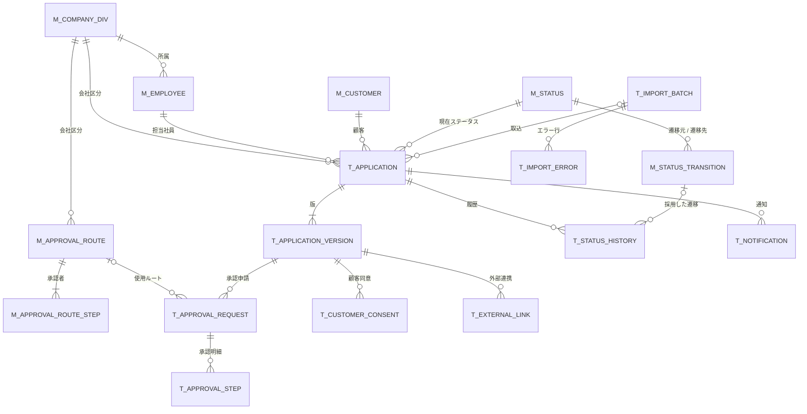

# 06. ER図

| 項目 | 内容 |
| --- | --- |
| 版 | 0.1（初版・ドラフト） |
| 図の原本 | [er-diagram.drawio](../diagrams/er-diagram.drawio)（draw.io 形式。PNG は [diagrams/png/er-diagram.png](../diagrams/png/er-diagram.png)） |
| 関連 | [07. テーブル定義](07-table-definition.md)、[08. コード定義](08-code-definition.md) |

申込（T_APPLICATION）が中心で、申込内容は版として子テーブルに持ち、承認申請・顧客同意・外部連携は版に紐づく。テーブルはマスタ 7 本、トランザクション 10 本の計 17 本。

## 1. ER図（全体）

社員マスタから承認明細・承認ルート明細・一括取込・承認申請への参照（承認者、取込者、申請者）は、線が混み合うため図から省いている。各テーブルの項目は [07. テーブル定義](07-table-definition.md) を参照。

## 2. ER図（概要：エンティティと関連のみ）

## 3. リレーション一覧

| No | 親 | 子 | 外部キー | 多重度 | 備考 |
| --- | --- | --- | --- | --- | --- |
| 1 | M_COMPANY_DIV | M_EMPLOYEE | COMPANY_DIV | 1 : 0..n | |
| 2 | M_COMPANY_DIV | M_APPROVAL_ROUTE | COMPANY_DIV | 1 : 0..n | |
| 3 | M_COMPANY_DIV | T_APPLICATION | COMPANY_DIV | 1 : 0..n | 起票時点の担当社員の会社区分 |
| 4 | M_EMPLOYEE | T_APPLICATION | OWNER_EMPLOYEE_ID | 1 : 0..n | 担当社員 |
| 5 | M_CUSTOMER | T_APPLICATION | CUSTOMER_ID | 1 : 0..n | |
| 6 | M_STATUS | T_APPLICATION | STATUS_CD | 1 : 0..n | 現在ステータス |
| 7 | M_STATUS | M_STATUS_TRANSITION | FROM_STATUS_CD、TO_STATUS_CD | 1 : 0..n（2 本） | |
| 8 | M_APPROVAL_ROUTE | M_APPROVAL_ROUTE_STEP | ROUTE_ID | 1 : 1..n | 識別関係（複合主キー） |
| 9 | M_APPROVAL_ROUTE | T_APPROVAL_REQUEST | ROUTE_ID | 0..1 : 0..n | 回付先なしの申請はルートなし |
| 10 | T_IMPORT_BATCH | T_IMPORT_ERROR | IMPORT_BATCH_ID | 1 : 0..n | 識別関係 |
| 11 | T_IMPORT_BATCH | T_APPLICATION | IMPORT_BATCH_ID | 0..1 : 0..n | 取込以外の登録に備えて任意 |
| 12 | T_APPLICATION | T_APPLICATION_VERSION | APPLICATION_ID | 1 : 1..n | 識別関係。第 1 版は必ず存在 |
| 13 | T_APPLICATION | T_STATUS_HISTORY | APPLICATION_ID | 1 : 1..n | 取込時の履歴が必ず存在 |
| 14 | T_APPLICATION | T_NOTIFICATION | APPLICATION_ID | 1 : 0..n | |
| 15 | T_APPLICATION_VERSION | T_APPROVAL_REQUEST | APPLICATION_ID、VERSION_NO | 1 : 0..n | 申請対象の版 |
| 16 | T_APPROVAL_REQUEST | T_APPROVAL_STEP | APPROVAL_REQUEST_ID | 1 : 0..n | 識別関係。回付先なしは 0 件 |
| 17 | T_APPLICATION_VERSION | T_CUSTOMER_CONSENT | APPLICATION_ID、VERSION_NO | 1 : 0..n | 同意対象の版 |
| 18 | T_APPLICATION_VERSION | T_EXTERNAL_LINK | APPLICATION_ID、VERSION_NO | 1 : 0..n | 依頼対象の版 |
| 19 | M_STATUS_TRANSITION | T_STATUS_HISTORY | TRANSITION_ID | 0..1 : 0..n | 取込時は空 |
| （省略） | M_EMPLOYEE | M_APPROVAL_ROUTE_STEP、T_APPROVAL_STEP、T_APPROVAL_REQUEST、T_IMPORT_BATCH | APPROVER_EMPLOYEE_ID、REQUEST_EMPLOYEE_ID、IMPORT_EMPLOYEE_ID | 1 : 0..n | 図では省略 |

## 4. データモデルの要点

### 4.1 申込と版

- 申込（T_APPLICATION）は 1 件につき 1 行で、現在ステータス・現行版番号・審査完了版番号・基準金額を持つ。
- 申込内容（T_APPLICATION_VERSION）は版ごとに 1 行。新規申込が第 1 版、審査中修正・契約変更・契約変更審査中修正のたびに版を追加する。差戻しと修正対応では同じ版を更新する。
- 承認申請・顧客同意・外部連携は「どの版に対する操作か」を残すため版に紐づける。ステータス履歴と通知は申込に紐づけ、履歴には変更時点の版番号を持つ。

### 4.2 承認

- 承認申請（T_APPROVAL_REQUEST）は申請 1 回につき 1 行。差戻し・引戻しで終了し、再申請では新しい行を作る。
- 承認明細（T_APPROVAL_STEP）は申請時に承認ルート明細を複写する。ルートマスタを後から変更しても進行中の申請には影響しない。

### 4.3 顧客同意

- 顧客同意（T_CUSTOMER_CONSENT）は確認依頼のたびに 1 行作り、確認用トークンのハッシュを持つ。再送や差戻しで旧行は無効化する。
- 内容同意日時と同意確定日時を分けて持ち、0301→0302、0302→0401 の証跡にする。

### 4.4 外部連携

- 外部連携（T_EXTERNAL_LINK）は依頼 1 回につき 1 行。事前確認と審査を連携種別で区別する。
- 外部受付番号は結果受信時の照合キーで、一意とする。

### 4.5 マスタ

- ステータス遷移マスタ（M_STATUS_TRANSITION）が遷移ルールを持ち、アプリケーションは遷移をハードコードしない。
- 会社区分マスタ（M_COMPANY_DIV）が外部事前確認フローの有無としきい値を持つ。
