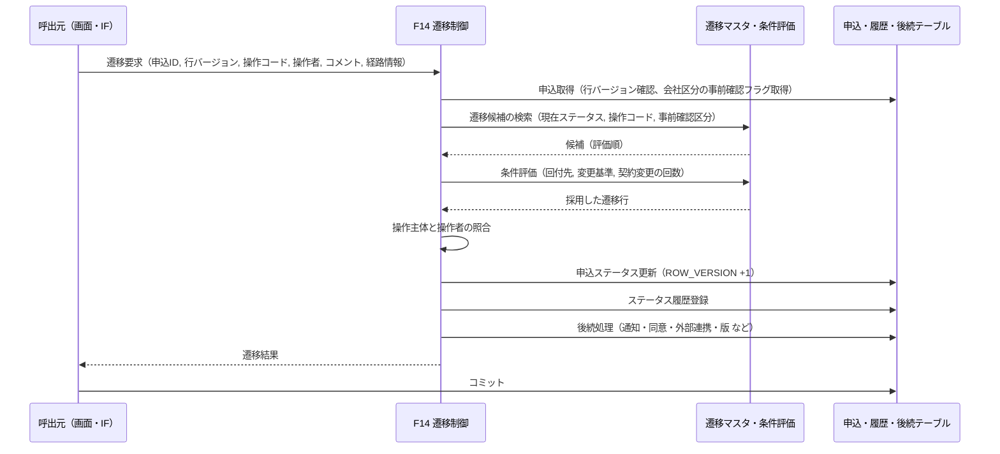
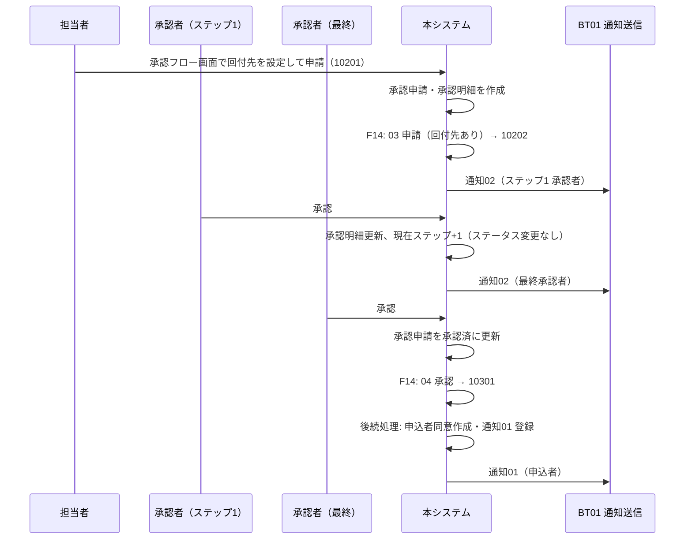
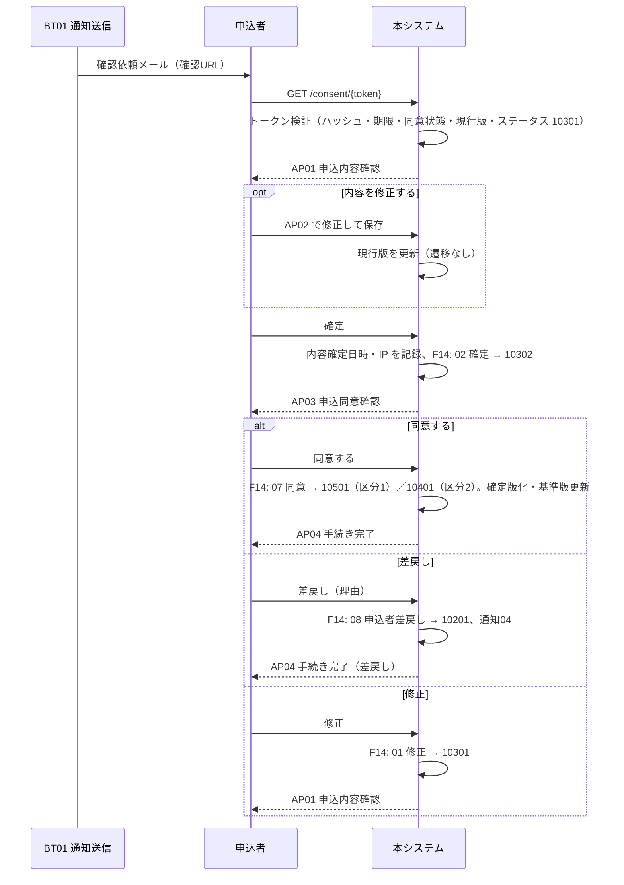
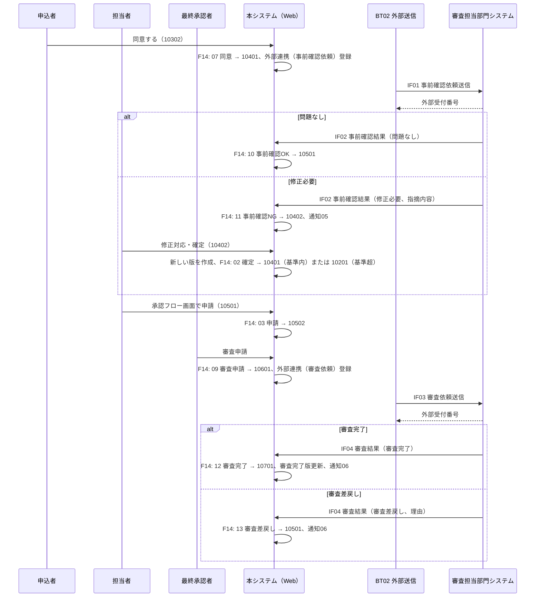

# 10. 機能詳細

| 項目 | 内容 |
| --- | --- |
| 版 | 0.8（申込者情報を申込データ（申込内容の版）に持ち、ログイン用の申込者アカウントを分離。F18 を廃止し 18 章を「申込者情報と申込者アカウント」に改定） |
| 関連 | [09. 機能一覧](09-function-list.md)、[03. ステータス定義・状態遷移](03-status-transition.md)、[07. テーブル定義](07-table-definition.md)、[11. 画面設計](11-screen-design.md)、[12. 外部インターフェース設計](12-external-interface.md)、[13. バッチ・通知設計](13-batch-notification.md) |

各機能を「概要／利用者・前提／処理手順／更新するテーブル／後続処理／エラー」の形で記述する。ステータスの更新はすべて F14 を通すため、F14 を最初に記述する。遷移 ID は [03. 6 章](03-status-transition.md#6-ステータス遷移マスタ-初期データ) の値。

## 1. F14 ステータス遷移制御（共通）

### 1.1 概要

申込 ID・操作コード・操作者・コメントを受け取り、ステータス遷移マスタから遷移先を 1 件に決めて申込を更新し、ステータス履歴を登録し、遷移先に応じた後続処理を起動する共通部品。画面・外部 IF のどこから呼ばれても同じ判定と更新を行う。

### 1.2 入力・出力

| 区分 | 項目 | 説明 |
| --- | --- | --- |
| 入力 | 申込 ID | 対象の申込 |
| 入力 | 期待する行バージョン | 呼出元が画面表示・取得時に読んだ T_APPLICATION.ROW_VERSION |
| 入力 | 操作コード | 01〜14 |
| 入力 | 操作主体・操作者 ID | 社員 ID、申込者 ID、外部システム ID |
| 入力 | コメント | 差戻し理由、指摘内容など（任意） |
| 入力 | 経路情報 | 承認申請 ID（承認・差戻し・審査申請）、同意 ID（申込者操作）、外部連携 ID（審査担当部門の結果）、回付先の有無（申請） |
| 出力 | 遷移結果 | 採用した遷移 ID、遷移元・遷移先ステータス、履歴 ID |

呼出元は同一トランザクション内で、遷移の前提となる自分の更新（版の作成・更新、承認明細の更新、同意の記録など）を済ませてから F14 を呼ぶ。

### 1.3 処理手順

1. 申込を取得し、期待する行バージョンと一致することを確認する。不一致は排他エラー。
2. 現在ステータスと操作コードで遷移マスタを検索する。申込の会社区分の外部事前確認フラグに合わせ、事前確認区分が 9（共通）の行と、フラグと一致する行（0 または 1）だけを候補にする。0 件なら「この操作はできない」エラー。
3. 候補を評価順に条件評価し、最初に成立した行を採用する（1.4 節）。成立する行がなければエラー（設計上、既定行があるため発生しない）。
4. 採用した行の操作主体と操作者を照合する（[03. 8 章](03-status-transition.md#8-操作主体と操作者の照合)）。不一致は権限エラー。
5. 申込のステータスを遷移先に更新し、行バージョンを +1 する（`WHERE ROW_VERSION = 期待値` で更新し、更新件数 0 なら排他エラー）。遷移先が遷移元と同じ行（遷移 ID 24）でも更新する。
6. ステータス履歴を登録する（遷移元、遷移先、遷移 ID、操作コード、操作主体、操作者 ID、コメント、変更後の現行版番号、変更日時）。
7. 遷移先と経路に応じた後続処理（1.5 節）を同一トランザクションで実行する。
8. 遷移結果を返す。コミットは呼出元が行う。

### 1.4 条件評価

| 条件コード | 判定に使うデータ | 判定 |
| --- | --- | --- |
| 00 なし | なし | 常に成立 |
| 11 回付先あり | 経路情報（回付先の有無） | 承認フロー画面で承認者が 1 人以上設定された |
| 12 回付先なし | 同上 | 承認者が設定されていない |
| 21 変更基準超 | T_APPLICATION_VERSION（現行版・基準版）、M_COMPANY_DIV | 現行版の AMOUNT_RATIO（申込金額合計 ÷ 基準版の申込金額合計）≧ 会社区分の AMOUNT_RATIO_LIMIT。AMOUNT_RATIO は呼出元が現行版に設定済み。金額以外の項目の変更は判定に含めない。減額は常に基準内 |
| 41 初回の契約変更 | T_APPLICATION_VERSION（審査完了版） | 審査完了版の VERSION_TYPE が 1 または 2（新規申込系） |
| 42 2回目以降の契約変更 | 同上 | 審査完了版の VERSION_TYPE が 3 または 4（契約変更系） |

### 1.5 後続処理

遷移先（または遷移 ID）ごとに F14 が起動する処理。いずれも同一トランザクションで DB 更新までを行い、実際のメール送信・外部送信はバッチ（BT01／BT02）が行う。

| 契機 | 後続処理 | 更新するテーブル |
| --- | --- | --- |
| 申請で申請中へ（遷移 ID 5、21、34、49） | ステップ 1 の承認者へ承認依頼（通知 02）を登録 | T_NOTIFICATION |
| 承認者の差戻し（7、25、36、50） | 申請社員へ差戻し通知（通知 03）を登録 | T_NOTIFICATION |
| 内容確認待ちへ（6、8、35、37） | 申込者同意を作成（トークン発行、同意状態 1、有効期限 14 日）。申込者へ確認依頼（通知 01）を登録。申込が申込者アカウントに紐づいていなければアカウントを発行して申込に紐づけ、ユーザー ID（申込者番号）と初期パスワードを申込者アカウント通知（通知 08）で登録（F17 17.2）。通知の宛先は現行版のメールアドレス | T_APPLICANT_CONSENT、T_NOTIFICATION、M_APPLICANT_ACCOUNT、T_APPLICATION |
| 申込者の修正で内容確認待ちへ（13） | なし（同じ同意レコードで継続） | |
| 引戻し（9、11、38、40） | 進行中の申込者同意を無効（同意状態 9）にする | T_APPLICANT_CONSENT |
| 申込者差戻し（12、41） | 同意状態 3、差戻し日時・理由を記録。担当社員へ申込者差戻し通知（通知 04）を登録 | T_APPLICANT_CONSENT、T_NOTIFICATION |
| 同意（14、15、42、43） | 同意状態 2、同意日時を記録。現行版を確定版（FIXED_FLG = 1）にし、基準版番号 = 現行版番号。遷移先が事前確認待ちなら外部連携（連携種別 1／3、未送信）を作成 | T_APPLICANT_CONSENT、T_APPLICATION_VERSION、T_APPLICATION、T_EXTERNAL_LINK |
| 修正対応の確定で事前確認待ちへ（19、47）、契約変更の確定で事前確認待ちへ（32） | 外部連携（連携種別 1／3、未送信）を作成 | T_EXTERNAL_LINK |
| 事前確認NG（17、45） | 結果理由（指摘内容）を履歴コメントに記録。担当社員へ事前確認結果通知（通知 05）を登録 | T_NOTIFICATION |
| 審査申請（26、51） | 外部連携（連携種別 2／4、未送信）を作成 | T_EXTERNAL_LINK |
| 審査完了（27、52） | 審査完了版番号 = 現行版番号、審査完了日時を更新。現行版を確定版にする。担当社員へ審査結果通知（通知 06）を登録 | T_APPLICATION、T_APPLICATION_VERSION、T_NOTIFICATION |
| 審査差戻し（28） | 差戻し理由を履歴コメントに記録。担当社員へ審査結果通知（通知 06）を登録 | T_NOTIFICATION |
| 契約変更の審査差戻し（53、54） | F13 契約変更審査差戻しの復元を実行。担当社員へ審査結果通知（通知 06）を登録 | T_APPLICATION、T_APPLICATION_VERSION、T_APPLICANT_CONSENT、T_NOTIFICATION |
| 契約変更開始（29、55） | 審査完了版を複写した版（版種別 3）を作成し、現行版番号・基準版番号を更新 | T_APPLICATION_VERSION、T_APPLICATION |
| 全体修正（20、22） | 現行版（確定版）を複写した版（版種別 2）を作成し、現行版番号を更新。進行中の申込者同意があれば無効にする | T_APPLICATION_VERSION、T_APPLICATION、T_APPLICANT_CONSENT |
| 申込取消（56〜62） | 進行中の申込者同意を無効にする | T_APPLICANT_CONSENT |
| 契約変更の取消（63〜74） | F13 と同じ復元（契約変更で作った版を取消、現行版・基準版を審査完了版へ）。通知は登録しない | T_APPLICATION、T_APPLICATION_VERSION、T_APPLICANT_CONSENT |

### 1.6 エラー

| エラー | 発生条件 | 呼出元の扱い |
| --- | --- | --- |
| 排他エラー | 行バージョン不一致 | 画面：メッセージを表示して最新を再表示。IF：E409 相当で応答 |
| 遷移不可エラー | 現在ステータス・操作コード・会社区分に該当する遷移がない | 画面：「現在のステータスではこの操作はできません」。IF：E409 |
| 権限エラー | 操作主体と操作者が一致しない | 画面：権限エラー。IF：E401／E403 |

### 1.7 処理シーケンス

## 2. F01 申込一括取込

### 2.1 概要

担当者がアップロードした取込ファイル（CSV、[IF05](12-external-interface.md)）を行単位で検証し、正常行を申込（ステータス 10100）と申込内容の第 1 版として登録する。

### 2.2 利用者・前提

- 利用者：担当者。画面 SC10。
- 取込社員の会社区分・部署が申込に引き継がれ、取込社員が担当社員になる。

### 2.3 処理手順

1. ファイルを受け取り、拡張子・サイズ（5MB 以内、仮）・文字コード（UTF-8）・ヘッダ行を検証する。ファイル単位のエラーは取込を行わずに画面へ返す。
2. 一括取込（T_IMPORT_BATCH）を登録する（ファイル名、取込社員、取込日時、件数は 0 で仮登録）。
3. 2 行目以降を 1 行ずつ検証する。検証内容は IF05 のレイアウト表に従う（必須、型・桁、日付書式、契約開始日 ≦ 契約終了日、申込者情報、申込者番号を指定した行はアカウントの存在、指定しない行は同じメールアドレスの申込者アカウントが発行済みでないこと）。
4. 正常行ごとに次を登録する。
   - 申込（T_APPLICATION）：申込番号を採番、申込者 ID（申込者番号を指定した行はそのアカウント、空の行はなし。アカウントは一次承認が通ったときに発行して紐づける）、担当社員 ID = 取込社員、会社区分・部署 = 取込社員のもの、ステータス 10100、現行版番号 1、登録区分 1、取込 ID。
   - 申込内容（T_APPLICATION_VERSION）：版番号 1、版種別 1、申込者情報（申込者名、申込者名カナ、メールアドレス、電話番号、住所）、商品コード、基本料金・オプション料金・事務手数料、申込金額合計（金額項目の合計を計算）、契約開始日、契約終了日、備考、確定版フラグ 0。
   - ステータス履歴（T_STATUS_HISTORY）：遷移元なし、遷移先 10100、操作コード 00 新規作成、操作主体 1、操作者 = 取込社員。F14 は通さず F01 が直接登録する。
5. エラー行は取込エラー（T_IMPORT_ERROR）に行番号・エラー内容・行データを登録し、スキップする。
6. 全行の処理後、一括取込の総件数・成功件数・エラー件数を更新してコミットする。
7. 結果（件数とエラー行一覧）を画面に返す。

### 2.4 エラー

- 上限行数（1,000 行、仮）超過、ヘッダ不一致、文字コード不正はファイル単位のエラーとし、何も登録しない。
- 行単位のエラーは正常行の登録を妨げない（部分成功）。

## 3. F02 申込一覧・検索

### 3.1 概要

申込受付会社の社員が申込を検索・一覧表示し、申込詳細（SC03）へ遷移する。承認者は「自分の操作待ち」で承認待ちを絞り込む。新規申込の起点（SC04 へ）でもある。

### 3.2 処理手順

1. 検索条件（申込番号、申込者番号／申込者名、ステータス（大分類・中分類・個別）、担当社員、登録日、自分の操作待ち）を受け取る。
2. 権限による絞り込み：担当者は自分が担当社員の申込、承認者は自分が承認明細に含まれる申込に加えて自部署の申込、管理者は全申込を対象とする（仮）。
3. 「自分の操作待ち」は次の条件で絞る。
   - 担当者：担当社員 = 自分、かつステータスの操作主体が 1（担当者）。
   - 承認者：申請状態が申請中の承認申請で、現在ステップの承認者社員 ID = 自分。
4. 申込に現行版の申込内容（申込者名を含む）・申込者アカウントの申込者番号（未発行は空）・担当社員名を結合し、更新日時の降順で 20 件ずつ返す。申込者名の検索は現行版の申込者名で行う。

## 4. F03 申込入力・修正

### 4.1 概要

画面から新規申込・追加申込を作成し、一括取込した申込の補正や入力中の修正を行い、申込内容確認画面で確定して一次承認申請待ち（10201）へ進める。

### 4.2 利用者・前提

- 利用者：申込の担当社員（新規申込は入力する社員が担当社員になる）。画面 SC02／SC03 → SC04 → SC05。
- 全体修正（F10）で 10101 へ戻った申込の再入力も本機能で行う。

### 4.3 新規申込・追加申込の処理手順

1. 新規申込：SC02 の「新規申込」で SC04 を空の状態で開く。申込者情報（申込者名、申込者名カナ、メールアドレス、電話番号、住所）は申込内容と同じく申込データとして入力する。同じ申込者の 2 件目以降で発行済みの申込者アカウントを使う場合だけ、申込者番号（ユーザー ID）を入力する（18 章）。
2. 追加申込：SC14 の「追加申込」で、元の申込の申込内容（現行版。申込者情報を含む）を複写した状態で SC04 を開く（複写する項目は仮）。申込者アカウントは元の申込のものを引き継ぐ（元の申込が未発行なら引き継がない）。
3. 最初の「一時保存」または「確認へ」で申込を作成する。申込者番号を入力した場合は申込者アカウントを検索し（なければ E009）、申込に紐づける。申込者番号を入力せず、同じメールアドレスの申込者アカウントが発行済みなら W003 で確認する（18.3 節）。申込（申込番号を採番、申込者 ID（紐づけたアカウント。なければ空）、担当社員 = 入力社員、会社区分・部署 = 入力社員のもの、ステータス 10101、現行版番号 1、登録区分 2 または 3、追加申込元申込 ID）、申込内容の第 1 版、ステータス履歴（遷移元なし、遷移先 10101、操作コード 00 新規作成）を登録する。
4. 2 回目以降の一時保存は現行版を更新する。ステータス遷移なし、履歴なし。

### 4.4 修正・確定の処理手順

| 操作 | ステータス | 画面 | 処理 |
| --- | --- | --- | --- |
| 修正 | 10100 | SC05 | F14 を操作コード 01 で呼ぶ（→ 10101）。続けて SC04 を開く |
| 修正 | 10201 | SC03 または SC05 | F14 を操作コード 01 で呼ぶ（→ 10101）。続けて SC04 を開く |
| 一時保存 | 10101 | SC04 | 現行版を更新する。ステータス遷移なし |
| 確認へ | 10100、10101 | SC04 | 入力チェック後に現行版を更新し、SC05 を表示する（遷移なし） |
| 確定 | 10100、10101 | SC05 | 入力チェック後に確定日時を設定し、F14 を操作コード 02 で呼ぶ（→ 10201） |

入力チェックは画面共通（必須、型・桁、契約開始日 ≦ 契約終了日）に加え、基本料金・オプション料金・事務手数料 は 0 以上、申込金額合計 > 0 とする。申込者名・メールアドレスは確認へ・確定で必須とし、一時保存では書式（桁、カナ、電話番号、メールアドレスの形式）だけを確認する。申込金額合計は保存時にサーバ側で計算する。

### 4.5 更新するテーブル

T_APPLICATION、T_APPLICATION_VERSION、T_STATUS_HISTORY（新規作成時は直接、それ以外は F14 経由）

## 5. F04 承認申請

### 5.1 概要

申請待ち（10201／10501／20201／20501）の申込について、担当者が承認フロー画面（SC06）で回付先を設定して申請する。4 つの承認種別で同じ処理を使う。

| 承認種別 | 申請待ち | 申請中 | 最終承認者の操作 | 承認完了後 | 回付先なし |
| --- | --- | --- | --- | --- | --- |
| 01 一次承認 | 10201 | 10202 | 承認 | 10301 | 可（→ 10301） |
| 02 最終承認 | 10501 | 10502 | 審査申請 | 10601 | 不可 |
| 03 契約変更一次承認 | 20201 | 20202 | 承認 | 20301 | 可（→ 20301） |
| 04 契約変更最終承認 | 20501 | 20502 | 審査申請 | 20601 | 不可 |

### 5.2 処理手順

1. SC06 を開くと、回付先の初期値を次の優先順位で決めて表示する。(a) 同じ申込・同じ承認種別の前回の承認申請（回付先ありのもの）の承認者の並び、(b) 申請する担当者が同じ承認種別で前回使った回付先、(c) 承認ルートマスタから申込の会社区分・部署・承認種別・当日に合うテンプレート（複数該当は適用開始日が最も新しいもの）。いずれも現在の承認者候補（有効かつ権限 02、同じ会社区分）に含まれない社員は除く。該当がなければ空で表示する。
2. 担当者は回付先の承認者（有効かつ権限 02、同じ会社区分）を追加・削除・並べ替えできる（仮）。設定できる階層（ステップ数）は 5 までとし、超過は E112。
3. 申請後（10202／10502／20202／20502）も申請した担当者は SC06 を参照モードで開き、回付先と各ステップの結果を確認できる。申請ボタンは非活性で、申請者による引戻し（取下げ）はできない（差戻しを待つ）。
3. 「申請」で次を行う。操作者が申込の担当社員であることを確認する。
   - 回付先あり：承認申請（T_APPROVAL_REQUEST）を登録する。申込 ID、現行版番号、承認種別、ルート ID（テンプレートを使った場合）、申請社員 = 操作者、申請日時、申請状態 1（申請中）、現在ステップ 1、最終ステップ = 回付先の人数。承認明細（T_APPROVAL_STEP）を回付先の順に登録する（結果 0 未処理）。F14 を操作コード 03、経路情報 = 回付先ありで呼ぶ（条件 11 → 申請中）。後続処理でステップ 1 の承認者へ通知 02 が登録される。
   - 回付先なし（一次承認のみ）：承認申請を申請状態 2（承認済）、ステップは空、完了日時 = 申請日時で登録する。承認明細は作らない。F14 を操作コード 03、経路情報 = 回付先なしで呼ぶ（条件 12 → 内容確認待ち）。
   - 最終承認で回付先なし：エラー（E109「回付先を設定してください」）。

### 5.3 エラー

- 進行中（申請状態 1）の承認申請が申込に 2 件以上ある状態は不正。検出したらシステムエラーとする。
- 回付先に無効な社員や権限 02 以外の社員が含まれる場合は申請できない。

## 6. F05 承認・差戻し・審査申請

### 6.1 概要

申請中（10202／10502／20202／20502）の申込を、現在ステップの承認者が承認または差戻しする。最終承認（02／04）の最終承認者は「審査申請」で審査担当部門へ審査を申請する。

### 6.2 承認の処理手順

1. 承認者が SC06 で「承認」を押す（コメント任意）。進行中の承認申請の現在ステップの承認者 = 操作者であることを確認する。
2. 現在ステップの承認明細を結果 1（承認）、コメント、処理日時で更新する。
3. 現在ステップ < 最終ステップの場合：承認申請の現在ステップを +1 し、次の承認者へ通知 02 を登録する。ステータスは変えず、F14 は呼ばない。
4. 現在ステップ = 最終ステップの場合（一次承認・契約変更一次承認のみ）：承認申請を申請状態 2（承認済）、完了日時に更新し、F14 を操作コード 04 で呼ぶ（→ 10301／20301）。後続処理で申込者同意と通知 01 が登録される。
5. 最終承認・契約変更最終承認の最終承認者には「承認」ではなく「審査申請」を表示する（6.4 節）。

### 6.3 差戻しの処理手順

1. 承認者が SC06 で「差戻し」を押す。コメントは必須。現在ステップの承認者 = 操作者であることを確認する。
2. 現在ステップの承認明細を結果 2（差戻し）、コメント、処理日時で更新する。
3. 承認申請を申請状態 3（差戻し）、完了日時に更新する。
4. F14 を操作コード 05、コメント = 差戻し理由で呼ぶ（→ 申請待ち）。後続処理で申請社員へ通知 03 が登録される。

### 6.4 審査申請の処理手順

1. 最終承認（10502／20502）の最終承認者が SC06 で「審査申請」を押す。現在ステップ = 最終ステップ、承認者 = 操作者であることを確認する。
2. 現在ステップの承認明細を結果 3（審査申請）、処理日時で更新し、承認申請を申請状態 2（承認済）、完了日時に更新する。
3. F14 を操作コード 09 で呼ぶ（→ 10601／20601）。後続処理で外部連携（審査依頼）が登録される。

### 6.5 承認ワークフローのシーケンス（一次承認）

## 7. F06 申込者確認依頼通知

### 7.1 概要

内容確認待ち（10301／20301）に到達した申込について、確認用 URL を申込者へメールで送る。レコードの作成は F14 の後続処理、送信は BT01 が行う。

### 7.2 処理手順（F14 後続処理）

1. トークンを生成する（SecureRandom 32 バイト → Base64URL 文字列）。
2. 申込者同意（T_APPLICANT_CONSENT）を登録する。申込 ID、現行版番号、同意種別（10301 → 1、20301 → 2）、トークンの SHA-256 ハッシュ、有効期限 = 現在日時 + 14 日（仮）、同意状態 1。
3. 通知（T_NOTIFICATION）を通知種別 01 で登録する。宛先 = 申込者のメールアドレス、本文に確認 URL（`{ベースURL}/consent/{トークン}`）と有効期限を埋め込む。平文トークンは本文にだけ含まれ、DB にはハッシュのみ残る。

### 7.3 再送

担当者は SC14 の「確認依頼メール再送」で、10301／10302／20301／20302 の申込に対して再送できる。処理は、進行中の申込者同意を無効（同意状態 9）にし、7.2 と同じ手順で新しい申込者同意と通知を登録する。ステータス遷移はしない。10302／20302 で再送した場合、申込者は新しい URL から内容確認（AP01）をやり直す（仮）。

## 8. F07 申込者確認・同意

### 8.1 概要

申込者が確認用 URL から申込内容を確認・修正して確定し（10301 → 10302、20301 → 20302）、同意する（10302 → 10501／10401、20302 → 20501／20401）。同意確認の段階では差戻し（→ 10201／20201）と修正（→ 10301）もできる。

### 8.2 利用者・前提

- 利用者：申込者。画面 AP01〜AP05。認証は確認用トークンのみ。
- 申込受付会社の画面から申込者操作の代行はできない。

### 8.3 トークン検証（全リクエスト共通）

申込者の特定方法は 2 通りある。確認依頼メールの URL（トークン）と、申込者ポータルにログインした申込者本人（F17。申込 ID から進行中の申込者同意を引く）。どちらも同じ申込者同意レコードを使い、以降の処理は共通。ポータル経由では手順 1 を「ログイン中の申込者の申込であることを確認し、進行中（同意状態 1）の申込者同意を取得する」に読み替える。

1. URL のトークンを SHA-256 でハッシュ化し、申込者同意を検索する。該当なし → AP05。
2. 同意状態が 9（無効）、または有効期限切れ → AP05。
3. 同意状態が 2（同意済）または 3（申込者差戻し） → AP04（手続き完了・参照のみ。操作はできない）。
4. 同意状態が 1（確認依頼中）で、対象の版が申込の現行版でない → AP05。
5. 申込のステータスにより表示を決める：10301／20301 → AP01、10302／20302 → AP03、それ以外（引戻し後など） → AP05。

### 8.4 内容確認・修正・確定の処理手順（AP01、AP02）

1. AP01 に現行版の申込内容を表示する。契約変更では審査完了版（変更前）と並べて差分を表示する。
2. 「内容を修正する」（10301 のみ）で AP02 を開き、保存すると現行版をそのまま更新する（版は増えない。ステータス遷移なし）。修正できる項目は申込者情報を含む申込内容の全項目とする（仮）。
3. 「確定」でトークン検証を行い、ステータスが 10301／20301 であることを確認し、申込者同意の内容確定日時・接続元 IP を更新する。F14 を操作コード 02、操作主体 3、操作者 ID = 申込者 ID、経路情報 = 同意 ID で呼ぶ（→ 10302／20302）。AP03 へリダイレクトする。

### 8.5 同意・差戻し・修正の処理手順（AP03）

| 操作 | 処理 |
| --- | --- |
| 同意する | ステータスが 10302／20302 であることを確認し、F14 を操作コード 07 で呼ぶ（→ 10501／10401、20501／20401）。後続処理で同意状態 2・同意日時・接続元 IP の記録、現行版の確定版化、基準版の更新、（区分 2）事前確認依頼の登録が行われる。AP04 へ |
| 差戻し | 差戻し理由（必須）を入力し、F14 を操作コード 08、コメント = 理由で呼ぶ（→ 10201／20201）。後続処理で同意状態 3・差戻し日時・理由の記録と、担当社員への通知 04 が行われる。AP04（差戻し完了）へ |
| 修正 | 新規申込（10302）のみ。F14 を操作コード 01 で呼ぶ（→ 10301）。AP01 へ戻り、内容の修正・再確定ができる。契約変更（20302）にはこの操作はない |

### 8.6 申込者確認のシーケンス

## 9. F08 審査依頼送信

### 9.1 概要

事前確認待ち（10401／20401）と審査中（10601／20601）に到達した申込の現行版を、審査担当部門システムへ事前確認依頼（[IF01](12-external-interface.md)）または審査依頼（[IF03](12-external-interface.md)）として送る。レコードの作成は F14 の後続処理、送信は BT02 が行う。

### 9.2 処理手順（F14 後続処理）

| 到達の契機 | 連携種別 |
| --- | --- |
| 同意（遷移 ID 15、43）、修正対応の確定（19、47）、契約変更の確定（32） | 1 事前確認依頼（新規申込）／3 契約変更事前確認依頼 |
| 審査申請（26、51） | 2 審査依頼／4 契約変更審査依頼 |

外部連携（T_EXTERNAL_LINK）を登録する。申込 ID、現行版番号、連携種別、送信状態 0、再送回数 0。事前確認依頼には基準版との差分（変更金額倍率など）を含めて送る。

### 9.3 送信（BT02）

未送信の外部連携を取得し、連携種別に応じて IF01 または IF03 で送信する。送信成功で送信状態 1、送信日時、外部受付番号を保存する。送信前に対象の版が現行版であることを確認し、違えば送信せず送信エラーにする。再送上限超過は送信エラーとして担当社員・管理者へ通知 07 を登録する。

## 10. F09 審査結果受信

### 10.1 概要

審査担当部門システムから事前確認結果（[IF02](12-external-interface.md)）と審査結果（[IF04](12-external-interface.md)）を受信し、ステータスを進める。

### 10.2 処理手順

1. IF 認証を行う。失敗は E401 で応答する。
2. 外部受付番号で外部連携を特定する（IF02 は連携種別 1／3、IF04 は 2／4、結果未設定）。該当なしは E404。結果設定済みなら重複受信として正常応答し、何もしない。
3. 申込のステータスが受信可能なステータス（IF02：10401／20401、IF04：10601／20601）であること、外部連携の版が現行版であることを確認する。違えば E409／E410 で応答し、結果は取り込まない。
4. 外部連携の結果・結果受信日時・結果理由を更新する。
5. 結果に応じて F14 を呼ぶ（操作主体 4、操作者 ID = 外部システム ID、経路情報 = 外部連携 ID）。

| IF | 結果 | 結果コード | 操作コード | 遷移先 | 後続処理 |
| --- | --- | --- | --- | --- | --- |
| IF02 | 問題なし | 1 | 10 事前確認OK | 10501／20501 | なし |
| IF02 | 修正必要 | 2 | 11 事前確認NG | 10402／20402 | 指摘内容を履歴に記録、通知 05 |
| IF04 | 審査完了 | 3 | 12 審査完了 | 10701／20701 | 審査完了版・審査完了日時の更新、確定版化、通知 06 |
| IF04 | 審査差戻し（新規申込） | 4 | 13 審査差戻し | 10501 | 理由を履歴に記録、通知 06 |
| IF04 | 審査差戻し（契約変更） | 4 | 13 審査差戻し | 10701／20701 | F13 で契約変更を取り消し、通知 06 |

6. 新しいステータスを応答する。

### 10.3 事前確認・審査のシーケンス（会社区分 2）

## 11. F10 同意後の申込修正

### 11.1 概要

申込者の同意後に担当者が申込内容を修正する機能。修正対応待ち（10402／20402）では指摘内容に応じて申込内容を修正し、最終承認申請待ち（10501）では金額項目だけを修正する（一部修正）。いずれも申込修正画面（SC07）から修正・確定し、変更基準で遷移先を決める。最終承認申請待ちと修正対応待ちからは「全体修正」で入力中（10101）へ戻すこともできる（申込者の同意を取り直す）。

### 11.2 利用者・前提

- 利用者：申込の担当社員。画面 SC03 → SC07。
- 修正対象の現行版は確定版（申込者が同意した版）のため、確定時に現行版を複写した新しい版を作って変更を反映する。

### 11.3 修正・確定の処理手順（SC07）

1. SC07 に現行版の内容と、基準版（同意した版）との差分、直近の指摘内容（10402／20402 のとき）を表示する。10402／20402 では申込内容の全項目を、10501 では金額項目（基本料金・オプション料金・事務手数料）だけを修正できる（業務確認済み）。
2. 入力チェックを行う。現行版と比べて変更がない場合は、10402／20402 ではそのまま確定できる（事前確認を再依頼する）。10501 では変更がない場合は確定できない（E104）。
3. 変更がある場合、新しい版を登録する。版番号 = 現行版番号 + 1、版種別（10402／10501 → 2、20402 → 4）、複写元 = 現行版、入力内容、確定日時 = 現在日時、確定版フラグ 0。
   - 申込金額合計 = 基本料金・オプション料金・事務手数料 の合計。変更金額倍率 = 新しい申込金額合計 ÷ 基準版の申込金額合計（小数第 4 位まで、切り捨て）。
4. 申込の現行版番号を新しい版番号に更新する。
5. F14 を操作コード 02 で呼ぶ。

| 修正時のステータス | 変更基準超（条件 21） | 既定（変更基準内） |
| --- | --- | --- |
| 10402 修正対応待ち | → 10201 一次承認申請待ち（遷移 ID 18） | → 10401 事前確認待ち（19）。事前確認依頼を再登録 |
| 10501 最終承認申請待ち | → 10201 一次承認申請待ち（23） | → 10501 のまま（24） |
| 20402 契約変更修正対応待ち | → 20201 契約変更一次承認申請待ち（46） | → 20401 契約変更事前確認待ち（47）。事前確認依頼を再登録 |

変更基準超で一次承認申請待ちへ戻った場合は、一次承認と申込者確認からやり直す。申込者が再び同意した時点で基準版が更新される。

### 11.4 全体修正の処理手順（SC05）

1. 担当者が SC14「申込内容確認」から SC05 を開き、「修正（全体修正）」を押す（10402／10501）。確認ダイアログを出す。メニューに入力画面へ直接進むボタンは置かない。
2. F14 を操作コード 01 で呼ぶ（→ 10101、遷移 ID 20／22）。後続処理で現行版を複写した新しい版（版種別 2）が作られ、現行版番号が更新される。
3. SC04 を開き、以降は F03 の入力・確定の流れになる。

## 12. F11 申込者確認中の引戻し

### 12.1 概要

申込者確認中（10301／10302／20301／20302）の申込を、担当者が一次承認申請待ち（10201／20201）へ戻す。申込者の確認用 URL は使えなくなる。

### 12.2 処理手順

1. 担当者が SC14 で「引戻し」を押す。確認ダイアログを出す。操作者が申込の担当社員であることを確認する。
2. F14 を操作コード 06 で呼ぶ（遷移 ID 9、11、38、40）。後続処理で進行中の申込者同意が無効（同意状態 9）になる。
3. 内容確認待ちで申込者が修正した内容は現行版に残る。引戻し後に担当者が「修正」で入力中へ戻して直すことができる。

## 13. F12 契約変更入力

### 13.1 概要

審査完了（10701／20701）の申込について契約変更手続きを開始し、審査完了版を複写した版に変更内容を入力・確定して、変更基準に応じて一次承認申請待ち（20201）または最終承認申請待ち／事前確認待ち（20501／20401）へ進める。

### 13.2 契約変更手続きの開始（10701／20701）

1. 担当者が SC14 で「契約変更」を押す。操作者が申込の担当社員であることを確認する。
2. F14 を操作コード 14 で呼ぶ（→ 20101、遷移 ID 29／55）。後続処理で審査完了版を複写した版（版種別 3、複写元 = 審査完了版、確定版フラグ 0）が作られ、現行版番号と基準版番号（= 審査完了版番号）が更新される。
3. SC08 を開く。

### 13.3 入力・確認・確定（20101）

| 操作 | 画面 | 処理 |
| --- | --- | --- |
| 一時保存 | SC08 | 現行版を更新する。ステータス遷移なし |
| 確認へ | SC08 | 入力チェック後に現行版を更新し、SC09 を表示する。審査完了版との差分と、変更金額倍率・変更基準の判定結果を表示する |
| 修正 | SC09 | SC08 へ戻る（20101 のまま。遷移なし） |
| 確定 | SC09 | 申込金額合計と変更金額倍率（申込金額合計 ÷ 基準版の申込金額合計）を現行版に設定し、確定日時を更新して F14 を操作コード 02 で呼ぶ |

| 判定 | 遷移先 |
| --- | --- |
| 変更基準超（条件 21） | 20201 契約変更一次承認申請待ち（遷移 ID 30）。一次承認・申込者確認を経る |
| 変更基準内・会社区分 1 | 20501 契約変更最終承認申請待ち（31） |
| 変更基準内・会社区分 2 | 20401 契約変更事前確認待ち（32）。事前確認依頼を登録 |

変更がない場合は確定できない（E104）。

### 13.4 申請待ちからの修正（20201／20501）

SC03 または SC09 の「修正」で F14 を操作コード 01 で呼び（→ 20101、遷移 ID 33／48）、SC08 で修正する。現行版は未同意のためそのまま更新する。差戻し（承認者）で申請待ちへ戻った場合も同じ。

## 14. F13 契約変更審査差戻しの復元

### 14.1 概要

契約変更審査中（20601）に審査担当部門から審査差戻しを受信したとき、契約変更を取り消して契約変更前の審査完了状態へ戻す。F09 → F14（遷移 ID 53／54）の後続処理として実行する。

### 14.2 処理手順

1. 審査完了版（REVIEWED_VERSION_NO）の版種別で遷移先を決める：1／2（新規申込系）なら 10701、3／4（契約変更系）なら 20701（F14 の条件 41／42）。
2. 版番号が審査完了版番号より大きい版（今回の契約変更で作った版）をすべて取消（CANCELED_FLG = 1）にする。
3. 申込の現行版番号と基準版番号を審査完了版番号に戻す。
4. 進行中の申込者同意があれば無効にする（通常は存在しない）。
5. 差戻し理由を履歴コメントに記録し、担当社員へ通知 06 を登録する。

取り消した版は SC03 の版履歴で「取消」として参照できる。再度契約変更手続きを行うと、審査完了版を複写した新しい版が作られる。

## 15. F15 マスタメンテナンス

### 15.1 概要

管理者が社員・会社区分・承認ルート（テンプレート）を保守する。画面 SC11〜SC13。

### 15.2 処理内容

| 対象 | 操作 | チェック・備考 |
| --- | --- | --- |
| 社員マスタ | 登録・更新・無効化 | 社員番号の重複不可。物理削除はせず有効フラグで無効化。無効化する社員が進行中の承認申請の未処理ステップにいる場合は警告を表示する（仮） |
| 会社区分マスタ | 更新 | 会社区分名、外部事前確認フラグ、金額倍率しきい値（1.00 以上）。区分の追加・削除は対象外 |
| 承認ルートマスタ・明細 | 登録・更新・削除 | ステップ番号は 1 から連番、承認者は有効かつ権限 02、会社区分がルートと一致、適用開始日 ≦ 適用終了日。進行中の承認申請には影響しない（申請時に承認明細へ複写済み） |

### 15.3 排他

マスタも行バージョンで楽観排他する。

## 16. F16 申込取消

### 16.1 概要

担当者が申込メニュー（SC14）から申込を取り消す。新規申込フローでは 90101 申込取消へ遷移し、契約変更中は契約変更を取り消して契約変更前の審査完了状態へ戻す（03. 3 章 12、6.5 節）。

### 16.2 処理手順

1. 担当者が SC14 の「申込取消」（契約変更中は「契約変更の取消」）を押す。取消理由は任意。確認ダイアログを出す。操作者が申込の担当社員であることを確認する。
2. F14 を操作コード 15、コメント = 取消理由で呼ぶ。遷移先は遷移マスタに従う（新規申込：90101、契約変更：条件 41／42 で 10701／20701）。
3. 後続処理で進行中の申込者同意を無効にし、契約変更の取消では F13 と同じ復元を行う。
4. 取り消した申込（90101）は参照のみで、追加申込の元にもできない。

## 17. F17 申込者アカウント・申込者ポータル

### 17.1 概要

申込者は申込受付会社が登録した申込の一次承認が通った時点（内容確認待ちへの到達）で申込者ページのアカウント（申込者アカウント。ログインに必要なデータだけを持つ）を得て、ログイン後のメニューから申込確認、内容確認・同意、お知らせの参照、パスワード変更を行う。確認依頼メールの URL（トークン）からの操作も引き続きできる。

### 17.2 アカウント発行（F14 後続処理）

1. 内容確認待ち（10301／20301）へ遷移したとき、申込が申込者アカウントに紐づいていなければ（T_APPLICATION.APPLICANT_ID が空）、申込者番号（ユーザー ID）を採番し（`C` ＋ 10 桁ゼロ埋め。SEQ_APPLICANT_NO。既に使われている番号は読み飛ばす）、初期パスワード（英数字 10 桁）を生成して、申込者アカウント（M_APPLICANT_ACCOUNT）にユーザー ID・パスワードのハッシュ・発行日時を登録する。申込の APPLICANT_ID にアカウントを設定する（申込の行バージョンは変えない）。
2. 申込者アカウント通知（通知 08）を、申込データ（現行版）の申込者名・メールアドレスで登録する。本文にログイン URL、ユーザー ID（申込者番号）、初期パスワードを埋め込む。平文の初期パスワードは本文にだけ含まれる。
3. 既にアカウントに紐づいている申込（申込者番号を指定した 2 件目以降の申込、追加申込、契約変更）には何もしない。

### 17.3 ログインとメニュー（AP06〜AP09）

| 操作 | 処理 |
| --- | --- |
| ログイン（AP06） | ユーザー ID（申込者番号）とパスワードで M_APPLICANT_ACCOUNT を照合する。不一致は E113。成功時はセッションを再生成する。画面に出す申込者名は、そのアカウントに紐づく最新の申込の現行版の申込者名 |
| メニュー（AP07） | 「お知らせ」タブに申込者宛の通知（通知 01、08、09）を、「メニュー」タブにアカウントに紐づく申込の概要と操作タイル（申込確認、内容確認・同意、お知らせ、パスワード変更）を表示する。申込が複数ある場合は選択できる。「内容確認・同意」は進行中の同意があるときだけ押せる |
| 申込確認（AP08） | 現行版の申込内容（契約変更中は変更前と並べて表示）、確認・同意の状況、手続きの履歴（申込者に関係する項目のみ）を表示する |
| 内容確認・同意 | AP01〜AP03 と同じ画面・処理を、トークンではなくログイン中の申込者本人として行う（8.3 節） |
| パスワード変更（AP09） | 現在のパスワードを照合し、新しいパスワード（8〜64 桁、確認用と一致）に変更する |

### 17.4 パスワードの初期化（SC15）

1. 申込の担当者または管理者が SC14「メンテナンス」から SC15 を開き、申込に紐づく申込者アカウントの「パスワードの初期化」を押す。確認ダイアログを出す。アカウント未発行（申込がアカウントに紐づいていない）は E117。
2. 新しい初期パスワード（英数字 10 桁）を生成し、ハッシュを M_APPLICANT_ACCOUNT.PASSWORD_HASH に保存する。PASSWORD_CHANGED_AT は空に戻す（初期パスワードのままの状態）。
3. パスワード初期化通知（通知 09）を、この申込の申込データ（現行版）のメールアドレスへ登録する。本文にログイン URL、ユーザー ID、新しい初期パスワードを埋め込む。
4. 申込者の既存セッションは無効にしない（次回ログインから新しいパスワード）。I018 を表示して SC15 を再表示する。

## 18. 申込者情報と申込者アカウント

### 18.1 データの持ち方

申込者に関するデータは、申込データとログイン用のデータに分けて持つ（[05. データフロー 3 章](05-data-flow.md#3-申込者データの流れ)、[99. 決定事項 D29〜D31](99-open-issues.md#2-本書群での決定事項遷移表から読み取れない点の補足)）。

| 区分 | 項目 | 持つ場所 | 入力・変更 |
| --- | --- | --- | --- |
| 申込データ | 申込者名、申込者名カナ、メールアドレス、電話番号、住所 | 申込内容（T_APPLICATION_VERSION）の各版 | 申込内容と同じ。新規申込・補正（SC04）、一括取込（SC10）、全体修正（SC04）、契約変更（SC08）、申込者の修正（AP02） |
| ログイン用データ | 申込者番号（ユーザー ID）、パスワード、発行日時、パスワード変更日時 | 申込者アカウント（M_APPLICANT_ACCOUNT） | 一次承認が通ったときに発行（17.2 節）。パスワードは申込者の変更（AP09）と初期化（SC15）だけ |

- 申込者情報は版ごとに持つため、全体修正・契約変更・申込者の修正の差分表示（赤字）、確定版との比較、版履歴の対象になる。確認依頼メール（通知 01）・アカウント通知（通知 08）・パスワード初期化通知（通知 09）の宛先は、その申込の現行版のメールアドレスとする。
- 申込とアカウントは T_APPLICATION.APPLICANT_ID（任意）で結ぶ。1 つのアカウントに複数の申込を紐づけられる（同じ申込者の 2 件目以降、追加申込）。申込者ポータルではアカウントに紐づく申込を選んで操作する。
- アカウントは申込者名・メールアドレスを持たない。同じアカウントの申込で申込者情報が異なってもよい（申込ごとの申込データとして扱う）。

### 18.2 申込者番号の指定（同じ申込者の 2 件目以降）

1. SC04 で申込者アカウントに紐づいていない申込（新規申込、アカウント未発行の補正）は、申込者番号（ユーザー ID）を任意で入力できる。入力すると申込者アカウントを検索し（なければ E009）、保存時に申込を紐づける。紐づけた申込は一次承認が通ってもアカウントを発行しない。
2. 追加申込は元の申込のアカウントを引き継ぐ。紐づいた後の申込者番号は変更できない（表示のみ）。
3. 一括取込（F01）は申込者番号の列で同じことを行う（存在しない番号はエラー行）。

### 18.3 アカウントの重複の確認

1. 申込者番号を入力せずに保存するとき、同じメールアドレス（大文字・小文字を区別しない）を現行版に持つ別の申込がアカウントに紐づいていれば、W003 と該当するアカウント（申込者番号・申込者名）を表示して保存しない。担当者は申込者番号を入力して既存のアカウントに紐づけるか、「別の申込者として登録する」にチェックを入れて保存し直す（その申込は一次承認が通ったときに別のアカウントを発行する）。
2. メールアドレスを変えなかった保存（一時保存のやり直しなど）では確認しない。
3. 一括取込は確認できないため、申込者番号が空で同じメールアドレスのアカウントが発行済みの行をエラー行にする（申込者番号の指定を促す）。

### 18.4 申込者情報の確認と変更

1. 申込受付会社は SC05 で申込者情報（確認依頼メールとアカウント通知の宛先）を申込内容と一緒に確認してから確定する。全体修正・契約変更で変えた申込者情報は SC05／SC09 で赤字にする。
2. 申込者は AP01 で自分の申込者情報を申込内容と一緒に確認し、10301 では AP02 で修正できる（契約変更中の 20301 は差戻しで伝える）。申込者の修正は他の申込内容と同じく現行版を更新する（8.4 節）。
3. 申込者の関与後（一次承認申請後）に申込者情報を変える場合は、申込内容と同じく全体修正（F10）または契約変更（F12）で新しい版を作って変更する。SC15 メンテナンスでは申込者情報を変更しない。
4. 変更の履歴は版履歴（版ごとの申込者情報）で参照できる。

## 19. ログイン・ログアウト（共通）

1. 社員番号とパスワードを受け取り、社員マスタを検索する。有効フラグ 0 または不一致はエラー。連続 5 回失敗でロック（仮、[14. 共通仕様](14-common-spec.md)）。
2. 成功時はセッションを再生成し、社員 ID・権限・会社区分・部署をセッションに保持する。
3. ログアウトでセッションを破棄する。
