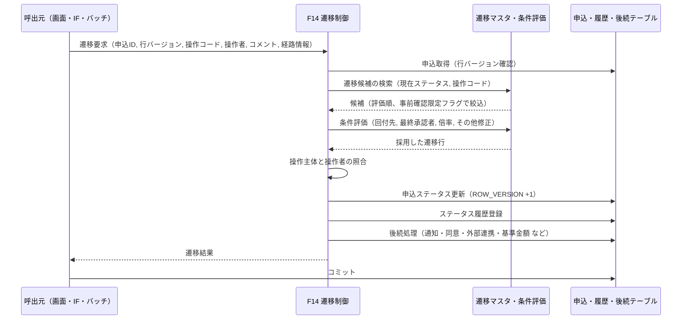
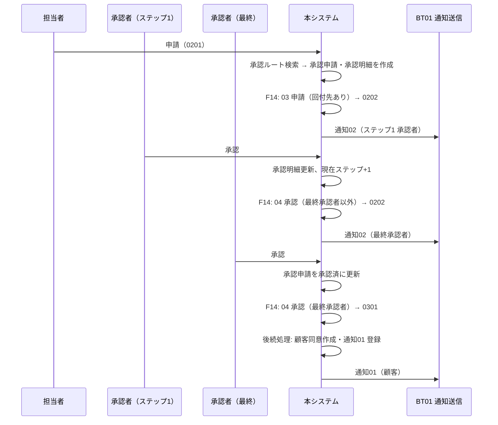
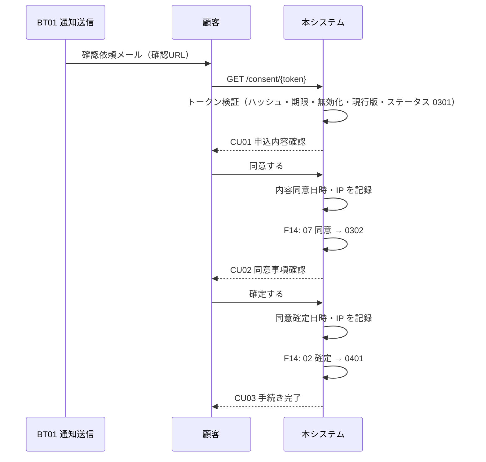
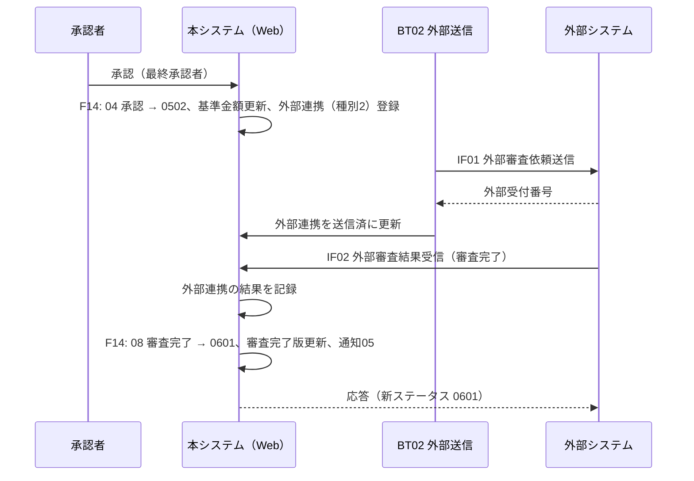
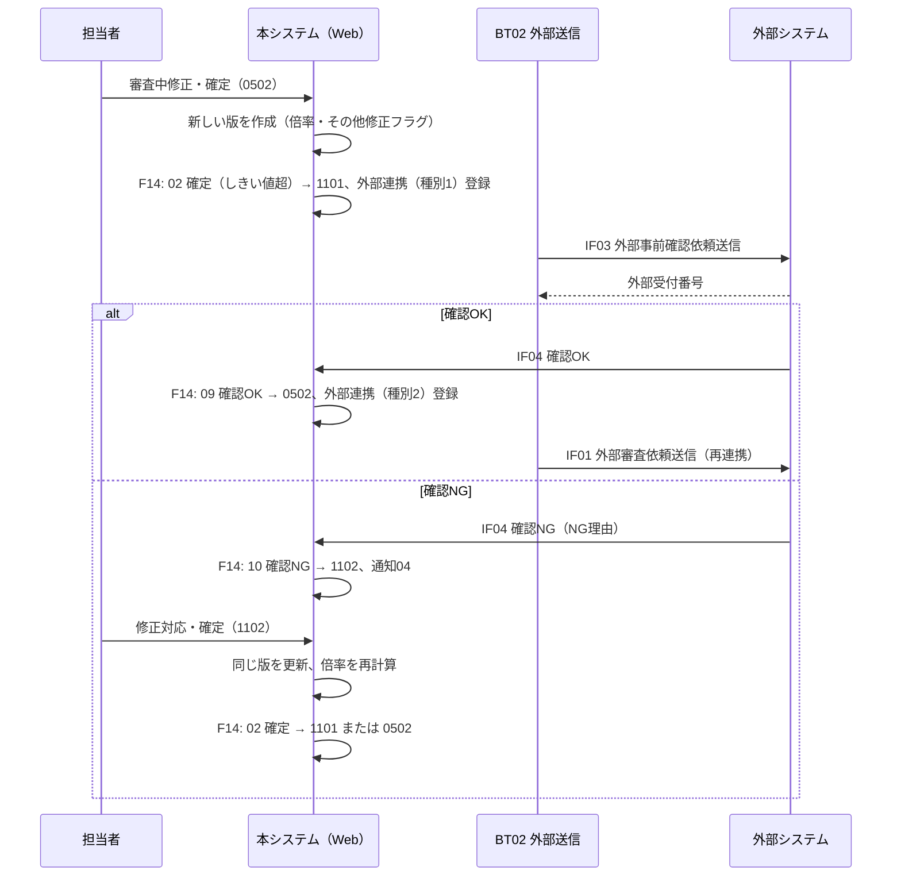

# 10. 機能詳細

| 項目 | 内容 |
| --- | --- |
| 版 | 0.1（初版・ドラフト） |
| 関連 | [09. 機能一覧](09-function-list.md)、[03. ステータス定義・状態遷移](03-status-transition.md)、[07. テーブル定義](07-table-definition.md)、[11. 画面設計](11-screen-design.md)、[12. 外部インターフェース設計](12-external-interface.md)、[13. バッチ・通知設計](13-batch-notification.md) |

各機能を「概要／利用者・前提／入力／処理手順／更新するテーブル／後続処理／エラー」の形で記述する。ステータスの更新はすべて F14 を通すため、F14 を最初に記述する。

## 1. F14 ステータス遷移制御（共通）

### 1.1 概要

申込 ID・操作コード・操作者・コメントを受け取り、ステータス遷移マスタから遷移先を 1 件に決めて申込を更新し、ステータス履歴を登録し、遷移先に応じた後続処理を起動する共通部品。画面・外部 IF・バッチのどこから呼ばれても同じ判定と更新を行う。

### 1.2 入力・出力

| 区分 | 項目 | 説明 |
| --- | --- | --- |
| 入力 | 申込 ID | 対象の申込 |
| 入力 | 期待する行バージョン | 呼出元が画面表示・取得時に読んだ T_APPLICATION.ROW_VERSION |
| 入力 | 操作コード | 01〜11 |
| 入力 | 操作主体・操作者 ID | 社員 ID、顧客 ID、外部システム ID |
| 入力 | コメント | 差戻し理由、NG 理由など（任意） |
| 入力 | 経路情報 | 承認申請 ID（承認・引戻し時）、顧客同意 ID（顧客操作時）、外部連携 ID（外部システム操作時） |
| 出力 | 遷移結果 | 採用した遷移 ID、遷移元・遷移先ステータス、履歴 ID |

呼出元は同一トランザクション内で、遷移の前提となる自分の更新（版の作成、承認明細の更新、同意日時の記録など）を済ませてから F14 を呼ぶ。

### 1.3 処理手順

1. 申込を取得し、期待する行バージョンと一致することを確認する。不一致は排他エラー。
2. 現在ステータスと操作コードで遷移マスタを検索し、評価順の昇順に並べる。0 件なら「この操作はできない」エラー。
3. 申込の会社区分から外部事前確認フラグを取得し、事前確認限定フラグが 1 の行は、外部事前確認フラグが 1 の場合だけ候補に残す。
4. 候補を評価順に条件評価し、最初に成立した行を採用する。成立する行がなければエラー（設計上、既定行があるため発生しない）。
5. 採用した行の操作主体と操作者を照合する（[03. 6 章](03-status-transition.md#6-操作主体と操作者の照合)）。不一致は権限エラー。
6. 申込のステータスを遷移先に更新し、行バージョンを +1 する（`WHERE ROW_VERSION = 期待値` で更新し、更新件数 0 なら排他エラー）。
7. ステータス履歴を登録する（遷移元、遷移先、遷移 ID、操作コード、操作主体、操作者 ID、コメント、変更後の現行版番号、変更日時）。
8. 遷移先と経路に応じた後続処理（1.5 節）を同一トランザクションで実行する。
9. 遷移結果を返す。コミットは呼出元が行う。

### 1.4 条件評価

| 条件コード | 判定に使うデータ | 判定 |
| --- | --- | --- |
| 00 なし | なし | 常に成立 |
| 11 回付先あり | M_APPROVAL_ROUTE、M_APPROVAL_ROUTE_STEP | 申込の会社区分・部署、操作に対応する承認種別、当日（VALID_FROM ≦ 当日 ≦ VALID_TO または VALID_TO が空）でルートを検索し、有効な承認者が 1 人以上いる。複数該当は VALID_FROM の最も新しいルートを採用し、採用ルート ID を呼出元（F04）に返す |
| 12 回付先なし | 同上 | 11 が不成立 |
| 21 最終承認者以外 | T_APPROVAL_REQUEST | 経路情報の承認申請の CURRENT_STEP_NO < FINAL_STEP_NO |
| 22 最終承認者 | T_APPROVAL_REQUEST | CURRENT_STEP_NO = FINAL_STEP_NO |
| 32 倍率しきい値超 | T_APPLICATION_VERSION、T_APPLICATION、M_COMPANY_DIV | 現行版の AMOUNT_RATIO > 会社区分の AMOUNT_RATIO_LIMIT。AMOUNT_RATIO は呼出元が現行版に設定済み |
| 33 その他修正あり | T_APPLICATION_VERSION | 現行版の OTHER_MODIFIED_FLG = 1 |

操作コードと承認種別の対応：遷移元 0201／0202 → 01 一次承認、0401／0402 → 02 最終承認、0801／0802 → 03 契約変更承認、1001／1002 → 04 契約変更審査依頼承認。

### 1.5 後続処理

遷移先（または遷移 ID）ごとに F14 が起動する処理。いずれも同一トランザクションで DB 更新までを行い、実際のメール送信・外部送信はバッチ（BT01／BT02）が行う。

| 契機 | 後続処理 | 更新するテーブル |
| --- | --- | --- |
| 遷移先が申請中（0202／0402／0802／1002）で承認申請が申請中 | 現在ステップの承認者へ承認依頼（通知 02）を登録 | T_NOTIFICATION |
| 差戻し（遷移 ID 7、15、31、39） | 申請者へ差戻し通知（通知 03）を登録。現行版の顧客同意を無効化（INVALID_FLG = 1） | T_NOTIFICATION、T_CUSTOMER_CONSENT |
| 遷移先が 0301／0901 | 顧客同意レコードを作成（トークン発行、有効期限 14 日）。顧客へ確認依頼（通知 01）を登録 | T_CUSTOMER_CONSENT、T_NOTIFICATION |
| 遷移先が 0502／0504 で承認完了経由（遷移 ID 12、13、36、37） | 申込の基準金額を現行版の申込金額で更新。外部連携（連携種別 2／4、未送信）を作成 | T_APPLICATION、T_EXTERNAL_LINK |
| 遷移先が 0502／0504 で再連携経由（遷移 ID 20、22、25、43、44、47） | 基準金額は更新しない。外部連携（連携種別 2／4、未送信）を作成 | T_EXTERNAL_LINK |
| 遷移先が 1101／1201 | 外部連携（連携種別 1／3、未送信）を作成 | T_EXTERNAL_LINK |
| 遷移先が 1102／1202 | 担当社員へ確認 NG 通知（通知 04）を登録。NG 理由を履歴コメントに記録 | T_NOTIFICATION |
| 遷移先が 0601／0602 | 申込の審査完了版番号を現行版番号で、審査完了日時を現在日時で更新。担当社員へ審査完了通知（通知 05）を登録 | T_APPLICATION、T_NOTIFICATION |

### 1.6 エラー

| エラー | 発生条件 | 呼出元の扱い |
| --- | --- | --- |
| 排他エラー | 行バージョン不一致 | 画面：メッセージを表示して最新を再表示。IF：E409 相当で応答 |
| 遷移不可エラー | 現在ステータス・操作コードに該当する遷移がない | 画面：「現在のステータスではこの操作はできません」。IF：E409 |
| 権限エラー | 操作主体と操作者が一致しない | 画面：権限エラー。IF：E401／E403 |
| 事前確認対象外エラー | 事前確認限定の遷移しか候補がなく、会社区分が事前確認なし | 設計上は既定行で回避する。発生した場合はシステムエラーとして記録 |

### 1.7 処理シーケンス

## 2. F01 申込一括取込

### 2.1 概要

担当者がアップロードした取込ファイル（CSV、[IF05](12-external-interface.md)）を行単位で検証し、正常行を申込（ステータス 0101）と申込内容の第 1 版として登録する。

### 2.2 利用者・前提

- 利用者：社員（担当者）。画面 SC05。
- 取込社員の会社区分・部署が申込に引き継がれ、取込社員が担当社員になる。

### 2.3 処理手順

1. ファイルを受け取り、拡張子・サイズ（5MB 以内、仮）・文字コード（UTF-8）・ヘッダ行を検証する。ファイル単位のエラーは取込を行わずに画面へ返す。
2. 一括取込（T_IMPORT_BATCH）を登録する（ファイル名、取込社員、取込日時、件数は 0 で仮登録）。
3. 2 行目以降を 1 行ずつ検証する。検証内容は IF05 のレイアウト表に従う（必須、型・桁、日付書式、契約開始日 ≦ 契約終了日、顧客番号の存在）。
4. 正常行ごとに次を登録する。
   - 申込（T_APPLICATION）：申込番号を採番、顧客 ID、担当社員 ID = 取込社員、会社区分・部署 = 取込社員のもの、ステータス 0101、現行版番号 1、取込 ID。
   - 申込内容（T_APPLICATION_VERSION）：版番号 1、版種別 1、商品コード、申込金額、契約開始日、契約終了日、備考、その他修正フラグ 0。
   - ステータス履歴（T_STATUS_HISTORY）：遷移元なし、遷移先 0101、操作コード 00 取込、操作主体 1、操作者 = 取込社員。F14 は通さず F01 が直接登録する。
5. エラー行は取込エラー（T_IMPORT_ERROR）に行番号・エラー内容・行データを登録し、スキップする。
6. 全行の処理後、一括取込の総件数・成功件数・エラー件数を更新してコミットする。
7. 結果（件数とエラー行一覧）を画面に返す。

### 2.4 エラー

- 上限行数（1,000 行、仮）超過、ヘッダ不一致、文字コード不正はファイル単位のエラーとし、何も登録しない。
- 行単位のエラーは正常行の登録を妨げない（部分成功）。

## 3. F02 申込一覧・検索

### 3.1 概要

社員が申込を検索・一覧表示し、申込詳細（SC03）へ遷移する。承認者は「自分の操作待ち」で承認待ちを絞り込む。

### 3.2 処理手順

1. 検索条件（申込番号、顧客番号／顧客名、ステータス、担当社員、取込日、自分の操作待ち）を受け取る。
2. 権限による絞り込み：担当者は自分が担当社員の申込、承認者は自分が承認明細に含まれる申込に加えて自部署の申込、管理者は全申込を対象とする（仮）。
3. 「自分の操作待ち」は次の条件で絞る。
   - 担当者：担当社員 = 自分、かつステータスの操作主体が 1（担当者）。
   - 承認者：申請状態が申請中の承認申請で、現在ステップの承認者社員 ID = 自分。
4. 申込に現行版の申込内容・顧客名・担当社員名を結合し、更新日時の降順で 20 件ずつ返す。

## 4. F03 申込入力・修正

### 4.1 概要

取込済（0101）または入力中（0102）の申込内容を修正し、確定して一次承認申請待ち（0201）へ進める。

### 4.2 利用者・前提

- 利用者：申込の担当社員。画面 SC03 → SC04（モード：新規入力・修正）。
- 差戻しで 0102 に戻った場合も同じ版を再編集する。

### 4.3 処理手順

| 操作 | ステータス | 処理 |
| --- | --- | --- |
| 一時保存 | 0102 | 現行版を更新する。ステータス遷移なし、履歴なし |
| 保存（初回） | 0101 | 現行版を更新し、F14 を操作コード 01 で呼ぶ（→ 0102） |
| 確定 | 0101 | 入力チェック後に現行版を更新し、F14 を操作コード 01（→ 0102）、続けて 02（→ 0201）で呼ぶ。履歴は 2 行になる |
| 確定 | 0102 | 入力チェック後に現行版を更新し、確定日時を設定して F14 を操作コード 02 で呼ぶ（→ 0201） |

入力チェックは画面共通（必須、型・桁、契約開始日 ≦ 契約終了日）に加え、申込金額 > 0 とする。

### 4.4 更新するテーブル

T_APPLICATION_VERSION（現行版）、T_APPLICATION・T_STATUS_HISTORY（F14 経由）

## 5. F04 承認申請・引戻し

### 5.1 概要

申請待ち（0201／0401／0801／1001）の申込を承認ルートに沿って申請する。申請中の申込は申請者が引き戻せる。4 つの承認種別で同じ処理を使う。

| 承認種別 | 申請待ち | 申請中 | 承認完了後 | 差戻し先 |
| --- | --- | --- | --- | --- |
| 01 一次承認 | 0201 | 0202 | 0301 | 0102 |
| 02 最終承認 | 0401 | 0402 | 0502 | 0102 |
| 03 契約変更承認 | 0801 | 0802 | 0901 | 0701 |
| 04 契約変更審査依頼承認 | 1001 | 1002 | 0504 | 0701 |

### 5.2 申請の処理手順

1. 担当者が SC03 で「申請」を押す。操作者が申込の担当社員であることを確認する。
2. 承認ルートを検索する（会社区分・部署・承認種別・当日。F14 の条件 11 と同じ判定）。
3. 回付先ありの場合：
   - 承認申請（T_APPROVAL_REQUEST）を登録する。申込 ID、現行版番号、承認種別、ルート ID、申請社員 = 操作者、申請日時、申請状態 1（申請中）、現在ステップ 1、最終ステップ = ルート明細の最大ステップ。
   - 承認明細（T_APPROVAL_STEP）をルート明細から複写する（結果 0 未処理）。
   - F14 を操作コード 03 で呼ぶ（条件 11 → 申請中）。後続処理でステップ 1 の承認者へ通知 02 が登録される。
4. 回付先なしの場合：
   - 承認申請を申請状態 2（承認済）、ルート ID・ステップは空、完了日時 = 申請日時で登録する。承認明細は作らない。
   - F14 を操作コード 03 で呼ぶ（条件 12 → 承認完了後のステータス）。

### 5.3 引戻しの処理手順

1. 申請者が SC03 で「引戻し」を押す。進行中の承認申請の申請社員 = 操作者であることを確認する。
2. 承認申請を申請状態 4（引戻し）、完了日時 = 現在日時に更新する。未処理の承認明細はそのまま残す。
3. F14 を操作コード 06 で呼ぶ（→ 申請待ち）。

### 5.4 エラー

- 進行中（申請状態 1）の承認申請が申込に 2 件以上ある状態は不正。検出したらシステムエラーとする。
- ルートの承認者に無効な社員が含まれる場合は、そのステップを除いて回付する。全員無効なら回付先なしとして扱う（仮）。

## 6. F05 承認・差戻し

### 6.1 概要

申請中（0202／0402／0802／1002）の申込を、現在ステップの承認者が承認または差戻しする。

### 6.2 承認の処理手順

1. 承認者が SC03 で「承認」を押す（コメント任意）。進行中の承認申請の現在ステップの承認者 = 操作者であることを確認する。
2. 現在ステップの承認明細を結果 1（承認）、コメント、処理日時で更新する。
3. 現在ステップ < 最終ステップの場合：承認申請の現在ステップを +1 し、F14 を操作コード 04 で呼ぶ（条件 21 → 同じステータス）。後続処理で次の承認者へ通知 02 が登録される。
4. 現在ステップ = 最終ステップの場合：承認申請を申請状態 2（承認済）、完了日時に更新し、F14 を操作コード 04 で呼ぶ（条件 22 → 承認完了後のステータス）。

### 6.3 差戻しの処理手順

1. 承認者が SC03 で「差戻し」を押す。コメントは必須。現在ステップの承認者 = 操作者であることを確認する。
2. 現在ステップの承認明細を結果 2（差戻し）、コメント、処理日時で更新する。
3. 承認申請を申請状態 3（差戻し）、完了日時に更新する。
4. F14 を操作コード 05、コメント = 差戻し理由で呼ぶ（→ 0102／0701）。後続処理で申請者へ通知 03 が登録され、現行版の顧客同意が無効化される。

### 6.4 承認ワークフローのシーケンス

## 7. F06 顧客確認依頼通知

### 7.1 概要

内容確認待ち（0301／0901）に到達した申込について、確認用 URL を顧客へメールで送る。レコードの作成は F14 の後続処理、送信は BT01 が行う。

### 7.2 処理手順（F14 後続処理）

1. トークンを生成する（SecureRandom 32 バイト → Base64URL 文字列）。
2. 顧客同意（T_CUSTOMER_CONSENT）を登録する。申込 ID、現行版番号、同意種別（0301 → 1、0901 → 2）、トークンの SHA-256 ハッシュ、有効期限 = 現在日時 + 14 日（仮）、無効フラグ 0。
3. 通知（T_NOTIFICATION）を通知種別 01 で登録する。宛先 = 顧客のメールアドレス、本文に確認 URL（`{ベースURL}/consent/{トークン}`）と有効期限を埋め込む。平文トークンは本文にだけ含まれ、DB にはハッシュのみ残る。

### 7.3 再送

担当者は SC03 の「確認依頼メール再送」で、0301／0302／0901／0902 の申込に対して再送できる。処理は、現行版の既存の顧客同意を無効化（INVALID_FLG = 1）し、7.2 と同じ手順で新しい顧客同意と通知を登録する。ステータス遷移はしない。
0302／0902 で再送した場合、新しい同意レコードには内容同意日時を引き継がず、顧客は CU01 からやり直す（同意はステータスが示すため、新しいレコードの内容同意日時は空のままでもよい。仮）。

## 8. F07 顧客確認・同意

### 8.1 概要

顧客が確認用 URL から申込内容を確認して同意し（0301 → 0302、0901 → 0902）、続く同意事項の確認で確定する（0302 → 0401、0902 → 1001）。

### 8.2 利用者・前提

- 利用者：顧客。画面 CU01〜CU04。認証は確認用トークンのみ。
- 社員画面から顧客操作の代行はできない。

### 8.3 トークン検証（全リクエスト共通）

1. URL のトークンを SHA-256 でハッシュ化し、顧客同意を検索する。該当なし → CU04。
2. 無効フラグ = 1、または有効期限切れ → CU04。
3. 対象の版が申込の現行版でない → CU04。
4. 申込のステータスにより表示を決める：0301／0901 → CU01、0302／0902 → CU02、それ以外（0401 以降など） → CU03（手続き完了・参照のみ）。

### 8.4 同意の処理手順（CU01）

1. 顧客が「内容を確認しました」にチェックして「同意する」を押す。
2. トークン検証を行い、ステータスが 0301／0901 であることを確認する。
3. 顧客同意の内容同意日時 = 現在日時、接続元 IP を更新する。
4. F14 を操作コード 07、操作主体 3、操作者 ID = 顧客 ID、経路情報 = 同意 ID で呼ぶ（→ 0302／0902）。
5. CU02 へリダイレクトする。

### 8.5 確定の処理手順（CU02）

1. 顧客が同意事項を確認して「確定する」を押す。
2. トークン検証を行い、ステータスが 0302／0902 であることを確認する。
3. 顧客同意の同意確定日時 = 現在日時、接続元 IP を更新する。
4. F14 を操作コード 02、操作主体 3、操作者 ID = 顧客 ID で呼ぶ（→ 0401／1001）。
5. CU03 へリダイレクトする。

### 8.6 顧客同意のシーケンス

## 9. F08 外部審査依頼送信

### 9.1 概要

外部審査中（0502）または契約変更審査中（0504）に到達した申込の現行版を、外部システムへ審査依頼として送る。レコードの作成は F14 の後続処理、送信は BT02（[IF01](12-external-interface.md)）が行う。

### 9.2 処理手順（F14 後続処理）

1. 承認完了経由（遷移 ID 12、13、36、37）で到達した場合、申込の基準金額を現行版の申込金額で更新する。再連携経由（遷移 ID 20、22、25、43、44、47）では更新しない。
2. 外部連携（T_EXTERNAL_LINK）を登録する。申込 ID、現行版番号、連携種別（0502 → 2、0504 → 4）、送信状態 0、再送回数 0。

### 9.3 送信（BT02）

未送信の外部連携を取得し、IF01 で送信する。送信成功で送信状態 1、送信日時、外部受付番号を保存する。送信前に対象の版が現行版であることを確認し、違えば送信せず送信エラーにする（版が更新され、新しい外部連携が後続にあるため）。再送上限超過は送信エラーとして担当社員・管理者へ通知 06 を登録する。

## 10. F09 外部審査結果受信

### 10.1 概要

外部システムから審査完了（[IF02](12-external-interface.md)）を受信し、審査完了（0601／0602）へ遷移する。

### 10.2 処理手順

1. IF 認証を行う。失敗は E401 で応答する。
2. 外部受付番号で外部連携を特定する（連携種別 2／4、結果未設定）。該当なしは E404。結果設定済みなら重複受信として正常応答し、何もしない。
3. 申込のステータスが 0502／0504 であること、外部連携の版が現行版であることを確認する。違えば E409／E410 で応答し、結果は取り込まない。
4. 外部連携の結果 3（審査完了）、結果受信日時を更新する。
5. F14 を操作コード 08、操作主体 4、操作者 ID = 外部システム ID、経路情報 = 外部連携 ID で呼ぶ（→ 0601／0602）。後続処理で審査完了版番号・審査完了日時が更新され、担当社員へ通知 05 が登録される。
6. 新しいステータスを応答する。

### 10.3 外部審査のシーケンス

## 11. F10 審査中修正

### 11.1 概要

外部審査中（0502／0504）の申込を担当者が修正・確定し、現行版を複写した新しい版を作って、変更金額倍率とその他修正の有無で事前確認（1101／1201）へ回すか、審査中のまま再連携するかを決める。

### 11.2 利用者・前提

- 利用者：申込の担当社員。画面 SC03 → SC04（モード：審査中修正）。
- 会社区分が「外部事前確認なし」の申込は、条件にかかわらず審査中のまま再連携する。

### 11.3 処理手順

1. 入力チェックを行う。現行版と比べて変更がない場合はエラー（確定できない）。
2. 新しい版を登録する。版番号 = 現行版番号 + 1、版種別（0502 → 2、0504 → 4）、入力内容、確定日時 = 現在日時。
   - 変更金額倍率 = 新しい申込金額 ÷ 申込の基準金額（小数第 4 位まで、切り捨て）。
   - その他修正フラグ = 商品コード・契約開始日・契約終了日・備考のいずれかが直前の版と異なれば 1。
3. 申込の現行版番号を新しい版番号に更新する。
4. F14 を操作コード 02 で呼ぶ。条件評価は次の順（[03. 5 章](03-status-transition.md#5-審査中修正の遷移先マトリクス)）。

| 修正時のステータス | 評価順 1 | 評価順 2 | 既定 |
| --- | --- | --- | --- |
| 0502 | 32 しきい値超 → 1101 | 33 その他修正あり → 1101 | → 0502（再連携） |
| 0504 | 32 しきい値超 → 1201 | （なし） | → 0504（再連携） |

5. 後続処理で、1101／1201 なら外部連携（連携種別 1／3）、0502／0504 のままなら外部連携（連携種別 2／4）が登録される。

### 11.4 補足

- 先に送った審査依頼の結果が、新しい版の送信後に届いた場合は、F09 で「対象版が現行版でない」として受け付けない（仮。[99. 未決事項](99-open-issues.md)）。
- 事前確認から 0502／0504 に戻るときの再連携は、確認 OK を受けた版（現行版）で行う。

## 12. F11 外部事前確認連携

### 12.1 概要

事前確認待ち（1101／1201）に到達した申込の現行版を外部システムへ事前確認として送り（[IF03](12-external-interface.md)）、確認 OK／NG を受信して（[IF04](12-external-interface.md)）審査中へ戻すか修正対応待ちへ進める。

### 12.2 送信

F14 の後続処理で外部連携（連携種別 1／3、未送信）を登録し、BT02 が IF03 で送信する。送信電文には直前の版との差分（変更前後の金額、変更金額倍率、その他修正フラグ）を含める。

### 12.3 受信の処理手順

1. IF 認証を行う。
2. 外部受付番号で外部連携を特定する（連携種別 1／3、結果未設定）。該当なしは E404、結果設定済みは重複受信として正常応答。
3. 申込のステータスが 1101／1201 であること、外部連携の版が現行版であることを確認する。
4. 確認 OK の場合：結果 1、結果受信日時を更新し、F14 を操作コード 09 で呼ぶ（→ 0502／0504）。後続処理で再連携用の外部連携（連携種別 2／4）が登録される。
5. 確認 NG の場合：結果 2、結果受信日時、NG 理由を更新し、F14 を操作コード 10、コメント = NG 理由で呼ぶ（→ 1102／1202）。後続処理で担当社員へ通知 04 が登録される。
6. 新しいステータスを応答する。

### 12.4 審査中修正〜事前確認のシーケンス

## 13. F12 修正対応

### 13.1 概要

修正対応待ち（1102／1202）の申込について、担当者が NG 理由を確認して同じ版を修正・確定し、変更金額倍率で再判定する。

### 13.2 処理手順

1. SC04（モード：修正対応）に NG 理由（直近の外部連携の NG 理由）を表示する。
2. 入力チェックを行う。変更がない場合はエラー。
3. 現行版を更新する（新しい版は作らない）。変更金額倍率 = 申込金額 ÷ 基準金額、その他修正フラグは直前の版（現行版 − 1）との比較で再設定、確定日時 = 現在日時。
4. F14 を操作コード 02 で呼ぶ。条件 32（しきい値超） → 1101／1201、既定 → 0502／0504。
5. 後続処理で、1101／1201 なら外部連携（連携種別 1／3）、0502／0504 なら外部連携（連携種別 2／4）が登録される。

## 14. F13 契約変更入力

### 14.1 概要

審査完了（0601）の申込について契約変更を開始し、審査完了版を複写した新しい版に変更内容を入力・確定して契約変更承認申請待ち（0801）へ進める。

### 14.2 契約変更開始の処理手順（0601）

1. 担当者が SC03 で「契約変更開始」を押す。操作者が申込の担当社員であることを確認する。
2. 審査完了版を複写して新しい版を登録する。版番号 = 現行版番号 + 1、版種別 3、変更金額倍率は空、その他修正フラグ 0、確定日時は空。
3. 申込の現行版番号を新しい版番号に更新する。
4. F14 を操作コード 11 で呼ぶ（→ 0701）。

### 14.3 契約変更入力の処理手順（0701）

- 一時保存：現行版を更新する。ステータス遷移なし。
- 確定：入力チェック後に現行版を更新し、確定日時を設定して F14 を操作コード 02 で呼ぶ（→ 0801）。変更がない場合は確定できない。
- 画面には審査完了版との差分を表示する。差戻しで 0701 に戻った場合も同じ版を再編集する。

### 14.4 補足

- 契約変更審査完了（0602）からの 2 回目以降の契約変更は本設計では対象外（[99. 未決事項](99-open-issues.md)）。

## 15. F15 マスタメンテナンス

### 15.1 概要

管理者が社員・会社区分・承認ルートを保守する。画面 SC06〜SC08。

### 15.2 処理内容

| 対象 | 操作 | チェック・備考 |
| --- | --- | --- |
| 社員マスタ | 登録・更新・無効化 | 社員番号の重複不可。物理削除はせず有効フラグで無効化。無効化する社員が進行中の承認申請の未処理ステップにいる場合は警告を表示する（仮） |
| 会社区分マスタ | 更新 | 会社区分名、外部事前確認フラグ、金額倍率しきい値（1.00 以上）。区分の追加・削除は対象外 |
| 承認ルートマスタ・明細 | 登録・更新・削除 | ステップ番号は 1 から連番、承認者は有効かつ権限 02、会社区分がルートと一致、適用開始日 ≦ 適用終了日。進行中の承認申請には影響しない（申請時に明細を複写済み） |

### 15.3 排他

マスタも行バージョンで楽観排他する。

## 16. ログイン・ログアウト（共通）

1. 社員番号とパスワードを受け取り、社員マスタを検索する。有効フラグ 0 または不一致はエラー。連続 5 回失敗でロック（仮、[14. 共通仕様](14-common-spec.md)）。
2. 成功時はセッションを再生成し、社員 ID・権限・会社区分・部署をセッションに保持する。
3. ログアウトでセッションを破棄する。
