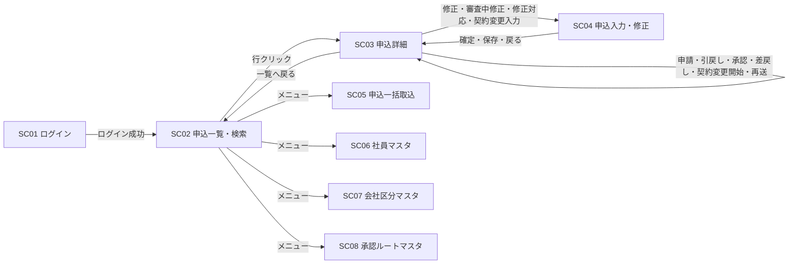
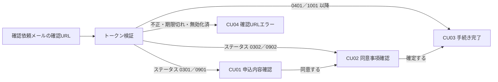

# 11. 画面設計

| 項目 | 内容 |
| --- | --- |
| 版 | 0.1（初版・ドラフト） |
| 関連 | [09. 機能一覧](09-function-list.md)、[10. 機能詳細](10-function-detail.md)、[03. ステータス定義・状態遷移](03-status-transition.md)、[07. テーブル定義](07-table-definition.md)、[08. コード定義](08-code-definition.md)、[14. 共通仕様](14-common-spec.md) |

画面は社員向け 8 画面（SC01〜SC08）、顧客向け 4 画面（CU01〜CU04）、共通 1 画面（CM01）の計 13 画面。画面 ID・画面名は [09. 機能一覧](09-function-list.md) に従う。外部インターフェース（IF01〜IF05）は [12. 外部インターフェース設計](12-external-interface.md) で扱い、本書の対象外とする。

## 1. 画面一覧

### 1.1 画面一覧

| 画面ID | 画面名 | 利用者 | 権限（ROLE_CD） | 対応機能 | URL（仮） | 備考 |
| --- | --- | --- | --- | --- | --- | --- |
| SC01 | ログイン | 社員 | 認証前 | 共通 | `/emp/login` | ログアウトは `POST /emp/logout` |
| SC02 | 申込一覧・検索 | 社員 | 01、02、09 | F02、F05 | `/emp/applications` | 承認者は承認待ち一覧として使う |
| SC03 | 申込詳細 | 社員 | 01、02、09 | F03、F04、F05、F06（再送）、F10、F12、F13 | `/emp/applications/{applicationId}` | ステータス操作の起点。操作は `POST .../{applicationId}/{action}` |
| SC04 | 申込入力・修正 | 社員（担当者） | 01 | F03、F10、F12、F13 | `/emp/applications/{applicationId}/edit` | 1 画面をモード切替で使う |
| SC05 | 申込一括取込 | 社員（担当者） | 01 | F01 | `/emp/import` | 取込結果は `/emp/import/{importBatchId}` |
| SC06 | 社員マスタ | 社員（管理者） | 09 | F15 | `/emp/master/employees` | |
| SC07 | 会社区分マスタ | 社員（管理者） | 09 | F15 | `/emp/master/company-divs` | |
| SC08 | 承認ルートマスタ | 社員（管理者） | 09 | F15 | `/emp/master/approval-routes` | ルートと明細を同一画面で編集 |
| CU01 | 申込内容確認（同意） | 顧客 | 確認用トークン | F07 | `/consent/{token}` | |
| CU02 | 同意事項確認（確定） | 顧客 | 確認用トークン | F07 | `/consent/{token}/confirm` | |
| CU03 | 手続き完了 | 顧客 | 確認用トークン | F07 | `/consent/{token}/complete` | |
| CU04 | 確認 URL エラー | 顧客 | なし | F07 | URL なし（トークン検証エラー時に表示） | |
| CM01 | システムエラー | 共通 | なし | 共通 | URL なし（想定外の例外発生時に表示） | |

- `/emp/` 配下は認証 Filter でログイン済セッションを要求し、`/consent/` 配下はトークン検証だけで到達できる。顧客ブラウザからは `/consent/` 以外に到達できない構成とする（[02. システム構成](02-system-architecture.md)）。
- `{applicationId}` は T_APPLICATION.APPLICATION_ID、`{token}` は確認用トークンの平文（DB には SHA-256 ハッシュのみ保持）。

### 1.2 権限と参照範囲

| 権限 | 参照できる申込（SC02・SC03） | 操作 |
| --- | --- | --- |
| 01 担当者 | T_APPLICATION.OWNER_EMPLOYEE_ID = 自分 | 修正・確定・申請・引戻し・審査中修正・修正対応・契約変更・再送 |
| 02 承認者 | 自分が T_APPROVAL_STEP.APPROVER_EMPLOYEE_ID に含まれる申込、および自部署（T_APPLICATION.DEPT_CD = 自分の部署）の申込（仮） | 承認・差戻し（現在ステップの承認者のみ） |
| 09 管理者 | 全申込 | 参照、外部連携の再送、マスタメンテナンス |

参照範囲外の申込 ID を URL で直接指定した場合は権限エラー（E103）とし、SC02 へ戻す。

## 2. 画面遷移図

### 2.1 社員向け

- メニューは全画面のヘッダにあり、SC02・SC05〜SC08 は相互に遷移できる（図では SC02 からの矢印だけ示す）。
- すべての社員向け画面から、ログアウトとセッションタイムアウトで SC01 へ、システムエラーで CM01 へ遷移する（図では省略）。

### 2.2 顧客向け

- トークン検証は `/consent/` 配下の全リクエストで行い（[10. F07 8.3](10-function-detail.md#83-トークン検証全リクエスト共通)）、通過後に申込のステータスで表示画面を決める。
- 顧客向け画面にメニューはなく、画面間の任意遷移はできない。

## 3. 画面共通仕様

### 3.1 レイアウトとメニュー

| 領域 | 社員向け画面 | 顧客向け画面 |
| --- | --- | --- |
| ヘッダ | システム名、ログイン社員名（M_EMPLOYEE.EMPLOYEE_NAME）、権限名（ROLE_CD の名称）、ログアウトボタン | システム名のみ |
| メニュー | 権限別に表示（下表） | なし |
| メッセージ領域 | コンテンツ上部。エラー（赤）、警告（黄）、情報（青）を種別ごとに表示。入力エラーは該当項目の直下にも表示する | 同じ |
| フッタ | 著作権表示、アプリケーション版数（仮） | 同じ |

| メニュー | 遷移先 | 01 担当者 | 02 承認者 | 09 管理者 |
| --- | --- | --- | --- | --- |
| 申込一覧 | SC02 | ○ | ○ | ○ |
| 一括取込 | SC05 | ○ | × | × |
| 社員マスタ／会社区分マスタ／承認ルートマスタ | SC06／SC07／SC08 | × | × | ○ |

メニューの非表示に加え、URL 直接アクセスは認可 Filter で拒否し、E103 を表示して SC02 へ戻す。

### 3.2 一覧・書式

| 項目 | 規則 |
| --- | --- |
| ページング | 1 ページ 20 件（仮）。ページ番号リンクと総件数を表示。検索条件はページ移動時に引き継ぐ |
| 並び順 | 既定は更新日時（UPDATED_AT）の降順。列見出しクリックで並び替え（対象列はホワイトリストで固定） |
| 日付／日時 | yyyy/MM/dd／yyyy/MM/dd HH:mm。日付の入力も同じ書式 |
| 金額 | 円、整数、3 桁カンマ区切り。入力はカンマ許容 |
| 変更金額倍率 | 小数第 2 位まで表示（保持は小数第 4 位、切り捨て） |
| 区分値 | コードではなく名称を表示。ステータスは「0102 入力中」のようにコード＋名称 |
| 空値 | 「－」を表示（仮） |

### 3.3 更新処理の共通動作

| 項目 | 規則 |
| --- | --- |
| 二重送信防止 | 更新系は PRG パターン（POST → Redirect → GET）。送信ボタンはクリック後に無効化する（仮） |
| CSRF | セッション単位のトークンを hidden（`_csrf`、仮）に持ち、Filter で検証する。顧客向け画面も同じ |
| 楽観排他 | 画面表示時の ROW_VERSION を hidden で持ち回る。不一致（E102）の場合はメッセージを表示し、対象の詳細画面（SC03、マスタの編集画面）を最新データで再表示する。入力値は引き継がない |
| 遷移不可・権限エラー | E101／E103 を表示し、SC03 を最新データで再表示する（表示後にステータスが変わった場合など） |
| セッションタイムアウト | 30 分（仮）。タイムアウト後のリクエストは SC01 へ遷移し、「セッションが切れました。再度ログインしてください。」を表示する。再ログイン後は SC02 へ遷移する（元の画面には戻らない、仮） |
| 処理結果 | 更新成功時はリダイレクト先に情報メッセージ（I0xx）を 1 回だけ表示する（セッションのフラッシュ属性、仮） |
| 出力エスケープ | JSP の出力は JSTL で必ずエスケープする（[14. 共通仕様 10 章](14-common-spec.md#10-セキュリティ)） |

## 4. 画面別設計（社員向け）

### 4.1 SC01 ログイン

**概要**：社員番号とパスワードで社員を認証し、セッションを開始する。

**利用者・権限**：全社員（認証前）。ログイン済でアクセスした場合は SC02 へリダイレクトする。

**表示項目**：システム名、メッセージ領域のみ。

**入力項目**

| 項目名 | 型 | 桁 | 必須 | チェック内容 |
| --- | --- | --- | --- | --- |
| 社員番号（M_EMPLOYEE.EMPLOYEE_NO） | 文字列 | 10 | ○ | 半角英数字 |
| パスワード | 文字列 | 64（仮） | ○ | 桁のみ。マスク表示、エラー時も値を保持しない |

**操作**

| ボタン名 | 処理内容 | 遷移先 | 操作コード |
| --- | --- | --- | --- |
| ログイン | M_EMPLOYEE を EMPLOYEE_NO で検索し、VALID_FLG = 1 かつ PASSWORD_HASH と一致すれば成功。セッションを再生成し、社員 ID・権限・会社区分・部署を保持する | SC02 | なし |

**備考**：失敗時は「社員番号またはパスワードが正しくありません。」とし、社員番号の存在有無を区別しない。連続 5 回（仮）失敗でロックし、「アカウントがロックされています。管理者に連絡してください。」を表示する。ロック状態の保持（M_EMPLOYEE への列追加を想定）と解除手段は 7 章。

### 4.2 SC02 申込一覧・検索

**概要**：申込を検索して一覧表示し、SC03 へ遷移する。「自分の操作待ちのみ」で担当者・承認者の作業一覧として使う。

**利用者・権限**：01、02、09。1.2 節の参照範囲を検索条件に加えて必ず適用する。

**表示項目（一覧の列）**

| 項目名 | 参照元 | 書式 |
| --- | --- | --- |
| 申込番号 | T_APPLICATION.APPLICATION_NO | リンク。クリックで SC03 へ |
| 顧客名 | M_CUSTOMER.CUSTOMER_NAME | |
| ステータス | M_STATUS.STATUS_NAME（T_APPLICATION.STATUS_CD） | コード＋名称 |
| 申込金額（現行版） | T_APPLICATION_VERSION.APPLICATION_AMOUNT（VERSION_NO = CURRENT_VERSION_NO） | 3 桁カンマ、右寄せ |
| 担当社員 | M_EMPLOYEE.EMPLOYEE_NAME（OWNER_EMPLOYEE_ID） | |
| 更新日時 | T_APPLICATION.UPDATED_AT | yyyy/MM/dd HH:mm |

**入力項目（検索条件）**

| 項目名 | 型 | 桁 | 必須 | チェック内容・検索方法 |
| --- | --- | --- | --- | --- |
| 申込番号 | 文字列 | 12 | | 前方一致（T_APPLICATION.APPLICATION_NO） |
| 顧客番号／顧客名 | 文字列 | 12／100 | | 顧客番号は完全一致、顧客名は部分一致（M_CUSTOMER） |
| ステータス | 複数選択 | | | M_STATUS を DISPLAY_ORDER 順に列挙。未選択は全ステータス |
| 担当社員 | 選択 | | | VALID_FLG = 1 の社員。担当者は自分で固定（変更不可） |
| 取込日 From／To | 日付 | 10 | | yyyy/MM/dd、From ≦ To。T_IMPORT_BATCH.IMPORTED_AT の日付部分で範囲検索 |
| 自分の操作待ちのみ | チェック | | | 下表の条件で絞る。管理者には表示しない |

| 権限 | 「自分の操作待ち」の判定 |
| --- | --- |
| 01 担当者 | T_APPLICATION.OWNER_EMPLOYEE_ID = ログイン社員 かつ STATUS_CD が操作主体 1（担当者）のステータス（0101、0102、0201、0401、0601、0701、0801、1001、1102、1202） |
| 02 承認者 | T_APPROVAL_REQUEST.REQUEST_STATUS = 1（申請中）の承認申請について、T_APPROVAL_STEP.STEP_NO = CURRENT_STEP_NO の行の APPROVER_EMPLOYEE_ID = ログイン社員 |

**操作**

| ボタン名 | 処理内容 | 遷移先 | 操作コード |
| --- | --- | --- | --- |
| 検索／クリア | 条件で検索して 1 ページ目を表示する（GET、条件は URL パラメータ）／条件を初期状態に戻す | SC02 | なし |
| 行クリック（申込番号リンク） | 申込詳細を表示する | SC03 | なし |

**備考**：初期表示は担当者・承認者は「自分の操作待ちのみ」をチェック済で検索した状態、管理者は全件を更新日時降順とする。一覧に承認・差戻しのボタンは置かず、操作は SC03 で行う。

### 4.3 SC03 申込詳細

**概要**：申込の全情報（基本情報、現行版の申込内容と差分、承認状況、顧客同意、外部連携、ステータス履歴）を表示し、ステータス操作と SC04 への遷移の起点になる。

**利用者・権限**：01、02、09（参照範囲は 1.2 節）。ボタンはステータス×権限×操作者で表示制御する（下表）。表示制御に関わらず、サーバ側で F14 の操作主体照合を行う。

**表示項目**

| 区分 | 項目名 | 参照元 | 書式・備考 |
| --- | --- | --- | --- |
| 申込基本情報 | 申込番号、顧客番号／顧客名、担当社員 | T_APPLICATION.APPLICATION_NO、M_CUSTOMER.CUSTOMER_NO／CUSTOMER_NAME、M_EMPLOYEE.EMPLOYEE_NAME（OWNER_EMPLOYEE_ID） | |
| | 会社区分／部署コード、ステータス | M_COMPANY_DIV.COMPANY_DIV_NAME／T_APPLICATION.DEPT_CD、M_STATUS.STATUS_NAME | ステータスはコード＋名称で強調表示 |
| | 現行版番号／審査完了版番号、基準金額、審査完了日時／更新日時 | T_APPLICATION.CURRENT_VERSION_NO／REVIEWED_VERSION_NO、BASE_AMOUNT、REVIEWED_AT／UPDATED_AT | 金額は 3 桁カンマ、未設定は「－」 |
| 申込内容（現行版） | 版番号／版種別、商品コード、申込金額、契約開始日／契約終了日、備考、確定日時 | T_APPLICATION_VERSION.VERSION_NO／VERSION_TYPE、PRODUCT_CD、APPLICATION_AMOUNT、CONTRACT_START_DATE／CONTRACT_END_DATE、REMARKS、CONFIRMED_AT | 備考は改行を保持 |
| | 変更金額倍率／その他修正フラグ | T_APPLICATION_VERSION.AMOUNT_RATIO／OTHER_MODIFIED_FLG | 版種別 2／4 のとき表示 |
| 差分表示 | 比較元の版の同項目 | T_APPLICATION_VERSION（比較元は表の下に記載） | 現行版と並べ、値が異なる項目を強調 |
| 承認状況 | 承認申請の一覧 | T_APPROVAL_REQUEST：VERSION_NO、APPROVAL_TYPE、REQUEST_EMPLOYEE_ID（氏名）、REQUESTED_AT、REQUEST_STATUS、CURRENT_STEP_NO／FINAL_STEP_NO、COMPLETED_AT | 申請日時の降順 |
| | 各申請の承認明細 | T_APPROVAL_STEP：STEP_NO、APPROVER_EMPLOYEE_ID（氏名）、RESULT_CD、COMMENT、ACTED_AT | 申請中の現在ステップ行を強調 |
| 顧客同意 | 同意の一覧 | T_CUSTOMER_CONSENT：VERSION_NO、CONSENT_TYPE、TOKEN_EXPIRES_AT、CONTENT_AGREED_AT、CONSENT_CONFIRMED_AT、INVALID_FLG | トークンは表示しない |
| 外部連携 | 連携の一覧 | T_EXTERNAL_LINK：VERSION_NO、LINK_TYPE、SEND_STATUS、RETRY_COUNT、SENT_AT、EXTERNAL_RECEIPT_NO、RESULT_CD、RESULT_RECEIVED_AT、NG_REASON、ERROR_MESSAGE | 送信エラー行を強調 |
| ステータス履歴 | 履歴の一覧 | T_STATUS_HISTORY：CHANGED_AT、FROM_STATUS_CD、TO_STATUS_CD、ACTION_CD、ACTOR_TYPE、ACTOR_ID（氏名等）、COMMENT、VERSION_NO | 変更日時の降順 |

差分表示の比較元は現行版の版種別で決める。版種別 3（契約変更）は審査完了版（T_APPLICATION.REVIEWED_VERSION_NO）、版種別 2／4（審査中修正）は直前の版（CURRENT_VERSION_NO − 1）と比較し、版種別 1（新規申込）では差分表示しない（SC04 のモード表と同じ）。

**入力項目**

| 項目名 | 型 | 桁 | 必須 | チェック内容 |
| --- | --- | --- | --- | --- |
| コメント（T_APPROVAL_STEP.COMMENT） | 文字列 | 500 | 差戻し時○ | 承認は任意。申請中かつ現在ステップの承認者にだけ表示 |
| hidden：申込 ID、ROW_VERSION、承認申請 ID、CSRF トークン | | | | |

**ステータス×権限別のボタン表示制御**

| ステータス | 01 担当者（担当の申込のみ） | 02 承認者（現在ステップの承認者のみ） | 09 管理者 |
| --- | --- | --- | --- |
| 0101 一括取込済 | 修正 | － | － |
| 0102 入力中 | 修正 | － | － |
| 0201 一次承認申請待ち | 申請 | － | － |
| 0202 一次承認申請中 | 引戻し（申請者のみ） | 承認、差戻し | － |
| 0301 内容確認待ち | 確認依頼メール再送 | － | － |
| 0302 同意確認待ち | 確認依頼メール再送 | － | － |
| 0401 最終承認申請待ち | 申請 | － | － |
| 0402 最終承認申請中 | 引戻し（申請者のみ） | 承認、差戻し | － |
| 0502 外部審査中 | 審査中修正、外部連携再送※ | － | 外部連携再送※ |
| 0601 審査完了 | 契約変更開始 | － | － |
| 1101 外部事前確認待ち | 外部連携再送※ | － | 外部連携再送※ |
| 1102 修正対応待ち | 修正対応 | － | － |
| 0701 契約変更入力中 | 契約変更入力 | － | － |
| 0801 契約変更承認申請待ち | 申請 | － | － |
| 0802 契約変更承認申請中 | 引戻し（申請者のみ） | 承認、差戻し | － |
| 0901 契約変更内容確認待ち | 確認依頼メール再送 | － | － |
| 0902 契約変更同意確認待ち | 確認依頼メール再送 | － | － |
| 1001 契約変更審査依頼申請待ち | 申請 | － | － |
| 1002 契約変更審査依頼申請中 | 引戻し（申請者のみ） | 承認、差戻し | － |
| 0504 契約変更審査中 | 審査中修正、外部連携再送※ | － | 外部連携再送※ |
| 0602 契約変更審査完了 | － | － | － |
| 1201 契約変更事前確認待ち | 外部連携再送※ | － | 外部連携再送※ |
| 1202 契約変更修正対応待ち | 修正対応 | － | － |

- ※ 現行版の外部連携（T_EXTERNAL_LINK）に SEND_STATUS = 2（送信エラー）の行がある場合だけ表示する。
- 「一覧へ戻る」は全ステータス・全権限で表示する。引戻しは進行中の承認申請の REQUEST_EMPLOYEE_ID = ログイン社員の場合だけ表示する。
- 0202／0402／0802／1002 では承認者用のコメント欄を、承認・差戻しボタンと併せて表示する。

**操作**

| ボタン名 | 処理内容 | 遷移先 | 操作コード |
| --- | --- | --- | --- |
| 修正 | SC04 をモード「新規入力・修正」で開く | SC04 | （01／02 は SC04 側） |
| 申請 | F04 申請。承認ルートを判定し、回付先ありなら承認申請・承認明細を作成する | SC03（再表示、I002） | 03 |
| 引戻し | F04 引戻し。進行中の承認申請を引戻しにする | SC03 | 06 |
| 承認 | F05 承認。現在ステップの承認明細を更新し、次ステップへ進めるか承認完了にする | SC03 | 04 |
| 差戻し | F05 差戻し。コメント未入力は E105。承認申請を差戻しにし、現行版の顧客同意を無効化する | SC03 | 05 |
| 審査中修正／修正対応／契約変更入力 | SC04 をそれぞれのモードで開く | SC04 | （02 は SC04 側） |
| 契約変更開始 | F13 契約変更開始。審査完了版を複写した版（版種別 3）を作る | SC03（→ 0701） | 11 |
| 確認依頼メール再送 | F06 7.3 再送。現行版の既存の顧客同意を INVALID_FLG = 1 にし、新しいトークンで顧客同意と通知（通知種別 01）を登録する。旧 URL は使えなくなる旨の確認ダイアログを出す | SC03 | なし（遷移しない） |
| 外部連携再送 | 送信エラー（SEND_STATUS = 2）の外部連携を SEND_STATUS = 0（未送信）に戻し、RETRY_COUNT を 0 にする（仮）。BT02 が次回周期で再送する | SC03 | なし（遷移しない） |
| 一覧へ戻る | 検索条件を保持したまま一覧に戻る | SC02 | なし |

**備考**：SC03 内の操作は成功後に PRG で SC03 を再表示する。表示から操作までの間にステータスが変わった場合は E101 または E102 になり、最新データで再表示する。承認者が自分の担当申込を承認する場合の制限は設けない（[99. 未決事項 No.29](99-open-issues.md)）。

### 4.4 SC04 申込入力・修正

**概要**：申込内容（T_APPLICATION_VERSION）を入力・修正して確定する。遷移元のステータスに応じたモードで 1 画面を共用する。

**利用者・権限**：01 担当者（申込の担当社員のみ）。他権限は SC04 に到達できない。

**モード**

| モード | 対象ステータス | 編集する版 | 差分の比較元 | 一時保存 | 確定時の遷移（操作コード 02） | 追加表示 |
| --- | --- | --- | --- | --- | --- | --- |
| 1 新規入力・修正 | 0101、0102 | 現行版（第 1 版）を更新 | なし | 0102 のみ | 0102 → 0201。0101 では 01 修正（→ 0102）と 02 確定（→ 0201）の 2 遷移を連続して行い、履歴は 2 行 | なし |
| 2 契約変更入力 | 0701 | 現行版（版種別 3）を更新 | 審査完了版（REVIEWED_VERSION_NO） | 可 | 0701 → 0801 | 変更前（審査完了版）を並べて表示。変更がない場合は確定不可（E104） |
| 3 審査中修正 | 0502、0504 | 確定時に現行版を複写して新しい版（版種別 2／4）を作成 | 現行版 | 不可 | 0502 → 1101／0502、0504 → 1201／0504（[03. 5 章](03-status-transition.md#5-審査中修正の遷移先マトリクス)） | 変更金額倍率としきい値の注意表示。変更がない場合は確定不可（E104） |
| 4 修正対応 | 1102、1202 | 現行版を更新（新しい版は作らない） | 直前の版（CURRENT_VERSION_NO − 1） | 不可 | 1102 → 1101／0502、1202 → 1201／0504 | 直近の NG 理由を画面上部に表示。倍率の注意表示。変更がない場合は確定不可（E104） |

**表示項目**

| 項目名 | 参照元 | 書式・備考 |
| --- | --- | --- |
| 申込番号、ステータス、担当社員 | T_APPLICATION、M_STATUS、M_EMPLOYEE | 見出しに表示 |
| 顧客番号／顧客名 | M_CUSTOMER.CUSTOMER_NO／CUSTOMER_NAME | 表示のみ。顧客は変更できない |
| 版番号／版種別 | T_APPLICATION_VERSION.VERSION_NO／VERSION_TYPE | モード 3 では「確定時に新しい版を作成する」旨を表示 |
| 基準金額、金額倍率しきい値 | T_APPLICATION.BASE_AMOUNT、M_COMPANY_DIV.AMOUNT_RATIO_LIMIT（申込の会社区分） | モード 3／4 |
| 変更金額倍率（参考値） | 申込金額 ÷ BASE_AMOUNT | モード 3／4。入力中に画面側で再計算して小数第 2 位まで表示。判定はサーバ側で行う |
| NG 理由 | 直近の T_EXTERNAL_LINK.NG_REASON（RESULT_CD = 2） | モード 4。画面上部に表示 |
| 比較元の版の各項目 | T_APPLICATION_VERSION（モード表の比較元） | モード 2〜4。入力欄の横に表示 |

**入力項目**

| 項目名 | 型 | 桁 | 必須 | チェック内容 |
| --- | --- | --- | --- | --- |
| 商品コード（PRODUCT_CD） | 文字列 | 10 | ○ | 半角英数字（仮。商品マスタは持たないため存在チェックなし） |
| 申込金額（APPLICATION_AMOUNT） | 数値 | 13 | ○ | 整数、カンマ許容、0 より大きい |
| 契約開始日（CONTRACT_START_DATE） | 日付 | 10 | | yyyy/MM/dd、実在する日付 |
| 契約終了日（CONTRACT_END_DATE） | 日付 | 10 | | yyyy/MM/dd、実在する日付、契約開始日 ≦ 契約終了日（E004） |
| 備考（REMARKS） | 文字列 | 1000 | | 改行・タブ以外の制御文字不可 |
| hidden：申込 ID、版番号、ROW_VERSION、モード、CSRF トークン | | | | モードはサーバ側でもステータスから再判定する |

**操作**

| ボタン名 | 表示条件 | 処理内容 | 遷移先 | 操作コード |
| --- | --- | --- | --- | --- |
| 保存 | 0101 | 桁・書式チェック後に現行版を更新し、0102 へ遷移する（F03 保存（初回）） | SC03（I001） | 01 |
| 一時保存 | 0102、0701 | 現行版を更新する。ステータス遷移なし、履歴なし。桁・書式チェックのみ行い、必須と相関は確定時に行う（仮） | SC04（再表示、I001） | なし |
| 確定 | 全モード | 入力チェック後、モードに応じて版を更新または作成し、CONFIRMED_AT を設定して F14 を呼ぶ。モード 3 は AMOUNT_RATIO と OTHER_MODIFIED_FLG を新しい版に設定、モード 4 は現行版で再計算する | SC03（遷移後のステータスを表示） | 02（0101 は 01 → 02） |
| 戻る | 全モード | 保存せずに詳細へ戻る。入力を変更している場合は確認ダイアログを出す（仮） | SC03 | なし |

**備考**

- 変更金額倍率がしきい値を超え、かつ申込の会社区分の PRE_CHECK_FLG = 1 の場合、W001「変更金額がしきい値を超えるため、外部事前確認の対象になります。」を表示する。PRE_CHECK_FLG = 0 の会社区分では表示しない（審査中のまま再連携になる）。
- モード 3 で対象が 0502 の場合、金額以外の項目（商品コード、契約開始日、契約終了日、備考）を変更したときも事前確認の対象になる旨を注意表示する（条件 33）。0504 にはこの条件はない。
- 「変更がない」の判定は、編集対象の版の保存済みの値と入力値の全項目が一致することとする。差戻しで 0102／0701 に戻った場合は同じ版を再編集し、差戻しコメントは SC03 の承認状況で確認する。

### 4.5 SC05 申込一括取込

**概要**：取込ファイル（CSV、[IF05](12-external-interface.md)）をアップロードして申込を 0101 で登録し、結果と過去の取込履歴を表示する。

**利用者・権限**：01 担当者。

**表示項目**

| 区分 | 項目名 | 参照元 | 書式・備考 |
| --- | --- | --- | --- |
| 取込結果 | ファイル名、取込日時、総件数／成功件数／エラー件数 | T_IMPORT_BATCH.FILE_NAME、IMPORTED_AT、TOTAL_COUNT／SUCCESS_COUNT／ERROR_COUNT | |
| | エラー行一覧：行番号、エラー内容、行データ | T_IMPORT_ERROR.LINE_NO、ERROR_MESSAGE、RAW_LINE | 行番号の昇順。行データは折り返し表示 |
| 取込履歴 | 取込日時、ファイル名、取込社員、総件数、成功件数、エラー件数 | T_IMPORT_BATCH、M_EMPLOYEE.EMPLOYEE_NAME（IMPORT_EMPLOYEE_ID） | 取込日時の降順、ページング。自分が取り込んだ履歴のみ（仮）。行クリックでその取込の結果を表示 |

**入力項目**

| 項目名 | 型 | 桁 | 必須 | チェック内容 |
| --- | --- | --- | --- | --- |
| 取込ファイル | ファイル | | ○ | 拡張子 .csv、サイズ 5MB 以内（仮）、文字コード UTF-8、ヘッダ行が IF05 と一致、上限 1,000 行（仮）。ファイル単位のエラーは登録せずに画面へ返す |

**操作**

| ボタン名 | 処理内容 | 遷移先 | 操作コード |
| --- | --- | --- | --- |
| 取込実行 | F01。行単位に検証し、正常行を登録、エラー行を T_IMPORT_ERROR に記録する（部分成功） | SC05（`/emp/import/{importBatchId}` へリダイレクトして結果表示） | 00 取込（履歴のみ） |
| 履歴の行クリック | 該当する取込の結果とエラー行一覧を表示する | SC05 | なし |

**備考**：ファイルはサーバに保存せずメモリ上で処理する。取込は同期処理とし、1,000 行を 1 分以内で処理する（[14. 共通仕様 12 章](14-common-spec.md#12-性能容量仮)）。結果画面へのリダイレクトで再読み込みによる二重取込を防ぐ。

### 4.6 SC06 社員マスタ

**概要**：社員の一覧表示、登録、編集、無効化・有効化を行う。

**利用者・権限**：09 管理者。

**表示項目（一覧）**：社員番号（EMPLOYEE_NO）、氏名（EMPLOYEE_NAME）、会社区分（M_COMPANY_DIV.COMPANY_DIV_NAME）、部署コード（DEPT_CD）、権限（ROLE_CD の名称）、メールアドレス（MAIL_ADDRESS）、有効フラグ（VALID_FLG）。絞り込みは会社区分、権限、有効のみ（既定オン）。社員番号の昇順。

**入力項目（登録・編集）**

| 項目名 | 型 | 桁 | 必須 | チェック内容 |
| --- | --- | --- | --- | --- |
| 社員番号（EMPLOYEE_NO） | 文字列 | 10 | ○ | 半角英数字、重複不可。編集時は変更不可 |
| 氏名（EMPLOYEE_NAME） | 文字列 | 50 | ○ | |
| パスワード | 文字列 | 64（仮） | 登録時○ | 編集時は空なら変更しない。ソルト付きハッシュで PASSWORD_HASH に保存。文字種などの方針は 7 章 |
| 会社区分（COMPANY_DIV） | 選択 | 1 | ○ | M_COMPANY_DIV に存在 |
| 部署コード（DEPT_CD） | 文字列 | 10 | ○ | 半角英数字（仮。部署マスタは持たない） |
| 権限（ROLE_CD） | 選択 | 2 | ○ | 01／02／09 |
| メールアドレス（MAIL_ADDRESS） | 文字列 | 254 | ○ | メールアドレス形式 |
| 有効フラグ（VALID_FLG） | チェック | 1 | ○ | |
| hidden：社員 ID、ROW_VERSION、CSRF トークン | | | | |

**操作**

| ボタン名 | 処理内容 | 遷移先 | 操作コード |
| --- | --- | --- | --- |
| 新規登録／編集（一覧の行） | 空の編集フォーム／該当社員の編集フォームを表示する | SC06（編集） | なし |
| 保存 | 入力チェック後に登録または更新する（楽観排他） | SC06（一覧、I001） | なし |
| 無効化／有効化 | VALID_FLG を切り替える。物理削除はしない | SC06（一覧） | なし |
| 戻る | 一覧に戻る | SC06（一覧） | なし |

**備考**：無効化する社員が進行中の承認申請（REQUEST_STATUS = 1）の未処理ステップ（RESULT_CD = 0）の承認者である場合は警告を表示し、確認のうえ続行できる（仮）。進行中の申請には影響しない。ログイン中の自分自身は無効化できない（仮）。

### 4.7 SC07 会社区分マスタ

**概要**：会社区分ごとの名称、外部事前確認フラグ、金額倍率しきい値を更新する。区分の追加・削除は対象外。

**利用者・権限**：09 管理者。

**表示項目**：会社区分（COMPANY_DIV、表示のみ）。一覧内で直接編集する形式とし、区分ごとに ROW_VERSION を hidden で持つ。

**入力項目**

| 項目名 | 型 | 桁 | 必須 | チェック内容 |
| --- | --- | --- | --- | --- |
| 会社区分名（COMPANY_DIV_NAME） | 文字列 | 50 | ○ | |
| 外部事前確認フラグ（PRE_CHECK_FLG） | 選択 | 1 | ○ | 1：あり、0：なし |
| 金額倍率しきい値（AMOUNT_RATIO_LIMIT） | 数値 | 3,2 | ○ | 小数第 2 位まで、1.00 以上 9.99 以下 |

**操作**

| ボタン名 | 処理内容 | 遷移先 | 操作コード |
| --- | --- | --- | --- |
| 保存 | 全区分を検証し、変更のある区分だけ更新する（楽観排他） | SC07（I001） | なし |
| 戻る | 申込一覧へ戻る | SC02 | なし |

**備考**：外部事前確認フラグとしきい値は遷移時に評価されるため、変更は進行中の申込にも即時に影響する。保存前に確認ダイアログでその旨を表示する。

### 4.8 SC08 承認ルートマスタ

**概要**：承認ルート（M_APPROVAL_ROUTE）と承認ルート明細（M_APPROVAL_ROUTE_STEP）を同一画面で登録・編集・削除する。

**利用者・権限**：09 管理者。

**表示項目（一覧）**：会社区分名、部署コード（DEPT_CD）、承認種別（APPROVAL_TYPE の名称）、ルート名（ROUTE_NAME）、適用開始日（VALID_FROM）、適用終了日（VALID_TO）、ステップ数。絞り込みは会社区分、部署コード、承認種別。会社区分・部署・承認種別・適用開始日の順に並べる。

**入力項目（編集）**

| 区分 | 項目名 | 型 | 桁 | 必須 | チェック内容 |
| --- | --- | --- | --- | --- | --- |
| ルート | 会社区分（COMPANY_DIV） | 選択 | 1 | ○ | M_COMPANY_DIV に存在。変更時は明細の承認者を再検証 |
| | 部署コード（DEPT_CD） | 文字列 | 10 | ○ | 半角英数字（仮） |
| | 承認種別（APPROVAL_TYPE） | 選択 | 2 | ○ | 01〜04 |
| | ルート名（ROUTE_NAME） | 文字列 | 50 | ○ | |
| | 適用開始日／適用終了日（VALID_FROM／VALID_TO） | 日付 | 10 | 開始○ | yyyy/MM/dd、適用開始日 ≦ 適用終了日。終了日の空は無期限 |
| 明細（複数行） | ステップ番号（STEP_NO） | 数値 | 2 | ○ | 1 から連番。行の並びから自動採番し、行追加・削除時に振り直す |
| | 承認者社員（APPROVER_EMPLOYEE_ID） | 選択 | 10 | ○ | VALID_FLG = 1 かつ ROLE_CD = 02 かつ COMPANY_DIV がルートと同一の社員から選択（会社区分の選択に応じて絞り込む）。同一ルート内で同じ社員の重複不可（仮）。明細は 1 行以上 |
| | hidden：ルート ID、ROW_VERSION、CSRF トークン | | | | |

**操作**

| ボタン名 | 処理内容 | 遷移先 | 操作コード |
| --- | --- | --- | --- |
| 新規登録／編集（一覧の行） | 編集フォームを表示する | SC08（編集） | なし |
| 行追加／行削除 | 明細行を末尾に追加、または選択行を削除し、ステップ番号を振り直す（画面内） | SC08（編集） | なし |
| 保存 | ルートと明細を検証し、同一トランザクションで登録・更新する。明細は全削除・全登録で置き換える（仮） | SC08（一覧、I001） | なし |
| 削除 | ルートと明細を物理削除する（確認ダイアログあり）。進行中の承認申請には影響しない（申請時に承認明細へ複写済み） | SC08（一覧） | なし |
| 戻る | 一覧に戻る | SC08（一覧） | なし |

**備考**：同じ会社区分・部署・承認種別で適用期間が重なるルートは許容し、遷移時は適用開始日が最も新しいルートを使う（[03. 2 章](03-status-transition.md#2-遷移の共通ルール)）。重なりがある場合は保存時に警告を表示する（仮）。

## 5. 画面別設計（顧客向け・共通）

### 5.1 CU01 申込内容確認（同意）

**概要**：確認用 URL から申込内容を表示し、顧客が内容を確認して同意する（0301 → 0302、0901 → 0902）。

**利用者・権限**：顧客。トークン検証（[10. F07 8.3](10-function-detail.md#83-トークン検証全リクエスト共通)）に通ったリクエストのみ。

**表示項目**

| 項目名 | 参照元 | 書式・備考 |
| --- | --- | --- |
| 申込番号、顧客名 | T_APPLICATION.APPLICATION_NO、M_CUSTOMER.CUSTOMER_NAME | |
| 商品コード、申込金額 | T_APPLICATION_VERSION.PRODUCT_CD、APPLICATION_AMOUNT（現行版） | 金額は 3 桁カンマ、円 |
| 契約期間 | T_APPLICATION_VERSION.CONTRACT_START_DATE 〜 CONTRACT_END_DATE | yyyy/MM/dd。空は「－」 |
| 備考 | T_APPLICATION_VERSION.REMARKS | |
| 変更前の内容 | 審査完了版（REVIEWED_VERSION_NO）の同項目 | CONSENT_TYPE = 2（契約変更）のときだけ、変更前・変更後を並べて表示し、異なる項目を強調 |
| 確認期限 | T_CUSTOMER_CONSENT.TOKEN_EXPIRES_AT | yyyy/MM/dd HH:mm |

**入力項目**

| 項目名 | 型 | 桁 | 必須 | チェック内容 |
| --- | --- | --- | --- | --- |
| 内容を確認しました | チェック | | ○ | 未チェックでは同意ボタンを押せない（画面側）。サーバ側でも検証 |
| hidden：CSRF トークン | | | | 同意 ID はトークンから特定するため hidden に持たない |

**操作**

| ボタン名 | 処理内容 | 遷移先 | 操作コード |
| --- | --- | --- | --- |
| 同意する | トークン検証後、ステータスが 0301／0901 であることを確認し、CONTENT_AGREED_AT と CLIENT_IP を記録して F14 を呼ぶ | CU02（リダイレクト） | 07 |

**備考**：ステータスが 0302／0902 の場合は CU01 を表示せず CU02 へリダイレクトし、0401／1001 以降は CU03 へリダイレクトする。担当社員・承認状況・外部連携などの社員向け情報は表示しない。

### 5.2 CU02 同意事項確認（確定）

**概要**：同意事項を表示し、顧客が確定する（0302 → 0401、0902 → 1001）。

**利用者・権限**：顧客（トークン検証済、ステータス 0302／0902）。

**表示項目**：申込番号（APPLICATION_NO）、顧客名（CUSTOMER_NAME）、同意事項の本文（文言は仮。契約変更の場合は契約変更用の文言に切り替える）。

**入力項目**：hidden：CSRF トークン。

**操作**

| ボタン名 | 処理内容 | 遷移先 | 操作コード |
| --- | --- | --- | --- |
| 確定する | トークン検証後、ステータスが 0302／0902 であることを確認し、CONSENT_CONFIRMED_AT と CLIENT_IP を記録して F14 を呼ぶ | CU03（リダイレクト） | 02 |

**備考**：CU01 へ戻るリンクは置かない（同意済のため、CU01 の URL を開いても CU02 へ戻る）。

### 5.3 CU03 手続き完了

**概要**：同意手続きが完了したことを表示する。

**利用者・権限**：顧客（トークン検証済）。

**表示項目**：申込番号（APPLICATION_NO）、完了メッセージ「お手続きは完了しました。この画面を閉じてください。」（文言は仮）。**入力項目・操作**：なし。

**備考**：ステータスが 0401／1001 以降（0301／0302／0901／0902 以外）のときに有効なトークンで URL を開いた場合もこの画面を表示し、「お手続きは完了しています。」とする。

### 5.4 CU04 確認 URL エラー

**概要**：トークン検証に失敗した場合に表示する。

**利用者・権限**：顧客。

**表示項目**：下表のエラーメッセージと「担当者にお問い合わせください。」の案内。申込番号などの業務情報は表示しない。**入力項目・操作**：なし。

| 原因 | メッセージ |
| --- | --- |
| トークンのハッシュが T_CUSTOMER_CONSENT に存在しない、INVALID_FLG = 1、対象の版が現行版でない | E201「この確認 URL は無効です。担当者にお問い合わせください。」 |
| TOKEN_EXPIRES_AT を過ぎている | E202「この確認 URL は有効期限が切れています。」 |

**備考**：総当たり対策として、検証失敗の応答には失敗回数に応じた遅延を入れる（[14. 共通仕様 10 章](14-common-spec.md#10-セキュリティ)、仮）。

### 5.5 CM01 システムエラー

**概要**：想定外の例外（DB 接続失敗など）が発生した場合に表示する。**利用者・権限**：全利用者。

**表示項目**：E901「システムエラーが発生しました。管理者に連絡してください。」、発生日時、問い合わせ用のエラー ID（ログと突き合わせる識別子、仮）。スタックトレースなどの内部情報は表示しない。

**操作**：ログイン済の社員には「申込一覧へ」（SC02）リンクを表示する。顧客・未ログインには操作を置かない。

**備考**：HTTP ステータスは 500 とし、web.xml の error-page で全例外をこの画面に集約する。ログは ERROR でスタックトレース付きに出力する。

## 6. 入力チェック仕様

### 6.1 チェックの順序と実施場所

[14. 共通仕様 6 章](14-common-spec.md#6-入力チェック共通) に従い、次の順で行う。同じ項目に複数のエラーがある場合は最初のエラーだけ表示する。

| 順 | 分類 | 内容 | 実施場所 |
| --- | --- | --- | --- |
| 1 | 必須 | 未入力（前後の空白をトリムして空） | Servlet／Form |
| 2 | 型・桁 | 数値・日付への変換可否、最大桁数、文字種（半角英数字など） | Servlet／Form |
| 3 | 書式 | 日付の実在、メールアドレス形式、コード値の範囲（区分値、ステータス） | Servlet／Form |
| 4 | 相関 | 契約開始日 ≦ 契約終了日、適用開始日 ≦ 適用終了日、取込日 From ≦ To、ステップ番号の連番 | Servlet／Form |
| 5 | 業務 | 存在チェック（社員番号重複、顧客番号）、変更なし、ステータス・権限・排他 | サービス層（F14 を含む） |

- 1〜4 でエラーがあれば 5 は行わず、同じ画面に入力値を保持して戻す。5 のエラーはメッセージ領域に表示し、排他・遷移不可・権限エラーは 3.3 節のとおり詳細画面を最新データで再表示する。
- 画面側（JavaScript）のチェックは利便性のための補助とし、サーバ側で必ず同じチェックを行う。

### 6.2 主なエラーメッセージ

| ID | メッセージ | 主な発生画面 |
| --- | --- | --- |
| E001 | {0}を入力してください。 | SC01、SC04、SC06〜SC08、CU01 |
| E002 | {0}は{1}桁以内で入力してください。 | SC02、SC04、SC06〜SC08 |
| E003 | {0}の形式が正しくありません。 | SC02（日付）、SC04、SC06（メールアドレス） |
| E004 | 契約終了日は契約開始日以降の日付を入力してください。 | SC04 |
| E101 | 現在のステータスではこの操作はできません。 | SC03、SC04 |
| E102 | 他のユーザーが更新しました。最新の内容を確認してください。 | SC03、SC04、SC06〜SC08 |
| E103 | この操作を行う権限がありません。 | SC03、SC04、URL 直接アクセス |
| E104 | 変更がないため確定できません。 | SC04（モード 2〜4） |
| E105 | 差戻しにはコメントを入力してください。 | SC03 |
| （案）E005／E006 | {0}は{1}以上の値を入力してください。／{0}はすでに登録されています。 | SC04（申込金額 > 0）・SC07（しきい値 ≧ 1.00）／SC06（社員番号重複） |
| （案）E007／E008 | {0}は{1}以降の日付を入力してください。／ファイルの形式またはサイズが正しくありません。 | SC02（取込日）・SC08（適用終了日）／SC05 |
| （案）E106／E107 | 社員番号またはパスワードが正しくありません。／アカウントがロックされています。管理者に連絡してください。 | SC01 |
| （案）E108 | 承認者には有効な承認者権限の社員を、会社区分をそろえて設定してください。 | SC08 |

E201／E202、E901 は 5.4・5.5 節を参照。（案）の ID は本書で追加したもので、[14. 共通仕様 7 章](14-common-spec.md#7-メッセージ) への反映は 7 章の確認事項とする。

## 7. 確認事項

- 画面レイアウト（ワイヤーフレーム）の作成要否と時期。本書は項目・操作の定義にとどめ、レイアウトは詳細設計で作成する前提（[99. 未決事項 No.31](99-open-issues.md)）。
- 対応ブラウザ、画面解像度、アクセシビリティ要件。顧客向け画面はスマートフォン表示を想定するか。
- 取込ファイルの上限（5MB、1,000 行）と、SC05 の取込履歴を自分の取込分に限定するか（管理者に全件表示の画面が必要か）。
- 商品コード・部署コードの入力方法。マスタがないため自由入力としているが、選択式にする場合はマスタ追加が必要。
- 承認者の参照範囲（自部署の申込を含めるか）と、SC02 の担当社員条件を承認者に開放してよいか。
- パスワード方針（桁・文字種・有効期限）、初期パスワードの配布方法、リセットとロック解除の操作画面（SC06 に置くか）。ロック状態の保持には M_EMPLOYEE への列追加が必要。
- 外部連携再送時に RETRY_COUNT を 0 に戻してよいか（再送の総回数を証跡として残すなら別項目が必要）。
- 確定・申請・承認・差戻し・削除の前に確認ダイアログ（または確認画面）を挟むか。本書はブラウザのダイアログを仮置きとしている。
- 差分表示の比較元（契約変更 = 審査完了版、審査中修正・修正対応 = 直前の版）でよいか。SC03 で任意の 2 版を選んで比較する機能は必要か。
- SC04 の保存・一時保存時のチェック範囲（桁・書式のみ、必須・相関は確定時）でよいか。
- CU02 の同意事項の文言、CU01〜CU04 の文面・デザイン（顧客向けのため法務・営業の確認が必要）。
- 承認ルートの明細で同じ承認者を複数ステップに設定できるか、適用期間の重なるルートを許容するか。
- セッションタイムアウト後の再ログインで、元の画面（申込詳細など）へ戻す必要があるか。
- 本書で（案）とした追加メッセージ ID（E005〜E008、E106〜E108）と、確定・契約変更開始などの情報メッセージ（I0xx）の [14. 共通仕様](14-common-spec.md) への反映。
- SC03 のステータス履歴・承認状況・外部連携の表示件数上限と、各セクションの初期表示（折りたたみ）の要否。
