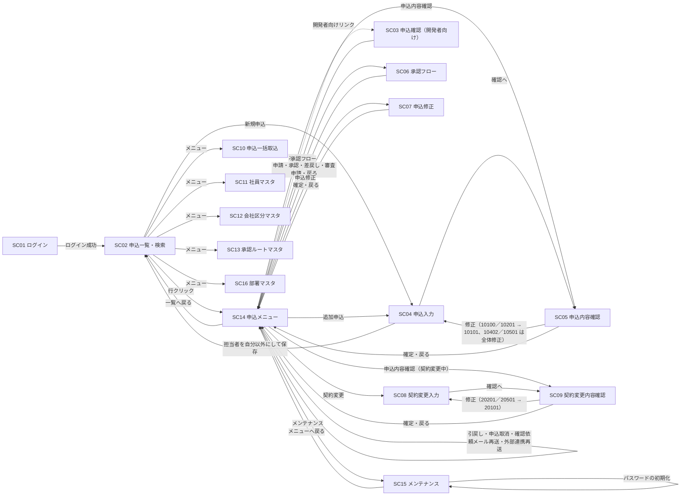
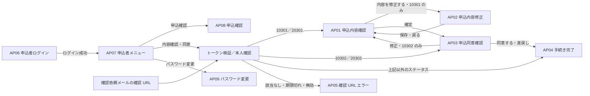

# 11. 画面設計

| 項目 | 内容 |
| --- | --- |
| 版 | 0.12（会社B だけの追加項目（SC04・SC05・SC07〜SC09・AP01・AP03・AP08）を追加、申込者向け画面に担当を出さない判定を明記。版 0.11：SC04 に申込の担当（会社 > 部署 > 担当者）、SC16 部署マスタ、SC11／SC13 の部署選択を追加。版 0.10：実装との照合：操作・戻り先を SC14 に統一、SC03 の旧ボタン表を削除、申込者ページのヘッダ・遷移、マスタ画面の一覧・入力、メッセージの発生画面を実装に合わせる。版 0.9：SC04 の申込者番号の入力と重複警告を廃止、追加申込は審査完了のときだけ） |
| 関連 | [09. 機能一覧](09-function-list.md)、[10. 機能詳細](10-function-detail.md)、[03. ステータス定義・状態遷移](03-status-transition.md)、[07. テーブル定義](07-table-definition.md)、[08. コード定義](08-code-definition.md)、[14. 共通仕様](14-common-spec.md)、[99. 未決事項](99-open-issues.md) |

画面は申込受付会社向け 16 画面（SC01〜SC16）、申込者向け 9 画面（AP01〜AP09）、共通 1 画面（CM01）の計 26 画面。画面 ID・画面名は [09. 機能一覧](09-function-list.md) に従う。外部インターフェース（IF01〜IF05）は [12. 外部インターフェース設計](12-external-interface.md) で扱い、本書の対象外とする。審査担当部門は本システムの画面を使わず、審査担当部門システムから結果を連携する（[99. 未決事項 No.3](99-open-issues.md)）。

## 1. 画面一覧

### 1.1 画面一覧

| 画面ID | 画面名 | 利用者 | 権限（ROLE_CD） | 対応機能 | URL（仮） | 備考 |
| --- | --- | --- | --- | --- | --- | --- |
| SC01 | ログイン | 申込受付会社 | 認証前 | 共通 | `/emp/login` | ログアウトは `POST /emp/logout` |
| SC02 | 申込一覧・検索 | 申込受付会社 | 01、02、09 | F02、F03（新規申込の起点）、F05（承認待ち一覧） | `/emp/applications` | 「新規申込」ボタンは担当者にだけ表示 |
| SC03 | 申込確認（開発者向け） | 申込受付会社 | 01、02、09 | 参照（F02） | `/emp/applications/{applicationId}` | 開発者向けの参照画面。SC14 末尾のリンクから開く。操作は SC14 から行う |
| SC14 | 申込メニュー | 申込受付会社 | 01、02、09 | F03、F04、F05、F06（再送）、F10、F11、F12、F16 の操作起点 | `/emp/applications/{applicationId}/menu` | 一覧で申込を選ぶと表示。申込全体の操作と、手続きごとの領域（新規申込、契約変更 N。折りたたみ可）。操作は `POST .../{applicationId}/{action}` |
| SC15 | メンテナンス | 申込受付会社 | 01（担当者）、09 | F17 | `/emp/applications/{applicationId}/maintenance` | 申込者への通知の履歴、パスワードの初期化（`POST .../maintenance/resetPassword`） |
| SC04 | 申込入力 | 担当者 | 01 | F03 | `/emp/applications/new`（新規申込）、`/emp/applications/{applicationId}/additional`（追加申込）、`/emp/applications/{applicationId}/edit`（入力・修正） | 未作成の申込と 10101 を編集。申込の担当（会社 > 部署 > 担当者）もここで選ぶ |
| SC05 | 申込内容確認 | 申込受付会社 | 01、02、09 | F03 | `/emp/applications/{applicationId}/confirm?group=N` | 全ステータスで参照可。「修正」「確定」は進行中の領域で担当者が条件を満たすときだけ活性。入力画面（SC04）へはここから進む。全体修正で変更した項目は赤字 |
| SC06 | 承認フロー | 申込受付会社 | 01、02、09 | F04、F05 | `/emp/applications/{applicationId}/approval?group=N` | 申請待ちは担当者が申請、申請中は現在ステップの承認者が操作。それ以外は参照（申請者は申請中の状況を確認できる。申請ボタンは非活性） |
| SC07 | 申込修正 | 担当者 | 01 | F10 | `/emp/applications/{applicationId}/revise` | 10402、10501、20402 |
| SC08 | 契約変更入力 | 担当者 | 01 | F12 | `/emp/applications/{applicationId}/change` | 20101 |
| SC09 | 契約変更内容確認 | 申込受付会社 | 01、02、09 | F12 | `/emp/applications/{applicationId}/change/confirm?group=N` | 契約変更の領域ごとに参照可（完了・取消した契約変更は参照のみ）。「修正」「確定」は担当者で条件を満たすときだけ活性。入力画面（SC08）へはここから進む |
| SC10 | 申込一括取込 | 担当者 | 01 | F01 | `/emp/import` | 取込結果は `/emp/import/{importBatchId}` |
| SC11 | 社員マスタ | 管理者 | 09 | F15 | `/emp/master/employees` | |
| SC12 | 会社区分マスタ | 管理者 | 09 | F15 | `/emp/master/company-divs` | |
| SC13 | 承認ルートマスタ | 管理者 | 09 | F15 | `/emp/master/approval-routes` | テンプレートと明細を同一画面で編集 |
| SC16 | 部署マスタ | 管理者 | 09 | F15 | `/emp/master/departments` | 会社区分ごとの部署。登録と、一覧内での部署名・有効フラグの更新 |
| AP01 | 申込内容確認 | 申込者 | 確認用トークン | F07 | `/consent/{token}` | 10301、20301 |
| AP02 | 申込内容修正 | 申込者 | 確認用トークン | F07 | `/consent/{token}/edit` | 10301 のみ |
| AP03 | 申込同意確認 | 申込者 | 確認用トークン | F07 | `/consent/{token}/agree` | 10302、20302 |
| AP04 | 手続き完了 | 申込者 | 確認用トークン | F07 | `/consent/{token}/complete` | |
| AP05 | 確認 URL エラー | 申込者 | なし | F07 | URL なし（トークン検証エラー時に表示） | |
| AP06 | 申込者ログイン | 申込者 | 認証前 | F17 | `/my/login` | ユーザー ID は申込者番号。ログアウトは `POST /my/logout` |
| AP07 | 申込者メニュー | 申込者 | ログイン | F17 | `/my/menu` | 「お知らせ」「メニュー」のタブ。申込が複数なら選択 |
| AP08 | 申込確認（申込者） | 申込者 | ログイン | F17 | `/my/applications/{applicationId}` | 参照のみ |
| （AP01〜AP03） | 内容確認・同意（ポータル） | 申込者 | ログイン | F07 | `/my/applications/{applicationId}/consent`（`/edit`、`/confirm`、`/agree`） | AP01〜AP03 と同じ画面をログイン済みの本人として表示 |
| AP09 | パスワード変更 | 申込者 | ログイン | F17 | `/my/password` | |
| CM01 | システムエラー | 共通 | なし | 共通 | URL なし（想定外の例外発生時に表示） | |

- `/emp/` 配下は認証 Filter でログイン済セッションを要求し、`/consent/` 配下はトークン検証だけで到達できる。`/my/` 配下は申込者のログインを要求する。申込者のブラウザからは `/consent/` と `/my/` 以外に到達できない構成とする（[02. システム構成](02-system-architecture.md)）。
- `{applicationId}` は T_APPLICATION.APPLICATION_ID、`{token}` は確認用トークンの平文（DB には SHA-256 ハッシュのみ保持）。

### 1.2 権限と参照範囲

| 権限 | 参照できる申込（SC02・SC03） | 操作 |
| --- | --- | --- |
| 01 担当者 | T_APPLICATION.OWNER_EMPLOYEE_ID = 自分 | 新規申込・追加申込、入力・修正・確定、申請（回付先の設定）、引戻し、同意後の修正・全体修正、契約変更、確認依頼メール再送、外部連携再送 |
| 02 承認者 | 自分が T_APPROVAL_STEP.APPROVER_EMPLOYEE_ID に含まれる申込、および自部署（申込の担当会社・担当部署 T_APPLICATION.COMPANY_DIV・DEPT_CD = 自分の会社区分・部署）の申込（仮） | 承認・差戻し・審査申請（現在ステップの承認者のみ） |
| 09 管理者 | 全申込 | 参照、外部連携再送、マスタメンテナンス |

参照範囲外の申込 ID を URL で直接指定した場合は権限エラー（E103）とし、SC02 へ戻す。新規申込・追加申込は担当者だけが行え、既定では入力した社員が担当社員になる。SC04 で担当者を別の担当者権限の社員にすると、保存後はその社員だけが操作・参照でき、入力した社員は開けない（E103）。

## 2. 画面遷移図

### 2.1 申込受付会社向け

- メニューは全画面のヘッダにあり、SC02・SC10〜SC13・SC16 は相互に遷移できる（図では SC02 からの矢印だけ示す）。
- 申込入力画面（SC04／SC08）へはメニューから直接進まず、SC05／SC09 の「修正」から進む。10201 → 10101 の戻しも SC05 の「修正」で行う。SC14 は申込全体の操作と手続きごとの領域（新規申込、契約変更 N）に分かれ、各領域のタイルは常に同じ並びで活性・非活性だけが変わる（4.14 節）。SC05／SC06／SC09 は `group` で領域を指定し、完了・取消した領域は参照のみ。
- すべての申込受付会社向け画面から、ログアウトとセッションタイムアウトで SC01 へ、システムエラーで CM01 へ遷移する（図では省略）。

### 2.2 申込者向け

- トークン検証は `/consent/` 配下の全リクエストで行い（[10. F07 8.3](10-function-detail.md#83-トークン検証全リクエスト共通)）、通過後に申込のステータスで表示画面を決める。
- AP07（申込者ページ）から「内容確認・同意」に進んだ場合は、同意する・差戻しの後と、期限切れ（E202）・お手続きなしのときに AP07 へ戻る（メッセージを表示）。AP04／AP05 を表示するのは確認 URL から開いたときだけ。
- 確認 URL（`/consent/`）の画面にメニューはなく、画面間の任意遷移はできない。申込者ページ（`/my/`）の画面はヘッダのメニュー・お知らせから AP07 へ戻れる。ステータスは申込者向け表示名（M_STATUS.APPLICANT_STATUS_NAME）で表示する。

## 3. 画面共通仕様

### 3.1 レイアウトとメニュー

| 領域 | 申込受付会社向け画面 | 申込者向け画面 |
| --- | --- | --- |
| ヘッダ | システム名、ログイン社員名（M_EMPLOYEE.EMPLOYEE_NAME）、権限名（ROLE_CD の名称）、会社区分名、部署名（M_DEPARTMENT.DEPT_NAME）、ログアウトボタン | 確認 URL の画面：システム名のみ。申込者ページ：システム名、申込者名（申込者番号）、ログアウトボタン |
| メニュー | 権限別に表示（下表） | 確認 URL の画面：なし。申込者ページ：「メニュー」「お知らせ」（AP07） |
| メッセージ領域 | コンテンツ上部。エラー（赤）、警告（黄）、情報（緑。一部の案内は青）を種別ごとに表示。入力エラーは該当項目の直下にも表示する | 同じ |
| フッタ | システム名、アプリケーション版数 | システム名 |

メニューは「申込一覧」（SC02、全権限）、「一括取込」（SC10、01 担当者のみ）、「社員マスタ」「会社区分マスタ」「部署マスタ」「承認ルートマスタ」（SC11／SC12／SC16／SC13、09 管理者のみ）。メニューの非表示に加え、URL 直接アクセスは認可 Filter で拒否し、E103 を表示して SC02 へ戻す。

### 3.2 一覧・書式

| 項目 | 規則 |
| --- | --- |
| ページング | 1 ページ 20 件（仮）。ページ番号リンクと総件数を表示。検索条件はページ移動時に引き継ぐ |
| 並び順 | 既定は更新日時（UPDATED_AT）の降順。並び替えはサーバ側で sort／order パラメータ（対象列はホワイトリストで固定）として受け付けるが、画面の列見出しからの並び替えは未実装 |
| 日付／日時 | yyyy/MM/dd／yyyy/MM/dd HH:mm。日付の入力も同じ書式 |
| 金額 | 円、整数、3 桁カンマ区切り。入力はカンマ許容 |
| 変更金額倍率 | 小数第 2 位まで表示（保持は小数第 4 位、切り捨て） |
| 区分値 | コードではなく名称を表示。ステータスは申込受付会社向け画面では「10101 申込入力中」のようにコード＋名称（M_STATUS.STATUS_NAME）、申込者向け画面では申込者向け表示名（APPLICANT_STATUS_NAME）だけを表示する |
| 版 | 「第 3 版（契約変更）」のように版番号＋版種別名。確定版は「確定版」、取消版は「取消」を併記する |
| 空値 | 「－」を表示（仮） |

### 3.3 更新処理の共通動作

| 項目 | 規則 |
| --- | --- |
| 二重送信防止 | 更新系は PRG パターン（POST → Redirect → GET）。送信ボタンはクリック後に無効化する（仮） |
| CSRF | セッション単位のトークンを hidden（`_csrf`、仮）に持ち、Filter で検証する。申込者向け画面も同じ |
| 楽観排他 | 画面表示時の T_APPLICATION.ROW_VERSION（マスタはその行の ROW_VERSION）を hidden で持ち回る。不一致（E102）の場合はメッセージを表示し、申込は申込メニュー（SC14）、マスタは各マスタの一覧を最新データで表示する。入力値は引き継がない |
| 遷移不可・権限エラー | E101／E103 を表示し、申込メニュー（SC14）を最新データで表示する（表示後にステータスが変わった場合など）。SC14 自体を表示できない場合（参照範囲外・存在しない申込）は SC02 へ戻す。表示制御に関わらず、サーバ側で F14 の操作主体照合（[03. 8 章](03-status-transition.md#8-操作主体と操作者の照合)）を行う |
| 確認ダイアログ | 引戻し（W002）、全体修正、契約変更手続き、確認依頼メール再送、削除の前にブラウザのダイアログで確認する（仮、[99. 未決事項 No.32](99-open-issues.md)） |
| セッションタイムアウト | 30 分（仮）。タイムアウト後のリクエストは SC01 へ遷移し、「セッションが切れました。再度ログインしてください。」を表示する。再ログイン後は SC02 へ遷移する（元の画面には戻らない、仮） |
| 処理結果 | 更新成功時はリダイレクト先に情報メッセージ（I0xx）を 1 回だけ表示する（セッションのフラッシュ属性、仮） |
| 出力エスケープ | JSP の出力は JSTL で必ずエスケープする（[14. 共通仕様 10 章](14-common-spec.md#10-セキュリティ)） |

## 4. 画面別設計（申込受付会社向け）

### 4.1 SC01 ログイン

**概要**：社員番号とパスワードで申込受付会社の社員を認証し、セッションを開始する（[10. 19 章](10-function-detail.md#19-ログインログアウト共通)）。

**利用者・権限**：全社員（認証前）。ログイン済でアクセスした場合は SC02 へリダイレクトする。

**表示項目**：システム名、メッセージ領域のみ。

**入力項目**：社員番号（M_EMPLOYEE.EMPLOYEE_NO、文字列 10 桁）、パスワード（文字列 64 桁（仮）。マスク表示とし、エラー時も値を保持しない）。未入力・桁超過を含め、認証できない場合は一律 E106 とする（項目ごとの入力チェックは行わない）。

**操作**：「ログイン」で M_EMPLOYEE を EMPLOYEE_NO で検索し、VALID_FLG = 1 かつ PASSWORD_HASH と一致すれば成功。セッションを再生成し、社員 ID・権限・会社区分・部署を保持して SC02 へ遷移する（操作コードなし）。

**備考**：失敗時は E106 とし、社員番号の存在有無を区別しない。連続 5 回（仮）失敗でロックし、E107 を表示する。ロック状態の保持（M_EMPLOYEE への列追加を想定）と解除手段は [99. 未決事項 No.30](99-open-issues.md)。

### 4.2 SC02 申込一覧・検索

**概要**：申込を検索して一覧表示し、申込メニュー（SC14）へ遷移する。「自分の操作待ちのみ」で担当者・承認者の作業一覧として使う。担当者の新規申込の起点でもある。

**利用者・権限**：01、02、09。1.2 節の参照範囲を検索条件に加えて必ず適用する。

**表示項目（一覧の列）**

| 項目名 | 参照元 | 書式 |
| --- | --- | --- |
| 申込番号 | T_APPLICATION.APPLICATION_NO | リンク。クリックで SC14（申込メニュー）へ |
| 申込者名／申込者番号 | T_APPLICATION_VERSION.APPLICANT_NAME（現行版）／M_APPLICANT_ACCOUNT.APPLICANT_NO | 申込者番号はアカウント発行後のみ小さく表示 |
| ステータス | M_STATUS.STATUS_NAME（T_APPLICATION.STATUS_CD） | コード＋名称 |
| 申込金額合計（現行版） | T_APPLICATION_VERSION.TOTAL_AMOUNT（VERSION_NO = CURRENT_VERSION_NO） | 3 桁カンマ、右寄せ |
| 担当社員 | M_EMPLOYEE.EMPLOYEE_NAME（OWNER_EMPLOYEE_ID） | |
| 登録区分 | T_APPLICATION.REGISTRATION_TYPE の名称 | 一括取込／画面入力／追加申込 |
| 更新日時 | T_APPLICATION.UPDATED_AT | yyyy/MM/dd HH:mm |

**入力項目（検索条件）**

| 項目名 | 型 | 桁 | 必須 | チェック内容・検索方法 |
| --- | --- | --- | --- | --- |
| 申込番号 | 文字列 | 12 | | 前方一致（T_APPLICATION.APPLICATION_NO） |
| 申込者番号／申込者名 | 文字列 | 12／100 | | 申込者番号は完全一致（M_APPLICANT_ACCOUNT）、申込者名は部分一致（現行版の APPLICANT_NAME） |
| ステータス | 複数選択 | | | 大分類（新規申込／契約変更）、中分類（入力中〜審査完了）、個別ステータスの 3 段で指定。M_STATUS を DISPLAY_ORDER 順に列挙。未選択は全ステータス |
| 担当社員 | 選択 | | | VALID_FLG = 1 の社員。担当者は自分で固定（変更不可） |
| 登録日 From／To | 日付 | 10 | | yyyy/MM/dd、From ≦ To（E007）。T_APPLICATION.CREATED_AT の日付部分で範囲検索 |
| 自分の操作待ちのみ | チェック | | | 下表の条件で絞る。管理者には表示しない |

| 権限 | 「自分の操作待ち」の判定 |
| --- | --- |
| 01 担当者 | T_APPLICATION.OWNER_EMPLOYEE_ID = ログイン社員 かつ STATUS_CD の操作主体が 1（担当者）のステータス（10100、10101、10201、10402、10501、10701、20101、20201、20402、20501、20701） |
| 02 承認者 | T_APPROVAL_REQUEST.REQUEST_STATUS = 1（申請中）の承認申請について、T_APPROVAL_STEP.STEP_NO = CURRENT_STEP_NO の行の APPROVER_EMPLOYEE_ID = ログイン社員 |

**操作**

| ボタン名 | 処理内容 | 遷移先 | 操作コード |
| --- | --- | --- | --- |
| 検索／クリア | 条件で検索して 1 ページ目を表示する（GET、条件は URL パラメータ）／条件を外して全件を表示する（「自分の操作待ちのみ」も外れる） | SC02 | なし |
| 新規申込 | SC04 を新規申込モードで開く。担当者にだけ表示 | SC04 | なし（作成は SC04 側） |
| 行クリック（申込番号リンク） | 申込メニューを表示する | SC14 | なし |

**備考**：初期表示は担当者・承認者は「自分の操作待ちのみ」をチェック済で検索した状態、管理者は全件を更新日時降順とする。一覧に承認・差戻しのボタンは置かず、操作は SC14（と SC14 から開く SC05〜SC09）で行う。

### 4.3 SC03 申込確認（開発者向け）

**概要**：申込の全情報（基本情報、現行版の申込内容と基準版との差分、版履歴、承認状況、申込者同意、外部連携、ステータス履歴）を表示する参照画面。開発・保守時の確認用（開発者向け）とし、SC14 末尾の小さなリンクから開く。操作は申込メニュー（SC14、4.14 節）から行い、本画面には「申込メニューへ」「一覧へ戻る」だけを置く。

**利用者・権限**：01、02、09（参照範囲は 1.2 節）。本画面に操作ボタンはない（「申込メニューへ」「一覧へ戻る」のリンクだけ。操作の活性条件は 4.14 節）。

**表示項目**

| 区分 | 項目名 | 参照元 | 書式・備考 |
| --- | --- | --- | --- |
| 申込基本情報 | 申込番号、申込者名（申込者番号）、担当社員 | T_APPLICATION.APPLICATION_NO、T_APPLICATION_VERSION.APPLICANT_NAME（現行版）、M_APPLICANT_ACCOUNT.APPLICANT_NO、M_EMPLOYEE.EMPLOYEE_NAME（OWNER_EMPLOYEE_ID） | アカウント未発行は「アカウント未発行」 |
| | 会社区分／部署コード、ステータス | M_COMPANY_DIV.COMPANY_DIV_NAME／T_APPLICATION.DEPT_CD、M_STATUS.STATUS_NAME | ステータスはコード＋名称で強調表示 |
| | 登録区分、追加申込元申込番号、取込 ID | T_APPLICATION.REGISTRATION_TYPE、SOURCE_APPLICATION_ID（元の申込の APPLICATION_NO をリンク表示）、IMPORT_BATCH_ID | 該当しない場合は「－」 |
| | 現行版番号／基準版番号／審査完了版番号、審査完了日時／更新日時 | T_APPLICATION.CURRENT_VERSION_NO／BASE_VERSION_NO／REVIEWED_VERSION_NO、REVIEWED_AT／UPDATED_AT | 未設定は「－」 |
| 申込内容（現行版） | 版番号／版種別／複写元版番号、商品コード、基本料金・オプション料金・事務手数料・申込金額合計、契約開始日／契約終了日、備考、確定日時、確定版フラグ | T_APPLICATION_VERSION.VERSION_NO／VERSION_TYPE／COPIED_FROM_VERSION_NO、PRODUCT_CD、BASIC_FEE・OPTION_FEE・HANDLING_FEE／TOTAL_AMOUNT、CONTRACT_START_DATE／CONTRACT_END_DATE、REMARKS、CONFIRMED_AT、FIXED_FLG | 備考は改行を保持。確定版は「確定版」と表示 |
| | 変更金額倍率 | T_APPLICATION_VERSION.AMOUNT_RATIO | 設定されている版のみ表示 |
| 差分表示 | 基準版の同項目 | T_APPLICATION_VERSION（VERSION_NO = BASE_VERSION_NO） | 基準版があり、現行版と版番号が異なるとき、現行版と並べて値が異なる項目を強調 |
| 版履歴 | 全版の一覧 | T_APPLICATION_VERSION：VERSION_NO、VERSION_TYPE、COPIED_FROM_VERSION_NO、BASIC_FEE・OPTION_FEE・HANDLING_FEE／TOTAL_AMOUNT、CONFIRMED_AT、FIXED_FLG、CANCELED_FLG | 版番号の降順。取消版は「取消」と表示し参照のみ（[99. 未決事項 No.20](99-open-issues.md)） |
| 承認状況 | 承認申請の一覧 | T_APPROVAL_REQUEST：VERSION_NO、APPROVAL_TYPE、ROUTE_ID（M_APPROVAL_ROUTE.ROUTE_NAME）、REQUEST_EMPLOYEE_ID（氏名）、REQUESTED_AT、REQUEST_STATUS、CURRENT_STEP_NO／FINAL_STEP_NO、COMPLETED_AT | 申請日時の降順 |
| | 各申請の承認明細 | T_APPROVAL_STEP：STEP_NO、APPROVER_EMPLOYEE_ID（氏名）、RESULT_CD、COMMENT、ACTED_AT | 申請中の現在ステップ行を強調。差戻しコメントはここで確認する |
| 申込者同意 | 同意の一覧 | T_APPLICANT_CONSENT：VERSION_NO、CONSENT_TYPE、CONSENT_STATUS、TOKEN_EXPIRES_AT、CONTENT_CONFIRMED_AT、CONSENTED_AT、RETURNED_AT、RETURN_REASON | トークンは表示しない。申込者の差戻し理由は RETURN_REASON |
| 外部連携 | 連携の一覧 | T_EXTERNAL_LINK：VERSION_NO、LINK_TYPE、SEND_STATUS、RETRY_COUNT、SENT_AT、EXTERNAL_RECEIPT_NO、RESULT_CD、RESULT_RECEIVED_AT、RESULT_REASON、ERROR_MESSAGE | 送信エラー行を強調。指摘内容・審査差戻し理由は RESULT_REASON |
| ステータス履歴 | 履歴の一覧 | T_STATUS_HISTORY：CHANGED_AT、FROM_STATUS_CD、TO_STATUS_CD、ACTION_CD、ACTOR_TYPE、ACTOR_ID（氏名等）、COMMENT、VERSION_NO、TRANSITION_ID | 変更日時の降順 |

差分表示の比較元は基準版（T_APPLICATION.BASE_VERSION_NO）で統一する。契約変更（版種別 3）では契約変更手続きの開始時に基準版 = 審査完了版になるため、審査完了版との比較になる。第 1 版（版種別 1）で同意前、または同意直後のように基準版 = 現行版のときは差分を表示しない。

**入力項目**：なし。承認者のコメントは SC06 で入力する。

旧版にあったステータス×権限別のボタン制御と操作の表は、操作を申込メニューに集約したため 4.14 節（SC14）に一本化した。

### 4.4 SC04 申込入力

**概要**：新規申込・追加申込の作成、一括取込した申込の補正、入力中の修正、全体修正後の再入力を行う（F03）。申込者情報（申込者名、カナ、メールアドレス、電話番号、住所）は申込データとして申込内容と一緒に入力する。新規申込は同じ氏名・メールアドレスの申込があっても別の申込者として扱い、申込者アカウント（ログイン用）は一次承認が通ったときに発行する。同じ申込者の申込は追加申込で作り、元の申込のアカウントを引き継ぐ（[10. 18 章](10-function-detail.md#18-申込者情報と申込者アカウント)）。確定は SC05 で行い、本画面はステータスを遷移させない（申込の作成を除く）。

**利用者・権限**：01 担当者（作成済みの申込は担当社員のみ）。他権限は SC04 に到達できない。

**モード**

| モード | 起点 | 対象 | 初期表示 | 申込の作成 |
| --- | --- | --- | --- | --- |
| 新規申込 | SC02「新規申込」 | 未作成 | 空 | 最初の一時保存／確認へで作成（登録区分 2）。申込者アカウントは未発行 |
| 追加申込 | SC14「追加申込」（元の申込が 10701／20701 のときだけ。それ以外は E101） | 未作成 | 元の申込の現行版の申込内容（申込者情報を含む）を複写。複写した値はこの申込のデータで、申込者情報も変更できる（元の申込は変わらない）。申込者アカウントは元の申込のものを引き継ぐ（変更不可） | 最初の一時保存／確認へで作成（登録区分 3、追加申込元申込 ID = 元の申込） |
| 入力・修正 | SC05「修正」（10101 はそのまま、10100／10201 → 10101、10402／10501 → 10101 の全体修正） | 10101 | 現行版の内容 | 作成済み |

**表示項目**：申込番号・ステータス・入力者（ログイン社員）（見出し。未作成のときは「（未採番）」）、申込者アカウント欄（入力欄はない。新規申込・未発行は一次承認で発行する旨の案内、発行済みは申込者番号、追加申込は引き継ぐアカウントの申込者番号を表示）、追加申込元申込番号（T_APPLICATION.SOURCE_APPLICATION_ID。追加申込のみ）、版番号／版種別／複写元版番号（T_APPLICATION_VERSION。全体修正後は版種別 2 と複写元を表示）。

**入力項目**

| 項目名 | 型 | 桁 | 必須 | チェック内容 |
| --- | --- | --- | --- | --- |
| 担当：会社（COMPANY_DIV） | 選択 | 1 | ○ | 会社区分マスタから選択（E011）。既定は新規申込：ログイン社員の会社区分、追加申込：元の申込の担当会社、それ以外：現在の値 |
| 担当：部署（DEPT_CD） | 選択 | 10 | ○ | 選んだ会社の有効な部署（M_DEPARTMENT）から選択。会社を変えると選択肢を絞り込む。現在の値のまま保存する場合を除き無効な部署は不可（E011）。担当者の所属部署と異なってよい。既定は新規申込：ログイン社員の所属部署 |
| 担当：担当者（OWNER_EMPLOYEE_ID） | 選択 | 10 | ○ | 選んだ会社の有効な担当者権限（01）の社員から選択（E012）。選択肢は「氏名（所属部署名）」、自分には「※自分」を付ける。既定はログイン社員（修正・再入力は現在の値） |
| 申込者名（APPLICANT_NAME） | 文字列 | 100 | ○（確認へ） | 制御文字不可。一時保存では必須チェックしない |
| 申込者名カナ（APPLICANT_KANA） | 文字列 | 100 | | 全角カタカナ・スペース |
| 電話番号（TEL_NO） | 文字列 | 15 | | 数字とハイフン |
| メールアドレス（MAIL_ADDRESS） | 文字列 | 254 | ○（確認へ） | 形式チェック。他の申込との重複は確認しない（新規申込は常に別の申込者） |
| 住所（ADDRESS） | 文字列 | 200 | | 制御文字不可 |
| 商品コード（PRODUCT_CD） | 文字列 | 10 | ○ | 半角英数字（仮。商品マスタは持たないため存在チェックなし） |
| 基本料金（BASIC_FEE） | 数値 | 13 | ○ | 整数、カンマ許容、0 以上。金額項目の名称・個数はサンプル（業務確認済み） |
| オプション料金（OPTION_FEE） | 数値 | 13 | | 整数、カンマ許容、0 以上。未入力は 0 |
| 事務手数料（HANDLING_FEE） | 数値 | 13 | | 整数、カンマ許容、0 以上。未入力は 0 |
| 申込金額合計（TOTAL_AMOUNT） | 数値 | 13 | （自動） | 基本料金・オプション料金・事務手数料 の合計。画面側で再計算して表示し、保存時にサーバ側で計算する。0 より大きいこと（E005） |
| 契約開始日（CONTRACT_START_DATE） | 日付 | 10 | | yyyy/MM/dd、実在する日付 |
| 契約終了日（CONTRACT_END_DATE） | 日付 | 10 | | yyyy/MM/dd、実在する日付、契約開始日 ≦ 契約終了日（E004） |
| 備考（REMARKS） | 文字列 | 1000 | | 改行・タブ以外の制御文字不可 |
| 会社B 追加項目：法人番号（CORPORATE_NO） | 文字列 | 13 | | 担当会社が会社B（会社区分 2）のときだけ表示・送信する。入力があれば半角数字 13 桁（E003）。項目名・桁はサンプル |
| 会社B 追加項目：設置場所（INSTALL_PLACE） | 文字列 | 200 | | 同上。制御文字不可 |
| 会社B 追加項目：窓口メモ（CONTACT_MEMO） | 文字列 | 500 | | 同上。改行・タブ以外の制御文字不可 |
| hidden：ROW_VERSION、CSRF トークン | | | | 申込 ID・追加申込元申込 ID・モードは URL パスで指定し、モードはサーバ側でもステータスから再判定する |

**操作**

| ボタン名 | 表示条件 | 処理内容 | 遷移先 | 操作コード |
| --- | --- | --- | --- | --- |
| 一時保存 | 全モード | 桁・書式チェックのみ行う（必須・相関は確認へで行う、仮）。未作成なら申込（申込番号を採番、ステータス 10101、現行版番号 1、会社区分・部署・担当社員 = 担当欄の値）、第 1 版（版種別 1）、ステータス履歴（遷移元なし、遷移先 10101、操作コード 00）を登録する。作成済みなら現行版と担当を更新する（遷移・履歴なし） | SC04（再表示、I012）。担当者を自分以外にした場合は SC02（I020） | 00（作成時のみ。履歴に記録） |
| 確認へ | 全モード | 必須・型・桁・書式・相関・申込金額合計 > 0 のチェック後、一時保存と同じ登録または更新を行い、SC05 を表示する | SC05。担当者を自分以外にした場合は SC02（I020） | 00（作成時のみ） |
| 戻る | 全モード | 保存せずに戻る | SC14（作成済み）／SC02（新規申込）／元の申込の SC14（追加申込） | なし |

**備考**：担当（会社 > 部署 > 担当者）を変更できるのは本画面（入力中）だけで、SC07・SC08 などでは見出しに参照表示する（[10. 4.6 節](10-function-detail.md#46-申込の担当会社--部署--担当者)）。担当者を自分以外にして保存するときは「担当者を「氏名」にします。保存後、この申込は担当者だけが操作でき、あなたは開けなくなります。よろしいですか？」の確認ダイアログを出し、保存後は I020 を表示して SC02 へ戻る。申込者情報と担当は版ごとに持つため、全体修正後の再入力で変えた申込者情報・担当は SC05 で赤字になる。会社B の追加項目欄（法人番号・設置場所・窓口メモ）は担当会社の選択に合わせて表示・非表示を切り替え、非表示のときは送信しない。項目を使った制御はない（[10. 4.7 節](10-function-detail.md#47-会社b-だけの追加項目)）。申込者の関与後に申込者情報だけを変える専用の画面は持たない（全体修正・契約変更で変更する）。10100（一括取込済）は SC04 で直接開かず、SC05 の「修正」で 10101 へ遷移してから開く。全体修正で 10101 へ戻った申込は版種別 2 の新しい版を編集し、以降は新規申込と同じ流れ（SC05 の確定 → 10201）になる。

### 4.5 SC05 申込内容確認

**概要**：申込内容を確認する画面。進行中の新規申込では現行版を表示し、入力中・申請待ちでは「修正」で申込入力（SC04）へ進み、「確定」で一次承認申請待ち（10201）へ進める。一括取込した申込の補正の起点にもなる。申込入力画面へはメニューから直接進まず、必ずこの画面の「修正」から進む。契約変更後に SC14 の「新規申込」領域から開いたとき（`?group=0`）は新規申込の最終版を参照のみで表示する。表示する版が全体修正で作った版（版種別 2）のときは、複写元の版と異なる項目を**赤字**で表示し、凡例に複写元の版番号を示す。

**利用者・権限**：申込を参照できる利用者（01、02、09）は全ステータス（新規申込フロー 1xxxx と 90101。契約変更中は SC09）で開ける。「修正」「確定」は常に表示し、申込の担当社員（01）で条件を満たすときだけ活性にする（押せない理由を添える）。

**対象ステータスと操作**

| ステータス | 起点 | 修正（操作コード 01） | 確定（操作コード 02） |
| --- | --- | --- | --- |
| 10100 一括取込済 | SC14「申込内容確認」 | F14 を操作コード 01 で呼ぶ（→ 10101、遷移 ID 1）。続けて SC04 を開く | 入力チェック後、確定日時を設定し F14 を操作コード 02 で呼ぶ（→ 10201、遷移 ID 2）。入力チェックエラーは E001〜E005 を表示し確定不可 |
| 10101 申込入力中 | SC04「確認へ」、SC14「申込内容確認」 | 遷移なし。SC04 を開く | 同上（→ 10201、遷移 ID 3） |
| 10201 一次承認申請待ち | SC14「申込内容確認」 | F14 を操作コード 01 で呼ぶ（→ 10101、遷移 ID 4）。続けて SC04 を開く | 非活性（確定済み） |
| 10402 修正対応待ち／10501 最終承認申請待ち | SC14「申込内容確認」 | 「修正（全体修正）」：確認ダイアログの後、F14 を操作コード 01 で呼ぶ（→ 10101、遷移 ID 20／22）。後続処理で確定版を複写した版（版種別 2）が作られ、進行中の申込者同意は無効になる。続けて SC04 を開く | 非活性 |
| 上記以外 | SC14「申込内容確認」 | 非活性（承認申請中・申込者確認中・事前確認待ち・審査中は修正不可。10701 は「契約変更」から、90101 は取消済み） | 非活性 |

「メニューへ戻る」は全ステータスで表示し、保存せずに SC14 へ戻る。

**表示項目**：申込番号・ステータス・担当社員・登録区分、申込者アカウント（申込者番号。未発行は「一次承認で発行」）と宛先（現行版のメールアドレス）、担当（会社・部署（部署名と部署コード）・担当者。現行版の値）、会社B の追加項目（担当会社が会社B の版だけ）、申込者情報（申込者名・カナ、電話番号、メールアドレス、住所。現行版の申込データ。確認依頼メールとアカウント通知の宛先を担当者が確定前に確認できるようにする）、現行版の版番号／版種別、商品コード、基本料金・オプション料金・事務手数料・申込金額合計、契約開始日／契約終了日、備考。

**入力項目**：hidden（ROW_VERSION、CSRF トークン）のみ。確定時の入力チェック（必須、型・桁、書式、契約開始日 ≦ 契約終了日、申込金額合計 > 0）でエラーがあれば SC05 の上部にエラーの一覧を表示し、「修正」を促す。

**備考**：10100 の確定は 10101 を経由せず 10201 へ直接遷移する（[99. 未決事項 D7](99-open-issues.md)）。確定後の修正は SC05 の「修正」（10201 → 10101）で行う。

### 4.6 SC06 承認フロー

**概要**：申請待ちでは担当者が回付先（承認者と順序）を設定して申請する（F04）。申請中では現在ステップの承認者が承認・差戻し・審査申請を行う（F05）。4 つの承認種別で同じ画面を使う。

**利用者・権限**：申請待ちは 01 担当者（申込の担当社員のみ）が申請、申請中は 02 承認者（現在ステップの承認者のみ）が操作。それ以外（申請した担当者、現在ステップ以外の承認者、管理者、申請待ち・申請中以外のステータス）は参照モードで開け、承認申請の状況と承認・申請履歴を確認できる。`group` で SC14 の領域（新規申込、契約変更 N）を指定し、承認・申請履歴はその領域の版に対するものだけを表示する。完了・取消した領域は参照モードで、申込内容はその領域の最終版を表示する。参照モードでは申請・承認・差戻しのボタンを非活性で表示し、理由を添える。申請中の申請者は引戻しできない。承認種別とモードはステータスから決める。

| ステータス | 承認種別 | モード | 操作できる利用者 | 最終承認者の操作 |
| --- | --- | --- | --- | --- |
| 10201／20201 | 01 一次承認／03 契約変更一次承認 | 申請待ち | 担当者 | － |
| 10501／20501 | 02 最終承認／04 契約変更最終承認 | 申請待ち | 担当者 | － |
| 10202／20202 | 01／03 | 申請中 | 現在ステップの承認者 | 承認（→ 10301／20301） |
| 10502／20502 | 02／04 | 申請中 | 現在ステップの承認者 | 審査申請（→ 10601／20601） |
| 10202／10502／20202／20502 | 01〜04 | 参照（申請者） | 申請した担当者。回付先と各ステップの結果を確認できる。申請ボタンは非活性、引戻し不可 | － |
| 上記以外 | 直近の申請の承認種別 | 参照 | 申込を参照できる利用者。進行中の申請はなく、承認・申請履歴だけ表示 | － |

**表示項目**

| 区分 | 項目名 | 参照元 | 書式・備考 |
| --- | --- | --- | --- |
| 共通 | 申込番号、申込者名、ステータス、担当社員、承認種別 | T_APPLICATION、T_APPLICATION_VERSION（現行版の APPLICANT_NAME）、M_STATUS、M_EMPLOYEE | 承認種別は名称を表示 |
| | 申込内容（現行版）：版番号／版種別、商品コード、基本料金・オプション料金・事務手数料・申込金額合計、契約開始日／契約終了日、備考 | T_APPLICATION_VERSION | 基準版があれば差分を併記（SC03 と同じ規則） |
| 申請待ち | テンプレート名、適用開始日 | M_APPROVAL_ROUTE.ROUTE_NAME、VALID_FROM | 申込の会社区分・部署・承認種別で、適用期間に当日を含むテンプレートを検索し、適用開始日が最も新しいものを採用。該当なしは「（テンプレートなし）」 |
| | 回付先一覧：ステップ番号、承認者氏名、部署コード | 画面内の編集状態（初期値はテンプレートの M_APPROVAL_ROUTE_STEP） | 並び順がステップ番号。最終行が最終承認者 |
| | 承認者候補 | M_EMPLOYEE（VALID_FLG = 1、ROLE_CD = 02、COMPANY_DIV = 申込の会社区分） | 行追加時の選択肢 |
| 申請中 | 承認申請：申請社員、申請日時、現在ステップ／最終ステップ | T_APPROVAL_REQUEST | |
| | 承認明細一覧：ステップ番号、承認者氏名、結果、コメント、処理日時 | T_APPROVAL_STEP：STEP_NO、APPROVER_EMPLOYEE_ID、RESULT_CD、COMMENT、ACTED_AT | 現在ステップ行を強調 |
| 共通 | 承認・申請履歴：日時、操作（申請／承認／差戻し／審査申請）、操作者、対象版、結果・コメント | T_APPROVAL_REQUEST（申請 1 回 = 1 行）と T_APPROVAL_STEP（結果が未処理以外の明細 = 1 行）を申請日時の降順、明細はステップ順に並べる | この申込の全申請を表示する。差戻しで終了した申請の未処理ステップは「差戻しにより終了」、申請中の現在ステップは「操作待ち」と表示する。審査担当部門の結果は含めない（SC03 の外部連携・ステータス履歴で確認する。[99. 未決事項 No.41〜44](99-open-issues.md)） |

**入力項目**：回付先（承認者社員 ID、複数行、最大 5 ステップ（超過は E112）。初期値は前回の申請の回付先（同じ申込・同じ承認種別 → 担当者の前回 → テンプレート の順。[10. F04 5.2](10-function-detail.md#52-処理手順)）。候補外（無効、権限 02 以外、会社区分不一致）は E108。同じ社員の重複不可（仮）。最終承認（02／04）は 1 人以上必須で、0 人は E109。一次承認（01／03）は 0 人（回付先なし）でも申請できる）、コメント（T_APPROVAL_STEP.COMMENT、文字列 500 桁。申請中モードで現在ステップの承認者にだけ表示。差戻し時は必須、承認・審査申請は任意）。hidden：申込 ID、ROW_VERSION、承認申請 ID、ルート ID（テンプレート）、CSRF トークン。

**操作**

| ボタン名 | 表示条件 | 処理内容 | 遷移先 | 操作コード |
| --- | --- | --- | --- | --- |
| 行追加／行削除／上へ／下へ | 申請待ち | 画面内で回付先を編集し、ステップ番号を 1 から振り直す（仮、[99. 未決事項 No.10](99-open-issues.md)） | SC06 | なし |
| テンプレートに戻す | 申請待ち | 回付先をテンプレートの初期値に戻す | SC06 | なし |
| 申請 | 申請待ち | F04 5.2。操作者が担当社員であることを確認する。回付先あり：承認申請（申請状態 1、現在ステップ 1、最終ステップ = 人数、ルート ID = テンプレートを使った場合）と承認明細（結果 0）を登録し、F14 を操作コード 03・経路情報 = 回付先ありで呼ぶ（→ 申請中）。回付先なし（01／03 のみ）：承認済の承認申請を登録し、F14 を操作コード 03・経路情報 = 回付先なしで呼ぶ（→ 10301／20301） | SC14（I002） | 03 |
| 承認 | 申請中。01／03 の全ステップ、02／04 の最終ステップ以外 | F05 6.2。現在ステップの承認明細を結果 1 で更新する。最終ステップでなければ現在ステップを +1 し、次の承認者へ通知 02 を登録する（ステータスは変えず、F14 は呼ばない）。01／03 の最終承認者は承認申請を承認済にし、F14 を操作コード 04 で呼ぶ（→ 10301／20301） | SC14（I003） | 04（最終承認者のみ） |
| 審査申請 | 申請中。02／04 の最終ステップ | F05 6.4。承認明細を結果 3、承認申請を承認済にし、F14 を操作コード 09 で呼ぶ（→ 10601／20601）。後続処理で審査依頼の外部連携が登録される | SC14（I002） | 09 |
| 差戻し | 申請中 | F05 6.3。コメント未入力は E105。承認明細を結果 2、承認申請を差戻し（申請状態 3）にし、F14 を操作コード 05・コメント = 差戻し理由で呼ぶ（→ 申請待ち）。後続処理で申請社員へ通知 03 が登録される | SC14（I004） | 05 |
| メニューへ戻る | 全モード | SC14 へ戻る | SC14 | なし |

**備考**

- 最終承認者以外の承認はステータスを変えない（[99. 未決事項 D5](99-open-issues.md)）。最終承認は回付先なしで申請できない（[99. 未決事項 No.4](99-open-issues.md)）。
- 申請中モードでは、現在ステップの承認者以外（回付先の他の承認者、担当者、管理者）は参照のみとし、コメント欄は表示しない。ボタンは非活性で表示して押せない理由を添える（管理者は理由のみ）。
- 差戻し後の再申請は新しい承認申請を作る。前回の差戻しコメントは SC06 の承認・申請履歴で確認する。
- 回付先に無効な社員が含まれる状態で申請した場合はサーバ側で E108 とする。進行中の承認申請の承認者が無効化されても申請には影響しない（[99. 未決事項 No.23](99-open-issues.md)）。

### 4.7 SC07 申込修正

**概要**：申込者の同意後に担当者が申込内容を修正し、確定時に現行版（確定版）を複写した新しい版を作って、変更基準で遷移先を決める（F10）。

**利用者・権限**：申込を参照できる利用者（01、02、09）。「修正」「確定」は申込の担当社員だけ活性。

**対象ステータスと確定時の遷移**

| ステータス | 起点 | 作る版の版種別 | 変更基準超（条件 21） | 変更基準内（既定） | 変更がないとき |
| --- | --- | --- | --- | --- | --- |
| 10402 修正対応待ち | SC14「申込修正」 | 2 | 10201 一次承認申請待ち（遷移 ID 18） | 10401 事前確認待ち（19）。事前確認依頼を再登録 | 確定可（事前確認の再依頼。[99. 未決事項 No.19](99-open-issues.md)） |
| 10501 最終承認申請待ち | SC14「申込修正」 | 2 | 10201 一次承認申請待ち（23） | 10501 のまま（24）。新しい版を作り履歴に記録 | E104 |
| 20402 【契約変更】修正対応待ち | SC14「申込修正」 | 4 | 20201 【契約変更】一次承認申請待ち（46） | 20401 【契約変更】事前確認待ち（47）。事前確認依頼を再登録 | 確定可（事前確認の再依頼） |

**表示項目**

| 項目名 | 参照元 | 書式・備考 |
| --- | --- | --- |
| 指摘内容、結果受信日時 | 現行版の T_EXTERNAL_LINK のうち RESULT_CD = 2（修正必要）の直近行の RESULT_REASON、RESULT_RECEIVED_AT | 10402／20402 のみ。画面上部に表示 |
| 申込番号、ステータス、担当（会社 ／ 部署 ／ 担当者。参照のみ）、申込者名（申込者番号） | T_APPLICATION、M_STATUS、M_COMPANY_DIV、M_DEPARTMENT、M_EMPLOYEE、T_APPLICATION_VERSION（現行版）、M_APPLICANT_ACCOUNT | 見出しに表示。アカウント未発行は「アカウント未発行」 |
| 現行版の版番号／版種別、作成する版番号 | T_APPLICATION_VERSION.VERSION_NO／VERSION_TYPE、CURRENT_VERSION_NO + 1 | 「確定時に第 n 版を作成する」旨を表示 |
| 基準版の各項目 | T_APPLICATION_VERSION（VERSION_NO = BASE_VERSION_NO）の申込者情報、商品コード、基本料金・オプション料金・事務手数料・申込金額合計、契約開始日／契約終了日、備考 | 入力欄の下に「比較元」として表示する（差分の強調はしない） |
| 基準版の申込金額合計、金額倍率しきい値 | 同上、M_COMPANY_DIV.AMOUNT_RATIO_LIMIT（申込の会社区分） | |
| 変更金額倍率（参考値） | 申込金額合計 ÷ 基準版の申込金額合計 | 入力中に画面側で再計算して小数第 2 位まで表示。判定はサーバ側で行う |

**入力項目**：10402／20402 では申込者情報（申込者名、カナ、電話番号、メールアドレス、住所）、商品コード、基本料金・オプション料金・事務手数料、契約開始日、契約終了日、備考（型・桁・チェックは SC04 と同じ）。10501（一部修正）では基本料金・オプション料金・事務手数料 だけを入力でき、他の項目は表示のみ（業務確認済み）。申込金額合計は自動計算。hidden：申込 ID、現行版番号、ROW_VERSION、CSRF トークン。会社B の申込では追加項目（法人番号・設置場所・窓口メモ）も入力欄を出す（10501 は参照のみ）。

**操作**

| ボタン名 | 処理内容 | 遷移先 | 操作コード |
| --- | --- | --- | --- |
| 確定 | F10 11.3。入力チェック後、現行版の保存値と入力値の全項目を比較して変更の有無を判定する。変更あり：新しい版（版番号 = 現行版番号 + 1、版種別 2／4、複写元 = 現行版、確定日時、申込金額合計 = 基本料金・オプション料金・事務手数料 の合計、変更金額倍率 = 申込金額合計 ÷ 基準版の申込金額合計（小数第 4 位切り捨て）、確定版フラグ 0）を登録し、現行版番号を更新して F14 を操作コード 02 で呼ぶ。変更なし：10501 は E104、10402／20402 は版を作らず F14 を操作コード 02 で呼ぶ（変更基準内として扱う、仮） | SC14（I005。基準超のときは W001 も表示） | 02 |
| 戻る | 保存せずに SC14 へ戻る | SC14 | なし |

**備考**：変更金額倍率がしきい値以上の場合は、画面側の参考表示でも W001 を表示する。減額は常に基準内。確定版を直接変更しないため一時保存はない。申込内容全体を作り直す場合は SC05 の「修正（全体修正）」（10402／10501）で入力中へ戻す。変更基準超で一次承認申請待ちへ戻った場合は、一次承認と申込者確認からやり直し、申込者が再び同意した時点で基準版が更新される。

### 4.8 SC08 契約変更入力

**概要**：契約変更手続きで作られた版（版種別 3、審査完了版の複写）に契約変更内容を入力する（F12）。確定は SC09 で行う。

**利用者・権限**：01 担当者（申込の担当社員のみ）。対象ステータスは 20101。

**起点**：SC14「契約変更」（10701／20701 → 20101）、SC09「修正」（20101 はそのまま、20201／20501 → 20101）。いずれも現行版（版種別 3、未同意）をそのまま更新する。

**表示項目**：申込番号・ステータス・担当（会社 ／ 部署 ／ 担当者。契約変更では変更できないため参照のみ）・申込者番号／申込者名（見出し）、版番号／版種別／複写元版番号（複写元 = 審査完了版）、変更前（審査完了版 = REVIEWED_VERSION_NO）の各項目（入力欄の下に「比較元」として表示する。差分の強調はしない。契約変更中は基準版 = 審査完了版）、基準版の申込金額・金額倍率しきい値（M_COMPANY_DIV.AMOUNT_RATIO_LIMIT）・変更金額倍率（参考値。SC07 と同じ。基準超なら W001 を参考表示）。会社B の申込では申込内容の入力欄に追加項目（法人番号・設置場所・窓口メモ）を含める。

**入力項目**：申込者情報（申込者名、カナ、電話番号、メールアドレス、住所）、商品コード、基本料金・オプション料金・事務手数料・申込金額合計、契約開始日、契約終了日、備考（SC04 と同じ）。hidden：ROW_VERSION、CSRF トークン（申込 ID は URL パス）。

**操作**

| ボタン名 | 処理内容 | 遷移先 | 操作コード |
| --- | --- | --- | --- |
| 一時保存 | 桁・書式チェック後、現行版を更新する。ステータス遷移なし、履歴なし | SC08（再表示、I012） | なし |
| 確認へ | 必須・相関・申込金額合計 > 0 を含む入力チェック後、現行版を更新して SC09 を表示する | SC09 | なし |
| 戻る | 保存せずに SC14 へ戻る | SC14 | なし |

**備考**：契約変更は審査完了後に何度でも行える。審査差戻し（20601）で取り消された版は編集できず、再度「契約変更手続き」で新しい版を作る。

### 4.9 SC09 契約変更内容確認

**概要**：契約変更内容を審査完了版と比較して確認し、変更金額倍率と変更基準の判定結果を表示して「確定」する（F12 13.3）。申請待ち（20201／20501）では内容の参照と「修正」の起点になる。

**利用者・権限**：01 担当者（申込の担当社員のみ）。

**対象ステータス**：契約変更の領域ごとに `?group=N` で開ける（進行中の契約変更のほか、審査完了・取消した契約変更は参照のみ）。「修正」は 20101（SC08 を開く）と 20201／20501（F14 操作コード 01 で 20101 へ戻して SC08 を開く）の担当者だけ活性、「確定」は 20101 の担当者だけ活性。それ以外は参照（20402 の修正対応は SC14「申込修正」）。

**表示項目**

| 項目名 | 参照元 | 書式・備考 |
| --- | --- | --- |
| 申込番号、ステータス、担当社員、申込者名（申込者番号）、会社区分 | T_APPLICATION、M_STATUS、M_EMPLOYEE、T_APPLICATION_VERSION（現行版）、M_APPLICANT_ACCOUNT、M_COMPANY_DIV | 申込者情報は申込内容の一部として変更前・変更後を並べて表示する |
| 変更前／変更後の各項目 | 審査完了版（REVIEWED_VERSION_NO）と現行版の商品コード、基本料金・オプション料金・事務手数料・申込金額合計、契約開始日／契約終了日、備考 | 並べて表示し、異なる項目を強調 |
| 変更金額倍率、金額倍率しきい値 | 現行版の申込金額合計 ÷ 基準版の申込金額合計、M_COMPANY_DIV.AMOUNT_RATIO_LIMIT | 小数第 2 位まで |
| 判定結果と確定後の遷移先 | 変更基準超：20201（一次承認・申込者確認を経る）。変更基準内：会社区分 1 は 20501、会社区分 2 は 20401（事前確認依頼を登録） | 基準超のときは W001 を表示 |

**入力項目**：hidden（申込 ID、版番号、ROW_VERSION、CSRF トークン）のみ。

**操作**

| ボタン名 | 処理内容 | 遷移先 | 操作コード |
| --- | --- | --- | --- |
| 修正 | 20101：遷移なしで SC08 へ戻る。20201／20501：F14 を操作コード 01 で呼ぶ（→ 20101、遷移 ID 33／48）。続けて SC08 を開く | SC08 | なし（20101）／01（20201、20501） |
| 確定 | 20101 のみ。審査完了版と比べて変更がない場合は E104。申込金額合計、変更金額倍率（小数第 4 位切り捨て）、確定日時を現行版に設定し、F14 を操作コード 02 で呼ぶ（→ 20201（遷移 ID 30）／20501（31）／20401（32）） | SC14（I005。基準超のときは W001 も表示） | 02 |
| メニューへ戻る | SC14 へ戻る | SC14 | なし |

**備考**：判定はサーバ側で確定時に行い、画面の判定結果は参考表示とする。確定の直前に会社区分マスタのしきい値が変更された場合は、確定時点の値で判定する。

### 4.10 SC10 申込一括取込

**概要**：取込ファイル（CSV、[IF05](12-external-interface.md)）をアップロードして申込を 10100（一括取込済）で登録し、結果と過去の取込履歴を表示する（F01）。

**利用者・権限**：01 担当者。取込社員が担当社員になり、取込社員の会社区分・部署が申込に引き継がれる。

**表示項目**

| 区分 | 項目名 | 参照元 | 書式・備考 |
| --- | --- | --- | --- |
| 取込結果 | ファイル名、取込日時、総件数／成功件数／エラー件数 | T_IMPORT_BATCH.FILE_NAME、IMPORTED_AT、TOTAL_COUNT／SUCCESS_COUNT／ERROR_COUNT | |
| | エラー行一覧：行番号、エラー内容、行データ | T_IMPORT_ERROR.LINE_NO、ERROR_MESSAGE、RAW_LINE | 行番号の昇順。行データは折り返し表示 |
| 取込履歴 | 取込日時、ファイル名、取込社員、総件数、成功件数、エラー件数 | T_IMPORT_BATCH、M_EMPLOYEE.EMPLOYEE_NAME（IMPORT_EMPLOYEE_ID） | 取込日時の降順で直近 20 件（ページングなし）。自分が取り込んだ履歴のみ（仮）。行クリックでその取込の結果を表示 |

**入力項目**：取込ファイル（必須。拡張子 .csv、サイズ 5MB 以内（仮）、文字コード UTF-8、ヘッダ行が IF05 と一致、上限 1,000 行（仮）。ファイル単位のエラーは E008 とし、登録せずに画面へ返す）。

**操作**：「取込実行」で F01 を実行する。行単位に検証（必須、型・桁、日付書式、契約開始日 ≦ 契約終了日、申込者情報。同じ氏名・メールアドレスの行や既存の申込との重複は確認せず、各行を別の申込者とする）し、正常行を申込（10100、登録区分 1、現行版番号 1。申込者アカウントは一次承認で発行）・第 1 版（申込者情報を含む）・ステータス履歴（操作コード 00 新規作成。履歴のみ）として登録し、エラー行を T_IMPORT_ERROR に記録する（部分成功）。完了後は `/emp/import/{importBatchId}` へリダイレクトして結果を表示する。取込履歴の行クリックで該当する取込の結果とエラー行一覧を表示する。

**備考**：ファイルはサーバに保存しない（アップロード処理の一時ファイルだけを使う）。取込は同期処理とし、1,000 行を 1 分以内で処理する（[14. 共通仕様 12 章](14-common-spec.md#12-性能容量仮)）。結果画面へのリダイレクトで再読み込みによる二重取込を防ぐ。取り込んだ申込の補正・確定は SC14 → SC05 で行う。

### 4.11 SC11 社員マスタ

**概要**：申込受付会社の社員の一覧表示、登録、編集、無効化・有効化を行う（F15）。

**利用者・権限**：09 管理者。

**表示項目（一覧）**：社員番号（EMPLOYEE_NO）、氏名（EMPLOYEE_NAME）、会社区分（M_COMPANY_DIV.COMPANY_DIV_NAME）、部署（M_DEPARTMENT.DEPT_NAME と部署コード）、権限（ROLE_CD の名称）、メールアドレス（MAIL_ADDRESS）、有効フラグ（VALID_FLG）。絞り込みはなく、全社員を社員番号の昇順で表示する。

**入力項目（登録・編集）**：社員番号（EMPLOYEE_NO、文字列 10 桁、必須、半角英数字、重複不可（E006）、編集時は変更不可）、氏名（EMPLOYEE_NAME、50 桁、必須）、パスワード（64 桁（仮）、登録時必須。編集時は空なら変更しない。ソルト付きハッシュで PASSWORD_HASH に保存。文字種などの方針は [99. 未決事項 No.30](99-open-issues.md)）、会社区分（COMPANY_DIV、選択、必須、M_COMPANY_DIV に存在。1：事前確認なし、2：事前確認あり）、部署（DEPT_CD、選択、必須。選んだ会社区分の有効な部署（SC16）から選び、会社区分を変えると選択肢を絞り込む。現在の値のまま保存する場合を除き無効な部署は不可（E011））、権限（ROLE_CD、01／02／09、必須）、メールアドレス（MAIL_ADDRESS、254 桁、必須、メールアドレス形式（E003））、有効フラグ（VALID_FLG）。hidden：社員 ID、ROW_VERSION、CSRF トークン。

**操作**：「新規登録」「編集」（一覧の行）で編集フォームを表示する。「保存」で入力チェック後に登録または更新する（楽観排他、一覧へ戻り I001）。「無効化」「有効化」で VALID_FLG を切り替える（物理削除はしない）。「戻る」で一覧に戻る。操作コードはない。

**備考**：無効化する社員が進行中の承認申請（REQUEST_STATUS = 1）の未処理ステップ（RESULT_CD = 0）の承認者である場合は警告を表示し、確認のうえ続行できる（仮）。進行中の申請には影響しない。無効な社員は承認フロー画面の回付先に設定できない。ログイン中の自分自身は無効化できない（仮）。

### 4.12 SC12 会社区分マスタ

**概要**：会社区分（1：事前確認なし、2：事前確認あり）ごとの名称、外部事前確認フラグ、金額倍率しきい値を更新する（F15）。区分の追加・削除は対象外。

**利用者・権限**：09 管理者。

**表示項目**：会社区分（COMPANY_DIV、表示のみ）。一覧内で直接編集する形式とし、区分ごとに ROW_VERSION を hidden で持つ。

**入力項目**：会社区分名（COMPANY_DIV_NAME、文字列 50 桁、必須。名称は [99. 未決事項 No.1](99-open-issues.md)）、外部事前確認フラグ（PRE_CHECK_FLG、1：あり／0：なし、必須）、金額倍率しきい値（AMOUNT_RATIO_LIMIT、数値 3,2、必須、小数第 2 位まで、1.00 以上（E005）9.99 以下）。

**操作**：「保存」で全区分を検証し、変更のある区分だけ更新する（楽観排他、I001）。「戻る」で SC02 へ戻る。操作コードはない。

**備考**：外部事前確認フラグは F14 の遷移候補の絞り込み（事前確認区分）に、しきい値は変更基準の判定に、いずれも遷移時に評価されるため、変更は進行中の申込にも即時に影響する。保存前に確認ダイアログでその旨を表示する。

### 4.13 SC13 承認ルートマスタ

**概要**：承認フロー画面で回付先の初期値として使うテンプレート（M_APPROVAL_ROUTE）とその明細（M_APPROVAL_ROUTE_STEP）を同一画面で登録・編集・削除する（F15）。

**利用者・権限**：09 管理者。

**表示項目（一覧）**：会社区分名、部署（部署名と部署コード）、承認種別（APPROVAL_TYPE の名称）、ルート名（ROUTE_NAME）、適用期間（VALID_FROM〜VALID_TO）、承認者（ステップ順）。絞り込みはない。会社区分・部署・承認種別・適用開始日の順に並べる。

**入力項目（編集）**

| 区分 | 項目名 | 型 | 桁 | 必須 | チェック内容 |
| --- | --- | --- | --- | --- | --- |
| ルート | 会社区分（COMPANY_DIV） | 選択 | 1 | ○ | M_COMPANY_DIV に存在。変更時は明細の承認者を再検証 |
| | 部署（DEPT_CD） | 選択 | 10 | ○ | 選んだ会社区分の有効な部署（SC16）から選択。会社区分を変えると選択肢を絞り込む（E011） |
| | 承認種別（APPROVAL_TYPE） | 選択 | 2 | ○ | 01 一次承認／02 最終承認／03 契約変更一次承認／04 契約変更最終承認 |
| | ルート名（ROUTE_NAME） | 文字列 | 50 | ○ | |
| | 適用開始日／適用終了日（VALID_FROM／VALID_TO） | 日付 | 10 | 開始○ | yyyy/MM/dd、適用開始日 ≦ 適用終了日（E007）。終了日の空は無期限 |
| 明細（複数行） | ステップ番号（STEP_NO） | 数値 | 2 | ○ | 1 から連番。行の並びから自動採番し、行追加・削除時に振り直す |
| | 承認者社員（APPROVER_EMPLOYEE_ID） | 選択 | 10 | ○ | VALID_FLG = 1 かつ ROLE_CD = 02 かつ COMPANY_DIV がルートと同一の社員から選択（E108）。同一ルート内で同じ社員の重複不可（仮）。明細は 1 行以上 |
| | hidden：ルート ID、ROW_VERSION、CSRF トークン | | | | |

**操作**：「新規登録」「編集」（一覧の行）で編集フォームを表示する。承認者はステップ 1〜5 の選択欄で指定し、空欄は詰めてステップ番号を振る。「保存」でルートと明細を検証し、同一トランザクションで登録・更新する（明細は全削除・全登録で置き換える、仮。一覧へ戻り I001）。「削除」でルートと明細を物理削除する（確認ダイアログあり。行バージョンによる排他はしない。進行中の承認申請には影響しない。申請時に承認明細へ複写済み）。「戻る」で一覧に戻る。操作コードはない。

**備考**：テンプレートは申請時の初期値であり、担当者は SC06 で回付先を変更できる（仮）。同じ会社区分・部署・承認種別で適用期間が重なるテンプレートは許容し、SC06 では適用開始日が最も新しいものを使う。重なりがある場合は保存時に警告を表示する（仮）。

### 4.14 SC14 申込メニュー

**概要**：申込一覧で申込を選ぶと表示する、その申込に関する操作の起点。申込の概要（申込番号、ステータス、申込者、担当社員、会社区分、現行版、申込金額合計、更新日時）の下に、**申込全体の操作**と**手続きごとの領域**（新規申込、契約変更 1、契約変更 2 …）を表示する。契約変更を始めるたびに領域が 1 つ増える。各領域は見出しのボタンで折りたたみ表示を切り替えられ（初期表示は進行中の領域だけ展開）、領域内のタイルは常に同じ並びで、ステータス×権限×操作者に応じて**活性・非活性だけ**を切り替える（表示・非表示や配置は変えない）。押せないタイルは理由を添える。申込者メニュー（AP07）と同じタイル形式にそろえる。

**利用者・権限**：01、02、09（参照範囲は 1.2 節）。活性条件は下表のとおり。

**領域の決め方**：版の並びから組み立てる。版種別 3（契約変更）の版が現れるたびに新しい「契約変更 N」が始まり、以降の版（版種別 4 を含む）はその領域に属する。版種別 1・2 の版は「新規申込」。領域の状態は、現行版を含む領域が進行中（審査完了のステータスでは審査完了）、版がすべて取消（審査差戻し・契約変更の取消）なら取消、それ以外は審査完了。契約変更の「変更前」は直前に審査完了した領域の最終版（なければ新規申込の最終版）。

**申込全体の操作（固定の並び）**

| # | タイル | 活性条件 | 遷移先・処理 |
| --- | --- | --- | --- |
| 1 | 契約変更 | 10701／20701 の担当者 | F14 操作コード 14 → SC08。新しい「契約変更 N」の領域が増える |
| 2 | 追加申込 | 10701／20701 の担当者 | SC04（追加申込モード）。同じ申込者の新しい申込（アカウントを引き継ぎ、申込者情報・申込内容は複写） |
| 3 | メンテナンス | 申込の担当者、管理者 | SC15（申込者への通知の履歴、パスワードの初期化） |

**領域ごとのタイル（固定の並び。新規申込と契約変更 N で同じ）**

| # | タイル | 活性条件 | 遷移先・処理 |
| --- | --- | --- | --- |
| 1 | 申込内容確認（契約変更では「契約変更内容確認」） | 常に活性 | SC05 `?group=N`（契約変更は SC09 `?group=N`）。進行中の領域では入力画面（SC04／SC08）へこの画面の「修正」から進む。完了・取消した領域は参照のみ |
| 2 | 申込修正 | 進行中の領域で、10501（金額の一部修正）、10402／20402（修正対応）の担当者 | SC07 |
| 3 | 承認フロー | 常に活性 | SC06 `?group=N`。その領域の版に対する承認・申請履歴を表示。申請待ちは担当者が申請、申請中は現在ステップの承認者が操作、それ以外は参照（申請者は申請中の状況を確認できる。申請ボタンは非活性、引戻し不可） |
| 4 | 引戻し | 進行中の領域で 10301／10302／20301／20302 の担当者 | F14 操作コード 06（W002 の確認ダイアログ） |
| 5 | 申込取消（契約変更では「契約変更の取消」） | 進行中の領域で、遷移マスタに取消（15）の行があるステータスの担当者 | F16。取消理由（任意、500 桁）を入力して F14 操作コード 15 |
| 6 | 確認依頼メール再送 | 進行中の領域で 10301／10302／20301／20302 の担当者 | F06 7.3 |
| 7 | 外部連携再送 | 進行中の領域で、10401／10601／20401／20601 かつ現行版の外部連携に送信エラー（SEND_STATUS = 2）があるとき（担当者・管理者） | 送信エラーの外部連携を未送信（SEND_STATUS = 0、RETRY_COUNT = 0）に戻し、BT02 が次回周期で再送する。I006 |

メニューには申込入力画面（SC04／SC08）へ直接進むタイルを置かない。全体修正（10402／10501 → 10101）も SC05 の「修正」で行う。完了・取消した領域のタイルは、内容確認と承認フロー（参照）以外を非活性にして「この契約変更は審査完了しています」などの理由を添える。

**開発者向けリンク**：タイルとは並べず、画面末尾に小さく「開発者向け：申込確認（SC03 詳細）」のリンクを置く。SC03 は開発・保守時の確認用とし、業務の操作には使わない。

**備考**：各操作の成功後は PRG で SC14 を再表示する（契約変更の開始は SC08 へ）。表示から操作までの間にステータスが変わった場合は E101 または E102 を SC14 に表示する。引戻し・全体修正・契約変更手続きの情報メッセージは I009〜I011、申込取消は I015／I016。SC04〜SC09、SC15 の「戻る」「メニューへ戻る」は SC14 へ戻る（SC04 の新規申込は SC02、追加申込は元の申込の SC14）。承認申請中（10202／10502／20202／20502）に担当者の引戻し（取下げ）はない（[99. 未決事項 No.5](99-open-issues.md)）。20402 には全体修正がない（[99. 未決事項 No.8](99-open-issues.md)）。承認者が自分の担当申込を承認する場合の制限は設けない。

### 4.15 SC15 メンテナンス

**概要**：申込者ページ（AP06〜AP09）に関する保守操作。申込に紐づく申込者アカウントの状態（ユーザー ID、発行・未発行、発行日時、パスワード変更日時）と、この申込の申込者宛の通知（通知 01 確認依頼、08 アカウント通知、09 パスワード初期化通知）の履歴（種別、宛先、送信状態、登録・送信日時、件名、本文）を表示し、パスワードの初期化を行う（F17 17.4）。

**利用者・権限**：申込の担当者（01）と管理者（09）。承認者は開けない（SC14 のタイルは非活性）。

**操作**

| ボタン名 | 活性条件 | 処理内容 | 遷移先 |
| --- | --- | --- | --- |
| パスワードの初期化 | 申込がアカウントに紐づいている（発行済み） | 確認ダイアログの後、新しい初期パスワードを発行して保存し、パスワード変更日時を空に戻す。パスワード初期化通知（通知 09）を現行版のメールアドレスへ登録する。I018 | SC15（PRG） |
| メニューへ戻る | 常時 | － | SC14 |

**備考**：初期パスワードの平文は通知の本文にだけ含まれる（アカウント通知と同じ扱い。[99. 未決事項 No.49](99-open-issues.md)）。本文は折りたたんで表示する。申込者情報（申込者名・連絡先）は申込データのため本画面では変更しない（申込内容の修正・全体修正・契約変更で変更する）。

### 4.16 SC16 部署マスタ

**概要**：申込受付会社の「会社 > 部署 > 担当者」の部署（M_DEPARTMENT）を会社区分ごとに登録・更新する（F15）。社員の所属部署（SC11）、承認ルートの部署（SC13）、申込の担当部署（SC04）はこのマスタから選ぶ。

**利用者・権限**：09 管理者。

**表示項目（一覧）**：会社区分名、部署コード（DEPT_CD）、部署名（DEPT_NAME、一覧内で編集）、有効フラグ（VALID_FLG、一覧内で編集）。会社区分・部署コードの順に並べ、無効な部署は薄く表示する。行ごとに ROW_VERSION を hidden で持つ。

**入力項目（新規登録）**：会社区分（選択、必須、M_COMPANY_DIV に存在（E011））、部署コード（文字列 10 桁、必須、半角英数字（E003）、会社区分の中で重複不可（E006））、部署名（文字列 50 桁、必須）。登録時は有効。

**入力項目（一覧の行）**：部署名（50 桁、必須）、有効フラグ。部署コード・会社区分は変更できない。

**操作**：新規登録欄の「登録」で入力チェック後に登録する。一覧の行の「保存」でその行の部署名・有効フラグを更新する（楽観排他、E102）。いずれも成功後は SC16 を再表示する（I001）。入力エラーは該当欄の下に表示する。操作コードはない。

**備考**：部署は削除しない。無効にした部署は社員・承認ルート・申込の担当として新しく選べないが、設定済みの社員・承認ルート・申込はそのまま使える（画面では「（無効）」を付けて表示し、変更しなければそのまま保存できる）。

## 5. 画面別設計（申込者向け・共通）

### 5.1 AP01 申込内容確認

**概要**：確認用 URL から申込内容を表示し、申込者が内容を確認して「確定」する（10301 → 10302、20301 → 20302）。新規申込では「内容を修正する」で AP02 へ進める。

**利用者・権限**：申込者。トークン検証（[10. F07 8.3](10-function-detail.md#83-トークン検証全リクエスト共通)）に通ったリクエストのみ。

**表示項目**

| 項目名 | 参照元 | 書式・備考 |
| --- | --- | --- |
| 申込番号、申込者名 | T_APPLICATION.APPLICATION_NO、T_APPLICATION_VERSION.APPLICANT_NAME（現行版） | |
| 手続きの状況 | M_STATUS.APPLICANT_STATUS_NAME（「内容確認中」） | 申込受付会社向けのステータス名・コードは表示しない |
| 申込者情報：お名前、カナ、電話番号、メールアドレス、住所 | T_APPLICATION_VERSION.APPLICANT_NAME、APPLICANT_KANA、TEL_NO、MAIL_ADDRESS、ADDRESS（現行版） | 申込内容の一部として表示する。誤りは 10301 では「内容を修正する」（AP02）、契約変更（20301）では AP03 の差戻しの理由で伝えるよう案内する |
| 商品コード、基本料金・オプション料金・事務手数料・申込金額合計、契約期間、備考 | T_APPLICATION_VERSION.PRODUCT_CD、BASIC_FEE・OPTION_FEE・HANDLING_FEE／TOTAL_AMOUNT、CONTRACT_START_DATE 〜 CONTRACT_END_DATE、REMARKS（現行版） | 金額は 3 桁カンマ、円。契約期間は yyyy/MM/dd、空は「－」 |
| 変更前の内容 | 審査完了版（REVIEWED_VERSION_NO）の同項目（申込者情報を含む） | CONSENT_TYPE = 2（契約変更）のときだけ、変更前・変更後を並べて表示し、異なる項目を強調 |
| 確認期限 | T_APPLICANT_CONSENT.TOKEN_EXPIRES_AT | yyyy/MM/dd HH:mm |

**入力項目**

| 項目名 | 型 | 桁 | 必須 | チェック内容 |
| --- | --- | --- | --- | --- |
| 内容を確認しました | チェック | | 確定時○ | 未チェックでは確定ボタンを押せない（画面側）。サーバ側でも検証（E001） |
| hidden：CSRF トークン | | | | 同意 ID はトークンから特定するため hidden に持たない |

**操作**

| ボタン名 | 表示条件 | 処理内容 | 遷移先 | 操作コード |
| --- | --- | --- | --- | --- |
| 内容を修正する | 10301 のみ | AP02 を開く | AP02 | なし |
| 確定 | 10301、20301 | トークン検証後、ステータスが 10301／20301 であることを確認し、申込者同意の CONTENT_CONFIRMED_AT と CLIENT_IP を更新して F14 を操作コード 02・操作主体 3・経路情報 = 同意 ID で呼ぶ（→ 10302／20302） | AP03（リダイレクト） | 02 |

**備考**：会社B の申込では申込内容の下に追加項目（法人番号・設置場所・窓口メモ）を表示する（表示のみ。AP02 では変更できない）。担当（申込受付会社）は表示しない（社員が同じブラウザで開いても出さない）。ステータスが 10302／20302 の場合は AP01 を表示せず AP03 へリダイレクトし、申込者確認中以外のステータスは AP04 へリダイレクトする。担当社員・承認状況・外部連携・指摘内容などの申込受付会社向け情報は表示しない（[99. 未決事項 No.11](99-open-issues.md)）。契約変更（20301）には修正がない。

### 5.2 AP02 申込内容修正

**概要**：申込者が内容確認待ち（10301）で申込内容を修正する。保存は現行版をそのまま更新し、版は増えずステータスも遷移しない。

**利用者・権限**：申込者（トークン検証済、ステータス 10301）。20301 では到達できない。

**表示項目**：申込番号（APPLICATION_NO）、申込者名（APPLICANT_NAME）、手続きの状況（APPLICANT_STATUS_NAME）、確認期限（TOKEN_EXPIRES_AT）。

**入力項目**：申込者情報（申込者名、カナ、電話番号、メールアドレス、住所）、商品コード、基本料金・オプション料金・事務手数料・申込金額合計、契約開始日、契約終了日、備考（型・桁・チェックは SC04 と同じ。申込者名・メールアドレスは必須。申込金額合計 > 0 は E005、契約開始日 ≦ 契約終了日は E004）。hidden：CSRF トークン。

**操作**：「保存」でトークン検証後、ステータスが 10301 であることを確認し、入力チェックを行って現行版を更新する（版は増えない。ステータス遷移なし、履歴なし）。AP01 へリダイレクトして I001 を表示する。「戻る」で保存せずに AP01 へ戻る。操作コードはない。

**備考**：修正できる項目は申込内容の全項目とする（仮、[99. 未決事項 No.9](99-open-issues.md)）。ただし会社B の追加項目は入力欄を出さず、保存しても値は変わらない。申込者情報は申込データのため申込者が修正できる（宛先のメールアドレスを変えると、以降の通知はその宛先へ送る）。申込者番号（ユーザー ID）・パスワードと担当者情報は変更できない。修正した内容は AP01 の「確定」で確定し、担当者の確認は挟まない（仮）。引戻し後は修正内容が現行版に残り、担当者が SC05 の「修正」（10201 → 10101）で直す。

### 5.3 AP03 申込同意確認

**概要**：確定した申込内容と同意事項を表示し、申込者が「同意する」「差戻し」「修正」のいずれかを行う（10302、20302）。

**利用者・権限**：申込者（トークン検証済、ステータス 10302／20302）。

**表示項目**：申込番号、申込者名、手続きの状況（APPLICANT_STATUS_NAME「同意確認待ち」）、確定した申込内容（現行版。項目は AP01 と同じ。契約変更は変更前の内容を併記）、同意事項の本文（文言は仮。契約変更の場合は契約変更用の文言に切り替える）、確認期限。

**入力項目**

| 項目名 | 型 | 桁 | 必須 | チェック内容 |
| --- | --- | --- | --- | --- |
| 同意事項に同意します | チェック | | 同意時○ | 未チェックでは「同意する」を押せない（画面側）。サーバ側でも検証（E001） |
| 差戻し理由（T_APPLICANT_CONSENT.RETURN_REASON） | 文字列 | 500 | 差戻し時○ | 改行・タブ以外の制御文字不可。未入力は E105 |
| hidden：CSRF トークン | | | | |

**操作**

| ボタン名 | 表示条件 | 処理内容 | 遷移先 | 操作コード |
| --- | --- | --- | --- | --- |
| 同意する | 10302、20302 | トークン検証後、ステータスを確認し F14 を操作コード 07 で呼ぶ（会社区分 1：→ 10501／20501、会社区分 2：→ 10401／20401）。後続処理で同意状態 2・同意日時・接続元 IP の記録、現行版の確定版化、基準版の更新、（会社区分 2）事前確認依頼の登録が行われる | AP04（リダイレクト、I007） | 07 |
| 差戻し | 10302、20302 | 差戻し理由を検証し、F14 を操作コード 08・コメント = 理由で呼ぶ（→ 10201／20201）。後続処理で同意状態 3・差戻し日時・理由の記録と、担当社員への通知 04 が行われる | AP04（リダイレクト、I008） | 08 |
| 修正 | 10302 のみ | F14 を操作コード 01 で呼ぶ（→ 10301）。同じ同意レコードで継続する | AP01（リダイレクト） | 01 |

**備考**：契約変更（20302）には「修正」がない（[99. 未決事項 No.7](99-open-issues.md)）。AP01 へ戻るリンクは置かない（確定済のため、AP01 の URL を開いても AP03 へリダイレクトする）。差戻し理由は申込受付会社が申込者差戻し通知（通知 04）と SC03（開発者向け）の申込者同意で確認する。

### 5.4 AP04 手続き完了

**概要**：同意または差戻しの手続きが完了したことを表示する。

**利用者・権限**：申込者（トークン検証済）。

**表示項目**：申込番号（APPLICATION_NO）、手続きの状況（APPLICANT_STATUS_NAME）、下表の完了メッセージ（文言は仮）。**入力項目・操作**：なし。

| 表示契機 | メッセージ |
| --- | --- |
| AP03「同意する」の直後 | I007「同意を受け付けました。」と「お手続きは完了しました。この画面を閉じてください。」 |
| AP03「差戻し」の直後 | I008「差し戻しました。担当者へ連絡します。」 |
| トークン検証を通過した申込が申込者確認中（10301／10302／20301／20302）以外のステータス | 「お手続きは完了しています。」 |

**備考**：同意後・差戻し後（同意状態 2／3）のトークンで確認 URL を再度開いたときは AP04 を表示する。

### 5.5 AP05 確認 URL エラー

**概要**：トークン検証に失敗した場合に表示する。

**利用者・権限**：申込者。

**表示項目**：下表のエラーメッセージと「担当者にお問い合わせください。」の案内。申込番号などの業務情報は表示しない。**入力項目・操作**：なし。

| 原因 | メッセージ |
| --- | --- |
| トークンのハッシュが T_APPLICANT_CONSENT に存在しない、CONSENT_STATUS が 9（無効。引戻し・再送・全体修正・取消で無効化された場合）、対象の版が現行版でない | E201「この確認 URL は無効です。担当者にお問い合わせください。」 |
| TOKEN_EXPIRES_AT を過ぎている | E202「この確認 URL は有効期限が切れています。」 |

**備考**：期限切れの場合は担当者が SC14 の「確認依頼メール再送」で新しい URL を発行する（[99. 未決事項 No.14](99-open-issues.md)）。総当たり対策として、検証失敗の応答には失敗回数に応じた遅延を入れる（[14. 共通仕様 10 章](14-common-spec.md#10-セキュリティ)、仮）。

### 5.6 AP06 申込者ログイン

**概要**：ユーザー ID（申込者番号）とパスワードで申込者を認証する（F17）。アカウントは一次承認が通った時点で発行され、ユーザー ID と初期パスワードは申込者アカウント通知（通知 08）で届く。

**入力項目**：ユーザー ID（M_APPLICANT_ACCOUNT.APPLICANT_NO、12 桁、必須）、パスワード（64 桁、必須、マスク表示）。失敗は E113 とし、ID の存在有無を区別しない。成功時はセッションを再生成して AP07 へ。

### 5.7 AP07 申込者メニュー

**概要**：ログイン後の起点。「お知らせ」タブと「メニュー」タブを切り替える。

| タブ | 内容 |
| --- | --- |
| お知らせ | 申込者宛の通知（T_NOTIFICATION の通知種別 01、08、09。申込者アカウントに紐づく申込のもの）を新しい順に、件名・本文付きで表示する |
| メニュー | 選択中の申込の概要（申込番号、申込者向けステータス名、商品コード、申込金額合計、契約期間、担当者）と操作タイル。申込が複数ある場合は選択できる |

**タイル**：申込確認（AP08）、内容確認・同意（進行中の同意があるときだけ押せる。期限切れは理由を表示）、お知らせ（タブ切替）、パスワード変更（AP09）。見た目は SC14 と同じタイル形式。

### 5.8 AP08 申込確認（申込者）

**概要**：現行版の申込内容（契約変更中は変更前の審査完了版と並べて表示）、確認・同意の状況、手続きの履歴（申込の受付、内容確認のお願い、申込者の操作、審査完了、取消）を表示する。申込受付会社向けの情報（承認状況、外部連携、指摘内容）は表示しない。進行中の同意があれば「内容確認・同意へ進む」を表示する。

### 5.9 AP09 パスワード変更

**入力項目**：現在のパスワード、新しいパスワード（8〜64 桁）、新しいパスワード（確認）。不一致は E114／E115、桁は E116。成功時は I017 を表示して AP07 へ。

### 5.10 CM01 システムエラー

**概要**：想定外の例外（DB 接続失敗など）が発生した場合に表示する。**利用者・権限**：全利用者。

**表示項目**：E901「システムエラーが発生しました。管理者に連絡してください。」、発生日時、問い合わせ用のエラー ID（ログと突き合わせる識別子、仮）。スタックトレースなどの内部情報は表示しない。

**操作**：ログイン済の社員には「申込一覧へ」（SC02）リンクを表示する。申込者・未ログインには操作を置かない。

**備考**：HTTP ステータスは 500 とし、web.xml の error-page で全例外をこの画面に集約する。ログは ERROR でスタックトレース付きに出力する。

## 6. 入力チェック仕様

### 6.1 チェックの順序と実施場所

[14. 共通仕様 6 章](14-common-spec.md#6-入力チェック共通) に従い、次の順で行う。同じ項目に複数のエラーがある場合は最初のエラーだけ表示する。

| 順 | 分類 | 内容 | 実施場所 |
| --- | --- | --- | --- |
| 1 | 必須 | 未入力（前後の空白をトリムして空） | Servlet／Form |
| 2 | 型・桁 | 数値・日付への変換可否、最大桁数、文字種（半角英数字など） | Servlet／Form |
| 3 | 書式 | 日付の実在、メールアドレス形式、コード値の範囲（区分値、ステータス、承認種別） | Servlet／Form |
| 4 | 相関 | 契約開始日 ≦ 契約終了日、適用開始日 ≦ 適用終了日、登録日 From ≦ To、ステップ番号の連番 | Servlet／Form |
| 5 | 業務 | 存在チェック（社員番号重複、申込者番号、回付先の承認者）、変更なし、回付先の有無、ステータス・権限・排他 | サービス層（F14 を含む） |

- 1〜4 でエラーがあれば 5 は行わず、同じ画面に入力値を保持して戻す。5 のエラーはメッセージ領域に表示し、排他・遷移不可・権限エラーは 3.3 節のとおり詳細画面を最新データで再表示する。
- 一時保存（SC04、SC08）は 2〜3 だけを行い、1・4・5 は「確認へ」と「確定」で行う（仮）。
- 画面側（JavaScript）のチェックは利便性のための補助とし、サーバ側で必ず同じチェックを行う。変更金額倍率の判定はサーバ側だけで行う。

### 6.2 主なメッセージ

| ID | メッセージ | 主な発生画面 |
| --- | --- | --- |
| E001〜E003 | {0}を入力してください。／{0}は{1}桁以内で入力してください。／{0}の形式が正しくありません。 | SC02（日付）、SC04、SC06〜SC08、SC11（メールアドレス）〜SC13、AP01〜AP03 |
| E004、E005 | 契約終了日は契約開始日以降の日付を入力してください。／{0}は{1}以上の値を入力してください。 | SC04、SC05、SC07、SC08、AP02（契約期間、申込金額合計 > 0）、SC12（しきい値 ≧ 1.00） |
| E006〜E008 | {0}はすでに登録されています。／{0}は{1}以降の日付を入力してください。／ファイルの形式またはサイズが正しくありません。 | SC11（社員番号）、SC16（部署コード）／SC02（登録日 To）、SC13（適用終了日）／SC10 |
| E011、E012 | {0}を一覧から選択してください。／担当者には、選択した会社の担当者権限を持つ有効な社員を選択してください。 | SC04（担当の会社・部署）、SC11、SC13、SC16（部署・会社）／SC04（担当者） |
| E101〜E103 | 現在のステータスではこの操作はできません。／他のユーザーが更新しました。最新の内容を確認してください。／この操作を行う権限がありません。 | SC14（各操作の結果）、SC04〜SC09、SC11〜SC13・SC16（E102）、AP01〜AP03（E101）、URL 直接アクセス（E103） |
| E104、E105 | 変更がないため確定できません。／差戻しには理由を入力してください。 | SC07（10501）、SC09／SC06、AP03 |
| E106、E107 | 社員番号またはパスワードが正しくありません。／アカウントがロックされています。管理者に連絡してください。 | SC01 |
| E108、E109 | 承認者には有効な承認者権限の社員を、会社区分をそろえて設定してください。／回付先を設定してください。 | SC06、SC13／SC06（最終承認・契約変更最終承認） |
| E201、E202 | 確認 URL の無効／有効期限切れ | AP05 |
| W001、W002 | 変更が所定の変更基準を超えるため、一次承認と申込者確認をやり直します。／引戻しを行うと申込者の確認用 URL は無効になります。 | SC07、SC09（参考表示と確定後）／SC14（引戻しの確認ダイアログ） |
| I001〜I005 | 登録しました。／申請しました。／承認しました。／差し戻しました。／確定しました。 | SC11〜SC13、SC16、AP02／SC06（申請、審査申請）／SC06／SC06／SC05、SC07、SC09 |
| I006〜I008 | 再送を登録しました。／同意を受け付けました。／差し戻しました。担当者へ連絡します。 | SC14（確認依頼メール再送、外部連携再送）／AP04（申込者ページ経由は AP07）／AP04（同） |
| I009〜I012 | 引き戻しました。／全体修正を開始しました。／契約変更手続きを開始しました。／保存しました。 | SC14／SC04／SC08／SC04・SC08（一時保存） |
| I015〜I018 | 申込を取り消しました。／契約変更を取り消しました。／パスワードを変更しました。／パスワードを初期化し、申込者へ通知を登録しました。 | SC14／SC14／AP09／SC15 |
| I020 | 申込 {0} の担当者を {1} さんにして保存しました。以降の操作は担当者が行います。 | SC02（SC04 で担当者を自分以外にして保存した後） |

E901 は 5.10 節を参照。メッセージ本文は [14. 共通仕様 7 章](14-common-spec.md#7-メッセージ) を正とする。

## 7. 開発支援画面（実装のみ。設計対象外）

開発・検証時に業務フローを画面だけで一周できるように、`app.dev-tools.enabled=true` のときだけ有効になる画面を実装している。本番では無効にする。

| 画面 | URL | 内容 |
| --- | --- | --- |
| 通知一覧 | `/emp/dev/notifications` | 通知（T_NOTIFICATION）の直近 50 件を本文付きで表示する。申込者確認依頼の本文に含まれる確認用 URL から申込者向け画面を開ける。BT01 の即時実行 |
| 審査担当部門システム（モック） | `/emp/dev/external-mock` | 送信済で結果待ちの外部連携に対し、審査担当部門システムの代わりに結果（OK／NG、COMPLETED／RETURNED と理由）を返す。処理は IF02／IF04 と同じサービスを通る。BT02 の即時実行 |

## 8. 確認事項

[99. 未決事項](99-open-issues.md) の No と対応づける。No のないものは本書で新たに挙げた点で、99 への追加を要する。

- 画面レイアウト（ワイヤーフレーム）の作成要否と時期。本書は項目・操作の定義にとどめ、レイアウトは詳細設計で作成する前提（No.27）。
- 対応ブラウザ、画面解像度、アクセシビリティ要件。申込者向け画面（AP01〜AP05）のスマートフォン対応（No.28）。
- 確定・申請・承認・差戻し・引戻し・全体修正・契約変更手続きの前に確認ダイアログ（または確認画面）を挟むか。本書はブラウザのダイアログを仮置きとしている（No.32）。
- SC06 で承認ルートマスタ（テンプレート）の回付先を担当者が追加・削除・並べ替えしてよいか。不可の場合は SC06 の回付先を表示のみにし、テンプレートなしの申請の扱いを決める必要がある（No.10）。
- 最終承認（10501／20501）で回付先なしの申請を認めるか。本書は E109 で不可としている（No.4）。
- 承認申請中（10202／10502／20202／20502）に担当者の取下げ（引戻し）が必要か。本書は承認申請中の SC14「引戻し」を非活性としている（No.5）。
- 契約変更の同意確認待ち（20302）に申込者の「修正」がなく、契約変更修正対応待ち（20402）に「全体修正」がない点が意図どおりか（No.7、No.8）。
- 申込者が AP02 で修正できる項目の範囲（金額項目を含むか）と、修正後に申込受付会社の確認を挟まず同意へ進んでよいか（No.9）。
- 申込者差戻しの理由（AP03）の必須化と、審査担当部門の指摘内容（SC07）・差戻し理由の申込者への開示範囲（No.11）。
- 追加申込で複写する範囲（申込者情報のみか、現行版の申込内容も複写するか）。本書は申込内容も複写し、担当者が変更できる。起点にできるのは審査完了（10701／20701）だけ（No.18、D32）。
- 修正対応待ち（10402／20402）で変更がないまま確定（事前確認の再依頼）を認めるか。認める場合、版を作らずに F14 を呼ぶとき変更金額倍率をどう扱うか（本書は基準内として扱う前提）（No.19）。
- 契約変更の審査差戻しで取り消した版の SC03 での表示（参照のみでよいか）（No.20）。
- 商品コード・部署コードの入力方法。マスタがないため自由入力としているが、選択式にする場合はマスタ追加が必要（No.33）。
- 承認者の参照範囲（自部署の申込を含めるか）と、SC02 の担当社員条件を承認者に開放してよいか。SC06 の申請中モードを現在ステップ以外の承認者・担当者・管理者が参照できるか。
- パスワード方針（桁・文字種・有効期限）、初期パスワードの配布方法、リセットとロック解除の操作画面（SC11 に置くか）。ロック状態の保持には M_EMPLOYEE への列追加が必要（No.30）。
- 通知の送信エラーを確認・再送する画面の要否と権限。本書は外部連携再送だけを SC14 に置いている。また外部連携再送時に RETRY_COUNT を 0 に戻してよいか（再送の総回数を証跡として残すなら別項目が必要）（No.31）。
- 同意後・差戻し後（同意状態 2／3）のトークンは AP04 を表示する実装とした（[10. F07 8.3](10-function-detail.md#83-トークン検証全リクエスト共通)）。10302／20302 で確認依頼メールを再送した場合、ステータスは変わらないため新しい URL からは AP03 が開く（内容確認からやり直す場合は AP03 の「修正」）。この扱いでよいかを確認する。
- SC04 の仕様：申込の作成後に申込者アカウント（ログイン用）の紐づけを変更できるようにするか（本書は変更不可。申込者情報は申込データとして SC04 などで変更できる）、一時保存時のチェック範囲（桁・書式のみ、必須・相関は確認へで実施。SC08 も同じ）でよいか。
- SC12 で外部事前確認フラグを編集可能にしてよいか。会社区分の値（1 = 事前確認なし、2 = 事前確認あり）が固定なら表示のみにする（No.1 と併せて確認）。
- SC03 のステータス履歴・承認状況・版履歴・外部連携の表示件数上限と、各セクションの初期表示（折りたたみ）の要否。
