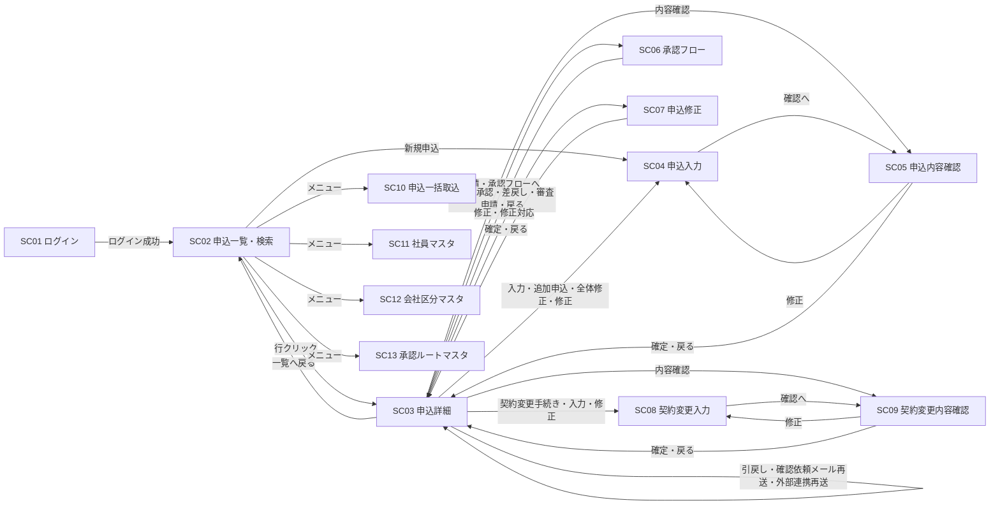
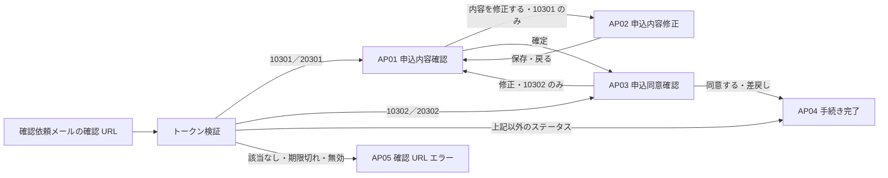

# 11. 画面設計

| 項目 | 内容 |
| --- | --- |
| 版 | 0.2（ステータス体系の改定を反映） |
| 関連 | [09. 機能一覧](09-function-list.md)、[10. 機能詳細](10-function-detail.md)、[03. ステータス定義・状態遷移](03-status-transition.md)、[07. テーブル定義](07-table-definition.md)、[08. コード定義](08-code-definition.md)、[14. 共通仕様](14-common-spec.md)、[99. 未決事項](99-open-issues.md) |

画面は申込受付会社向け 13 画面（SC01〜SC13）、申込者向け 5 画面（AP01〜AP05）、共通 1 画面（CM01）の計 19 画面。画面 ID・画面名は [09. 機能一覧](09-function-list.md) に従う。外部インターフェース（IF01〜IF05）は [12. 外部インターフェース設計](12-external-interface.md) で扱い、本書の対象外とする。審査担当部門は本システムの画面を使わず、審査担当部門システムから結果を連携する（[99. 未決事項 No.3](99-open-issues.md)）。

## 1. 画面一覧

### 1.1 画面一覧

| 画面ID | 画面名 | 利用者 | 権限（ROLE_CD） | 対応機能 | URL（仮） | 備考 |
| --- | --- | --- | --- | --- | --- | --- |
| SC01 | ログイン | 申込受付会社 | 認証前 | 共通 | `/emp/login` | ログアウトは `POST /emp/logout` |
| SC02 | 申込一覧・検索 | 申込受付会社 | 01、02、09 | F02、F03（新規申込の起点）、F05（承認待ち一覧） | `/emp/applications` | 「新規申込」ボタンは担当者にだけ表示 |
| SC03 | 申込詳細 | 申込受付会社 | 01、02、09 | F03、F04、F05、F06（再送）、F10、F11、F12 の操作起点 | `/emp/applications/{applicationId}` | 操作は `POST .../{applicationId}/{action}` |
| SC04 | 申込入力 | 担当者 | 01 | F03 | `/emp/applications/new`（新規申込）、`/emp/applications/{applicationId}/additional`（追加申込）、`/emp/applications/{applicationId}/edit`（入力・修正） | 未作成の申込と 10101 を編集 |
| SC05 | 申込内容確認 | 担当者 | 01 | F03 | `/emp/applications/{applicationId}/confirm` | 10100、10101、10201 |
| SC06 | 承認フロー | 担当者・承認者 | 01、02 | F04、F05 | `/emp/applications/{applicationId}/approval` | 申請待ちは担当者、申請中は承認者が操作 |
| SC07 | 申込修正 | 担当者 | 01 | F10 | `/emp/applications/{applicationId}/revise` | 10402、10501、20402 |
| SC08 | 契約変更入力 | 担当者 | 01 | F12 | `/emp/applications/{applicationId}/change` | 20101 |
| SC09 | 契約変更内容確認 | 担当者 | 01 | F12 | `/emp/applications/{applicationId}/change/confirm` | 20101、20201、20501 |
| SC10 | 申込一括取込 | 担当者 | 01 | F01 | `/emp/import` | 取込結果は `/emp/import/{importBatchId}` |
| SC11 | 社員マスタ | 管理者 | 09 | F15 | `/emp/master/employees` | |
| SC12 | 会社区分マスタ | 管理者 | 09 | F15 | `/emp/master/company-divs` | |
| SC13 | 承認ルートマスタ | 管理者 | 09 | F15 | `/emp/master/approval-routes` | テンプレートと明細を同一画面で編集 |
| AP01 | 申込内容確認 | 申込者 | 確認用トークン | F07 | `/consent/{token}` | 10301、20301 |
| AP02 | 申込内容修正 | 申込者 | 確認用トークン | F07 | `/consent/{token}/edit` | 10301 のみ |
| AP03 | 申込同意確認 | 申込者 | 確認用トークン | F07 | `/consent/{token}/agree` | 10302、20302 |
| AP04 | 手続き完了 | 申込者 | 確認用トークン | F07 | `/consent/{token}/complete` | |
| AP05 | 確認 URL エラー | 申込者 | なし | F07 | URL なし（トークン検証エラー時に表示） | |
| CM01 | システムエラー | 共通 | なし | 共通 | URL なし（想定外の例外発生時に表示） | |

- `/emp/` 配下は認証 Filter でログイン済セッションを要求し、`/consent/` 配下はトークン検証だけで到達できる。申込者のブラウザからは `/consent/` 以外に到達できない構成とする（[02. システム構成](02-system-architecture.md)）。
- `{applicationId}` は T_APPLICATION.APPLICATION_ID、`{token}` は確認用トークンの平文（DB には SHA-256 ハッシュのみ保持）。

### 1.2 権限と参照範囲

| 権限 | 参照できる申込（SC02・SC03） | 操作 |
| --- | --- | --- |
| 01 担当者 | T_APPLICATION.OWNER_EMPLOYEE_ID = 自分 | 新規申込・追加申込、入力・修正・確定、申請（回付先の設定）、引戻し、同意後の修正・全体修正、契約変更、確認依頼メール再送、外部連携再送 |
| 02 承認者 | 自分が T_APPROVAL_STEP.APPROVER_EMPLOYEE_ID に含まれる申込、および自部署（T_APPLICATION.DEPT_CD = 自分の部署）の申込（仮） | 承認・差戻し・審査申請（現在ステップの承認者のみ） |
| 09 管理者 | 全申込 | 参照、外部連携再送、マスタメンテナンス |

参照範囲外の申込 ID を URL で直接指定した場合は権限エラー（E103）とし、SC02 へ戻す。新規申込・追加申込は担当者だけが行え、入力した社員が担当社員になる。

## 2. 画面遷移図

### 2.1 申込受付会社向け

- メニューは全画面のヘッダにあり、SC02・SC10〜SC13 は相互に遷移できる（図では SC02 からの矢印だけ示す）。
- SC03 の「修正」は遷移元のステータスで遷移先が分かれる。10201 は SC04、10501 は SC07、20201／20501 は SC08（4.3 節）。
- すべての申込受付会社向け画面から、ログアウトとセッションタイムアウトで SC01 へ、システムエラーで CM01 へ遷移する（図では省略）。

### 2.2 申込者向け

- トークン検証は `/consent/` 配下の全リクエストで行い（[10. F07 8.3](10-function-detail.md#83-トークン検証全リクエスト共通)）、通過後に申込のステータスで表示画面を決める。
- 申込者向け画面にメニューはなく、画面間の任意遷移はできない。ステータスは申込者向け表示名（M_STATUS.APPLICANT_STATUS_NAME）で表示する。

## 3. 画面共通仕様

### 3.1 レイアウトとメニュー

| 領域 | 申込受付会社向け画面 | 申込者向け画面 |
| --- | --- | --- |
| ヘッダ | システム名、ログイン社員名（M_EMPLOYEE.EMPLOYEE_NAME）、権限名（ROLE_CD の名称）、会社区分名、ログアウトボタン | システム名のみ |
| メニュー | 権限別に表示（下表） | なし |
| メッセージ領域 | コンテンツ上部。エラー（赤）、警告（黄）、情報（青）を種別ごとに表示。入力エラーは該当項目の直下にも表示する | 同じ |
| フッタ | 著作権表示、アプリケーション版数（仮） | 同じ |

| メニュー | 遷移先 | 01 担当者 | 02 承認者 | 09 管理者 |
| --- | --- | --- | --- | --- |
| 申込一覧 | SC02 | ○ | ○ | ○ |
| 一括取込 | SC10 | ○ | × | × |
| 社員マスタ／会社区分マスタ／承認ルートマスタ | SC11／SC12／SC13 | × | × | ○ |

メニューの非表示に加え、URL 直接アクセスは認可 Filter で拒否し、E103 を表示して SC02 へ戻す。

### 3.2 一覧・書式

| 項目 | 規則 |
| --- | --- |
| ページング | 1 ページ 20 件（仮）。ページ番号リンクと総件数を表示。検索条件はページ移動時に引き継ぐ |
| 並び順 | 既定は更新日時（UPDATED_AT）の降順。列見出しクリックで並び替え（対象列はホワイトリストで固定） |
| 日付／日時 | yyyy/MM/dd／yyyy/MM/dd HH:mm。日付の入力も同じ書式 |
| 金額 | 円、整数、3 桁カンマ区切り。入力はカンマ許容 |
| 変更金額倍率 | 小数第 2 位まで表示（保持は小数第 4 位、切り捨て） |
| 区分値 | コードではなく名称を表示。ステータスは申込受付会社向け画面では「10101 申込入力中」のようにコード＋名称（M_STATUS.STATUS_NAME）、申込者向け画面では申込者向け表示名（APPLICANT_STATUS_NAME）だけを表示する |
| 版 | 「第 3 版（契約変更）」のように版番号＋版種別名。確定版は「確定版」、取消版は「取消」を併記する |
| 空値 | 「－」を表示（仮） |

### 3.3 更新処理の共通動作

| 項目 | 規則 |
| --- | --- |
| 二重送信防止 | 更新系は PRG パターン（POST → Redirect → GET）。送信ボタンはクリック後に無効化する（仮） |
| CSRF | セッション単位のトークンを hidden（`_csrf`、仮）に持ち、Filter で検証する。申込者向け画面も同じ |
| 楽観排他 | 画面表示時の T_APPLICATION.ROW_VERSION（マスタはその行の ROW_VERSION）を hidden で持ち回る。不一致（E102）の場合はメッセージを表示し、対象の詳細画面（SC03、マスタの編集画面）を最新データで再表示する。入力値は引き継がない |
| 遷移不可・権限エラー | E101／E103 を表示し、SC03 を最新データで再表示する（表示後にステータスが変わった場合など）。表示制御に関わらず、サーバ側で F14 の操作主体照合（[03. 8 章](03-status-transition.md#8-操作主体と操作者の照合)）を行う |
| 確認ダイアログ | 引戻し（W002）、全体修正、契約変更手続き、確認依頼メール再送、削除の前にブラウザのダイアログで確認する（仮、[99. 未決事項 No.32](99-open-issues.md)） |
| セッションタイムアウト | 30 分（仮）。タイムアウト後のリクエストは SC01 へ遷移し、「セッションが切れました。再度ログインしてください。」を表示する。再ログイン後は SC02 へ遷移する（元の画面には戻らない、仮） |
| 処理結果 | 更新成功時はリダイレクト先に情報メッセージ（I0xx）を 1 回だけ表示する（セッションのフラッシュ属性、仮） |
| 出力エスケープ | JSP の出力は JSTL で必ずエスケープする（[14. 共通仕様 10 章](14-common-spec.md#10-セキュリティ)） |

## 4. 画面別設計（申込受付会社向け）

### 4.1 SC01 ログイン

**概要**：社員番号とパスワードで申込受付会社の社員を認証し、セッションを開始する（[10. 16 章](10-function-detail.md#16-ログインログアウト共通)）。

**利用者・権限**：全社員（認証前）。ログイン済でアクセスした場合は SC02 へリダイレクトする。

**表示項目**：システム名、メッセージ領域のみ。

**入力項目**

| 項目名 | 型 | 桁 | 必須 | チェック内容 |
| --- | --- | --- | --- | --- |
| 社員番号（M_EMPLOYEE.EMPLOYEE_NO） | 文字列 | 10 | ○ | 半角英数字 |
| パスワード | 文字列 | 64（仮） | ○ | 桁のみ。マスク表示、エラー時も値を保持しない |

**操作**

| ボタン名 | 処理内容 | 遷移先 | 操作コード |
| --- | --- | --- | --- |
| ログイン | M_EMPLOYEE を EMPLOYEE_NO で検索し、VALID_FLG = 1 かつ PASSWORD_HASH と一致すれば成功。セッションを再生成し、社員 ID・権限・会社区分・部署を保持する | SC02 | なし |

**備考**：失敗時は E106 とし、社員番号の存在有無を区別しない。連続 5 回（仮）失敗でロックし、E107 を表示する。ロック状態の保持（M_EMPLOYEE への列追加を想定）と解除手段は [99. 未決事項 No.30](99-open-issues.md)。

### 4.2 SC02 申込一覧・検索

**概要**：申込を検索して一覧表示し、SC03 へ遷移する。「自分の操作待ちのみ」で担当者・承認者の作業一覧として使う。担当者の新規申込の起点でもある。

**利用者・権限**：01、02、09。1.2 節の参照範囲を検索条件に加えて必ず適用する。

**表示項目（一覧の列）**

| 項目名 | 参照元 | 書式 |
| --- | --- | --- |
| 申込番号 | T_APPLICATION.APPLICATION_NO | リンク。クリックで SC03 へ |
| 申込者番号／申込者名 | M_APPLICANT.APPLICANT_NO／APPLICANT_NAME | |
| ステータス | M_STATUS.STATUS_NAME（T_APPLICATION.STATUS_CD） | コード＋名称 |
| 申込金額（現行版） | T_APPLICATION_VERSION.APPLICATION_AMOUNT（VERSION_NO = CURRENT_VERSION_NO） | 3 桁カンマ、右寄せ |
| 担当社員 | M_EMPLOYEE.EMPLOYEE_NAME（OWNER_EMPLOYEE_ID） | |
| 登録区分 | T_APPLICATION.REGISTRATION_TYPE の名称 | 一括取込／画面入力／追加申込 |
| 更新日時 | T_APPLICATION.UPDATED_AT | yyyy/MM/dd HH:mm |

**入力項目（検索条件）**

| 項目名 | 型 | 桁 | 必須 | チェック内容・検索方法 |
| --- | --- | --- | --- | --- |
| 申込番号 | 文字列 | 12 | | 前方一致（T_APPLICATION.APPLICATION_NO） |
| 申込者番号／申込者名 | 文字列 | 12／100 | | 申込者番号は完全一致、申込者名は部分一致（M_APPLICANT） |
| ステータス | 複数選択 | | | 大分類（新規申込／契約変更）、中分類（入力中〜審査完了）、個別ステータスの 3 段で指定。M_STATUS を DISPLAY_ORDER 順に列挙。未選択は全ステータス |
| 担当社員 | 選択 | | | VALID_FLG = 1 の社員。担当者は自分で固定（変更不可） |
| 登録日 From／To | 日付 | 10 | | yyyy/MM/dd、From ≦ To（E007）。T_APPLICATION.CREATED_AT の日付部分で範囲検索 |
| 自分の操作待ちのみ | チェック | | | 下表の条件で絞る。管理者には表示しない |

| 権限 | 「自分の操作待ち」の判定 |
| --- | --- |
| 01 担当者 | T_APPLICATION.OWNER_EMPLOYEE_ID = ログイン社員 かつ STATUS_CD の操作主体が 1（担当者）のステータス（10100、10101、10201、10402、10501、10701、20101、20201、20402、20501、20701） |
| 02 承認者 | T_APPROVAL_REQUEST.REQUEST_STATUS = 1（申請中）の承認申請について、T_APPROVAL_STEP.STEP_NO = CURRENT_STEP_NO の行の APPROVER_EMPLOYEE_ID = ログイン社員 |

**操作**

| ボタン名 | 処理内容 | 遷移先 | 操作コード |
| --- | --- | --- | --- |
| 検索／クリア | 条件で検索して 1 ページ目を表示する（GET、条件は URL パラメータ）／条件を初期状態に戻す | SC02 | なし |
| 新規申込 | SC04 を新規申込モードで開く。担当者にだけ表示 | SC04 | なし（作成は SC04 側） |
| 行クリック（申込番号リンク） | 申込詳細を表示する | SC03 | なし |

**備考**：初期表示は担当者・承認者は「自分の操作待ちのみ」をチェック済で検索した状態、管理者は全件を更新日時降順とする。一覧に承認・差戻しのボタンは置かず、操作は SC03・SC06 で行う。

### 4.3 SC03 申込詳細

**概要**：申込の全情報（基本情報、現行版の申込内容と基準版との差分、版履歴、承認状況、申込者同意、外部連携、ステータス履歴）を表示し、ステータス操作と各入力画面への遷移の起点になる。

**利用者・権限**：01、02、09（参照範囲は 1.2 節）。ボタンはステータス×権限×操作者で表示制御する（下表）。

**表示項目**

| 区分 | 項目名 | 参照元 | 書式・備考 |
| --- | --- | --- | --- |
| 申込基本情報 | 申込番号、申込者番号／申込者名、担当社員 | T_APPLICATION.APPLICATION_NO、M_APPLICANT.APPLICANT_NO／APPLICANT_NAME、M_EMPLOYEE.EMPLOYEE_NAME（OWNER_EMPLOYEE_ID） | |
| | 会社区分／部署コード、ステータス | M_COMPANY_DIV.COMPANY_DIV_NAME／T_APPLICATION.DEPT_CD、M_STATUS.STATUS_NAME | ステータスはコード＋名称で強調表示 |
| | 登録区分、追加申込元申込番号、取込 ID | T_APPLICATION.REGISTRATION_TYPE、SOURCE_APPLICATION_ID（元の申込の APPLICATION_NO をリンク表示）、IMPORT_BATCH_ID | 該当しない場合は「－」 |
| | 現行版番号／基準版番号／審査完了版番号、審査完了日時／更新日時 | T_APPLICATION.CURRENT_VERSION_NO／BASE_VERSION_NO／REVIEWED_VERSION_NO、REVIEWED_AT／UPDATED_AT | 未設定は「－」 |
| 申込内容（現行版） | 版番号／版種別／複写元版番号、商品コード、申込金額、契約開始日／契約終了日、備考、確定日時、確定版フラグ | T_APPLICATION_VERSION.VERSION_NO／VERSION_TYPE／COPIED_FROM_VERSION_NO、PRODUCT_CD、APPLICATION_AMOUNT、CONTRACT_START_DATE／CONTRACT_END_DATE、REMARKS、CONFIRMED_AT、FIXED_FLG | 備考は改行を保持。確定版は「確定版」と表示 |
| | 変更金額倍率／その他修正フラグ | T_APPLICATION_VERSION.AMOUNT_RATIO／OTHER_MODIFIED_FLG | 設定されている版のみ表示 |
| 差分表示 | 基準版の同項目 | T_APPLICATION_VERSION（VERSION_NO = BASE_VERSION_NO） | 基準版があり、現行版と版番号が異なるとき、現行版と並べて値が異なる項目を強調 |
| 版履歴 | 全版の一覧 | T_APPLICATION_VERSION：VERSION_NO、VERSION_TYPE、COPIED_FROM_VERSION_NO、APPLICATION_AMOUNT、CONFIRMED_AT、FIXED_FLG、CANCELED_FLG | 版番号の降順。取消版は「取消」と表示し参照のみ（[99. 未決事項 No.20](99-open-issues.md)） |
| 承認状況 | 承認申請の一覧 | T_APPROVAL_REQUEST：VERSION_NO、APPROVAL_TYPE、ROUTE_ID（M_APPROVAL_ROUTE.ROUTE_NAME）、REQUEST_EMPLOYEE_ID（氏名）、REQUESTED_AT、REQUEST_STATUS、CURRENT_STEP_NO／FINAL_STEP_NO、COMPLETED_AT | 申請日時の降順 |
| | 各申請の承認明細 | T_APPROVAL_STEP：STEP_NO、APPROVER_EMPLOYEE_ID（氏名）、RESULT_CD、COMMENT、ACTED_AT | 申請中の現在ステップ行を強調。差戻しコメントはここで確認する |
| 申込者同意 | 同意の一覧 | T_APPLICANT_CONSENT：VERSION_NO、CONSENT_TYPE、CONSENT_STATUS、TOKEN_EXPIRES_AT、CONTENT_CONFIRMED_AT、CONSENTED_AT、RETURNED_AT、RETURN_REASON | トークンは表示しない。申込者の差戻し理由は RETURN_REASON |
| 外部連携 | 連携の一覧 | T_EXTERNAL_LINK：VERSION_NO、LINK_TYPE、SEND_STATUS、RETRY_COUNT、SENT_AT、EXTERNAL_RECEIPT_NO、RESULT_CD、RESULT_RECEIVED_AT、RESULT_REASON、ERROR_MESSAGE | 送信エラー行を強調。指摘内容・審査差戻し理由は RESULT_REASON |
| ステータス履歴 | 履歴の一覧 | T_STATUS_HISTORY：CHANGED_AT、FROM_STATUS_CD、TO_STATUS_CD、ACTION_CD、ACTOR_TYPE、ACTOR_ID（氏名等）、COMMENT、VERSION_NO、TRANSITION_ID | 変更日時の降順 |

差分表示の比較元は基準版（T_APPLICATION.BASE_VERSION_NO）で統一する。契約変更（版種別 3）では契約変更開始時に基準版 = 審査完了版になるため、審査完了版との比較になる。第 1 版（版種別 1）で同意前、または同意直後のように基準版 = 現行版のときは差分を表示しない。

**入力項目**：hidden（申込 ID、ROW_VERSION、CSRF トークン）のみ。承認者のコメントは SC06 で入力する。

**ステータス×権限別のボタン表示制御**

| ステータス | 01 担当者（担当の申込のみ） | 02 承認者（現在ステップの承認者のみ） | 09 管理者 |
| --- | --- | --- | --- |
| 10100 一括取込済 | 内容確認 | － | － |
| 10101 申込入力中 | 入力 | － | － |
| 10201 一次承認申請待ち | 修正、申請、内容確認 | － | － |
| 10202 一次承認申請中 | － | 承認フローへ | － |
| 10301 申込内容確認待ち | 引戻し、確認依頼メール再送 | － | － |
| 10302 申込同意確認待ち | 引戻し、確認依頼メール再送 | － | － |
| 10401 事前確認待ち | 外部連携再送※ | － | 外部連携再送※ |
| 10402 修正対応待ち | 修正対応、全体修正 | － | － |
| 10501 最終承認申請待ち | 申請、修正、全体修正 | － | － |
| 10502 最終承認申請中 | － | 承認フローへ | － |
| 10601 審査中 | 外部連携再送※ | － | 外部連携再送※ |
| 10701 審査完了 | 契約変更手続き | － | － |
| 20101 【契約変更】入力中 | 入力 | － | － |
| 20201 【契約変更】一次承認申請待ち | 修正、申請、内容確認 | － | － |
| 20202 【契約変更】一次承認申請中 | － | 承認フローへ | － |
| 20301 【契約変更】内容確認待ち | 引戻し、確認依頼メール再送 | － | － |
| 20302 【契約変更】同意確認待ち | 引戻し、確認依頼メール再送 | － | － |
| 20401 【契約変更】事前確認待ち | 外部連携再送※ | － | 外部連携再送※ |
| 20402 【契約変更】修正対応待ち | 修正対応 | － | － |
| 20501 【契約変更】最終承認申請待ち | 修正、申請、内容確認 | － | － |
| 20502 【契約変更】最終承認申請中 | － | 承認フローへ | － |
| 20601 【契約変更】審査中 | 外部連携再送※ | － | 外部連携再送※ |
| 20701 【契約変更】審査完了 | 契約変更手続き | － | － |

- ※ 現行版の外部連携（T_EXTERNAL_LINK）に SEND_STATUS = 2（送信エラー）の行がある場合だけ表示する。
- 「追加申込」は担当の申込であれば全ステータスで担当者に表示する（仮、[99. 未決事項 No.18](99-open-issues.md)）。「一覧へ戻る」は全ステータス・全権限で表示する。
- 承認申請中（10202／10502／20202／20502）に担当者の引戻し（取下げ）はない（[99. 未決事項 No.5](99-open-issues.md)）。承認者の差戻しで申請待ちへ戻す。
- 20402 には全体修正がない（[99. 未決事項 No.8](99-open-issues.md)）。

**操作**

| ボタン名 | 対象ステータス | 処理内容 | 遷移先 | 操作コード |
| --- | --- | --- | --- | --- |
| 内容確認 | 10100、10201 | SC05 を開く | SC05 | なし（01／02 は SC05 側） |
| 内容確認 | 20201、20501 | SC09 を開く | SC09 | なし（01 は SC09 側） |
| 入力 | 10101、20101 | SC04（10101）または SC08（20101）を開く | SC04／SC08 | なし |
| 修正 | 10201、20201、20501 | F14 を操作コード 01 で呼び、入力中（10101／20101）へ戻す。続けて SC04（10201）または SC08（20201／20501）を開く。現行版はそのまま再編集する | SC04／SC08 | 01 |
| 修正 | 10501 | SC07 を開く（同意後の修正。「全体修正」とは別） | SC07 | なし（02 は SC07 側） |
| 修正対応 | 10402、20402 | SC07 を開く | SC07 | なし（02 は SC07 側） |
| 全体修正 | 10402、10501 | 確認ダイアログの後、F14 を操作コード 01 で呼ぶ（→ 10101）。後続処理で現行版（確定版）を複写した版（版種別 2）が作られ、進行中の申込者同意は無効になる。続けて SC04 を開く | SC04 | 01 |
| 申請 | 10201、10501、20201、20501 | SC06 を申請待ちモードで開く | SC06 | なし（03 は SC06 側） |
| 承認フローへ | 10202、10502、20202、20502 | SC06 を申請中モードで開く | SC06 | なし（04／05／09 は SC06 側） |
| 引戻し | 10301、10302、20301、20302 | W002 の確認ダイアログの後、F11。F14 を操作コード 06 で呼ぶ（→ 10201／20201）。後続処理で進行中の申込者同意が無効（同意状態 9）になる | SC03（再表示） | 06 |
| 契約変更手続き | 10701、20701 | 確認ダイアログの後、F12 13.2。F14 を操作コード 14 で呼ぶ（→ 20101）。後続処理で審査完了版を複写した版（版種別 3）が作られ、基準版番号 = 審査完了版番号になる。続けて SC08 を開く | SC08 | 14 |
| 追加申込 | 全ステータス | SC04 を追加申込モードで開く（元の申込の申込者と現行版の申込内容を複写、仮） | SC04 | なし（作成は SC04 側） |
| 確認依頼メール再送 | 10301、10302、20301、20302 | F06 7.3。確認ダイアログの後、進行中の申込者同意を無効（同意状態 9）にし、新しいトークンで申込者同意と通知（通知種別 01）を登録する。旧 URL は使えなくなる。10302／20302 で再送した場合、申込者は新しい URL から AP01 をやり直す（仮） | SC03（I006） | なし（遷移しない） |
| 外部連携再送 | 10401、10601、20401、20601 | 送信エラー（SEND_STATUS = 2）の外部連携を SEND_STATUS = 0（未送信）に戻し、RETRY_COUNT を 0 にする（仮）。BT02 が次回周期で再送する | SC03（I006） | なし（遷移しない） |
| 一覧へ戻る | 全ステータス | 検索条件を保持したまま一覧に戻る | SC02 | なし |

**備考**：SC03 内の操作は成功後に PRG で SC03 を再表示する。表示から操作までの間にステータスが変わった場合は E101 または E102 になり、最新データで再表示する。引戻し・全体修正・契約変更手続きの情報メッセージ ID は 7 章の確認事項。承認者が自分の担当申込を承認する場合の制限は設けない。

### 4.4 SC04 申込入力

**概要**：新規申込・追加申込の作成、一括取込した申込の補正、入力中の修正、全体修正後の再入力を行う（F03）。確定は SC05 で行い、本画面はステータスを遷移させない（申込の作成を除く）。

**利用者・権限**：01 担当者（作成済みの申込は担当社員のみ）。他権限は SC04 に到達できない。

**モード**

| モード | 起点 | 対象 | 初期表示 | 申込の作成 |
| --- | --- | --- | --- | --- |
| 新規申込 | SC02「新規申込」 | 未作成 | 空。申込者番号で申込者を指定する | 最初の一時保存／確認へで作成（登録区分 2） |
| 追加申込 | SC03「追加申込」 | 未作成 | 元の申込の申込者と現行版の申込内容を複写（仮）。申込者は変更できない | 最初の一時保存／確認へで作成（登録区分 3、追加申込元申込 ID = 元の申込） |
| 入力・修正 | SC03「入力」（10101）、SC05「修正」（10100／10101／10201 → 10101）、SC03「全体修正」（10402／10501 → 10101） | 10101 | 現行版の内容 | 作成済み |

**表示項目**

| 項目名 | 参照元 | 書式・備考 |
| --- | --- | --- |
| 申込番号、ステータス、担当社員 | T_APPLICATION、M_STATUS、M_EMPLOYEE | 見出しに表示。未作成のときは「（未採番）」 |
| 申込者番号／申込者名／メールアドレス | M_APPLICANT.APPLICANT_NO／APPLICANT_NAME／MAIL_ADDRESS | 新規申込では申込者番号の入力後に検索して表示。追加申込・入力・修正では表示のみ |
| 追加申込元申込番号 | T_APPLICATION.SOURCE_APPLICATION_ID（元の申込の APPLICATION_NO） | 追加申込のみ |
| 版番号／版種別／複写元版番号 | T_APPLICATION_VERSION.VERSION_NO／VERSION_TYPE／COPIED_FROM_VERSION_NO | 全体修正後は版種別 2 と複写元を表示 |

**入力項目**

| 項目名 | 型 | 桁 | 必須 | チェック内容 |
| --- | --- | --- | --- | --- |
| 申込者番号（M_APPLICANT.APPLICANT_NO） | 文字列 | 12 | 新規申込○ | 半角英数字、M_APPLICANT に存在すること（業務チェック。メッセージ ID は 7 章）。申込の作成後は変更できない（仮） |
| 商品コード（PRODUCT_CD） | 文字列 | 10 | ○ | 半角英数字（仮。商品マスタは持たないため存在チェックなし） |
| 申込金額（APPLICATION_AMOUNT） | 数値 | 13 | ○ | 整数、カンマ許容、0 より大きい（E005） |
| 契約開始日（CONTRACT_START_DATE） | 日付 | 10 | | yyyy/MM/dd、実在する日付 |
| 契約終了日（CONTRACT_END_DATE） | 日付 | 10 | | yyyy/MM/dd、実在する日付、契約開始日 ≦ 契約終了日（E004） |
| 備考（REMARKS） | 文字列 | 1000 | | 改行・タブ以外の制御文字不可 |
| hidden：申込 ID、版番号、ROW_VERSION、モード、追加申込元申込 ID、CSRF トークン | | | | モードはサーバ側でもステータスから再判定する |

**操作**

| ボタン名 | 表示条件 | 処理内容 | 遷移先 | 操作コード |
| --- | --- | --- | --- | --- |
| 申込者検索 | 新規申込 | 申込者番号で M_APPLICANT を検索し、申込者名・メールアドレスを表示する（画面内） | SC04 | なし |
| 一時保存 | 全モード | 桁・書式チェックのみ行う（必須・相関は確認へで行う、仮）。未作成なら申込（申込番号を採番、ステータス 10101、現行版番号 1、担当社員・会社区分・部署 = ログイン社員）、第 1 版（版種別 1）、ステータス履歴（遷移元なし、遷移先 10101、操作コード 00）を登録する。作成済みなら現行版を更新する（遷移・履歴なし） | SC04（再表示、I001） | 00（作成時のみ。履歴に記録） |
| 確認へ | 全モード | 必須・型・桁・書式・相関・申込金額 > 0 のチェック後、一時保存と同じ登録または更新を行い、SC05 を表示する | SC05 | 00（作成時のみ） |
| 戻る | 全モード | 保存せずに戻る。入力を変更している場合は確認ダイアログを出す（仮） | SC03（作成済み）／SC02（未作成） | なし |

**備考**：10100（一括取込済）は SC04 で直接開かず、SC05 の「修正」で 10101 へ遷移してから開く。全体修正で 10101 へ戻った申込は版種別 2 の新しい版を編集し、以降は新規申込と同じ流れ（SC05 の確定 → 10201）になる。

### 4.5 SC05 申込内容確認

**概要**：入力した申込内容を確認し、「確定」で一次承認申請待ち（10201）へ進める。一括取込した申込の補正の起点にもなる。

**利用者・権限**：01 担当者（申込の担当社員のみ）。

**対象ステータスとボタン**

| ステータス | 起点 | 表示するボタン | 修正の処理 | 確定の処理 |
| --- | --- | --- | --- | --- |
| 10100 一括取込済 | SC03「内容確認」 | 修正、確定、戻る | F14 を操作コード 01 で呼ぶ（→ 10101、遷移 ID 1）。続けて SC04 を開く | 入力チェック後、確定日時を設定し F14 を操作コード 02 で呼ぶ（→ 10201、遷移 ID 2） |
| 10101 申込入力中 | SC04「確認へ」 | 修正、確定、戻る | 遷移なし。SC04 へ戻る | 同上（→ 10201、遷移 ID 3） |
| 10201 一次承認申請待ち | SC03「内容確認」 | 修正、戻る | F14 を操作コード 01 で呼ぶ（→ 10101、遷移 ID 4）。続けて SC04 を開く | （確定ボタンなし） |

**表示項目**

| 項目名 | 参照元 | 書式・備考 |
| --- | --- | --- |
| 申込番号、ステータス、担当社員、登録区分 | T_APPLICATION、M_STATUS、M_EMPLOYEE | |
| 申込者番号／申込者名／メールアドレス | M_APPLICANT | 確認依頼メールの宛先を担当者が確認できるようにする |
| 版番号／版種別、商品コード、申込金額、契約開始日／契約終了日、備考 | T_APPLICATION_VERSION（現行版） | 10100 では取込時の値をそのまま表示 |
| 取込エラー・警告 | なし | 10100 で確定時の入力チェックに該当する項目があれば、確定前に該当項目を強調表示する（仮） |

**入力項目**：hidden（申込 ID、版番号、ROW_VERSION、CSRF トークン）のみ。

**操作**

| ボタン名 | 処理内容 | 遷移先 | 操作コード |
| --- | --- | --- | --- |
| 修正 | 上表の「修正の処理」 | SC04 | 01（10100、10201）／なし（10101） |
| 確定 | 上表の「確定の処理」。入力チェック（必須、型・桁、書式、契約開始日 ≦ 契約終了日、申込金額 > 0）でエラーがあれば SC05 に表示し、修正を促す | SC03（I005） | 02 |
| 戻る | 保存せずに SC03 へ戻る | SC03 | なし |

**備考**：10100 の確定は 10101 を経由せず 10201 へ直接遷移する（[99. 未決事項 D7](99-open-issues.md)）。確定後の修正は SC03 の「修正」（10201 → 10101）で行う。

### 4.6 SC06 承認フロー

**概要**：申請待ちでは担当者が回付先（承認者と順序）を設定して申請する（F04）。申請中では現在ステップの承認者が承認・差戻し・審査申請を行う（F05）。4 つの承認種別で同じ画面を使う。

**利用者・権限**：申請待ちは 01 担当者（申込の担当社員のみ）、申請中は 02 承認者（現在ステップの承認者のみ操作可）。承認種別とモードはステータスから決める。

| ステータス | 承認種別 | モード | 操作できる利用者 | 最終承認者の操作 |
| --- | --- | --- | --- | --- |
| 10201／20201 | 01 一次承認／03 契約変更一次承認 | 申請待ち | 担当者 | － |
| 10501／20501 | 02 最終承認／04 契約変更最終承認 | 申請待ち | 担当者 | － |
| 10202／20202 | 01／03 | 申請中 | 現在ステップの承認者 | 承認（→ 10301／20301） |
| 10502／20502 | 02／04 | 申請中 | 現在ステップの承認者 | 審査申請（→ 10601／20601） |

**表示項目**

| 区分 | 項目名 | 参照元 | 書式・備考 |
| --- | --- | --- | --- |
| 共通 | 申込番号、申込者名、ステータス、担当社員、承認種別 | T_APPLICATION、M_APPLICANT、M_STATUS、M_EMPLOYEE | 承認種別は名称を表示 |
| | 申込内容（現行版）：版番号／版種別、商品コード、申込金額、契約開始日／契約終了日、備考 | T_APPLICATION_VERSION | 基準版があれば差分を併記（SC03 と同じ規則） |
| 申請待ち | テンプレート名、適用開始日 | M_APPROVAL_ROUTE.ROUTE_NAME、VALID_FROM | 申込の会社区分・部署・承認種別で、適用期間に当日を含むテンプレートを検索し、適用開始日が最も新しいものを採用。該当なしは「（テンプレートなし）」 |
| | 回付先一覧：ステップ番号、承認者氏名、部署コード | 画面内の編集状態（初期値はテンプレートの M_APPROVAL_ROUTE_STEP） | 並び順がステップ番号。最終行が最終承認者 |
| | 承認者候補 | M_EMPLOYEE（VALID_FLG = 1、ROLE_CD = 02、COMPANY_DIV = 申込の会社区分） | 行追加時の選択肢 |
| 申請中 | 承認申請：申請社員、申請日時、現在ステップ／最終ステップ | T_APPROVAL_REQUEST | |
| | 承認明細一覧：ステップ番号、承認者氏名、結果、コメント、処理日時 | T_APPROVAL_STEP：STEP_NO、APPROVER_EMPLOYEE_ID、RESULT_CD、COMMENT、ACTED_AT | 現在ステップ行を強調 |

**入力項目**

| 項目名 | 型 | 桁 | 必須 | チェック内容 |
| --- | --- | --- | --- | --- |
| 回付先（承認者社員 ID、複数行） | 選択 | | 最終承認（02／04）○ | 候補外（無効、権限 02 以外、会社区分不一致）は E108。同じ社員の重複不可（仮）。最終承認で 0 人は E109。一次承認（01／03）は 0 人（回付先なし）でも申請できる |
| コメント（T_APPROVAL_STEP.COMMENT） | 文字列 | 500 | 差戻し時○ | 申請中モードで、現在ステップの承認者にだけ表示。承認・審査申請は任意 |
| hidden：申込 ID、ROW_VERSION、承認申請 ID、ルート ID（テンプレート）、CSRF トークン | | | | |

**操作**

| ボタン名 | 表示条件 | 処理内容 | 遷移先 | 操作コード |
| --- | --- | --- | --- | --- |
| 行追加／行削除／上へ／下へ | 申請待ち | 画面内で回付先を編集し、ステップ番号を 1 から振り直す（仮、[99. 未決事項 No.10](99-open-issues.md)） | SC06 | なし |
| テンプレートに戻す | 申請待ち | 回付先をテンプレートの初期値に戻す | SC06 | なし |
| 申請 | 申請待ち | F04 5.2。操作者が担当社員であることを確認する。回付先あり：承認申請（申請状態 1、現在ステップ 1、最終ステップ = 人数、ルート ID = テンプレートを使った場合）と承認明細（結果 0）を登録し、F14 を操作コード 03・経路情報 = 回付先ありで呼ぶ（→ 申請中）。回付先なし（01／03 のみ）：承認済の承認申請を登録し、F14 を操作コード 03・経路情報 = 回付先なしで呼ぶ（→ 10301／20301） | SC03（I002） | 03 |
| 承認 | 申請中。01／03 の全ステップ、02／04 の最終ステップ以外 | F05 6.2。現在ステップの承認明細を結果 1 で更新する。最終ステップでなければ現在ステップを +1 し、次の承認者へ通知 02 を登録する（ステータスは変えず、F14 は呼ばない）。01／03 の最終承認者は承認申請を承認済にし、F14 を操作コード 04 で呼ぶ（→ 10301／20301） | SC03（I003） | 04（最終承認者のみ） |
| 審査申請 | 申請中。02／04 の最終ステップ | F05 6.4。承認明細を結果 3、承認申請を承認済にし、F14 を操作コード 09 で呼ぶ（→ 10601／20601）。後続処理で審査依頼の外部連携が登録される | SC03（I002） | 09 |
| 差戻し | 申請中 | F05 6.3。コメント未入力は E105。承認明細を結果 2、承認申請を差戻し（申請状態 3）にし、F14 を操作コード 05・コメント = 差戻し理由で呼ぶ（→ 申請待ち）。後続処理で申請社員へ通知 03 が登録される | SC03（I004） | 05 |
| 戻る | 全モード | SC03 へ戻る | SC03 | なし |

**備考**

- 最終承認者以外の承認はステータスを変えない（[99. 未決事項 D5](99-open-issues.md)）。最終承認は回付先なしで申請できない（[99. 未決事項 No.4](99-open-issues.md)）。
- 申請中モードでは、現在ステップの承認者以外（回付先の他の承認者、担当者、管理者）は参照のみとし、ボタンとコメント欄を表示しない（仮）。
- 差戻し後の再申請は新しい承認申請を作る。前回の差戻しコメントは SC03 の承認状況で確認する。
- 回付先に無効な社員が含まれる状態で申請した場合はサーバ側で E108 とする。進行中の承認申請の承認者が無効化されても申請には影響しない（[99. 未決事項 No.23](99-open-issues.md)）。

### 4.7 SC07 申込修正

**概要**：申込者の同意後に担当者が申込内容を修正し、確定時に現行版（確定版）を複写した新しい版を作って、変更基準で遷移先を決める（F10）。

**利用者・権限**：01 担当者（申込の担当社員のみ）。

**対象ステータスと確定時の遷移**

| ステータス | 起点 | 作る版の版種別 | 変更基準超（条件 21） | 変更基準内（既定） | 変更がないとき |
| --- | --- | --- | --- | --- | --- |
| 10402 修正対応待ち | SC03「修正対応」 | 2 | 10201 一次承認申請待ち（遷移 ID 18） | 10401 事前確認待ち（19）。事前確認依頼を再登録 | 確定可（事前確認の再依頼。[99. 未決事項 No.19](99-open-issues.md)） |
| 10501 最終承認申請待ち | SC03「修正」 | 2 | 10201 一次承認申請待ち（23） | 10501 のまま（24）。新しい版を作り履歴に記録 | E104 |
| 20402 【契約変更】修正対応待ち | SC03「修正対応」 | 4 | 20201 【契約変更】一次承認申請待ち（46） | 20401 【契約変更】事前確認待ち（47）。事前確認依頼を再登録 | 確定可（事前確認の再依頼） |

**表示項目**

| 項目名 | 参照元 | 書式・備考 |
| --- | --- | --- |
| 指摘内容、結果受信日時 | 現行版の T_EXTERNAL_LINK のうち RESULT_CD = 2（修正必要）の直近行の RESULT_REASON、RESULT_RECEIVED_AT | 10402／20402 のみ。画面上部に表示 |
| 申込番号、ステータス、担当社員、申込者番号／申込者名 | T_APPLICATION、M_STATUS、M_EMPLOYEE、M_APPLICANT | 見出しに表示 |
| 現行版の版番号／版種別、作成する版番号 | T_APPLICATION_VERSION.VERSION_NO／VERSION_TYPE、CURRENT_VERSION_NO + 1 | 「確定時に第 n 版を作成する」旨を表示 |
| 基準版の各項目 | T_APPLICATION_VERSION（VERSION_NO = BASE_VERSION_NO）の商品コード、申込金額、契約開始日／契約終了日、備考 | 入力欄の横に表示し、入力値と異なる項目を強調 |
| 基準版の申込金額、金額倍率しきい値 | 同上、M_COMPANY_DIV.AMOUNT_RATIO_LIMIT（申込の会社区分） | |
| 変更金額倍率（参考値） | 申込金額 ÷ 基準版の申込金額 | 入力中に画面側で再計算して小数第 2 位まで表示。判定はサーバ側で行う |

**入力項目**：商品コード、申込金額、契約開始日、契約終了日、備考（型・桁・チェックは SC04 と同じ）。hidden：申込 ID、現行版番号、ROW_VERSION、CSRF トークン。

**操作**

| ボタン名 | 処理内容 | 遷移先 | 操作コード |
| --- | --- | --- | --- |
| 確定 | F10 11.3。入力チェック後、現行版の保存値と入力値の全項目を比較して変更の有無を判定する。変更あり：新しい版（版番号 = 現行版番号 + 1、版種別 2／4、複写元 = 現行版、確定日時、変更金額倍率 = 申込金額 ÷ 基準版の申込金額（小数第 4 位切り捨て）、その他修正フラグ = 金額以外に基準版と異なる項目があれば 1、確定版フラグ 0）を登録し、現行版番号を更新して F14 を操作コード 02 で呼ぶ。変更なし：10501 は E104、10402／20402 は版を作らず F14 を操作コード 02 で呼ぶ（変更基準内として扱う、仮） | SC03（I005。基準超のときは W001 も表示） | 02 |
| 戻る | 保存せずに SC03 へ戻る。入力を変更している場合は確認ダイアログを出す（仮） | SC03 | なし |

**備考**：変更金額倍率がしきい値を超える場合は、画面側の参考表示でも W001 を表示する。確定版を直接変更しないため一時保存はない。申込内容全体を作り直す場合は SC03 の「全体修正」（10402／10501）で入力中へ戻す。変更基準超で一次承認申請待ちへ戻った場合は、一次承認と申込者確認からやり直し、申込者が再び同意した時点で基準版が更新される。

### 4.8 SC08 契約変更入力

**概要**：契約変更手続きで作られた版（版種別 3、審査完了版の複写）に契約変更内容を入力する（F12）。確定は SC09 で行う。

**利用者・権限**：01 担当者（申込の担当社員のみ）。対象ステータスは 20101。

**起点**：SC03「契約変更手続き」（10701／20701 → 20101）、SC03「入力」（20101）、SC03／SC09「修正」（20201／20501 → 20101）。いずれも現行版（版種別 3、未同意）をそのまま更新する。

**表示項目**

| 項目名 | 参照元 | 書式・備考 |
| --- | --- | --- |
| 申込番号、ステータス、担当社員、申込者番号／申込者名 | T_APPLICATION、M_STATUS、M_EMPLOYEE、M_APPLICANT | 見出しに表示 |
| 版番号／版種別／複写元版番号 | T_APPLICATION_VERSION | 複写元 = 審査完了版 |
| 変更前（審査完了版）の各項目 | T_APPLICATION_VERSION（VERSION_NO = REVIEWED_VERSION_NO） | 入力欄の横に表示し、入力値と異なる項目を強調。契約変更中は基準版 = 審査完了版 |
| 基準版の申込金額、金額倍率しきい値、変更金額倍率（参考値） | T_APPLICATION_VERSION（BASE_VERSION_NO）、M_COMPANY_DIV.AMOUNT_RATIO_LIMIT、申込金額 ÷ 基準版の申込金額 | SC07 と同じ。基準超なら W001 を参考表示 |

**入力項目**：商品コード、申込金額、契約開始日、契約終了日、備考（SC04 と同じ）。hidden：申込 ID、版番号、ROW_VERSION、CSRF トークン。

**操作**

| ボタン名 | 処理内容 | 遷移先 | 操作コード |
| --- | --- | --- | --- |
| 一時保存 | 桁・書式チェック後、現行版を更新する。ステータス遷移なし、履歴なし | SC08（再表示、I001） | なし |
| 確認へ | 必須・相関・申込金額 > 0 を含む入力チェック後、現行版を更新して SC09 を表示する | SC09 | なし |
| 戻る | 保存せずに SC03 へ戻る。入力を変更している場合は確認ダイアログを出す（仮） | SC03 | なし |

**備考**：契約変更は審査完了後に何度でも行える。審査差戻し（20601）で取り消された版は編集できず、再度「契約変更手続き」で新しい版を作る。

### 4.9 SC09 契約変更内容確認

**概要**：契約変更内容を審査完了版と比較して確認し、変更金額倍率と変更基準の判定結果を表示して「確定」する（F12 13.3）。申請待ち（20201／20501）では内容の参照と「修正」の起点になる。

**利用者・権限**：01 担当者（申込の担当社員のみ）。

**対象ステータスとボタン**

| ステータス | 起点 | 表示するボタン | 修正の処理 |
| --- | --- | --- | --- |
| 20101 【契約変更】入力中 | SC08「確認へ」 | 修正、確定、戻る | 遷移なし。SC08 へ戻る |
| 20201／20501 【契約変更】申請待ち | SC03「内容確認」 | 修正、戻る | F14 を操作コード 01 で呼ぶ（→ 20101、遷移 ID 33／48）。続けて SC08 を開く |

**表示項目**

| 項目名 | 参照元 | 書式・備考 |
| --- | --- | --- |
| 申込番号、ステータス、担当社員、申込者番号／申込者名、会社区分 | T_APPLICATION、M_STATUS、M_EMPLOYEE、M_APPLICANT、M_COMPANY_DIV | |
| 変更前／変更後の各項目 | 審査完了版（REVIEWED_VERSION_NO）と現行版の商品コード、申込金額、契約開始日／契約終了日、備考 | 並べて表示し、異なる項目を強調 |
| 変更金額倍率、金額倍率しきい値、その他修正の有無 | 現行版の申込金額 ÷ 基準版の申込金額、M_COMPANY_DIV.AMOUNT_RATIO_LIMIT、金額以外の項目の差分有無 | 小数第 2 位まで |
| 判定結果と確定後の遷移先 | 変更基準超：20201（一次承認・申込者確認を経る）。変更基準内：会社区分 1 は 20501、会社区分 2 は 20401（事前確認依頼を登録） | 基準超のときは W001 を表示 |

**入力項目**：hidden（申込 ID、版番号、ROW_VERSION、CSRF トークン）のみ。

**操作**

| ボタン名 | 処理内容 | 遷移先 | 操作コード |
| --- | --- | --- | --- |
| 修正 | 上表の「修正の処理」 | SC08 | なし（20101）／01（20201、20501） |
| 確定 | 20101 のみ。審査完了版と比べて変更がない場合は E104。変更金額倍率（小数第 4 位切り捨て）、その他修正フラグ、確定日時を現行版に設定し、F14 を操作コード 02 で呼ぶ（→ 20201（遷移 ID 30）／20501（31）／20401（32）） | SC03（I005。基準超のときは W001 も表示） | 02 |
| 戻る | SC03 へ戻る | SC03 | なし |

**備考**：判定はサーバ側で確定時に行い、画面の判定結果は参考表示とする。確定の直前に会社区分マスタのしきい値が変更された場合は、確定時点の値で判定する。

### 4.10 SC10 申込一括取込

**概要**：取込ファイル（CSV、[IF05](12-external-interface.md)）をアップロードして申込を 10100（一括取込済）で登録し、結果と過去の取込履歴を表示する（F01）。

**利用者・権限**：01 担当者。取込社員が担当社員になり、取込社員の会社区分・部署が申込に引き継がれる。

**表示項目**

| 区分 | 項目名 | 参照元 | 書式・備考 |
| --- | --- | --- | --- |
| 取込結果 | ファイル名、取込日時、総件数／成功件数／エラー件数 | T_IMPORT_BATCH.FILE_NAME、IMPORTED_AT、TOTAL_COUNT／SUCCESS_COUNT／ERROR_COUNT | |
| | エラー行一覧：行番号、エラー内容、行データ | T_IMPORT_ERROR.LINE_NO、ERROR_MESSAGE、RAW_LINE | 行番号の昇順。行データは折り返し表示 |
| 取込履歴 | 取込日時、ファイル名、取込社員、総件数、成功件数、エラー件数 | T_IMPORT_BATCH、M_EMPLOYEE.EMPLOYEE_NAME（IMPORT_EMPLOYEE_ID） | 取込日時の降順、ページング。自分が取り込んだ履歴のみ（仮）。行クリックでその取込の結果を表示 |

**入力項目**

| 項目名 | 型 | 桁 | 必須 | チェック内容 |
| --- | --- | --- | --- | --- |
| 取込ファイル | ファイル | | ○ | 拡張子 .csv、サイズ 5MB 以内（仮）、文字コード UTF-8、ヘッダ行が IF05 と一致、上限 1,000 行（仮）。ファイル単位のエラーは E008 とし、登録せずに画面へ返す |

**操作**

| ボタン名 | 処理内容 | 遷移先 | 操作コード |
| --- | --- | --- | --- |
| 取込実行 | F01。行単位に検証（必須、型・桁、日付書式、契約開始日 ≦ 契約終了日、申込者番号の存在）し、正常行を申込（10100、登録区分 1、現行版番号 1）・第 1 版・ステータス履歴（操作コード 00）として登録、エラー行を T_IMPORT_ERROR に記録する（部分成功） | SC10（`/emp/import/{importBatchId}` へリダイレクトして結果表示） | 00 新規作成（履歴のみ） |
| 履歴の行クリック | 該当する取込の結果とエラー行一覧を表示する | SC10 | なし |

**備考**：ファイルはサーバに保存せずメモリ上で処理する。取込は同期処理とし、1,000 行を 1 分以内で処理する（[14. 共通仕様 12 章](14-common-spec.md#12-性能容量仮)）。結果画面へのリダイレクトで再読み込みによる二重取込を防ぐ。取り込んだ申込の補正・確定は SC03 → SC05 で行う。

### 4.11 SC11 社員マスタ

**概要**：申込受付会社の社員の一覧表示、登録、編集、無効化・有効化を行う（F15）。

**利用者・権限**：09 管理者。

**表示項目（一覧）**：社員番号（EMPLOYEE_NO）、氏名（EMPLOYEE_NAME）、会社区分（M_COMPANY_DIV.COMPANY_DIV_NAME）、部署コード（DEPT_CD）、権限（ROLE_CD の名称）、メールアドレス（MAIL_ADDRESS）、有効フラグ（VALID_FLG）。絞り込みは会社区分、権限、有効のみ（既定オン）。社員番号の昇順。

**入力項目（登録・編集）**

| 項目名 | 型 | 桁 | 必須 | チェック内容 |
| --- | --- | --- | --- | --- |
| 社員番号（EMPLOYEE_NO） | 文字列 | 10 | ○ | 半角英数字、重複不可（E006）。編集時は変更不可 |
| 氏名（EMPLOYEE_NAME） | 文字列 | 50 | ○ | |
| パスワード | 文字列 | 64（仮） | 登録時○ | 編集時は空なら変更しない。ソルト付きハッシュで PASSWORD_HASH に保存。文字種などの方針は [99. 未決事項 No.30](99-open-issues.md) |
| 会社区分（COMPANY_DIV） | 選択 | 1 | ○ | M_COMPANY_DIV に存在（1：事前確認なし、2：事前確認あり） |
| 部署コード（DEPT_CD） | 文字列 | 10 | ○ | 半角英数字（仮。部署マスタは持たない） |
| 権限（ROLE_CD） | 選択 | 2 | ○ | 01／02／09 |
| メールアドレス（MAIL_ADDRESS） | 文字列 | 254 | ○ | メールアドレス形式（E003） |
| 有効フラグ（VALID_FLG） | チェック | 1 | ○ | |
| hidden：社員 ID、ROW_VERSION、CSRF トークン | | | | |

**操作**

| ボタン名 | 処理内容 | 遷移先 | 操作コード |
| --- | --- | --- | --- |
| 新規登録／編集（一覧の行） | 空の編集フォーム／該当社員の編集フォームを表示する | SC11（編集） | なし |
| 保存 | 入力チェック後に登録または更新する（楽観排他） | SC11（一覧、I001） | なし |
| 無効化／有効化 | VALID_FLG を切り替える。物理削除はしない | SC11（一覧） | なし |
| 戻る | 一覧に戻る | SC11（一覧） | なし |

**備考**：無効化する社員が進行中の承認申請（REQUEST_STATUS = 1）の未処理ステップ（RESULT_CD = 0）の承認者である場合は警告を表示し、確認のうえ続行できる（仮）。進行中の申請には影響しない。無効な社員は承認フロー画面の回付先に設定できない。ログイン中の自分自身は無効化できない（仮）。

### 4.12 SC12 会社区分マスタ

**概要**：会社区分（1：事前確認なし、2：事前確認あり）ごとの名称、外部事前確認フラグ、金額倍率しきい値を更新する（F15）。区分の追加・削除は対象外。

**利用者・権限**：09 管理者。

**表示項目**：会社区分（COMPANY_DIV、表示のみ）。一覧内で直接編集する形式とし、区分ごとに ROW_VERSION を hidden で持つ。

**入力項目**

| 項目名 | 型 | 桁 | 必須 | チェック内容 |
| --- | --- | --- | --- | --- |
| 会社区分名（COMPANY_DIV_NAME） | 文字列 | 50 | ○ | 名称は [99. 未決事項 No.1](99-open-issues.md) |
| 外部事前確認フラグ（PRE_CHECK_FLG） | 選択 | 1 | ○ | 1：あり、0：なし |
| 金額倍率しきい値（AMOUNT_RATIO_LIMIT） | 数値 | 3,2 | ○ | 小数第 2 位まで、1.00 以上（E005）9.99 以下 |

**操作**

| ボタン名 | 処理内容 | 遷移先 | 操作コード |
| --- | --- | --- | --- |
| 保存 | 全区分を検証し、変更のある区分だけ更新する（楽観排他） | SC12（I001） | なし |
| 戻る | 申込一覧へ戻る | SC02 | なし |

**備考**：外部事前確認フラグは F14 の遷移候補の絞り込み（事前確認区分）に、しきい値は変更基準の判定に、いずれも遷移時に評価されるため、変更は進行中の申込にも即時に影響する。保存前に確認ダイアログでその旨を表示する。

### 4.13 SC13 承認ルートマスタ

**概要**：承認フロー画面で回付先の初期値として使うテンプレート（M_APPROVAL_ROUTE）とその明細（M_APPROVAL_ROUTE_STEP）を同一画面で登録・編集・削除する（F15）。

**利用者・権限**：09 管理者。

**表示項目（一覧）**：会社区分名、部署コード（DEPT_CD）、承認種別（APPROVAL_TYPE の名称）、ルート名（ROUTE_NAME）、適用開始日（VALID_FROM）、適用終了日（VALID_TO）、ステップ数。絞り込みは会社区分、部署コード、承認種別。会社区分・部署・承認種別・適用開始日の順に並べる。

**入力項目（編集）**

| 区分 | 項目名 | 型 | 桁 | 必須 | チェック内容 |
| --- | --- | --- | --- | --- | --- |
| ルート | 会社区分（COMPANY_DIV） | 選択 | 1 | ○ | M_COMPANY_DIV に存在。変更時は明細の承認者を再検証 |
| | 部署コード（DEPT_CD） | 文字列 | 10 | ○ | 半角英数字（仮） |
| | 承認種別（APPROVAL_TYPE） | 選択 | 2 | ○ | 01 一次承認／02 最終承認／03 契約変更一次承認／04 契約変更最終承認 |
| | ルート名（ROUTE_NAME） | 文字列 | 50 | ○ | |
| | 適用開始日／適用終了日（VALID_FROM／VALID_TO） | 日付 | 10 | 開始○ | yyyy/MM/dd、適用開始日 ≦ 適用終了日（E007）。終了日の空は無期限 |
| 明細（複数行） | ステップ番号（STEP_NO） | 数値 | 2 | ○ | 1 から連番。行の並びから自動採番し、行追加・削除時に振り直す |
| | 承認者社員（APPROVER_EMPLOYEE_ID） | 選択 | 10 | ○ | VALID_FLG = 1 かつ ROLE_CD = 02 かつ COMPANY_DIV がルートと同一の社員から選択（E108）。同一ルート内で同じ社員の重複不可（仮）。明細は 1 行以上 |
| | hidden：ルート ID、ROW_VERSION、CSRF トークン | | | | |

**操作**

| ボタン名 | 処理内容 | 遷移先 | 操作コード |
| --- | --- | --- | --- |
| 新規登録／編集（一覧の行） | 編集フォームを表示する | SC13（編集） | なし |
| 行追加／行削除 | 明細行を末尾に追加、または選択行を削除し、ステップ番号を振り直す（画面内） | SC13（編集） | なし |
| 保存 | ルートと明細を検証し、同一トランザクションで登録・更新する。明細は全削除・全登録で置き換える（仮） | SC13（一覧、I001） | なし |
| 削除 | ルートと明細を物理削除する（確認ダイアログあり）。進行中の承認申請には影響しない（申請時に承認明細へ複写済み） | SC13（一覧） | なし |
| 戻る | 一覧に戻る | SC13（一覧） | なし |

**備考**：テンプレートは申請時の初期値であり、担当者は SC06 で回付先を変更できる（仮）。同じ会社区分・部署・承認種別で適用期間が重なるテンプレートは許容し、SC06 では適用開始日が最も新しいものを使う。重なりがある場合は保存時に警告を表示する（仮）。

## 5. 画面別設計（申込者向け・共通）

### 5.1 AP01 申込内容確認

**概要**：確認用 URL から申込内容を表示し、申込者が内容を確認して「確定」する（10301 → 10302、20301 → 20302）。新規申込では「内容を修正する」で AP02 へ進める。

**利用者・権限**：申込者。トークン検証（[10. F07 8.3](10-function-detail.md#83-トークン検証全リクエスト共通)）に通ったリクエストのみ。

**表示項目**

| 項目名 | 参照元 | 書式・備考 |
| --- | --- | --- |
| 申込番号、申込者名 | T_APPLICATION.APPLICATION_NO、M_APPLICANT.APPLICANT_NAME | |
| 手続きの状況 | M_STATUS.APPLICANT_STATUS_NAME（「内容確認中」） | 申込受付会社向けのステータス名・コードは表示しない |
| 商品コード、申込金額 | T_APPLICATION_VERSION.PRODUCT_CD、APPLICATION_AMOUNT（現行版） | 金額は 3 桁カンマ、円 |
| 契約期間 | T_APPLICATION_VERSION.CONTRACT_START_DATE 〜 CONTRACT_END_DATE | yyyy/MM/dd。空は「－」 |
| 備考 | T_APPLICATION_VERSION.REMARKS | |
| 変更前の内容 | 審査完了版（REVIEWED_VERSION_NO）の同項目 | CONSENT_TYPE = 2（契約変更）のときだけ、変更前・変更後を並べて表示し、異なる項目を強調 |
| 確認期限 | T_APPLICANT_CONSENT.TOKEN_EXPIRES_AT | yyyy/MM/dd HH:mm |

**入力項目**

| 項目名 | 型 | 桁 | 必須 | チェック内容 |
| --- | --- | --- | --- | --- |
| 内容を確認しました | チェック | | 確定時○ | 未チェックでは確定ボタンを押せない（画面側）。サーバ側でも検証（E001） |
| hidden：CSRF トークン | | | | 同意 ID はトークンから特定するため hidden に持たない |

**操作**

| ボタン名 | 表示条件 | 処理内容 | 遷移先 | 操作コード |
| --- | --- | --- | --- | --- |
| 内容を修正する | 10301 のみ | AP02 を開く | AP02 | なし |
| 確定 | 10301、20301 | トークン検証後、ステータスが 10301／20301 であることを確認し、申込者同意の CONTENT_CONFIRMED_AT と CLIENT_IP を更新して F14 を操作コード 02・操作主体 3・経路情報 = 同意 ID で呼ぶ（→ 10302／20302） | AP03（リダイレクト） | 02 |

**備考**：ステータスが 10302／20302 の場合は AP01 を表示せず AP03 へリダイレクトし、申込者確認中以外のステータスは AP04 へリダイレクトする。担当社員・承認状況・外部連携・指摘内容などの申込受付会社向け情報は表示しない（[99. 未決事項 No.11](99-open-issues.md)）。契約変更（20301）には修正がない。

### 5.2 AP02 申込内容修正

**概要**：申込者が内容確認待ち（10301）で申込内容を修正する。保存は現行版をそのまま更新し、版は増えずステータスも遷移しない。

**利用者・権限**：申込者（トークン検証済、ステータス 10301）。20301 では到達できない。

**表示項目**：申込番号（APPLICATION_NO）、申込者名（APPLICANT_NAME）、手続きの状況（APPLICANT_STATUS_NAME）、確認期限（TOKEN_EXPIRES_AT）。

**入力項目**

| 項目名 | 型 | 桁 | 必須 | チェック内容 |
| --- | --- | --- | --- | --- |
| 商品コード（PRODUCT_CD） | 文字列 | 10 | ○ | 半角英数字 |
| 申込金額（APPLICATION_AMOUNT） | 数値 | 13 | ○ | 整数、カンマ許容、0 より大きい（E005） |
| 契約開始日／契約終了日（CONTRACT_START_DATE／CONTRACT_END_DATE） | 日付 | 10 | | yyyy/MM/dd、実在する日付、契約開始日 ≦ 契約終了日（E004） |
| 備考（REMARKS） | 文字列 | 1000 | | 改行・タブ以外の制御文字不可 |
| hidden：CSRF トークン | | | | |

**操作**

| ボタン名 | 処理内容 | 遷移先 | 操作コード |
| --- | --- | --- | --- |
| 保存 | トークン検証後、ステータスが 10301 であることを確認し、入力チェックを行って現行版を更新する（版は増えない。ステータス遷移なし、履歴なし） | AP01（リダイレクト、I001） | なし |
| 戻る | 保存せずに AP01 へ戻る | AP01 | なし |

**備考**：修正できる項目は申込内容の全項目とする（仮、[99. 未決事項 No.9](99-open-issues.md)）。申込者情報（M_APPLICANT）や担当者情報は変更できない。修正した内容は AP01 の「確定」で確定し、担当者の確認は挟まない（仮）。引戻し後は修正内容が現行版に残り、担当者が SC03 の「修正」で直す。

### 5.3 AP03 申込同意確認

**概要**：確定した申込内容と同意事項を表示し、申込者が「同意する」「差戻し」「修正」のいずれかを行う（10302、20302）。

**利用者・権限**：申込者（トークン検証済、ステータス 10302／20302）。

**表示項目**：申込番号、申込者名、手続きの状況（APPLICANT_STATUS_NAME「同意確認待ち」）、確定した申込内容（現行版。項目は AP01 と同じ。契約変更は変更前の内容を併記）、同意事項の本文（文言は仮。契約変更の場合は契約変更用の文言に切り替える）、確認期限。

**入力項目**

| 項目名 | 型 | 桁 | 必須 | チェック内容 |
| --- | --- | --- | --- | --- |
| 同意事項に同意します | チェック | | 同意時○ | 未チェックでは「同意する」を押せない（画面側）。サーバ側でも検証（E001） |
| 差戻し理由（T_APPLICANT_CONSENT.RETURN_REASON） | 文字列 | 500 | 差戻し時○ | 改行・タブ以外の制御文字不可。未入力は E105 |
| hidden：CSRF トークン | | | | |

**操作**

| ボタン名 | 表示条件 | 処理内容 | 遷移先 | 操作コード |
| --- | --- | --- | --- | --- |
| 同意する | 10302、20302 | トークン検証後、ステータスを確認し F14 を操作コード 07 で呼ぶ（会社区分 1：→ 10501／20501、会社区分 2：→ 10401／20401）。後続処理で同意状態 2・同意日時・接続元 IP の記録、現行版の確定版化、基準版の更新、（会社区分 2）事前確認依頼の登録が行われる | AP04（リダイレクト、I007） | 07 |
| 差戻し | 10302、20302 | 差戻し理由を検証し、F14 を操作コード 08・コメント = 理由で呼ぶ（→ 10201／20201）。後続処理で同意状態 3・差戻し日時・理由の記録と、担当社員への通知 04 が行われる | AP04（リダイレクト、I008） | 08 |
| 修正 | 10302 のみ | F14 を操作コード 01 で呼ぶ（→ 10301）。同じ同意レコードで継続する | AP01（リダイレクト） | 01 |

**備考**：契約変更（20302）には「修正」がない（[99. 未決事項 No.7](99-open-issues.md)）。AP01 へ戻るリンクは置かない（確定済のため、AP01 の URL を開いても AP03 へリダイレクトする）。差戻し理由は申込受付会社が SC03 の申込者同意で確認する。

### 5.4 AP04 手続き完了

**概要**：同意または差戻しの手続きが完了したことを表示する。

**利用者・権限**：申込者（トークン検証済）。

**表示項目**：申込番号（APPLICATION_NO）、手続きの状況（APPLICANT_STATUS_NAME）、下表の完了メッセージ（文言は仮）。**入力項目・操作**：なし。

| 表示契機 | メッセージ |
| --- | --- |
| AP03「同意する」の直後 | I007「同意を受け付けました。」と「お手続きは完了しました。この画面を閉じてください。」 |
| AP03「差戻し」の直後 | I008「差し戻しました。担当者へ連絡します。」 |
| トークン検証を通過した申込が申込者確認中（10301／10302／20301／20302）以外のステータス | 「お手続きは完了しています。」 |

**備考**：同意後・差戻し後に確認 URL を再度開いたときの表示（AP04 か AP05 か）は 7 章の確認事項。

### 5.5 AP05 確認 URL エラー

**概要**：トークン検証に失敗した場合に表示する。

**利用者・権限**：申込者。

**表示項目**：下表のエラーメッセージと「担当者にお問い合わせください。」の案内。申込番号などの業務情報は表示しない。**入力項目・操作**：なし。

| 原因 | メッセージ |
| --- | --- |
| トークンのハッシュが T_APPLICANT_CONSENT に存在しない、CONSENT_STATUS が 1（確認依頼中）でない（引戻し・再送・全体修正で無効化された場合を含む）、対象の版が現行版でない | E201「この確認 URL は無効です。担当者にお問い合わせください。」 |
| TOKEN_EXPIRES_AT を過ぎている | E202「この確認 URL は有効期限が切れています。」 |

**備考**：期限切れの場合は担当者が SC03 の「確認依頼メール再送」で新しい URL を発行する（[99. 未決事項 No.14](99-open-issues.md)）。総当たり対策として、検証失敗の応答には失敗回数に応じた遅延を入れる（[14. 共通仕様 10 章](14-common-spec.md#10-セキュリティ)、仮）。

### 5.6 CM01 システムエラー

**概要**：想定外の例外（DB 接続失敗など）が発生した場合に表示する。**利用者・権限**：全利用者。

**表示項目**：E901「システムエラーが発生しました。管理者に連絡してください。」、発生日時、問い合わせ用のエラー ID（ログと突き合わせる識別子、仮）。スタックトレースなどの内部情報は表示しない。

**操作**：ログイン済の社員には「申込一覧へ」（SC02）リンクを表示する。申込者・未ログインには操作を置かない。

**備考**：HTTP ステータスは 500 とし、web.xml の error-page で全例外をこの画面に集約する。ログは ERROR でスタックトレース付きに出力する。

## 6. 入力チェック仕様

### 6.1 チェックの順序と実施場所

[14. 共通仕様 6 章](14-common-spec.md#6-入力チェック共通) に従い、次の順で行う。同じ項目に複数のエラーがある場合は最初のエラーだけ表示する。

| 順 | 分類 | 内容 | 実施場所 |
| --- | --- | --- | --- |
| 1 | 必須 | 未入力（前後の空白をトリムして空） | Servlet／Form |
| 2 | 型・桁 | 数値・日付への変換可否、最大桁数、文字種（半角英数字など） | Servlet／Form |
| 3 | 書式 | 日付の実在、メールアドレス形式、コード値の範囲（区分値、ステータス、承認種別） | Servlet／Form |
| 4 | 相関 | 契約開始日 ≦ 契約終了日、適用開始日 ≦ 適用終了日、登録日 From ≦ To、ステップ番号の連番 | Servlet／Form |
| 5 | 業務 | 存在チェック（社員番号重複、申込者番号、回付先の承認者）、変更なし、回付先の有無、ステータス・権限・排他 | サービス層（F14 を含む） |

- 1〜4 でエラーがあれば 5 は行わず、同じ画面に入力値を保持して戻す。5 のエラーはメッセージ領域に表示し、排他・遷移不可・権限エラーは 3.3 節のとおり詳細画面を最新データで再表示する。
- 一時保存（SC04、SC08）は 2〜3 だけを行い、1・4・5 は「確認へ」と「確定」で行う（仮）。
- 画面側（JavaScript）のチェックは利便性のための補助とし、サーバ側で必ず同じチェックを行う。変更金額倍率の判定はサーバ側だけで行う。

### 6.2 主なメッセージ

| ID | メッセージ | 主な発生画面 |
| --- | --- | --- |
| E001 | {0}を入力してください。 | SC01、SC04、SC07、SC08、SC11〜SC13、AP01〜AP03 |
| E002 | {0}は{1}桁以内で入力してください。 | SC02、SC04、SC06、SC07、SC08、SC11〜SC13、AP02、AP03 |
| E003 | {0}の形式が正しくありません。 | SC02（日付）、SC04、SC07、SC08、SC11（メールアドレス）、AP02 |
| E004 | 契約終了日は契約開始日以降の日付を入力してください。 | SC04、SC05、SC07、SC08、AP02 |
| E005 | {0}は{1}以上の値を入力してください。 | SC04、SC05、SC07、SC08、AP02（申込金額 > 0）、SC12（しきい値 ≧ 1.00） |
| E006 | {0}はすでに登録されています。 | SC11（社員番号） |
| E007 | {0}は{1}以降の日付を入力してください。 | SC02（登録日 To）、SC13（適用終了日） |
| E008 | ファイルの形式またはサイズが正しくありません。 | SC10 |
| E101 | 現在のステータスではこの操作はできません。 | SC03、SC05〜SC09、AP01〜AP03 |
| E102 | 他のユーザーが更新しました。最新の内容を確認してください。 | SC03〜SC09、SC11〜SC13 |
| E103 | この操作を行う権限がありません。 | SC03〜SC09、URL 直接アクセス |
| E104 | 変更がないため確定できません。 | SC07（10501）、SC09 |
| E105 | 差戻しには理由を入力してください。 | SC06、AP03 |
| E106 | 社員番号またはパスワードが正しくありません。 | SC01 |
| E107 | アカウントがロックされています。管理者に連絡してください。 | SC01 |
| E108 | 承認者には有効な承認者権限の社員を、会社区分をそろえて設定してください。 | SC06、SC13 |
| E109 | 回付先を設定してください。 | SC06（最終承認・契約変更最終承認） |
| E201／E202 | 確認 URL の無効／有効期限切れ | AP05 |
| W001 | 変更が所定の変更基準を超えるため、一次承認と申込者確認をやり直します。 | SC07、SC09（参考表示と確定後） |
| W002 | 引戻しを行うと申込者の確認用 URL は無効になります。 | SC03（引戻しの確認ダイアログ） |
| I001 | 登録しました。 | SC04、SC08（一時保存）、SC11〜SC13、AP02 |
| I002 | 申請しました。 | SC06（申請、審査申請） |
| I003 | 承認しました。 | SC06 |
| I004 | 差し戻しました。 | SC06 |
| I005 | 確定しました。 | SC05、SC07、SC09 |
| I006 | 再送を登録しました。 | SC03（確認依頼メール再送、外部連携再送） |
| I007 | 同意を受け付けました。 | AP04 |
| I008 | 差し戻しました。担当者へ連絡します。 | AP04 |

E901 は 5.6 節を参照。メッセージ本文は [14. 共通仕様 7 章](14-common-spec.md#7-メッセージ) を正とする。

## 7. 確認事項

[99. 未決事項](99-open-issues.md) の No と対応づける。No のないものは本書で新たに挙げた点で、99 への追加を要する。

- 画面レイアウト（ワイヤーフレーム）の作成要否と時期。本書は項目・操作の定義にとどめ、レイアウトは詳細設計で作成する前提（No.27）。
- 対応ブラウザ、画面解像度、アクセシビリティ要件。申込者向け画面（AP01〜AP05）のスマートフォン対応（No.28）。
- 確定・申請・承認・差戻し・引戻し・全体修正・契約変更手続きの前に確認ダイアログ（または確認画面）を挟むか。本書はブラウザのダイアログを仮置きとしている（No.32）。
- SC06 で承認ルートマスタ（テンプレート）の回付先を担当者が追加・削除・並べ替えしてよいか。不可の場合は SC06 の回付先を表示のみにし、テンプレートなしの申請の扱いを決める必要がある（No.10）。
- 最終承認（10501／20501）で回付先なしの申請を認めるか。本書は E109 で不可としている（No.4）。
- 承認申請中（10202／10502／20202／20502）に担当者の取下げ（引戻し）が必要か。本書は SC03 にボタンを置いていない（No.5）。
- 契約変更の同意確認待ち（20302）に申込者の「修正」がなく、契約変更修正対応待ち（20402）に「全体修正」がない点が意図どおりか（No.7、No.8）。
- 申込者が AP02 で修正できる項目の範囲（申込金額を含むか）と、修正後に申込受付会社の確認を挟まず同意へ進んでよいか（No.9）。
- 申込者差戻しの理由（AP03）の必須化と、審査担当部門の指摘内容（SC07）・差戻し理由の申込者への開示範囲（No.11）。
- 追加申込で複写する範囲（申込者のみか、現行版の申込内容も複写するか）と、追加申込を起点にできるステータス。本書は全ステータスで「追加申込」を表示している（No.18）。
- 修正対応待ち（10402／20402）で変更がないまま確定（事前確認の再依頼）を認めるか。認める場合、版を作らずに F14 を呼ぶとき変更金額倍率をどう扱うか（本書は基準内として扱う前提）（No.19）。
- 契約変更の審査差戻しで取り消した版の SC03 での表示（参照のみでよいか）（No.20）。
- 商品コード・部署コードの入力方法。マスタがないため自由入力としているが、選択式にする場合はマスタ追加が必要（No.33）。
- 承認者の参照範囲（自部署の申込を含めるか）と、SC02 の担当社員条件を承認者に開放してよいか。SC06 の申請中モードを現在ステップ以外の承認者・担当者・管理者が参照できるか。
- パスワード方針（桁・文字種・有効期限）、初期パスワードの配布方法、リセットとロック解除の操作画面（SC11 に置くか）。ロック状態の保持には M_EMPLOYEE への列追加が必要（No.30）。
- 通知の送信エラーを確認・再送する画面の要否と権限。本書は外部連携再送だけを SC03 に置いている（No.31）。
- 外部連携再送時に RETRY_COUNT を 0 に戻してよいか（再送の総回数を証跡として残すなら別項目が必要）。
- 同意後・差戻し後に申込者が確認 URL を再度開いたときの表示。[10. F07 8.3](10-function-detail.md#83-トークン検証全リクエスト共通) は同意状態が 1 でないトークンを AP05 とする一方、同意後・差戻し後は AP04 とも読めるため、同意状態 2／3 のトークンに限り AP04 を表示するかを決める。
- 10302／20302 で確認依頼メールを再送した場合に、申込者が AP01（内容確認）からやり直す仕様でよいか（10 の 7.3 の仮置き）。
- 新規申込で申込者番号を指定した後（申込の作成後）に申込者を変更できるようにするか。本書は変更不可としている。
- 引戻し・全体修正・契約変更手続き・申込者の内容修正の保存に対する情報メッセージ ID（I0xx）と、申込者番号が存在しない場合のメッセージ ID（E0xx）の [14. 共通仕様](14-common-spec.md#7-メッセージ) への追加。
- SC12 で外部事前確認フラグを編集可能にしてよいか。会社区分の値（1 = 事前確認なし、2 = 事前確認あり）が固定なら表示のみにする。
- SC04・SC08 の一時保存時のチェック範囲（桁・書式のみ、必須・相関は確認へで実施）でよいか。
- SC03 のステータス履歴・承認状況・版履歴・外部連携の表示件数上限と、各セクションの初期表示（折りたたみ）の要否。
