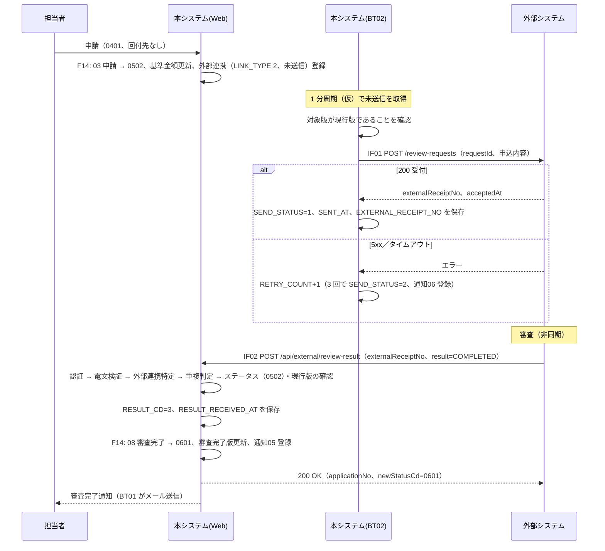
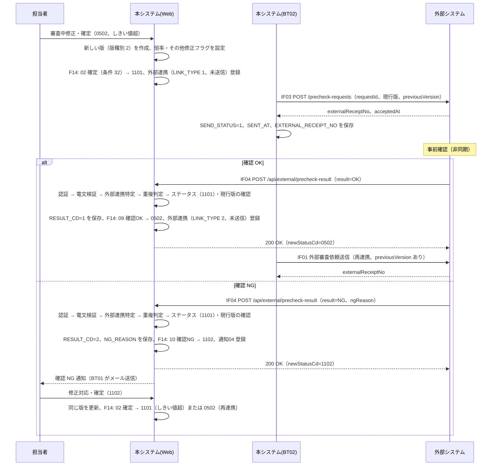

# 12. 外部インターフェース設計

| 項目 | 内容 |
| --- | --- |
| 版 | 0.1（初版・ドラフト） |
| 関連 | [09. 機能一覧](09-function-list.md)、[10. 機能詳細](10-function-detail.md)、[03. ステータス定義・状態遷移](03-status-transition.md)、[07. テーブル定義](07-table-definition.md)、[08. コード定義](08-code-definition.md)、[13. バッチ・通知設計](13-batch-notification.md)、[14. 共通仕様](14-common-spec.md)、[99. 未決事項](99-open-issues.md) |

外部システムとの API 連携（IF01〜IF04）と、社員がアップロードする申込一括取込ファイル（IF05）を定義する。
外部システムの API 仕様は未入手のため、連携方式・エンドポイント・電文・認証は本設計の仮置き（文中「仮」）であり、実物の入手後に見直す（7 章）。

## 1. IF 一覧

| IF ID | IF 名 | 方向 | 方式 | 契機 | 頻度 | 機能 | 連携種別／操作コード |
| --- | --- | --- | --- | --- | --- | --- | --- |
| IF01 | 外部審査依頼送信 | 本システム → 外部システム | REST／JSON over HTTPS（本システムがクライアント） | 0502／0504 到達時に F14 が登録した外部連携（LINK_TYPE 2／4、未送信）を BT02 が送信 | BT02 の周期（1 分ごと、仮）で未送信分をまとめて処理 | F08 | LINK_TYPE 2：外部審査、4：契約変更審査 |
| IF02 | 外部審査結果受信 | 外部システム → 本システム | REST／JSON over HTTPS（本システムがサーバ。コールバック） | 外部システムの審査完了時 | 随時（24 時間受信） | F09 | 操作コード 08 審査完了 → RESULT_CD 3 |
| IF03 | 外部事前確認依頼送信 | 本システム → 外部システム | IF01 と同じ | 1101／1201 到達時に F14 が登録した外部連携（LINK_TYPE 1／3、未送信）を BT02 が送信 | IF01 と同じ | F11 | LINK_TYPE 1：外部事前確認、3：契約変更事前確認 |
| IF04 | 外部事前確認結果受信 | 外部システム → 本システム | IF02 と同じ | 外部システムの事前確認完了時 | 随時（24 時間受信） | F11 | 操作コード 09 確認OK → RESULT_CD 1、10 確認NG → RESULT_CD 2 |
| IF05 | 申込一括取込ファイル | 社員 → 本システム（ファイル） | CSV ファイルを SC05 からアップロード | 担当者の操作 | 随時 | F01 | 操作コード 00 取込（ステータス履歴のみ） |

- IF01〜IF04 は 1 つの外部システムを相手とし、依頼（送信）と結果（受信）は外部受付番号（T_EXTERNAL_LINK.EXTERNAL_RECEIPT_NO）で対応づける。
- 外部連携レコード（T_EXTERNAL_LINK）1 行が依頼 1 回に対応する。同じ申込でも再連携のたびに新しい行を作る。
- IF01 と IF03 は電文構造を共通にし、連携種別（linkType）で区別する。IF02 と IF04 も電文構造は共通だが、エンドポイントは分ける。

## 2. 連携共通仕様（IF01〜IF04）

### 2.1 方式（仮）

| 項目 | 内容 |
| --- | --- |
| プロトコル | HTTPS（TLS 1.2 以上）。メソッドは POST、本文は JSON |
| 処理方式 | 非同期。依頼送信（IF01／IF03）の応答では外部受付番号を受け取るだけで、審査・確認の結果は外部システムからのコールバック（IF02／IF04）で受け取る |
| 送信側の実装 | BT02 外部連携送信バッチ → 外部連携サービス → 外部システム API クライアント（infra.extapi） |
| 受信側の実装 | web.api パッケージの Servlet。Filter で API 認証を行い、外部連携サービスを通して F14 を操作主体 4（外部システム）、操作者 ID = 設定値（例 `EXT01`）で呼ぶ |
| 対応づけ | 送信電文の requestId（EXTERNAL_LINK_ID）と応答の externalReceiptNo を T_EXTERNAL_LINK に保持し、結果受信時は externalReceiptNo でレコードを特定し、requestId で突合する |

### 2.2 認証（仮）

| 方向 | 方式 | 備考 |
| --- | --- | --- |
| 送信（IF01／IF03） | 外部システムが発行した API キーを本システムが `X-API-Key` ヘッダに付与する | キーは設定ファイルで管理し、リポジトリ・ログに含めない |
| 受信（IF02／IF04） | 本システムが発行した API キーを外部システムが `X-API-Key` ヘッダに付与する。加えて接続元 IP アドレスを許可リストで制限する | 許可 IP は設定ファイル。いずれかに失敗すると E401 |

- API キーは送信用・受信用に 1 本ずつを想定し、切替時は新旧 2 本を一定期間併用できるようにする（仮）。

### 2.3 エンドポイント（仮）

| IF | メソッド | URL | 備考 |
| --- | --- | --- | --- |
| IF01 | POST | `{外部システムベース URL}/review-requests` | ベース URL は環境ごとの設定値 |
| IF03 | POST | `{外部システムベース URL}/precheck-requests` | 同上 |
| IF02 | POST | `{本システムベース URL}/api/external/review-result` | 本システムのコンテキストパス配下 |
| IF04 | POST | `{本システムベース URL}/api/external/precheck-result` | 同上 |

### 2.4 HTTP ヘッダ

| ヘッダ | 値 | 送信時 | 受信時 |
| --- | --- | --- | --- |
| Content-Type | `application/json; charset=UTF-8` | 付与する | 必須。これ以外は E400 |
| Accept | `application/json` | 付与する | 任意 |
| X-API-Key | API キー | 付与する | 必須。なし・不一致は E401 |
| Content-Length | 本文長 | 付与する | 受信本文は 64KB 以内（仮）。超過は E400 |

### 2.5 文字コード・書式

| 項目 | 規則 | 例 |
| --- | --- | --- |
| 文字コード | UTF-8 | |
| 日時 | ISO 8601（秒まで、タイムゾーンオフセット付き） | `2026-09-30T10:15:30+09:00` |
| 日付 | yyyy-MM-dd | `2026-10-01` |
| 金額 | 整数（円）。JSON の number。小数・カンマなし | `1000000` |
| 倍率 | JSON の number。小数第 4 位まで（切り捨て済みの値） | `1.8` |
| 区分値 | 文字列。[08. コード定義](08-code-definition.md) の値をそのまま使う | `"2"` |
| 数値 ID | JSON の number（requestId、versionNo） | `1023` |
| 値なし | 項目を省略するか `null`。空文字は「値あり」として桁チェックの対象とする | |

### 2.6 タイムアウト・リトライ（送信側、仮）

| 項目 | 値 |
| --- | --- |
| 接続タイムアウト | 5 秒 |
| 読取タイムアウト | 30 秒 |
| 再送上限 | 3 回。RETRY_COUNT が 3 に達したら SEND_STATUS = 2（送信エラー） |
| 再送間隔 | BT02 の周期（1 分ごと）。次回周期で未送信分として再送する |
| 再送対象 | 5xx 応答、タイムアウト、接続エラー、応答本文の解析失敗。4xx は再送しない（3.5 節） |

送信エラー確定時は担当社員・管理者へ送信エラー通知（通知種別 06）を登録する。担当者・管理者は SC03 の再送操作で SEND_STATUS を 0、RETRY_COUNT を 0 に戻して再送できる（[13. バッチ・通知設計](13-batch-notification.md)）。

### 2.7 冪等性

- 送信側：同じ requestId（EXTERNAL_LINK_ID）の依頼を外部システムが 2 回以上受けた場合は、新規受付とせず初回の externalReceiptNo を HTTP 200 で返してもらう（仮）。読取タイムアウト後の再送で依頼が二重に登録されることを防ぐ。
- 受信側：同じ externalReceiptNo の結果を 2 回以上受けた場合、2 回目以降は「重複受信（E200）」として HTTP 200 で受け流し、DB は更新しない。
- 受信側の同時実行：同じ受付番号の結果が同時に届いた場合は、申込行の楽観排他により一方が正常、他方が E409 になる。E409 の後に再送すると E200 になる。

### 2.8 ログ

| 項目 | 内容 |
| --- | --- |
| 出力先 | IF ログ（[14. 共通仕様 9 章](14-common-spec.md#9-ログ)）。保持 1 年（仮） |
| 出力内容 | 日時、IF ID、方向、requestId、externalReceiptNo、applicationNo、versionNo、linkType、result、HTTP ステータス、エラーコード、所要時間（ms）、接続元 IP（受信時） |
| 電文 | 送受信の本文は上記の要約を記録し、全文は DEBUG レベルでのみ出力する。個人情報（customerName、customerKana、mailAddress、telNo、address）はマスクする |
| 出力しないもの | API キー |

## 3. IF01／IF03 送信電文

### 3.1 送信の流れ（BT02）

1. T_EXTERNAL_LINK から SEND_STATUS = 0 の行を EXTERNAL_LINK_ID の昇順に取得する。
2. 行ごとに、対象の版（VERSION_NO）が申込の現行版（T_APPLICATION.CURRENT_VERSION_NO）であることを確認する。違えば送信せず SEND_STATUS = 2、ERROR_MESSAGE「版が更新されたため送信中止」とする（後続に新しい外部連携があるため通知 06 は登録しない）。
3. 申込・現行版・顧客・直前の版から電文を組み立て、LINK_TYPE に応じたエンドポイントへ POST する。
4. 応答を 3.5 節に従って処理し、1 行ごとにコミットする。

### 3.2 リクエスト項目

IF01 と IF03 で共通。「必須」の △ は条件付きで設定する項目。

| No | 項目名（JSON キー） | 型 | 必須 | 参照元テーブル.項目 | 説明 |
| --- | --- | --- | --- | --- | --- |
| 1 | requestId | number | ○ | T_EXTERNAL_LINK.EXTERNAL_LINK_ID | 本システム側の依頼 ID。冪等キー。結果受信時に突合する |
| 2 | linkType | string(1) | ○ | T_EXTERNAL_LINK.LINK_TYPE | IF01：2／4、IF03：1／3 |
| 3 | applicationNo | string(12) | ○ | T_APPLICATION.APPLICATION_NO | |
| 4 | versionNo | number | ○ | T_EXTERNAL_LINK.VERSION_NO | 依頼対象の版。送信時点の現行版と一致する |
| 5 | versionType | string(1) | ○ | T_APPLICATION_VERSION.VERSION_TYPE | 1：新規申込、2：審査中修正、3：契約変更、4：契約変更審査中修正 |
| 6 | companyDiv | string(1) | ○ | T_APPLICATION.COMPANY_DIV | |
| 7 | customer | object | ○ | | 顧客情報（No.8〜13） |
| 8 | customer.customerNo | string(12) | ○ | M_CUSTOMER.CUSTOMER_NO | |
| 9 | customer.customerName | string(100) | ○ | M_CUSTOMER.CUSTOMER_NAME | |
| 10 | customer.customerKana | string(100) | | M_CUSTOMER.CUSTOMER_KANA | |
| 11 | customer.mailAddress | string(254) | ○ | M_CUSTOMER.MAIL_ADDRESS | |
| 12 | customer.telNo | string(15) | | M_CUSTOMER.TEL_NO | |
| 13 | customer.address | string(200) | | M_CUSTOMER.ADDRESS | |
| 14 | product | object | ○ | | 商品情報（No.15） |
| 15 | product.productCd | string(10) | ○ | T_APPLICATION_VERSION.PRODUCT_CD | |
| 16 | applicationAmount | number | ○ | T_APPLICATION_VERSION.APPLICATION_AMOUNT | 円。整数 |
| 17 | contractStartDate | string(日付) | | T_APPLICATION_VERSION.CONTRACT_START_DATE | yyyy-MM-dd |
| 18 | contractEndDate | string(日付) | | T_APPLICATION_VERSION.CONTRACT_END_DATE | yyyy-MM-dd |
| 19 | remarks | string(1000) | | T_APPLICATION_VERSION.REMARKS | |
| 20 | baseAmount | number | ○ | T_APPLICATION.BASE_AMOUNT | 変更金額倍率の分母。0502／0504 到達時に更新済み |
| 21 | amountRatio | number | IF03 のみ ○ | T_APPLICATION_VERSION.AMOUNT_RATIO | 申込金額 ÷ 基準金額。IF01 では送らない |
| 22 | otherModifiedFlg | string(1) | IF03 のみ ○ | T_APPLICATION_VERSION.OTHER_MODIFIED_FLG | 1：金額以外を修正。IF01 では送らない |
| 23 | previousVersion | object | △ | T_APPLICATION_VERSION（VERSION_NO = versionNo − 1） | 現行版の版種別が 2／4 の場合に設定する（IF03 は常に該当。IF01 は審査中修正の再連携の場合）。それ以外は省略 |
| 24 | previousVersion.versionNo | number | △ | 同上.VERSION_NO | |
| 25 | previousVersion.productCd | string(10) | △ | 同上.PRODUCT_CD | |
| 26 | previousVersion.applicationAmount | number | △ | 同上.APPLICATION_AMOUNT | |
| 27 | previousVersion.contractStartDate | string(日付) | | 同上.CONTRACT_START_DATE | |
| 28 | previousVersion.contractEndDate | string(日付) | | 同上.CONTRACT_END_DATE | |
| 29 | previousVersion.remarks | string(1000) | | 同上.REMARKS | |
| 30 | requestedAt | string(日時) | ○ | （送信時の現在日時） | ISO 8601 |

### 3.3 電文例（IF03 外部事前確認依頼）

```json
{
  "requestId": 1023,
  "linkType": "1",
  "applicationNo": "AP0000000123",
  "versionNo": 2,
  "versionType": "2",
  "companyDiv": "1",
  "customer": {
    "customerNo": "C00000000001",
    "customerName": "山田 太郎",
    "customerKana": "ヤマダ タロウ",
    "mailAddress": "taro.yamada@example.com",
    "telNo": "03-0000-0000",
    "address": "東京都千代田区丸の内1-1-1"
  },
  "product": { "productCd": "PRD001" },
  "applicationAmount": 1800000,
  "contractStartDate": "2026-10-01",
  "contractEndDate": "2027-09-30",
  "remarks": null,
  "baseAmount": 1000000,
  "amountRatio": 1.8,
  "otherModifiedFlg": "0",
  "previousVersion": {
    "versionNo": 1,
    "productCd": "PRD001",
    "applicationAmount": 1000000,
    "contractStartDate": "2026-10-01",
    "contractEndDate": "2027-09-30",
    "remarks": null
  },
  "requestedAt": "2026-09-30T10:15:30+09:00"
}
```

IF01（外部審査依頼）は linkType を 2／4 とし、amountRatio・otherModifiedFlg を含めない。承認完了経由の初回依頼では previousVersion も含めない。

### 3.4 レスポンス項目（HTTP 200）

| No | 項目名（JSON キー） | 型 | 必須 | 格納先テーブル.項目 | 説明 |
| --- | --- | --- | --- | --- | --- |
| 1 | externalReceiptNo | string(30) | ○ | T_EXTERNAL_LINK.EXTERNAL_RECEIPT_NO | 外部システムが採番する。本システム内で一意（UK） |
| 2 | acceptedAt | string(日時) | ○ | （IF ログのみ） | 外部システムの受付日時。SENT_AT には本システムの応答受信時刻を保存する |

### 3.5 HTTP ステータスと送信結果の扱い

| 応答 | 判定 | T_EXTERNAL_LINK の更新 | 後続 |
| --- | --- | --- | --- |
| 200／201 で externalReceiptNo あり | 送信成功 | SEND_STATUS = 1、SENT_AT = 現在日時、EXTERNAL_RECEIPT_NO、ERROR_MESSAGE = 空 | 結果受信待ち |
| 200／201 だが本文が不正（受付番号なし、JSON 解析不可、30 桁超） | 再送 | RETRY_COUNT + 1、ERROR_MESSAGE。RETRY_COUNT = 3 なら SEND_STATUS = 2 | 上限到達で通知 06 を登録 |
| 4xx（400、401、403、404、409、422 など） | 送信エラー（再送しない） | RETRY_COUNT + 1、SEND_STATUS = 2、ERROR_MESSAGE = HTTP ステータスと応答本文の先頭（1000 桁以内） | 通知 06 を登録 |
| 5xx、タイムアウト、接続エラー | 再送 | RETRY_COUNT + 1、ERROR_MESSAGE。RETRY_COUNT = 3 なら SEND_STATUS = 2 | 上限到達で通知 06 を登録 |
| 受付番号が他の外部連携と重複（UK 違反） | 送信エラー（再送しない） | SEND_STATUS = 2、ERROR_MESSAGE「受付番号が重複」 | 通知 06 を登録。外部システムの採番を確認 |

## 4. IF02／IF04 受信電文

### 4.1 エンドポイント

| IF | メソッド | パス | 受信 Servlet（web.api、名称は仮） | 対象の連携種別 | 受信可能なステータス | 操作コード |
| --- | --- | --- | --- | --- | --- | --- |
| IF02 | POST | `/api/external/review-result` | ReviewResultApiServlet | 2／4 | 0502／0504 | 08 審査完了 |
| IF04 | POST | `/api/external/precheck-result` | PrecheckResultApiServlet | 1／3 | 1101／1201 | 09 確認OK／10 確認NG |

- POST 以外のメソッドは HTTP 405 で応答する。社員セッション・CSRF トークンの検証対象外とし、API 認証（2.2 節）だけを行う。

### 4.2 リクエスト項目

| No | 項目名（JSON キー） | 型 | 必須 | 格納先テーブル.項目 | 説明 |
| --- | --- | --- | --- | --- | --- |
| 1 | externalReceiptNo | string(30) | ○ | （照合キー）T_EXTERNAL_LINK.EXTERNAL_RECEIPT_NO | 依頼送信の応答で受け取った受付番号 |
| 2 | requestId | number | ○ | （突合）T_EXTERNAL_LINK.EXTERNAL_LINK_ID | 依頼送信の requestId。受付番号で特定した行と不一致なら E400 |
| 3 | result | string | ○ | T_EXTERNAL_LINK.RESULT_CD | IF02：`COMPLETED`（→ 3 審査完了）。IF04：`OK`（→ 1 確認OK）／`NG`（→ 2 確認NG）。大文字のみ |
| 4 | ngReason | string(1000) | NG 時 ○ | T_EXTERNAL_LINK.NG_REASON、T_STATUS_HISTORY.COMMENT（500 桁で切詰め） | IF04 の NG 時のみ。OK・COMPLETED 時に設定されていても無視する |
| 5 | resultAt | string(日時) | ○ | （IF ログのみ） | 外部システム側の結果確定日時。RESULT_RECEIVED_AT には本システムの受信時刻を保存する |

### 4.3 処理手順

IF02 と IF04 で共通。1 リクエスト 1 トランザクションとし、E200 以外のエラーでは DB を更新しない。

| 手順 | 処理 | 失敗時 |
| --- | --- | --- |
| 1 | 認証：Filter で `X-API-Key` と接続元 IP を検証する | E401 |
| 2 | 電文検証：Content-Type、JSON 構文、必須、型・桁、result の値域、NG 時の ngReason の有無 | E400 |
| 3 | 外部連携の特定：externalReceiptNo で T_EXTERNAL_LINK を検索し、LINK_TYPE が IF に対応する値（IF02：2／4、IF04：1／3）であることを確認する。requestId が一致することを確認する | 該当なし・種別違い：E404。requestId 不一致：E400 |
| 4 | 重複判定：RESULT_CD が設定済みなら重複受信とする | E200（HTTP 200、更新なし） |
| 5 | ステータス確認：申込を行バージョン付きで取得し、STATUS_CD が IF02 は 0502／0504、IF04 は 1101／1201 であることを確認する | E409 |
| 6 | 版確認：T_EXTERNAL_LINK.VERSION_NO = T_APPLICATION.CURRENT_VERSION_NO であることを確認する | E410 |
| 7 | 結果保存：RESULT_CD（COMPLETED → 3、OK → 1、NG → 2）、RESULT_RECEIVED_AT = 現在日時、NG 時は NG_REASON を更新する | |
| 8 | F14 呼出：操作コード（IF02：08、IF04 OK：09、IF04 NG：10）、操作主体 4、操作者 ID = 設定値（例 `EXT01`）、経路情報 = EXTERNAL_LINK_ID、コメント = NG 理由（NG 時）、期待する行バージョン = 手順 5 で読んだ値 | 遷移不可・排他：E409 |
| 9 | 応答：status = OK、applicationNo、newStatusCd、message を返し、コミットする | 想定外の例外：E500（ロールバック） |

- 手順 8 の後続処理は F14 が行う（[10. 機能詳細 1.5 節](10-function-detail.md#15-後続処理)）。IF02 は審査完了版番号・審査完了日時の更新と審査完了通知（05）、IF04 OK は再連携用の外部連携（LINK_TYPE 2／4、未送信）の登録、IF04 NG は確認 NG 通知（04）の登録。
- result と RESULT_CD・操作コードの対応は [08. コード定義 14 章](08-code-definition.md#14-連携結果result_cd外部連携) に従う。

### 4.4 レスポンス項目

| No | 項目名（JSON キー） | 型 | 必須 | 説明 |
| --- | --- | --- | --- | --- |
| 1 | status | string | ○ | `OK`：正常（重複受信を含む）、`ERROR`：エラー |
| 2 | errorCode | string | エラー時・重複時 ○ | 4.5 節のコード。正常時は null |
| 3 | applicationNo | string(12) | 特定できた場合 ○ | 対象の申込番号。E401／E400／E404 では null |
| 4 | newStatusCd | string(4) | 特定できた場合 ○ | 遷移後のステータスコード。重複受信・E409／E410 では現在のステータスコード |
| 5 | message | string | ○ | 日本語のメッセージ |

```json
{ "status": "OK", "errorCode": null, "applicationNo": "AP0000000123", "newStatusCd": "0601", "message": "審査完了を受け付けました。" }
```

### 4.5 エラーコード

| コード | HTTP | 名称 | 発生条件 | 外部システムに期待する動作（仮） |
| --- | --- | --- | --- | --- |
| E200 | 200 | 重複受信 | 同じ受付番号の結果を受信済み（RESULT_CD 設定済み） | 正常終了として扱う。再送不要 |
| E400 | 400 | 電文不正 | Content-Type 不正、JSON 構文エラー、必須欠落、型・桁エラー、result の値域外、NG で ngReason なし、requestId 不一致、本文サイズ超過 | 電文を修正して送り直す。自動再送はしない |
| E401 | 401 | 認証エラー | API キーなし・不一致、接続元 IP が許可リスト外 | 設定を確認する。自動再送はしない |
| E404 | 404 | 受付番号不明 | 受付番号に該当する外部連携がない（IF と連携種別の不一致を含む） | 受付番号を確認する。依頼受付の直後は本システム側の記録が未完了の可能性があるため、間隔をあけて数回再送する |
| E409 | 409 | ステータス不整合 | 申込のステータスが受信可能なステータスでない、遷移マスタに該当なし、排他エラー | 排他エラー以外は再送しても解消しない。担当者間で状況を確認する |
| E410 | 410 | 対象版が現行版でない | 外部連携の版番号 ≠ 申込の現行版番号（審査中修正で新しい版の依頼を送信済み） | 結果は破棄する。新しい依頼（新しい受付番号）に対して結果を返す |
| E500 | 500 | システムエラー | DB 障害、想定外の例外 | 間隔をあけて再送する |

エラー時は status = `ERROR`、errorCode、message を返す。E401 では本システムの情報を漏らさないよう message は固定文言とする。

### 4.6 電文例（IF04 確認 NG）

```json
{
  "externalReceiptNo": "EXT-20260930-000123",
  "requestId": 1023,
  "result": "NG",
  "ngReason": "変更後の申込金額が基準金額の 1.8 倍のため、追加書類の提出が必要。",
  "resultAt": "2026-10-01T09:00:00+09:00"
}
```

## 5. IF05 申込一括取込ファイル

### 5.1 ファイル仕様（仮）

| 項目 | 仕様 |
| --- | --- |
| 形式 | CSV（カンマ区切り）。拡張子 `.csv` |
| 文字コード | UTF-8（BOM 可。BOM は読み飛ばす）。UTF-8 として復号できない場合はファイルエラー |
| 改行 | CRLF または LF |
| ヘッダ行 | あり（1 行目）。列名は 5.2 節の項目名と一致すること（前後の空白は無視）。不一致はファイルエラー |
| 囲み文字 | ダブルクォートで囲んでもよい。囲み内のカンマ・改行は値として扱い、囲み内の `"` は `""` でエスケープする |
| 列数 | 6 列固定。列数が異なる行はエラー行 |
| 空行 | 全列が空の行は読み飛ばし、件数に含めない |
| 最大行数 | 1,000 行（ヘッダ行を除く）。超過はファイルエラー |
| 最大サイズ | 5MB。超過はファイルエラー |
| 前処理 | 各列の前後の空白をトリムしてからチェックする |

### 5.2 レイアウト

| 列 | 項目名（ヘッダ） | 型 | 桁 | 必須 | チェック | 格納先テーブル.項目 |
| --- | --- | --- | --- | --- | --- | --- |
| 1 | 顧客番号 | 文字列 | 12 | ○ | 必須、桁、M_CUSTOMER.CUSTOMER_NO に存在すること | T_APPLICATION.CUSTOMER_ID（顧客番号から顧客 ID に変換） |
| 2 | 商品コード | 文字列 | 10 | ○ | 必須、桁、半角英数字（仮） | T_APPLICATION_VERSION.PRODUCT_CD |
| 3 | 申込金額 | 数値 | 13 | ○ | 必須、カンマなしの整数、1 以上、桁 | T_APPLICATION_VERSION.APPLICATION_AMOUNT |
| 4 | 契約開始日 | 日付 | 10 | | yyyy-MM-dd、実在する日付 | T_APPLICATION_VERSION.CONTRACT_START_DATE |
| 5 | 契約終了日 | 日付 | 10 | | yyyy-MM-dd、実在する日付、契約開始日 ≦ 契約終了日（両方ある場合） | T_APPLICATION_VERSION.CONTRACT_END_DATE |
| 6 | 備考 | 文字列 | 1000 | | 桁、制御文字（改行・タブを除く）不可 | T_APPLICATION_VERSION.REMARKS |

ファイルにない項目は F01 が設定する：申込番号（採番）、担当社員・会社区分・部署（取込社員のもの）、ステータス 0101、現行版番号 1、取込 ID、版番号 1、版種別 1、その他修正フラグ 0（[10. 機能詳細 2 章](10-function-detail.md#2-f01-申込一括取込)）。

### 5.3 チェックとエラーメッセージ

ファイル単位のエラーは何も登録せず画面に返す。行単位のエラーは T_IMPORT_ERROR に行番号（ヘッダ行を 1 とする）・エラー内容・行データを記録し、その行をスキップして残りの行を処理する（部分成功）。
同じ項目で複数のエラーがある場合は最初のエラーだけを記録し、項目をまたぐ複数エラーは「／」で連結する（ERROR_MESSAGE の 500 桁を超える分は切り捨て）。メッセージ ID は [14. 共通仕様 7 章](14-common-spec.md#7-メッセージ) の体系に従い、顧客番号の存在チェックは E1xx を詳細設計で採番する。

| 区分 | チェック | エラーメッセージ例 |
| --- | --- | --- |
| ファイル | 拡張子・サイズ・文字コード | 「取込ファイルは UTF-8 の CSV ファイル（5MB 以内）を指定してください。」 |
| ファイル | ヘッダ行の不一致 | 「ヘッダ行が正しくありません。1 列目は「顧客番号」である必要があります。」 |
| ファイル | 行数超過、データ行なし | 「取込できる行数は 1,000 行までです。」「取込対象の行がありません。」 |
| 行 | 列数 | 「列数が正しくありません（6 列必要）。」 |
| 行 | 必須（顧客番号、商品コード、申込金額） | E001「顧客番号を入力してください。」 |
| 行 | 桁（各列） | E002「備考は1000桁以内で入力してください。」 |
| 行 | 型・書式（申込金額、契約開始日、契約終了日） | E003「申込金額の形式が正しくありません。」 |
| 行 | 相関（契約開始日 ≦ 契約終了日） | E004「契約終了日は契約開始日以降の日付を入力してください。」 |
| 行 | 業務（顧客番号の存在） | 「顧客番号 C00000000999 は顧客マスタに存在しません。」 |

- 同一ファイル内で同じ顧客番号が複数行にあってもエラーにしない（顧客は複数の申込を持てる。仮）。
- 一括取込（T_IMPORT_BATCH）の総件数はヘッダ行と空行を除いた行数、成功件数は 0101 で登録した件数、エラー件数はスキップした件数とする。

### 5.4 サンプル

3 行目は正常行（備考にカンマを含む）、4 行目はエラー行（申込金額の形式、契約終了日が契約開始日より前）の例。

```csv
顧客番号,商品コード,申込金額,契約開始日,契約終了日,備考
C00000000001,PRD001,1000000,2026-10-01,2027-09-30,
C00000000002,PRD002,2500000,2026-10-15,,"備考に、カンマを含む例"
C00000000003,PRD001,abc,2026-10-01,2026-09-01,エラー行の例
```

## 6. シーケンス図

### 6.1 外部審査（IF01 依頼送信 → IF02 結果受信）



### 6.2 外部事前確認（IF03 依頼送信 → IF04 OK／NG 受信）



- 契約変更側（0504／1201／1202、LINK_TYPE 3／4）も同じ流れで、ステータスと連携種別が読み替わる。
- 6.2 で確認 OK 後の再連携（IF01）は、確認 OK を受けた版（現行版）で送る。

## 7. 確認事項

外部システム側の仕様確認が必要な点と、本書での仮置き。番号は [99. 未決事項](99-open-issues.md) の関連 No。

| No | 確認事項 | 本書での仮置き | 99 の No |
| --- | --- | --- | --- |
| 1 | 外部システムの API 仕様の実物（エンドポイント、電文項目と桁、受付番号の桁・体系、応答コード、エラー応答の形式） | 本書の電文・URL はすべて仮。受付番号は 30 桁以内 | 14 |
| 2 | 連携方式の合意（REST／JSON 非同期、結果はコールバック）。ファイル連携やポーリング方式になる場合は BT02 と受信 Servlet の設計を見直す | REST／JSON 非同期、コールバック | 14 |
| 3 | 認証方式（API キー＋IP 制限、相互 TLS、OAuth2 など）、キーの発行・交換・ローテーション手順、接続元 IP の一覧 | `X-API-Key`＋接続元 IP 制限 | 17 |
| 4 | 再送ポリシー。本システムの送信側は 3 回・1 分間隔。外部システム側の結果送信（IF02／IF04）で E404／E500 を受けたときの再送有無と間隔 | 送信側 3 回・1 分間隔。受信側は E404／E500 で数回の再送を依頼 | 18 |
| 5 | 依頼受付の冪等性。同じ requestId の再送を外部側で重複扱い（初回の受付番号を返す）にできるか | できる前提 | 18 |
| 6 | 審査中修正で古い版の結果が届いた場合の扱い。本設計は E410 で受け付けない。外部側で古い依頼を取り下げる（キャンセル）API の要否 | E410 で受け付けない。キャンセル API はなし | 20 |
| 7 | 依頼受付の直後に結果が届いた場合（BT02 の受付番号保存前）の扱い。E404 になるため、外部側での再送または一定時間後の送信を依頼する | 外部側で再送 | 18 |
| 8 | 送信電文に含める顧客情報の範囲（個人情報の最小化）、previousVersion の要否、契約変更審査（承認完了経由）で審査完了版との差分を送る必要があるか | 顧客 6 項目を送る。previousVersion は版種別 2／4 のみ | 14 |
| 9 | 外部審査の結果値。本設計は審査完了（COMPLETED）のみで、否決・差戻しの結果とステータスがない | 対象外 | 9 |
| 10 | IF02／IF04 を連携種別ごとに別エンドポイントとするか、単一エンドポイントで linkType により振り分けるか | 別エンドポイント | 14 |
| 11 | 外部 IF の稼働時間。本システムは 24 時間受信するが、外部システム側のメンテナンス時間帯と、送信側の時間帯制限の要否 | 制限なし | 30 |
| 12 | 取込ファイルのレイアウト・文字コード・上限（Shift_JIS の要否、Excel 出力の BOM、同一顧客の重複行、契約開始日・終了日を必須にするか） | UTF-8、1,000 行、5MB。契約開始日・終了日は任意 | 19 |
| 13 | 操作者 ID の設定値（例 `EXT01`）と外部システム ID の体系。T_STATUS_HISTORY.ACTOR_ID、CREATED_BY（20 桁）に収まること | `EXT01` | 17 |
