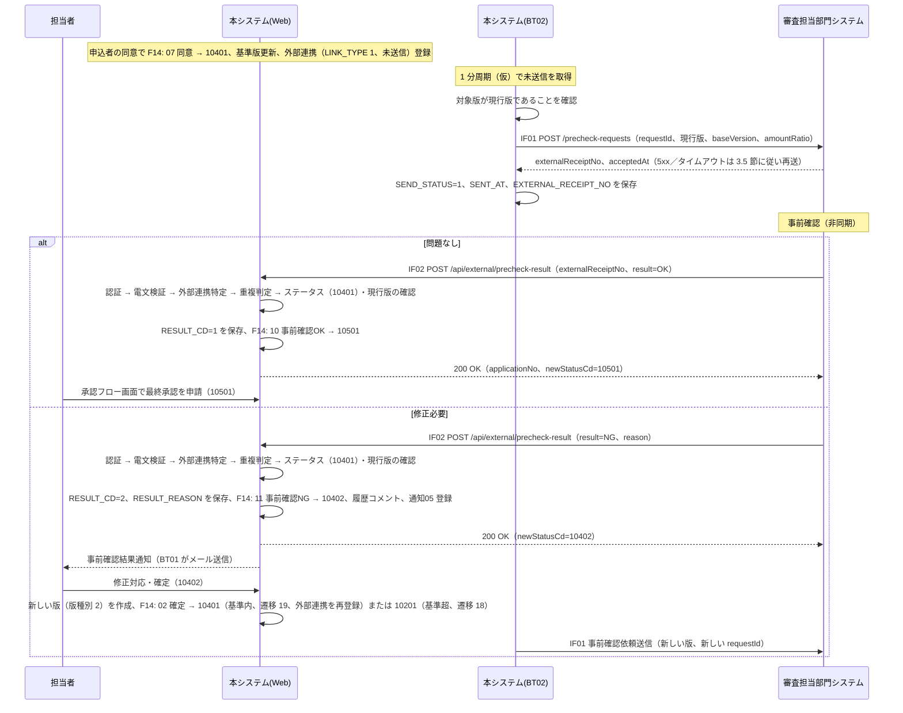
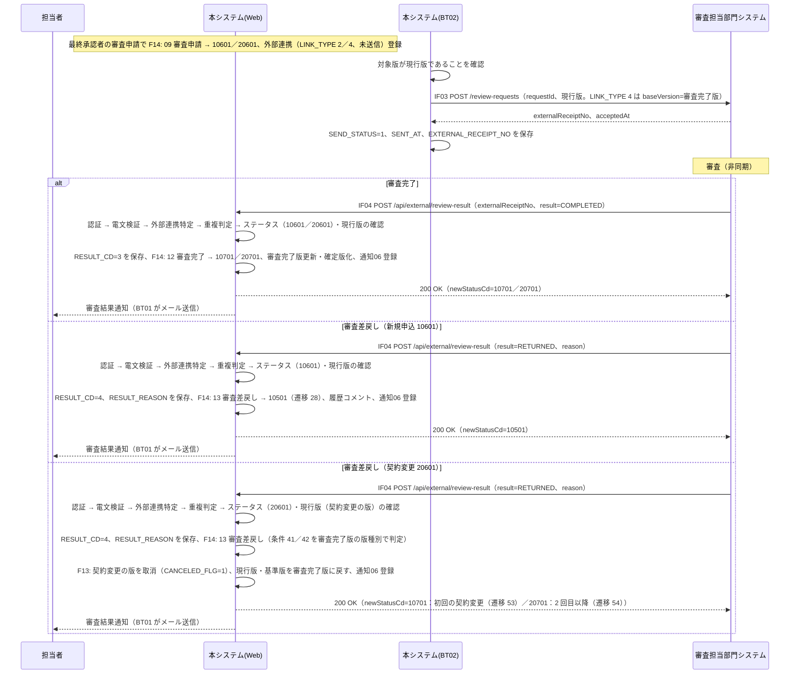

# 12. 外部インターフェース設計

| 項目 | 内容 |
| --- | --- |
| 版 | 0.2（ステータス体系の改定を反映） |
| 関連 | [01. システム概要](01-overview.md)、[03. ステータス定義・状態遷移](03-status-transition.md)、[07. テーブル定義](07-table-definition.md)、[08. コード定義](08-code-definition.md)、[09. 機能一覧](09-function-list.md)、[10. 機能詳細](10-function-detail.md)、[13. バッチ・通知設計](13-batch-notification.md)、[14. 共通仕様](14-common-spec.md)、[99. 未決事項](99-open-issues.md) |

審査担当部門システム（外部システム）との API 連携（IF01〜IF04）と、担当者がアップロードする申込一括取込ファイル（IF05）を定義する。
審査担当部門は本システムの画面を使わず、審査担当部門システムの審査管理画面で事前確認・審査を行う。本システムは依頼を送り、結果を受け取るだけで、審査管理画面は持たない（[01. システム概要 3 章](01-overview.md#3-登場人物アクター)、[99. 未決事項](99-open-issues.md) No.3）。
審査担当部門システムの API 仕様は未入手のため、連携方式・エンドポイント・電文・認証は本設計の仮置き（文中「仮」）であり、実物の入手後に見直す（7 章）。

## 1. IF 一覧

IF ID・IF 名は [09. 機能一覧](09-function-list.md#外部インターフェース一覧概要) に従う。遷移 ID は [03. 6 章](03-status-transition.md#6-ステータス遷移マスタ-初期データ)、連携種別・連携結果・操作コードは [08. コード定義](08-code-definition.md) の値。

| IF ID | IF 名 | 方向 | 方式 | 契機 | 頻度 | 機能 | 連携種別／操作コード |
| --- | --- | --- | --- | --- | --- | --- | --- |
| IF01 | 事前確認依頼送信 | 本システム → 審査担当部門システム | REST／JSON over HTTPS（本システムがクライアント） | 10401／20401 到達時（遷移 ID 15、19、32、43、47）に F14 が登録した外部連携（LINK_TYPE 1／3、未送信）を BT02 が送信 | BT02 の周期（1 分ごと、仮）で未送信分をまとめて処理 | F08 | LINK_TYPE 1：事前確認依頼、3：契約変更事前確認依頼 |
| IF02 | 事前確認結果受信 | 審査担当部門システム → 本システム | REST／JSON over HTTPS（本システムがサーバ。コールバック） | 審査担当部門システムの事前確認完了時 | 随時（24 時間受信） | F09 | result `OK` → 操作コード 10 事前確認OK（RESULT_CD 1 問題なし）、`NG` → 11 事前確認NG（RESULT_CD 2 修正必要） |
| IF03 | 審査依頼送信 | 本システム → 審査担当部門システム | IF01 と同じ | 10601／20601 到達時（遷移 ID 26、51）に F14 が登録した外部連携（LINK_TYPE 2／4、未送信）を BT02 が送信 | IF01 と同じ | F08 | LINK_TYPE 2：審査依頼、4：契約変更審査依頼 |
| IF04 | 審査結果受信 | 審査担当部門システム → 本システム | IF02 と同じ | 審査担当部門システムの審査完了時 | 随時（24 時間受信） | F09（契約変更の審査差戻しは F13） | result `COMPLETED` → 12 審査完了（RESULT_CD 3）、`RETURNED` → 13 審査差戻し（RESULT_CD 4） |
| IF05 | 申込一括取込ファイル | 担当者 → 本システム（ファイル） | CSV ファイルを SC10 からアップロード | 担当者の操作 | 随時 | F01 | 操作コード 00 新規作成（ステータス履歴のみ）。ステータス 10100 で登録 |

- IF01〜IF04 は 1 つの審査担当部門システムを相手とし、依頼（送信）と結果（受信）は外部受付番号（T_EXTERNAL_LINK.EXTERNAL_RECEIPT_NO）で対応づける。
- 外部連携レコード（T_EXTERNAL_LINK）1 行が依頼 1 回に対応する。同じ申込でも再依頼（修正対応後の再確定、審査差戻し後の再申請など）のたびに新しい行を作る。
- IF01 と IF03 は電文構造を共通にし、連携種別（linkType）で区別する。IF02 と IF04 も電文構造は共通だが、エンドポイントは分ける。結果を受信できるステータスは IF02 が 10401／20401、IF04 が 10601／20601 で、それ以外のステータスで届いた結果は受け付けない（4.3 節）。

## 2. 連携共通仕様（IF01〜IF04）

### 2.1 方式（仮）

| 項目 | 内容 |
| --- | --- |
| プロトコル | HTTPS（TLS 1.2 以上）。メソッドは POST、本文は JSON |
| 処理方式 | 非同期。依頼送信（IF01／IF03）の応答では外部受付番号を受け取るだけで、事前確認・審査の結果は審査担当部門システムからのコールバック（IF02／IF04）で受け取る |
| 送信側の実装 | BT02 外部連携送信バッチ → 外部連携サービス → 審査担当部門システム API クライアント（infra.extapi） |
| 受信側の実装 | web.api パッケージの Servlet。Filter で API 認証を行い、外部連携サービスを通して F14 を操作主体 4（審査担当部門）、操作者 ID = 外部システム ID（設定値、例 `EXT01`）で呼ぶ |
| 対応づけ | 送信電文の requestId（EXTERNAL_LINK_ID）と応答の externalReceiptNo を T_EXTERNAL_LINK に保持し、結果受信時は externalReceiptNo でレコードを特定し、requestId で突合する |

### 2.2 認証（仮）

| 方向 | 方式 | 備考 |
| --- | --- | --- |
| 送信（IF01／IF03） | 審査担当部門システムが発行した API キーを本システムが `X-API-Key` ヘッダに付与する | キーは設定ファイル（環境変数）で管理し、リポジトリ・ログに含めない |
| 受信（IF02／IF04） | 本システムが発行した API キーを審査担当部門システムが `X-API-Key` ヘッダに付与する。加えて接続元 IP アドレスを許可リストで制限する | 許可 IP は設定ファイル。いずれかに失敗すると E401 |

- API キーは送信用・受信用に 1 本ずつを想定し、切替時は新旧 2 本を一定期間併用できるようにする（仮）。

### 2.3 エンドポイント（仮）

| IF | メソッド | URL | 備考 |
| --- | --- | --- | --- |
| IF01 | POST | `{外部ベース URL}/precheck-requests` | ベース URL は環境ごとの設定値（extapi.base-url） |
| IF03 | POST | `{外部ベース URL}/review-requests` | 同上 |
| IF02 | POST | `{本システムベース URL}/api/external/precheck-result` | 本システムのコンテキストパス配下 |
| IF04 | POST | `{本システムベース URL}/api/external/review-result` | 同上 |

### 2.4 HTTP ヘッダ

| ヘッダ | 値 | 送信時 | 受信時 |
| --- | --- | --- | --- |
| Content-Type | `application/json; charset=UTF-8` | 付与する | 必須。これ以外は E400 |
| Accept | `application/json` | 付与する | 任意 |
| X-API-Key | API キー | 付与する | 必須。なし・不一致は E401 |
| Content-Length | 本文長 | 付与する | 受信本文は 64KB 以内（仮）。超過は E400 |

### 2.5 文字コード・書式

| 項目 | 規則 | 例 |
| --- | --- | --- |
| 文字コード | UTF-8 | |
| 日時 | ISO 8601（秒まで、タイムゾーンオフセット付き） | `2026-09-30T10:15:30+09:00` |
| 日付 | yyyy-MM-dd | `2026-10-01` |
| 金額 | 整数（円）。JSON の number。小数・カンマなし | `1000000` |
| 倍率 | JSON の number。小数第 4 位まで（切り捨て済みの値） | `1.8` |
| 区分値 | 文字列。[08. コード定義](08-code-definition.md) の値をそのまま使う | `"1"` |
| ステータスコード | 文字列(5)。[03. ステータス定義・状態遷移](03-status-transition.md) の値 | `"10701"` |
| 数値 ID・回数 | JSON の number（requestId、versionNo、contractChangeCount） | `1023` |
| 値なし | 項目を省略するか `null`。空文字は「値あり」として桁チェックの対象とする | |

### 2.6 タイムアウト・リトライ（送信側、仮）

| 項目 | 値 |
| --- | --- |
| 接続タイムアウト | 5 秒 |
| 読取タイムアウト | 30 秒 |
| 再送上限 | 3 回。RETRY_COUNT が 3 に達したら SEND_STATUS = 2（送信エラー） |
| 再送間隔 | BT02 の周期（1 分ごと）。次回周期で未送信分として再送する |
| 再送対象 | 5xx 応答、タイムアウト、接続エラー、応答本文の解析失敗。4xx は再送しない（3.5 節） |

送信エラー確定時は担当社員・管理者へ送信エラー通知（通知種別 07）を登録する。担当者・管理者は SC03 の外部連携再送操作で SEND_STATUS を 0、RETRY_COUNT を 0 に戻して再送できる（[13. バッチ・通知設計](13-batch-notification.md)）。

### 2.7 冪等性

- 送信側：同じ requestId（EXTERNAL_LINK_ID）の依頼を審査担当部門システムが 2 回以上受けた場合は、新規受付とせず初回の externalReceiptNo を HTTP 200 で返してもらう（仮）。読取タイムアウト後の再送で依頼が二重に登録されることを防ぐ。
- 受信側：同じ externalReceiptNo の結果を 2 回以上受けた場合、2 回目以降は「重複受信（E200）」として HTTP 200 で受け流し、DB は更新しない。
- 受信側の同時実行：同じ受付番号の結果が同時に届いた場合は、申込行の楽観排他により一方が正常、他方が E409 になる。E409 の後に再送すると E200 になる。

### 2.8 ログ

| 項目 | 内容 |
| --- | --- |
| 出力先 | IF ログ（[14. 共通仕様 9 章](14-common-spec.md#9-ログ)）。保持 1 年（仮） |
| 出力内容 | 日時、IF ID、方向、requestId、externalReceiptNo、applicationNo、versionNo、linkType、result、HTTP ステータス、エラーコード、所要時間（ms）、接続元 IP（受信時） |
| 電文 | 送受信の本文は上記の要約を記録し、全文は DEBUG レベルでのみ出力する。個人情報（applicantName、applicantKana、mailAddress、telNo、address）はマスクする |
| 出力しないもの | API キー |

## 3. IF01／IF03 送信電文

### 3.1 送信の流れ（BT02）

1. T_EXTERNAL_LINK から SEND_STATUS = 0 の行を EXTERNAL_LINK_ID の昇順に取得する。
2. 行ごとに、対象の版（VERSION_NO）が申込の現行版（T_APPLICATION.CURRENT_VERSION_NO）であることを確認する。違えば送信せず SEND_STATUS = 2、ERROR_MESSAGE「版が更新されたため送信中止」とする（後続に新しい外部連携があるため通知 07 は登録しない）。
3. 申込・現行版・申込者（M_APPLICANT）と、比較元の版（IF01 は基準版、IF03 の契約変更審査依頼は審査完了版）から電文を組み立て、LINK_TYPE に応じたエンドポイントへ POST する。
4. 応答を 3.5 節に従って処理し、1 行ごとにコミットする。

### 3.2 リクエスト項目

IF01 と IF03 で共通。「必須」の △ は条件付きで設定する項目。

| No | 項目名（JSON キー） | 型 | 必須 | 参照元テーブル.項目 | 説明 |
| --- | --- | --- | --- | --- | --- |
| 1 | requestId | number | ○ | T_EXTERNAL_LINK.EXTERNAL_LINK_ID | 本システム側の依頼 ID。冪等キー。結果受信時に突合する |
| 2 | linkType | string(1) | ○ | T_EXTERNAL_LINK.LINK_TYPE | IF01：1／3、IF03：2／4 |
| 3 | applicationNo | string(12) | ○ | T_APPLICATION.APPLICATION_NO | |
| 4 | versionNo | number | ○ | T_EXTERNAL_LINK.VERSION_NO | 依頼対象の版。送信時点の現行版と一致する |
| 5 | versionType | string(1) | ○ | T_APPLICATION_VERSION.VERSION_TYPE | 1：新規申込、2：新規申込の修正、3：契約変更、4：契約変更の修正 |
| 6 | companyDiv | string(1) | ○ | T_APPLICATION.COMPANY_DIV | 1：事前確認なし、2：事前確認あり |
| 7 | applicant | object | ○ | | 申込者情報（No.8〜13） |
| 8 | applicant.applicantNo | string(12) | ○ | M_APPLICANT.APPLICANT_NO | |
| 9 | applicant.applicantName | string(100) | ○ | M_APPLICANT.APPLICANT_NAME | |
| 10 | applicant.applicantKana | string(100) | | M_APPLICANT.APPLICANT_KANA | |
| 11 | applicant.mailAddress | string(254) | ○ | M_APPLICANT.MAIL_ADDRESS | |
| 12 | applicant.telNo | string(15) | | M_APPLICANT.TEL_NO | |
| 13 | applicant.address | string(200) | | M_APPLICANT.ADDRESS | |
| 14 | product | object | ○ | | 商品情報（No.15） |
| 15 | product.productCd | string(10) | ○ | T_APPLICATION_VERSION.PRODUCT_CD | 現行版 |
| 16 | amounts | object | ○ | | 金額項目（No.16-1〜16-4）。項目の名称・個数は仮 |
| 16-1 | amounts.basicFee | number | ○ | T_APPLICATION_VERSION.BASIC_FEE | 現行版。円。整数 |
| 16-2 | amounts.optionFee | number | ○ | T_APPLICATION_VERSION.OPTION_FEE | 同上。未入力は 0 |
| 16-3 | amounts.handlingFee | number | ○ | T_APPLICATION_VERSION.HANDLING_FEE | 同上。未入力は 0 |
| 16-4 | amounts.totalAmount | number | ○ | T_APPLICATION_VERSION.TOTAL_AMOUNT | 申込金額合計（基本料金・オプション料金・事務手数料 の合計）。変更基準の判定対象 |
| 17 | contractStartDate | string(日付) | | T_APPLICATION_VERSION.CONTRACT_START_DATE | yyyy-MM-dd |
| 18 | contractEndDate | string(日付) | | T_APPLICATION_VERSION.CONTRACT_END_DATE | yyyy-MM-dd |
| 19 | remarks | string(1000) | | T_APPLICATION_VERSION.REMARKS | |
| 20 | baseVersion | object | IF01 ○／IF03 △ | T_APPLICATION_VERSION（IF01：T_APPLICATION.BASE_VERSION_NO の版、IF03：T_APPLICATION.REVIEWED_VERSION_NO の版） | 比較元の版（No.21〜26）。IF01 は基準版を常に設定する。IF03 は契約変更審査依頼（LINK_TYPE 4）のとき審査完了版（契約変更前の内容）を設定し、審査依頼（LINK_TYPE 2）では省略する |
| 21 | baseVersion.versionNo | number | △ | 同上.VERSION_NO | |
| 22 | baseVersion.productCd | string(10) | △ | 同上.PRODUCT_CD | |
| 23 | baseVersion.totalAmount | number | △ | 同上.TOTAL_AMOUNT | 基準版の申込金額合計 |
| 24 | baseVersion.contractStartDate | string(日付) | | 同上.CONTRACT_START_DATE | |
| 25 | baseVersion.contractEndDate | string(日付) | | 同上.CONTRACT_END_DATE | |
| 26 | baseVersion.remarks | string(1000) | | 同上.REMARKS | |
| 27 | amountRatio | number | IF01 ○ | T_APPLICATION_VERSION.AMOUNT_RATIO | 現行版の変更金額倍率（申込金額合計 ÷ 基準版の申込金額合計）。同意直後の依頼（遷移 ID 15、43）は現行版が基準版そのもののため 1.0 を設定する。IF03 は現行版に値があれば送る（任意） |
| 29 | contractChangeCount | number | ○ | （T_APPLICATION.REVIEWED_VERSION_NO の版の VERSION_TYPE から算出） | 契約変更の回数（仮）。新規申込の依頼（LINK_TYPE 1／2）は 0。契約変更の依頼（LINK_TYPE 3／4）は、審査完了版の版種別が 1／2（新規申込系）なら 1（初回の契約変更）、3／4（契約変更系）なら 2（2 回目以降。正確な回数は表さない）。条件コード 41／42 と同じ判定 |
| 30 | requestedAt | string(日時) | ○ | （送信時の現在日時） | ISO 8601 |

### 3.3 電文例（IF01 事前確認依頼：修正対応後の再依頼）

修正対応待ち（10402）で担当者が修正して確定し（遷移 ID 19）、新しい版（第 2 版、版種別 2）で事前確認を再依頼する例。基準版は申込者が同意した第 1 版。

```json
{
  "requestId": 1023,
  "linkType": "1",
  "applicationNo": "AP0000000123",
  "versionNo": 2,
  "versionType": "2",
  "companyDiv": "2",
  "applicant": {
    "applicantNo": "A00000000001",
    "applicantName": "山田 太郎",
    "applicantKana": "ヤマダ タロウ",
    "mailAddress": "taro.yamada@example.com",
    "telNo": "03-0000-0000",
    "address": "東京都千代田区丸の内1-1-1"
  },
  "product": { "productCd": "PRD001" },
  "amounts": { "basicFee": 1000000, "optionFee": 200000, "handlingFee": 0, "totalAmount": 1200000 },
  "contractStartDate": "2026-10-01",
  "contractEndDate": "2027-09-30",
  "remarks": null,
  "baseVersion": {
    "versionNo": 1,
    "productCd": "PRD001",
    "totalAmount": 1000000,
    "contractStartDate": "2026-10-01",
    "contractEndDate": "2027-09-30",
    "remarks": null
  },
  "amountRatio": 1.2,
  "contractChangeCount": 0,
  "requestedAt": "2026-09-30T10:15:30+09:00"
}
```

- IF03（審査依頼）は linkType を 2／4 とする。新規申込の審査依頼（LINK_TYPE 2）では baseVersion・amountRatio を含めない。契約変更審査依頼（LINK_TYPE 4）では baseVersion に審査完了版（契約変更前の内容）を設定し、contractChangeCount を 1 または 2 とする。
- 契約変更の事前確認依頼（LINK_TYPE 3）は上記と同じ構造で、versionType が 3 または 4、baseVersion が基準版（契約変更開始時は審査完了版、申込者同意後は同意した版）になる。

### 3.4 レスポンス項目（HTTP 200）

| No | 項目名（JSON キー） | 型 | 必須 | 格納先テーブル.項目 | 説明 |
| --- | --- | --- | --- | --- | --- |
| 1 | externalReceiptNo | string(30) | ○ | T_EXTERNAL_LINK.EXTERNAL_RECEIPT_NO | 審査担当部門システムが採番する。本システム内で一意（UK） |
| 2 | acceptedAt | string(日時) | ○ | （IF ログのみ） | 審査担当部門システムの受付日時。SENT_AT には本システムの応答受信時刻を保存する |

### 3.5 HTTP ステータスと送信結果の扱い

| 応答 | 判定 | T_EXTERNAL_LINK の更新 | 後続 |
| --- | --- | --- | --- |
| 200／201 で externalReceiptNo あり | 送信成功 | SEND_STATUS = 1、SENT_AT = 現在日時、EXTERNAL_RECEIPT_NO、ERROR_MESSAGE = 空 | 結果受信待ち |
| 200／201 だが本文が不正（受付番号なし、JSON 解析不可、30 桁超） | 再送 | RETRY_COUNT + 1、ERROR_MESSAGE。RETRY_COUNT = 3 なら SEND_STATUS = 2 | 上限到達で通知 07 を登録 |
| 4xx（400、401、403、404、409、422 など） | 送信エラー（再送しない） | RETRY_COUNT + 1、SEND_STATUS = 2、ERROR_MESSAGE = HTTP ステータスと応答本文の先頭（1000 桁以内） | 通知 07 を登録 |
| 5xx、タイムアウト、接続エラー | 再送 | RETRY_COUNT + 1、ERROR_MESSAGE。RETRY_COUNT = 3 なら SEND_STATUS = 2 | 上限到達で通知 07 を登録 |
| 受付番号が他の外部連携と重複（UK 違反） | 送信エラー（再送しない） | SEND_STATUS = 2、ERROR_MESSAGE「受付番号が重複」 | 通知 07 を登録。審査担当部門システムの採番を確認 |

## 4. IF02／IF04 受信電文

### 4.1 エンドポイント

| IF | メソッド | パス | 受信 Servlet（web.api、名称は仮） | 対象の連携種別 | 受信可能なステータス | 操作コード |
| --- | --- | --- | --- | --- | --- | --- |
| IF02 | POST | `/api/external/precheck-result` | PrecheckResultApiServlet | 1／3 | 10401／20401 | 10 事前確認OK／11 事前確認NG |
| IF04 | POST | `/api/external/review-result` | ReviewResultApiServlet | 2／4 | 10601／20601 | 12 審査完了／13 審査差戻し |

- POST 以外のメソッドは HTTP 405 で応答する。社員セッション・CSRF トークンの検証対象外とし、API 認証（2.2 節）だけを行う。

### 4.2 リクエスト項目

| No | 項目名（JSON キー） | 型 | 必須 | 格納先テーブル.項目 | 説明 |
| --- | --- | --- | --- | --- | --- |
| 1 | externalReceiptNo | string(30) | ○ | （照合キー）T_EXTERNAL_LINK.EXTERNAL_RECEIPT_NO | 依頼送信の応答で受け取った受付番号 |
| 2 | requestId | number | ○ | （突合）T_EXTERNAL_LINK.EXTERNAL_LINK_ID | 依頼送信の requestId。受付番号で特定した行と不一致なら E400 |
| 3 | result | string | ○ | T_EXTERNAL_LINK.RESULT_CD | IF02：`OK`（→ 1 問題なし）／`NG`（→ 2 修正必要）。IF04：`COMPLETED`（→ 3 審査完了）／`RETURNED`（→ 4 審査差戻し）。大文字のみ |
| 4 | reason | string(1000) | NG／RETURNED 時 ○ | T_EXTERNAL_LINK.RESULT_REASON、T_STATUS_HISTORY.COMMENT（500 桁で切詰め） | NG 時は指摘内容、RETURNED 時は差戻し理由。OK・COMPLETED 時に設定されていても無視する |
| 5 | resultAt | string(日時) | ○ | （IF ログのみ） | 審査担当部門システム側の結果確定日時。RESULT_RECEIVED_AT には本システムの受信時刻を保存する |

### 4.3 処理手順

IF02 と IF04 で共通。1 リクエスト 1 トランザクションとし、E200 以外のエラーでは DB を更新しない。

| 手順 | 処理 | 失敗時 |
| --- | --- | --- |
| 1 | 認証：Filter で `X-API-Key` と接続元 IP を検証する | E401 |
| 2 | 電文検証：Content-Type、JSON 構文、必須、型・桁、result の値域（IF02：OK／NG、IF04：COMPLETED／RETURNED）、NG／RETURNED 時の reason の有無 | E400 |
| 3 | 外部連携の特定：externalReceiptNo で T_EXTERNAL_LINK を検索し、LINK_TYPE が IF に対応する値（IF02：1／3、IF04：2／4）であることを確認する。requestId が一致することを確認する | 該当なし・種別違い：E404。requestId 不一致：E400 |
| 4 | 重複判定：RESULT_CD が設定済みなら重複受信とする | E200（HTTP 200、更新なし） |
| 5 | ステータス確認：申込を行バージョン付きで取得し、STATUS_CD が IF02 は 10401／20401、IF04 は 10601／20601 であることを確認する | E409 |
| 6 | 版確認：T_EXTERNAL_LINK.VERSION_NO = T_APPLICATION.CURRENT_VERSION_NO であることを確認する | E410 |
| 7 | 結果保存：RESULT_CD（OK → 1、NG → 2、COMPLETED → 3、RETURNED → 4）、RESULT_RECEIVED_AT = 現在日時、NG／RETURNED 時は RESULT_REASON を更新する | |
| 8 | F14 呼出：操作コード（下表）、操作主体 4、操作者 ID = 外部システム ID、経路情報 = EXTERNAL_LINK_ID、コメント = reason（NG／RETURNED 時。500 桁で切詰め）、期待する行バージョン = 手順 5 で読んだ値 | 遷移不可・排他：E409 |
| 9 | 応答：status = OK、applicationNo、newStatusCd、message を返し、コミットする | 想定外の例外：E500（ロールバック） |

手順 8 の操作コードと遷移、F14 の後続処理（[10. 機能詳細 1.5 節](10-function-detail.md#15-後続処理)）は次のとおり。

| IF | result | 操作コード | 受信時のステータス | 遷移 ID | 遷移先 | F14 の後続処理 |
| --- | --- | --- | --- | --- | --- | --- |
| IF02 | OK | 10 事前確認OK | 10401／20401 | 16／44 | 10501／20501 | なし（担当者が最終承認の申請へ進む） |
| IF02 | NG | 11 事前確認NG | 10401／20401 | 17／45 | 10402／20402 | 指摘内容を履歴コメントに記録。担当社員へ事前確認結果通知（05）を登録 |
| IF04 | COMPLETED | 12 審査完了 | 10601／20601 | 27／52 | 10701／20701 | 審査完了版番号 = 現行版番号、審査完了日時を更新し、現行版を確定版（FIXED_FLG = 1）にする。担当社員へ審査結果通知（06）を登録 |
| IF04 | RETURNED | 13 審査差戻し | 10601 | 28 | 10501 | 差戻し理由を履歴コメントに記録。担当社員へ審査結果通知（06）を登録 |
| IF04 | RETURNED | 13 審査差戻し | 20601 | 53（条件 41 初回の契約変更）／54（条件 42 2 回目以降） | 10701／20701 | F13 契約変更審査差戻しの復元：契約変更で作った版（審査完了版より後の版）を取消（CANCELED_FLG = 1）にし、現行版番号・基準版番号を審査完了版番号に戻す。差戻し理由を履歴コメントに記録。審査結果通知（06）を登録（[10. 機能詳細 14 章](10-function-detail.md#14-f13-契約変更審査差戻しの復元)） |

- 20601 の RETURNED では、手順 6 の版確認は F13 の復元前（契約変更の版が現行版の状態）で行う。応答の newStatusCd は復元後のステータス（10701 または 20701）。
- 遷移 ID 53／54 の条件は審査完了版の版種別で判定する。審査完了版が存在しない（設計上は発生しない）場合は遷移不可として E409 を返す。
- result と RESULT_CD・操作コードの対応は [08. コード定義 18 章](08-code-definition.md#18-連携結果result_cd外部連携) に従う。

### 4.4 レスポンス項目

| No | 項目名（JSON キー） | 型 | 必須 | 説明 |
| --- | --- | --- | --- | --- |
| 1 | status | string | ○ | `OK`：正常（重複受信を含む）、`ERROR`：エラー |
| 2 | errorCode | string | エラー時・重複時 ○ | 4.5 節のコード。正常時は null |
| 3 | applicationNo | string(12) | 特定できた場合 ○ | 対象の申込番号。E401／E400／E404 では null |
| 4 | newStatusCd | string(5) | 特定できた場合 ○ | 遷移後のステータスコード。重複受信・E409／E410 では現在のステータスコード |
| 5 | message | string | ○ | 日本語のメッセージ |

```json
{ "status": "OK", "errorCode": null, "applicationNo": "AP0000000123", "newStatusCd": "10701", "message": "審査完了を受け付けました。" }
```

### 4.5 エラーコード

| コード | HTTP | 名称 | 発生条件 | 審査担当部門システムに期待する動作（仮） |
| --- | --- | --- | --- | --- |
| E200 | 200 | 重複受信 | 同じ受付番号の結果を受信済み（RESULT_CD 設定済み） | 正常終了として扱う。再送不要 |
| E400 | 400 | 電文不正 | Content-Type 不正、JSON 構文エラー、必須欠落、型・桁エラー、result の値域外、NG／RETURNED で reason なし、requestId 不一致、本文サイズ超過 | 電文を修正して送り直す。自動再送はしない |
| E401 | 401 | 認証エラー | API キーなし・不一致、接続元 IP が許可リスト外 | 設定を確認する。自動再送はしない |
| E404 | 404 | 受付番号不明 | 受付番号に該当する外部連携がない（IF と連携種別の不一致を含む） | 受付番号を確認する。依頼受付の直後は本システム側の記録が未完了の可能性があるため、間隔をあけて数回再送する |
| E409 | 409 | ステータス不整合 | 申込のステータスが受信可能なステータスでない、遷移マスタに該当なし、排他エラー | 排他エラー以外は再送しても解消しない。担当者間で状況を確認する |
| E410 | 410 | 対象版が現行版でない | 外部連携の版番号 ≠ 申込の現行版番号（結果受信前に新しい版の依頼を送信済み） | 結果は破棄する。新しい依頼（新しい受付番号）に対して結果を返す |
| E500 | 500 | システムエラー | DB 障害、想定外の例外 | 間隔をあけて再送する |

エラー時は status = `ERROR`、errorCode、message を返す。E401 では本システムの情報を漏らさないよう message は固定文言とする。

### 4.6 電文例（IF04 審査差戻し）

```json
{
  "externalReceiptNo": "EXT-20261015-000456",
  "requestId": 1088,
  "result": "RETURNED",
  "reason": "申込金額に対する根拠資料が不足しているため、追加資料の添付後に再申請が必要。",
  "resultAt": "2026-10-16T14:30:00+09:00"
}
```

IF02 事前確認結果も同じ構造で、result を `OK` または `NG`（reason に指摘内容）とする。

## 5. IF05 申込一括取込ファイル

### 5.1 ファイル仕様（仮）

| 項目 | 仕様 |
| --- | --- |
| 形式 | CSV（カンマ区切り）。拡張子 `.csv` |
| 文字コード | UTF-8（BOM 可。BOM は読み飛ばす）。UTF-8 として復号できない場合はファイルエラー |
| 改行 | CRLF または LF |
| ヘッダ行 | あり（1 行目）。列名は 5.2 節の項目名と一致すること（前後の空白は無視）。不一致はファイルエラー |
| 囲み文字 | ダブルクォートで囲んでもよい。囲み内のカンマ・改行は値として扱い、囲み内の `"` は `""` でエスケープする |
| 列数 | 13 列固定（申込者 6 列＋申込内容 7 列）。列数が異なる行はエラー行 |
| 空行 | 全列が空の行は読み飛ばし、件数に含めない |
| 最大行数 | 1,000 行（ヘッダ行を除く）。超過はファイルエラー |
| 最大サイズ | 5MB。超過はファイルエラー |
| 前処理 | 各列の前後の空白をトリムしてからチェックする |

### 5.2 レイアウト

| 列 | 項目名（ヘッダ） | 型 | 桁 | 必須 | チェック | 格納先テーブル.項目 |
| --- | --- | --- | --- | --- | --- | --- |
| 1 | 申込者番号 | 文字列 | 12 | | 空なら新規の申込者（2〜6 列を登録し採番）。指定した場合は M_APPLICANT.APPLICANT_NO に存在すること（2〜6 列は空） | T_APPLICATION.APPLICANT_ID（申込者番号から申込者 ID に変換） |
| 2 | 申込者名 | 文字列 | 100 | 新規の申込者○ | 必須、桁 | M_APPLICANT.APPLICANT_NAME |
| 3 | 申込者名カナ | 文字列 | 100 | | 全角カタカナ・スペース、桁 | M_APPLICANT.APPLICANT_KANA |
| 4 | メールアドレス | 文字列 | 254 | 新規の申込者○ | 必須、形式、登録済みの申込者と重複しないこと（同じファイル内で先に登録した同じ申込者名の行はその申込者に紐づける） | M_APPLICANT.MAIL_ADDRESS |
| 5 | 電話番号 | 文字列 | 15 | | 数字とハイフン、桁 | M_APPLICANT.TEL_NO |
| 6 | 住所 | 文字列 | 200 | | 桁 | M_APPLICANT.ADDRESS |
| 7 | 商品コード | 文字列 | 10 | ○ | 必須、桁、半角英数字（仮） | T_APPLICATION_VERSION.PRODUCT_CD |
| 8 | 基本料金 | 数値 | 13 | ○ | 必須、カンマなしの整数、0 以上、桁 | T_APPLICATION_VERSION.BASIC_FEE |
| 9 | オプション料金 | 数値 | 13 | | カンマなしの整数、0 以上、桁。空は 0 | T_APPLICATION_VERSION.OPTION_FEE |
| 10 | 事務手数料 | 数値 | 13 | | カンマなしの整数、0 以上、桁。空は 0 | T_APPLICATION_VERSION.HANDLING_FEE |
| 11 | 契約開始日 | 日付 | 10 | | yyyy-MM-dd、実在する日付 | T_APPLICATION_VERSION.CONTRACT_START_DATE |
| 12 | 契約終了日 | 日付 | 10 | | yyyy-MM-dd、実在する日付、契約開始日 ≦ 契約終了日（両方ある場合） | T_APPLICATION_VERSION.CONTRACT_END_DATE |
| 13 | 備考 | 文字列 | 1000 | | 桁、制御文字（改行・タブを除く）不可 | T_APPLICATION_VERSION.REMARKS |

申込金額合計（TOTAL_AMOUNT）は基本料金・オプション料金・事務手数料 の合計として F01 が計算する。合計が 0 の行はエラー（E005）。金額項目の名称・個数はサンプル（業務確認済み。実装時に実際の項目へ差し替える）。

ファイルにない項目は F01 が設定する：申込番号（採番）、担当社員・会社区分・部署（取込社員のもの）、ステータス 10100、現行版番号 1、登録区分 1（一括取込）、取込 ID、版番号 1、版種別 1、申込金額合計（計算）、確定版フラグ 0、取消フラグ 0。基準版番号・審査完了版番号は空のまま（[10. 機能詳細 2 章](10-function-detail.md#2-f01-申込一括取込)）。

### 5.3 チェックとエラーメッセージ

ファイル単位のエラーは何も登録せず画面に返す。行単位のエラーは T_IMPORT_ERROR に行番号（ヘッダ行を 1 とする）・エラー内容・行データを記録し、その行をスキップして残りの行を処理する（部分成功）。
同じ項目で複数のエラーがある場合は最初のエラーだけを記録し、項目をまたぐ複数エラーは「／」で連結する（ERROR_MESSAGE の 500 桁を超える分は切り捨て）。メッセージ ID は [14. 共通仕様 7 章](14-common-spec.md#7-メッセージ) の体系に従い、申込者番号の存在チェックは E1xx を詳細設計で採番する。

| 区分 | チェック | エラーメッセージ例 |
| --- | --- | --- |
| ファイル | 拡張子・サイズ・文字コード | E008「ファイルの形式またはサイズが正しくありません。」 |
| ファイル | ヘッダ行の不一致 | 「ヘッダ行が正しくありません。1 列目は「申込者番号」である必要があります。」 |
| ファイル | 行数超過、データ行なし | 「取込できる行数は 1,000 行までです。」「取込対象の行がありません。」 |
| 行 | 列数 | 「列数が正しくありません（13 列必要）。」 |
| 行 | 必須（新規の申込者の申込者名・メールアドレス、商品コード、基本料金） | E001「申込者名を入力してください。」 |
| 行 | 桁（各列） | E002「備考は1000桁以内で入力してください。」 |
| 行 | 型・書式（基本料金・オプション料金・事務手数料、契約開始日、契約終了日） | E003「基本料金の形式が正しくありません。」 |
| 行 | 相関（申込金額合計 > 0） | E005「申込金額合計は1以上の値を入力してください。」 |
| 行 | 相関（契約開始日 ≦ 契約終了日） | E004「契約終了日は契約開始日以降の日付を入力してください。」 |
| 行 | 業務（申込者番号の存在） | 「申込者番号 A00000000999 は申込者マスタに存在しません。」 |
| 行 | 業務（申込者番号を指定した行の申込者情報） | 「申込者番号を指定した行は申込者情報の列を空にしてください（登録済みの申込者の情報は取込で変更しません）。」 |
| 行 | 業務（メールアドレスの重複） | 「メールアドレス x は登録済みの申込者（C0000000001 山田 太郎）と同じです。同じ申込者なら申込者番号を指定してください。」「同じファイルの 3 行目と同じメールアドレスで申込者名が異なります。」 |

- 同一ファイル内で同じ申込者番号が複数行にあってもエラーにしない（申込者は複数の申込を持てる。仮）。新規の申込者も、同じメールアドレス・申込者名の行は 1 人として登録する。
- 一括取込（T_IMPORT_BATCH）の総件数はヘッダ行と空行を除いた行数、成功件数は 10100 で登録した件数、エラー件数はスキップした件数とする。

### 5.4 サンプル

2 行目は新規の申込者の正常行、3 行目は登録済みの申込者を指定した正常行（備考にカンマを含む）、4 行目はエラー行（基本料金の形式、契約終了日が契約開始日より前）の例。

```csv
申込者番号,申込者名,申込者名カナ,メールアドレス,電話番号,住所,商品コード,基本料金,オプション料金,事務手数料,契約開始日,契約終了日,備考
,山田 一郎,ヤマダ イチロウ,ichiro@example.com,03-0000-0001,東京都千代田区1-1-1,PRD001,1000000,0,0,2026-10-01,2027-09-30,
C0000000001,,,,,,PRD002,2000000,500000,,2026-10-15,,"備考に、カンマを含む例"
,鈴木 花子,スズキ ハナコ,hanako@example.com,,,PRD001,abc,0,0,2026-10-01,2026-09-01,エラー行の例
```

## 6. シーケンス図

### 6.1 事前確認（IF01 依頼送信 → IF02 問題なし／修正必要 受信）

会社区分 2 の新規申込で、申込者の同意（10302 → 10401、遷移 ID 15）を起点にした流れ。



- 契約変更側（20401／20402、LINK_TYPE 3、遷移 ID 32、43、44、45、47）も同じ流れで、ステータスと連携種別が読み替わる。
- 修正対応で変更基準超（遷移 ID 18／46）になった場合は一次承認・申込者確認からやり直し、申込者が再び同意した時点（遷移 ID 15／43）で事前確認依頼を改めて登録する。

### 6.2 審査（IF03 依頼送信 → IF04 審査完了／審査差戻し 受信）

最終承認者の審査申請（10502 → 10601、遷移 ID 26。契約変更は 20502 → 20601、遷移 ID 51）を起点にした流れ。



- 審査差戻し後の再申請（10501 → 10502 → 10601）では新しい外部連携（LINK_TYPE 2）を登録し、同じ版でも新しい requestId で依頼を送る。契約変更の審査差戻しで取り消した版は再利用せず、再度の契約変更手続き（10701／20701 → 20101）では審査完了版を複写した新しい版を作る。

## 7. 確認事項

審査担当部門システム側の仕様確認が必要な点と、本書での仮置き。番号は [99. 未決事項](99-open-issues.md) の関連 No。

| No | 確認事項 | 本書での仮置き | 99 の No |
| --- | --- | --- | --- |
| 1 | 審査管理画面の所在。本書は審査担当部門システム側の画面として扱い、本システムは IF で結果を受け取る。本システムに審査管理画面を持つ場合は IF02／IF04 を画面（SC14 審査管理、仮）に置き換え、F09 の処理手順を画面操作に読み替える | 審査担当部門システム側の画面 | 3 |
| 2 | 審査担当部門システムの API 仕様の実物（エンドポイント、電文項目と桁、受付番号の桁・体系、応答コード、エラー応答の形式）。IF02／IF04 を連携種別ごとに別エンドポイントとするか、単一エンドポイントで linkType により振り分けるか | 本書の電文・URL はすべて仮。受付番号は 30 桁以内。別エンドポイント | 15 |
| 3 | 連携方式の合意（REST／JSON 非同期、結果はコールバック）。ファイル連携やポーリング方式になる場合は BT02 と受信 Servlet の設計を見直す | REST／JSON 非同期、コールバック | 15 |
| 4 | 認証方式（API キー＋IP 制限、相互 TLS、OAuth2 など）、キーの発行・交換・ローテーション手順、接続元 IP の一覧 | `X-API-Key`＋接続元 IP 制限 | 15 |
| 5 | 再送ポリシー。本システムの送信側は 3 回・1 分間隔。審査担当部門システム側の結果送信（IF02／IF04）で E404／E500 を受けたときの再送有無と間隔 | 送信側 3 回・1 分間隔。受信側は E404／E500 で数回の再送を依頼 | 15 |
| 6 | 依頼受付の冪等性。同じ requestId の再送を外部側で重複扱い（初回の受付番号を返す）にできるか | できる前提 | 15 |
| 7 | 古い版の結果が届いた場合の扱い。本設計は E410 で受け付けない。外部側で古い依頼を取り下げる（キャンセル）API の要否と、契約変更の審査差戻し後に再度契約変更を依頼するとき前回の依頼（取り消した版）と関連づける必要があるか | E410 で受け付けない。キャンセル API はなし。関連づけない | 15、20 |
| 8 | 依頼受付の直後に結果が届いた場合（BT02 の受付番号保存前）の扱い。E404 になるため、外部側での再送または一定時間後の送信を依頼する | 外部側で再送 | 15 |
| 9 | 送信電文に含める申込者情報の範囲（個人情報の最小化）。baseVersion の要否（同意直後の事前確認依頼は現行版 = 基準版で差分がない）。契約変更審査依頼で審査完了版との差分を送る必要があるか | 申込者 6 項目を送る。IF01 は常に baseVersion を送り、IF03 は LINK_TYPE 4 のみ | 15 |
| 10 | 審査の結果値。本設計は審査完了（COMPLETED）と審査差戻し（RETURNED）のみで、否決（審査差戻し以外の終了）の結果値とステータスがない | 対象外 | 13 |
| 11 | 事前確認「修正必要」の指摘内容と審査差戻しの理由（reason）の必須化、文字数上限（1000 桁）、申込者への開示範囲 | NG／RETURNED で必須。申込受付会社のみに表示 | 11 |
| 12 | contractChangeCount の定義。本書は審査完了版の版種別から 0／1／2 を算出し、正確な回数は送らない。正確な回数が必要なら版種別 3 の版数（取消を除く）を数える | 0／1／2（仮） | 15 |
| 13 | 外部 IF の稼働時間。本システムは 24 時間受信するが、審査担当部門システム側のメンテナンス時間帯と、送信側の時間帯制限の要否 | 制限なし | 26 |
| 14 | 取込ファイルのレイアウト・文字コード・上限（Shift_JIS の要否、Excel 出力の BOM、同一申込者の重複行、契約開始日・終了日を必須にするか、申込者番号の採番体系） | UTF-8、1,000 行、5MB。契約開始日・終了日は任意 | 17 |
| 15 | 操作者 ID の設定値（例 `EXT01`）と外部システム ID の体系。T_STATUS_HISTORY.ACTOR_ID、CREATED_BY（20 桁）に収まること | `EXT01` | 15 |
