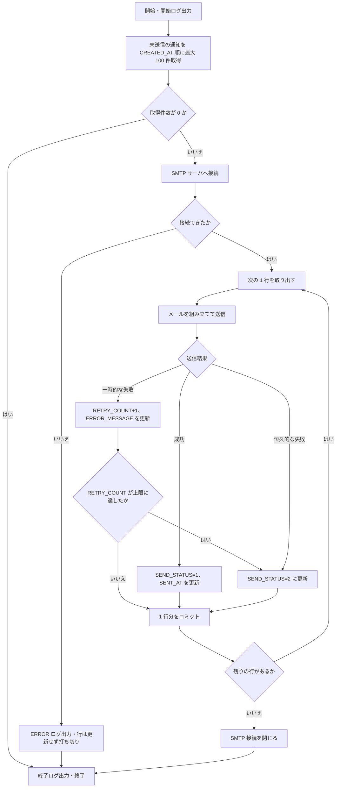

# 13. バッチ・通知設計

| 項目 | 内容 |
| --- | --- |
| 版 | 0.1（初版・ドラフト） |
| 関連 | [01. システム概要](01-overview.md)（設計方針 6）、[02. システム構成](02-system-architecture.md)、[03. ステータス定義・状態遷移](03-status-transition.md)、[07. テーブル定義](07-table-definition.md)、[08. コード定義](08-code-definition.md)、[09. 機能一覧](09-function-list.md)、[10. 機能詳細](10-function-detail.md)、[11. 画面設計](11-screen-design.md)、[12. 外部インターフェース設計](12-external-interface.md)、[14. 共通仕様](14-common-spec.md)、[99. 未決事項](99-open-issues.md) |
| 前提 | バッチの実行基盤・再送ポリシー・メール文面は仮置き（[99. 未決事項](99-open-issues.md) No.18、25、26）。確定後に本書を更新する |

メール通知と外部システムへの送信は、業務トランザクションの中では通知（T_NOTIFICATION）・外部連携（T_EXTERNAL_LINK）への登録までを F14 の後続処理として行い、実際の送信は本書のバッチが行う（[01. 設計方針 6](01-overview.md#5-設計方針)）。バッチはレコードを登録せず送るだけとし、例外は BT02 が送信エラー確定時に登録する通知種別 06 だけとする。

## 1. バッチ一覧

| バッチID | バッチ名 | 起動方式（仮） | 周期（仮） | 処理対象 | 多重起動防止 | 想定処理時間（仮） | 関連 |
| --- | --- | --- | --- | --- | --- | --- | --- |
| BT01 | 通知送信バッチ | 同一 WAR 内のスケジューラ（ServletContextListener で起動する ScheduledExecutorService） | 1 分ごと | T_NOTIFICATION の SEND_STATUS = 0（未送信）の行。1 回に最大 100 件 | バッチごとに 1 スレッドで実行し、前回実行が終わるまで次を起動しない。取得した行を「処理中」にはしない | 通常は数秒。100 件処理時で 1 分程度 | F06 ほか通知種別 01〜06、SMTP |
| BT02 | 外部連携送信バッチ | 同上 | 1 分ごと | T_EXTERNAL_LINK の SEND_STATUS = 0（未送信）の行。1 回に最大 100 件 | 同上 | 通常は数秒。外部システム無応答時は 1 件あたり最大 35 秒。連続失敗時は実行を打ち切る | F08、F11、IF01、IF03 |

- ID と名称は [09. 機能一覧](09-function-list.md#バッチ一覧概要) の定義に合わせる。
- BT01 と BT02 は互いに独立したスレッドで動く。同じバッチが 2 つ同時に動くことはないが、BT01 と BT02 が同時に動くことはある（更新するテーブルが異なるため問題ない）。AP サーバは 1 台を前提とし、2 台以上に配置する場合はいずれか 1 台だけでスケジューラを有効にする（設定値 `batch.enabled`）。

## 2. 共通仕様

### 2.1 起動・停止

| 項目 | 内容 |
| --- | --- |
| 起動 | Web アプリ起動時に `BatchScheduler`（ServletContextListener、パッケージ `infra.scheduler`）が `batch.enabled = true` のとき、バッチごとに 1 スレッドの ScheduledExecutorService を作り、`scheduleWithFixedDelay` で登録する。初回は起動の 30 秒後（仮）、以降は前回終了から周期分の間隔を空けて実行する |
| 停止 | Web アプリ停止時に `shutdown()` を呼び、実行中の 1 行が終わるまで最大 30 秒（仮）待つ。待ちきれない場合は `shutdownNow()` で中断する。行ごとにコミットしているため、中断しても未送信の行は次回起動時に処理される |
| 例外 | ジョブの `run()` はすべての例外を捕捉してログに出す。例外を外に投げるとスケジュールが止まるため |
| ジョブ本体 | `NotificationSendJob`（BT01）、`ExternalLinkSendJob`（BT02）はスケジューラに依存しない独立クラスとし、`main` から 1 回実行できるようにする。将来 OS スケジューラ（cron、タスクスケジューラ）や別プロセスへ分離するときは、WAR 側の `batch.enabled` を false にし、同じクラスを外部から起動する。その場合の多重起動防止はジョブ管理側で行い、DB 接続は設定ファイルの接続情報で組み立てる |
| DB 接続 | WAR 内で動く場合は Web アプリと同じ DataSource（JNDI）から接続を取得する |

### 2.2 実行ログ

バッチログは [14. 共通仕様 9 章](14-common-spec.md#9-ログ) のバッチログとして、Web アプリのログとは別ファイルに出力する（Logback の appender を分ける）。ログにはバッチ ID と、行を処理中は通知 ID／外部連携 ID と申込 ID を付ける（MDC）。

| タイミング | レベル | 出力内容 |
| --- | --- | --- |
| 実行開始 | INFO | バッチ ID、開始日時、取得件数 |
| 行の送信成功 | INFO | 通知 ID／外部連携 ID、申込 ID、通知種別／連携種別、所要時間。宛先アドレスはローカル部をマスクする |
| 行の送信失敗（再送待ち） | WARN | ID、再送回数、エラーの要約 |
| 行の送信エラー確定 | ERROR | ID、再送回数、エラー内容。BT02 では通知 06 の登録件数 |
| 基盤障害（SMTP・外部 API に接続できない） | ERROR | 接続先、例外、スタックトレース。実行の打ち切りを明記する |
| 実行終了 | INFO | 処理件数、成功件数、再送待ち件数、送信エラー確定件数、所要時間 |

取得件数が 0 の場合は開始・終了を DEBUG で出力し、INFO には残さない（1 分ごとにログが増えるため）。トークン平文、API キー、SMTP パスワード、メール本文はログに出力しない。

### 2.3 エラー時の継続方針

1. 1 件の送信失敗は、その行の送信状態・再送回数・エラー内容を更新して次の行へ進む。1 件の失敗で実行全体を止めない。
2. 行の更新自体（DB 更新）が失敗した場合はその行をロールバックしてログに出し、次の行へ進む。
3. BT01 は SMTP サーバに接続できない場合、行を更新せずに実行を打ち切り、再送回数は加算しない（仮）。BT02 の接続エラーは [12. 2.6 節](12-external-interface.md#26-タイムアウトリトライ送信側仮) に合わせて行の失敗として数え、接続エラー・タイムアウトが連続 5 回（仮）に達したら残りの行を処理せずに打ち切る。未処理のまま残った行は次回実行で改めて取得する。

### 2.4 トランザクション

- 1 行ごとにトランザクションを開始し、送信結果の反映（と BT02 の通知 06 登録）をコミットする。行の取得は読み取りだけの別トランザクションで行う。
- 送信状態の更新は `WHERE SEND_STATUS = '0' AND ROW_VERSION = 取得時の値` で行う（[14. 共通仕様 2 章](14-common-spec.md#2-排他制御)）。更新件数が 0 の場合（画面から再送操作されたなど）は WARN を出して次の行へ進む。
- 送信は成功したが DB 更新に失敗した場合、行は未送信のままとなり次回に再送される。メールは二重に届くことを許容する。外部連携は送信電文の requestId に外部連携 ID を入れ、外部システムが同じ requestId を初回の受付番号で応答する前提とする（[12. 2.7 節](12-external-interface.md#27-冪等性)、仮）。

### 2.5 設定値一覧（仮）

設定はプロパティファイル（`application.properties`、名称は仮）で管理する。パスワード・API キーは環境変数または配置先ごとの外部ファイルから読み、リポジトリには含めない（[14. 共通仕様 1.1](14-common-spec.md#11-認証)）。

| キー | 既定値（仮） | 説明 |
| --- | --- | --- |
| batch.enabled | true | WAR 内スケジューラの有効／無効 |
| batch.initial-delay-seconds／batch.shutdown-wait-seconds | 30／30 | 起動後の初回実行までの待ち時間／停止時に実行中の行の完了を待つ時間 |
| batch.notification.interval-seconds／max-rows／retry-limit | 60／100／3 | BT01 の周期（前回終了から次回開始まで）／1 回の最大処理件数／再送上限（失敗回数がこの値に達したら送信エラー） |
| batch.external.interval-seconds／max-rows／retry-limit | 60／100／3 | BT02 の周期／1 回の最大処理件数／再送上限 |
| batch.external.abort-after-consecutive-failures | 5 | BT02 で接続エラー・タイムアウトが連続した場合に実行を打ち切る回数 |
| mail.smtp.host／port／starttls | －／587／true | SMTP サーバと STARTTLS の使用 |
| mail.smtp.auth／user／password | false／－／－ | SMTP 認証。パスワードは環境変数 |
| mail.smtp.connection-timeout-ms／timeout-ms | 5000／30000 | SMTP の接続・送受信タイムアウト |
| mail.from.address／mail.from.name／mail.reply-to.address | －／申込管理システム／（空） | 送信元アドレス・表示名（要確認）と返信先。返信先が空なら付けない |
| extapi.base-url／review-path／precheck-path | －／/review-requests／/precheck-requests | 外部 API のベース URL と IF01・IF03 のパス（[12. 2.3 節](12-external-interface.md#23-エンドポイント仮)） |
| extapi.api-key | － | 外部 API の API キー（`X-API-Key` ヘッダ）。環境変数 |
| extapi.connect-timeout-ms／read-timeout-ms | 5000／30000 | 外部 API の接続・読取タイムアウト |
| app.customer-base-url／app.employee-base-url | － | 顧客向け確認 URL のベース URL（例：https://apply.example.com）／社員向け画面リンクのベース URL（社内向け） |

## 3. BT01 通知送信バッチ

### 3.1 概要

T_NOTIFICATION の未送信行を取得し、登録済みの宛先・件名・本文をそのまま Jakarta Mail で SMTP 送信する。件名・本文の組み立てとテンプレートの展開は登録側（F14 後続処理・通知サービス）で済んでおり、BT01 は本文を加工しない。

### 3.2 処理フロー



### 3.3 処理手順

1. 開始ログを出力する。
2. 未送信の通知を取得する。条件は `SEND_STATUS = '0'`、並び順は `CREATED_AT, NOTIFICATION_ID` の昇順、件数は `batch.notification.max-rows`（100 件、仮）。インデックス IX_T_NOTIFICATION_01 を使う。
3. 取得件数が 0 なら終了する。
4. SMTP サーバへ接続する（1 回の実行で 1 接続を使い回す）。接続できない場合は ERROR ログを出し、行を更新せずに終了する（2.3 節 3）。
5. 取得した行を順に処理する。
   1. メールを組み立てる。From = `mail.from.address`（表示名 `mail.from.name`）、To = TO_ADDRESS、Subject = SUBJECT、本文 = BODY（text/plain、UTF-8）。Reply-To は設定があれば付ける。
   2. 送信し、結果に応じて行を更新してコミットする（3.4 節）。
   3. 停止要求（スレッドの割込み）があれば、残りの行を処理せずに 6 へ進む。
6. SMTP 接続を閉じる。
7. 終了ログ（処理件数、成功、再送待ち、送信エラー確定）を出力する。

### 3.4 送信結果の判定と更新

| 結果 | 判定 | 更新内容 |
| --- | --- | --- |
| 成功 | 例外なく送信が完了した | SEND_STATUS = 1、SENT_AT = 現在日時、ERROR_MESSAGE = 空 |
| 一時的な失敗 | 送信中の I/O エラー、タイムアウト、SMTP 4xx 応答 | RETRY_COUNT = RETRY_COUNT + 1、ERROR_MESSAGE = 例外の要約（1,000 文字まで）。RETRY_COUNT が `retry-limit`（3、仮）に達したら SEND_STATUS = 2、達しなければ 0 のまま（次回実行で再送） |
| 恒久的な失敗 | 宛先アドレスの形式不正、SMTP 5xx 応答（宛先拒否など） | RETRY_COUNT + 1、ERROR_MESSAGE を記録し、即時 SEND_STATUS = 2（再送しても成功しないため。仮） |

- RETRY_COUNT は失敗した送信試行の回数とし、成功時は更新しない。上限 3 回・周期 1 分のため、一時的な失敗が続いた行は約 3 分で送信エラーになる。更新後の UPDATED_BY は `BT01` とする（[07. 共通項目](07-table-definition.md#2-共通項目)）。
- 通知の送信エラー（SEND_STATUS = 2）は BT01 では通知しない。ERROR ログと監視（6.1 節）、および管理者向けの一覧確認（画面は未定、7 章）で対応する。

## 4. 通知種別ごとの設計

### 4.1 登録契機と宛先

通知は F14 の後続処理（[10. 機能詳細 1.5](10-function-detail.md#15-後続処理)）が業務トランザクション内で登録する。遷移 ID は [03. 4 章](03-status-transition.md#4-ステータス遷移マスタ-初期データ) の値。

| 種別 | 名称 | 登録契機 | 登録者 | 宛先の決定ルール |
| --- | --- | --- | --- | --- |
| 01 | 顧客確認依頼 | 遷移先が 0301／0901：遷移 ID 4、5、28、29。および SC03「確認依頼メール再送」（[F06 7.3](10-function-detail.md#73-再送)） | F14（F06） | 申込の顧客（T_APPLICATION.CUSTOMER_ID）→ M_CUSTOMER.MAIL_ADDRESS |
| 02 | 承認依頼 | 遷移先が申請中（0202／0402／0802／1002）で承認申請が申請中：遷移 ID 3、6、11、14、27、30、35、38 | F14 | 承認申請の現在ステップ（CURRENT_STEP_NO）の承認明細の承認者 → M_EMPLOYEE.MAIL_ADDRESS。申請時はステップ 1、承認時は +1 した後のステップ |
| 03 | 差戻し通知 | 差戻し：遷移 ID 7、15、31、39 | F14 | 承認申請の申請社員（T_APPROVAL_REQUEST.REQUEST_EMPLOYEE_ID）→ M_EMPLOYEE.MAIL_ADDRESS |
| 04 | 確認NG通知 | 遷移先が 1102／1202：遷移 ID 23、45 | F14 | 申込の担当社員（T_APPLICATION.OWNER_EMPLOYEE_ID）→ M_EMPLOYEE.MAIL_ADDRESS |
| 05 | 審査完了通知 | 遷移先が 0601／0602：遷移 ID 17、41 | F14 | 同上 |
| 06 | 送信エラー通知 | 外部連携の送信エラー確定（5.4 節）。ステータス遷移は伴わない | BT02 | 申込の担当社員、および権限 09（管理者）で有効（VALID_FLG = 1）な全社員。宛先 1 件につき通知 1 行を登録し、重複する宛先は 1 行にまとめる |

- 宛先は登録時点のアドレスを TO_ADDRESS に保持し、その後のマスタ変更は反映しない（[07. T_NOTIFICATION](07-table-definition.md#416-通知t_notification)）。
- 引戻し（遷移 ID 8、16、32、40）、同意・確定（9、10、33、34）、確認 OK（22、44）、再連携（20、25、43、47）では通知を登録しない。

### 4.2 件名・本文テンプレート（仮）

テンプレートはプロパティファイル（`notification-templates.properties`、仮）に持ち、登録側が `${...}` のプレースホルダを展開して SUBJECT・BODY に保存する。文面は仮置きで、確定後に差し替える（[99. 未決事項](99-open-issues.md) No.25）。件名の先頭には共通の接頭辞 `[申込管理]` を付け、日時は yyyy/MM/dd HH:mm で埋め込む（[14. 共通仕様 5 章](14-common-spec.md#5-日付時刻金額文字)）。本文は空行を省略して示す。

| プレースホルダ | 内容 | 取得元 |
| --- | --- | --- |
| ${applicationNo}／${customerName}／${ownerName} | 申込番号／顧客名／担当社員名 | T_APPLICATION.APPLICATION_NO、M_CUSTOMER.CUSTOMER_NAME、M_EMPLOYEE.EMPLOYEE_NAME（担当社員） |
| ${approverName}／${requesterName} | 承認者名／申請社員名 | M_EMPLOYEE.EMPLOYEE_NAME |
| ${approvalTypeName}／${stepNo}／${finalStepNo} | 承認種別名／現在ステップ／最終ステップ | [08. 7 章](08-code-definition.md#7-承認種別approval_type)、T_APPROVAL_REQUEST |
| ${comment}／${ngReason} | 差戻しコメント／NG 理由 | T_APPROVAL_STEP.COMMENT、T_EXTERNAL_LINK.NG_REASON |
| ${linkTypeName}／${externalLinkId}／${errorMessage}／${occurredAt} | 連携種別名／外部連携 ID／送信エラー内容／確定日時 | [08. 12 章](08-code-definition.md#12-連携種別link_type)、T_EXTERNAL_LINK、現在日時 |
| ${reviewedAt}／${statusName} | 審査完了日時／遷移後のステータス名 | T_APPLICATION.REVIEWED_AT、M_STATUS.STATUS_NAME |
| ${baseUrl}／${token}／${expiresAt} | 顧客向けベース URL／確認用トークン（平文）／有効期限 | app.customer-base-url、F06 で生成、T_CUSTOMER_CONSENT.TOKEN_EXPIRES_AT |
| ${detailUrl} | 申込詳細（SC03）の URL | app.employee-base-url ＋ `/emp/applications/${applicationId}`（[11. 画面一覧](11-screen-design.md#11-画面一覧)） |

#### 01 顧客確認依頼（宛先：顧客）

件名：`[申込管理] お申込内容のご確認のお願い（申込番号 ${applicationNo}）`。同意種別 2（契約変更）では「お申込内容」を「契約変更内容」に読み替えたテンプレートを別に持つ。

```text
${customerName} 様
お申込内容をご確認のうえ、以下の URL から同意の手続きをお願いいたします。
確認 URL：${baseUrl}/consent/${token}
有効期限：${expiresAt}
有効期限を過ぎると URL は無効になります。その場合は担当者（${ownerName}）までご連絡ください。
本メールに心当たりがない場合は、お手数ですが破棄してください。
```

#### 02 承認依頼（宛先：次の承認者）

件名：`[申込管理] 承認依頼：${approvalTypeName}（申込番号 ${applicationNo}）`

```text
${approverName} 様
以下の申込について ${approvalTypeName} の承認をお願いします（ステップ ${stepNo}／${finalStepNo}）。
申込番号：${applicationNo}　顧客名：${customerName}　担当者：${ownerName}
申込詳細：${detailUrl}
```

#### 03 差戻し通知（宛先：申請社員）

件名：`[申込管理] 差戻し：${approvalTypeName}（申込番号 ${applicationNo}）`

```text
${requesterName} 様
以下の申込が ${approverName} により差し戻されました。内容を修正のうえ再度申請してください。
申込番号：${applicationNo}　顧客名：${customerName}
コメント：${comment}
申込詳細：${detailUrl}
```

#### 04 確認NG通知（宛先：担当社員）

件名：`[申込管理] 外部事前確認 NG（申込番号 ${applicationNo}）`

```text
${ownerName} 様
以下の申込について、外部システムの事前確認結果が NG でした。NG 理由を確認し、修正対応をお願いします。
申込番号：${applicationNo}　顧客名：${customerName}
NG 理由：${ngReason}
申込詳細：${detailUrl}
```

#### 05 審査完了通知（宛先：担当社員）

件名：`[申込管理] 審査完了（申込番号 ${applicationNo}）`

```text
${ownerName} 様
以下の申込の外部審査が完了しました（ステータス：${statusName}）。
申込番号：${applicationNo}　顧客名：${customerName}　審査完了日時：${reviewedAt}
申込詳細：${detailUrl}
```

#### 06 送信エラー通知（宛先：担当社員・管理者）

件名：`[申込管理] 外部連携の送信エラー（申込番号 ${applicationNo}）`

```text
以下の外部連携が再送上限に達したか、外部システムに受け付けられず、送信エラーになりました。
内容を確認のうえ、申込詳細画面から再送してください。
申込番号：${applicationNo}　連携種別：${linkTypeName}　外部連携 ID：${externalLinkId}
エラー内容：${errorMessage}
確定日時：${occurredAt}
申込詳細：${detailUrl}
```

### 4.3 確認用トークン（通知 01）

| 項目 | 内容 |
| --- | --- |
| 生成 | `SecureRandom` で 32 バイト（256 ビット）の乱数を生成し、Base64URL（パディングなし、43 文字）でエンコードした文字列をトークンとする |
| 保存 | トークンの SHA-256 ハッシュ（16 進 64 文字）だけを T_CUSTOMER_CONSENT.ACCESS_TOKEN_HASH に保存する。平文トークンは DB のどの列にも保存しない |
| 通知への埋込み | 平文トークンは通知 01 の本文（`${baseUrl}/consent/${token}`）にだけ含まれる。T_NOTIFICATION.BODY には平文が入るため、本文は画面に表示せず、ログにも出さない |
| 有効期限 | 発行から 14 日（仮）。本文の `${expiresAt}` に埋め込む |
| 再発行 | SC03「確認依頼メール再送」で既存の顧客同意を無効化し、新しいトークンと通知 01 を登録する。通知 01 の送信エラー行を SEND_STATUS = 0 に戻して再送する運用はせず、常に再発行する（旧トークンが無効化済みの場合があるため） |

## 5. BT02 外部連携送信バッチ

### 5.1 概要

T_EXTERNAL_LINK の未送信行を取得し、連携種別に応じて IF01（外部審査依頼送信）または IF03（外部事前確認依頼送信）で外部システムへ送る。送信電文の内容・認証・応答形式は [12. 外部インターフェース設計](12-external-interface.md) に従う。外部連携行は F14 の後続処理が登録する。

| 連携種別 | 名称 | 使う IF | 電文の主な内容 | 登録する遷移 ID |
| --- | --- | --- | --- | --- |
| 1 | 外部事前確認 | IF03 | 現行版の申込内容と直前の版との差分（金額の変更前後、変更金額倍率、その他修正フラグ） | 18、19、24 |
| 2 | 外部審査 | IF01 | 現行版の申込内容 | 12、13（承認完了経由）、20、22、25（再連携） |
| 3 | 契約変更事前確認 | IF03 | 連携種別 1 と同じ | 42、46 |
| 4 | 契約変更審査 | IF01 | 連携種別 2 と同じ | 36、37（承認完了経由）、43、44、47（再連携） |

### 5.2 処理フロー


### 5.3 処理手順

1. 開始ログを出力する。
2. 未送信の外部連携を取得する。条件は `SEND_STATUS = '0'`、並び順は `EXTERNAL_LINK_ID` の昇順、件数は `batch.external.max-rows`（100 件、仮）。インデックス IX_T_EXTERNAL_LINK_01 を使う。同一申込に複数の未送信行がある場合も ID 順（登録順）に送る。
3. 取得件数が 0 なら終了する。
4. 取得した行を順に処理する。
   1. 申込（T_APPLICATION）を取得し、外部連携の VERSION_NO と CURRENT_VERSION_NO を比較する。一致しなければ送信せず、SEND_STATUS = 2、ERROR_MESSAGE = 「版が更新されたため送信中止」で更新してコミットし、次の行へ進む（5.5 節）。
   2. 対象版の申込内容（T_APPLICATION_VERSION）と顧客情報を取得し、連携種別に応じて IF01 または IF03 の電文を組み立てる。requestId に外部連携 ID を入れる。
   3. `X-API-Key` ヘッダを付けて HTTPS で POST する（接続 5 秒、読取 30 秒、仮）。
   4. 応答に応じて行を更新し、必要なら通知 06 を登録してコミットする（5.4 節）。
   5. 接続エラー・タイムアウトが連続 5 回（仮）に達したら、残りの行を処理せずに 5 へ進む。停止要求があった場合も同じ。
5. 終了ログを出力する。

### 5.4 送信結果の判定と更新

| 結果 | 判定 | 更新内容 | 通知 06 |
| --- | --- | --- | --- |
| 成功 | HTTP 2xx で、応答から外部受付番号を取得できた | SEND_STATUS = 1、SENT_AT = 現在日時、EXTERNAL_RECEIPT_NO = 応答の受付番号、ERROR_MESSAGE = 空 | 登録しない |
| 一時的な失敗 | HTTP 5xx、タイムアウト、接続エラー、2xx だが応答本文が不正（受付番号なし、解析不可） | RETRY_COUNT + 1、ERROR_MESSAGE = HTTP ステータスと応答の要約、または例外の要約。RETRY_COUNT が `retry-limit`（3、仮）に達したら SEND_STATUS = 2 | 上限到達時に登録 |
| 恒久的な失敗 | HTTP 4xx（認証エラー、電文不正など）、受付番号が他の外部連携と重複（UK 違反） | RETRY_COUNT + 1、ERROR_MESSAGE を記録し、即時 SEND_STATUS = 2 | 登録 |
| 版の不一致 | 5.5 節 | SEND_STATUS = 2、ERROR_MESSAGE = 「版が更新されたため送信中止」。RETRY_COUNT は変更しない | 登録しない（後続の行が送られるため） |
| 連続失敗による打ち切り | 接続エラー・タイムアウトが連続 5 回（仮）に達した | その行までは上記のとおり更新し、残りの行は更新せずに次回へ回す | － |

- 判定は [12. 3.5 節](12-external-interface.md#35-http-ステータスと送信結果の扱い) と同じ。2xx で本文が不正な場合も再送するのは、外部システムが同じ requestId を初回の受付番号で応答する前提（12. 2.7 節）のため。UPDATED_BY は `BT02`、通知 06 の CREATED_BY／UPDATED_BY も `BT02` とする。
- 送信エラー（SEND_STATUS = 2）の行は、担当者・管理者が SC03 から再送するまで残る。申込のステータスは変わらないため、再送するまで外部システムからの結果は届かない。

### 5.5 版の一致確認

送信直前に、外部連携の版番号（VERSION_NO）が申込の現行版番号（CURRENT_VERSION_NO）と一致することを確認する。

- 不一致になるのは、行が未送信のうちに担当者が審査中修正で新しい版を作った場合（遷移 ID 20、43 など）や、送信エラー行を再送した後に版が進んでいた場合。このとき新しい版の外部連携行が後続に登録されているため、古い行は送らずに終了させ、後続の行を送る。
- 中止した行は SEND_STATUS = 2 になるが、通知 06 は登録せず、ERROR_MESSAGE で区別する。中止した行は現行版の行ではないため、SC03 の「外部連携再送」の対象にならない（[11. SC03](11-screen-design.md#43-sc03-申込詳細) の表示条件）。ERROR_MESSAGE の文言は [12. 3.1 節](12-external-interface.md#31-送信の流れbt02) と同じにする。

### 5.6 通知 06 の登録

送信エラー確定時に、行の更新と同じトランザクションで T_NOTIFICATION を登録する。宛先は申込の担当社員と、権限 09 で有効な全社員（4.1 節）。件名・本文は 4.2 節のテンプレート 06 で、登録時に展開する。登録した通知は次回の BT01 で送られる。

## 6. 運用

### 6.1 監視項目（仮）

| 項目 | 取得方法 | しきい値（仮） | 一次対応 |
| --- | --- | --- | --- |
| 通知の送信エラー件数 | `T_NOTIFICATION WHERE SEND_STATUS = '2'` の件数 | 1 件以上 | ERROR_MESSAGE を確認し、宛先不正はマスタ修正のうえ再送、SMTP 側の拒否はメール基盤に確認 |
| 外部連携の送信エラー件数 | `T_EXTERNAL_LINK WHERE SEND_STATUS = '2'` かつ ERROR_MESSAGE が版更新による中止でない件数 | 1 件以上 | 通知 06 の内容と IF ログを確認し、外部システムと調整のうえ再送 |
| 通知・外部連携の滞留件数 | `SEND_STATUS = '0'` かつ CREATED_AT が 10 分以上前の件数 | 1 件以上 | バッチの停止か、SMTP・外部システムの障害を疑う。バッチログの終了ログと ERROR ログを確認 |
| バッチの実行間隔 | バッチログの終了ログ（DEBUG を含む）の最終出力時刻 | 5 分以上更新なし | AP サーバの状態を確認し、必要なら再起動 |
| 基盤障害ログ | バッチログの ERROR（SMTP・外部 API 接続不可） | 連続 3 回 | メール基盤・外部システムの稼働を確認 |

件数の監視は監視ツールから DB へ SQL で確認する（専用の監視 API は設けない、仮）。

### 6.2 障害時の対応

| 障害 | バッチの挙動 | 復旧後 | 手作業 |
| --- | --- | --- | --- |
| SMTP サーバ停止 | BT01 は接続失敗で実行を打ち切り、行を更新しない。未送信行は滞留し、RETRY_COUNT は増えない | 次回実行から自動で送信を再開する。滞留分は 1 回 100 件ずつ、CREATED_AT 順に送られる | なし。ただし通知 01 の有効期限が停止中に切れた場合は担当者が確認依頼メールを再送する |
| SMTP サーバが接続はできるが送信を拒否 | 行ごとに失敗として RETRY_COUNT が増え、3 回で送信エラーになる | 自動再送はされない | 原因解消後に 6.3 節で再送する |
| 外部システム停止・無応答（接続エラー、タイムアウト、5xx） | 行ごとに失敗として RETRY_COUNT が増え、3 回で送信エラーになり通知 06 が届く。接続エラー・タイムアウトが連続 5 回で当該実行を打ち切り、残りの行は次回に回す | 未送信のまま残った行は自動で再開する。送信エラー行は自動再送されない | 原因解消後に 6.3 節で再送する。長時間の障害が見込まれる場合は `batch.enabled` を false にして止め、再送上限に達するのを避ける（仮） |
| AP サーバ停止・再起動 | 実行中の行は中断される。行ごとにコミットしているため、中断した行は未送信のまま残る | 起動 30 秒後から自動で再開する | 送信成功後・DB 更新前で中断した行は二重送信になる。メールは許容し、外部連携は外部システム側の重複検知に委ねる |
| DB 停止 | 行の取得または更新で失敗し、ログを出して実行を打ち切る | 自動で再開する | なし |

### 6.3 手動再送手順

| 対象 | 手順 |
| --- | --- |
| 外部連携の送信エラー行 | 1. 通知 06 または SC03 でエラー内容を確認する。2. 原因（外部システム障害、電文不正、認証設定）を解消する。3. 担当者または管理者が SC03 の「外部連携再送」を実行する。システムは対象行を SEND_STATUS = 0、RETRY_COUNT = 0 に更新する（ERROR_MESSAGE は次回の結果で上書き）。4. 次回の BT02 で送信され、結果を SC03 で確認する。再送ボタンは現行版の外部連携に送信エラー行がある場合だけ表示される（[11. SC03](11-screen-design.md#43-sc03-申込詳細)） |
| 通知 02〜06 の送信エラー行 | 1. バッチログでエラー内容を確認する（管理者向け一覧画面は未定）。2. 宛先不正なら社員マスタを修正する（TO_ADDRESS は登録時点のまま。宛先を変える場合は再登録が必要、要確認）。3. 管理者が DB 上で対象行を SEND_STATUS = 0、RETRY_COUNT = 0 に更新する（SQL は運用手順書で定める、仮。画面を設ける場合は SC03 または管理者向け一覧に「通知再送」を追加する）。4. 次回の BT01 で送信される |
| 通知 01 の送信エラー行 | 行の再送はせず、担当者が SC03 の「確認依頼メール再送」（[F06 7.3](10-function-detail.md#73-再送)）で新しいトークンと通知を発行する。エラー行はそのまま残す |
| 版更新により中止した外部連携行 | 再送しない。後続の行が送られていることを SC03 で確認する |

再送の権限は [14. 共通仕様 1.2](14-common-spec.md#12-認可権限) に従う（担当者は担当の申込、管理者は外部連携の再送）。通知行の再送手段と権限は要確認（7 章）。

### 6.4 ログ保管（仮）

| 項目 | 内容 |
| --- | --- |
| 出力先 | AP サーバのログディレクトリ。バッチログは `batch.log` として Web アプリのログと分ける |
| ローテーション・保持 | 日次でファイル名に日付を付けて gzip 圧縮する。保持期間は 1 年（[14. 共通仕様 9 章](14-common-spec.md#9-ログ)）。30 日を超えたファイルはログサーバまたはファイルサーバへ退避する（仮） |
| 送信結果の証跡 | T_NOTIFICATION・T_EXTERNAL_LINK の送信日時・送信状態・エラー内容が DB 上の証跡になる。テーブルの保持は申込と同じ |

## 7. 確認事項

| No | 確認事項 | 本書の仮置き | 関連 |
| --- | --- | --- | --- |
| 1 | バッチの実行基盤（Tomcat 内スケジューラか、OS スケジューラ／ジョブ管理ツールか） | Tomcat 内。ジョブ本体は main から実行できる独立クラス | 99 No.26 |
| 2 | AP サーバの台数。2 台以上なら多重起動防止を DB のロック等で実装する必要がある | 1 台。2 台以上は 1 台だけ `batch.enabled` | 1 章 |
| 3 | メール文面（件名・本文・署名・敬称）の確定。契約変更時の文面を分けるか | 4.2 節の仮文面 | 99 No.25 |
| 4 | 送信元アドレス・表示名、返信先（Reply-To）、顧客宛と社員宛で送信元を分けるか、SPF／DKIM の設定 | 単一の送信元 | 99 No.25 |
| 5 | SMTP 接続情報（ホスト、ポート、認証、STARTTLS）とメール基盤側の送信制限（件数／時間） | 2.5 節 | 02 |
| 6 | 再送ポリシー：上限 3 回・周期 1 分、失敗回数の数え方（[07](07-table-definition.md) の RETRY_COUNT「送信を試みた回数」との表現の統一）、外部システムの長時間停止時の扱い（バックオフ、上限の引き上げ） | 3 回、1 分間隔、失敗回数として数え、基盤障害時は加算しない | 99 No.18、07 |
| 7 | 通知の送信エラーを確認・再送する画面（管理者向け一覧、または SC03 への通知一覧追加）の要否と、通知行の再送権限（担当者／管理者） | 画面未定。ログで確認し、再送は管理者の DB 操作 | 11、14 |
| 8 | 通知 01 の送信エラーは行の再送ではなく確認依頼メール再送（新トークン）で対応する扱いでよいか | 再発行 | 4.3 節 |
| 9 | 顧客向け・社員向けのベース URL（ドメイン、HTTPS）と SC03 の URL 形式 | 設定値で分ける | 11 |
| 10 | 外部 API のタイムアウト値、4xx／5xx の扱い、受付番号を取得できない 2xx の扱い、requestId による重複検知の可否 | 12 の 2.6・2.7・3.5 節と同じ | 12 |
| 11 | 1 回の最大処理件数（100 件）と、BT02 の連続失敗による打ち切り回数（5 回） | 100 件、5 回 | 2.5 節 |
| 12 | 通知 06 の管理者宛の範囲（全管理者か、申込の会社区分の管理者か）と、版更新により中止した行に通知 06 を送らない扱い | 全管理者。中止行には送らない | 4.1 節、5.5 節 |
| 13 | 停止時の待ち時間（30 秒）と、送信成功後・DB 更新前で中断した場合の二重送信の許容 | 許容 | 2.4 節 |
| 14 | バッチログの保管先・退避方法・保持期間 | 1 年、日次ローテーション | 6.4 節 |
| 15 | 版不一致で送信を中止した行の ERROR_MESSAGE 文言（「版が更新されたため送信中止」。12 と統一済み）の妥当性 | 本書の文言 | 12 |
