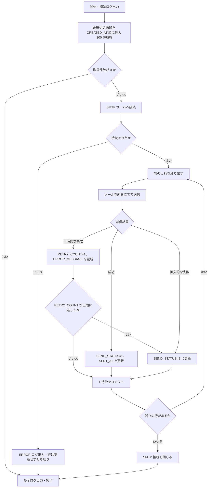
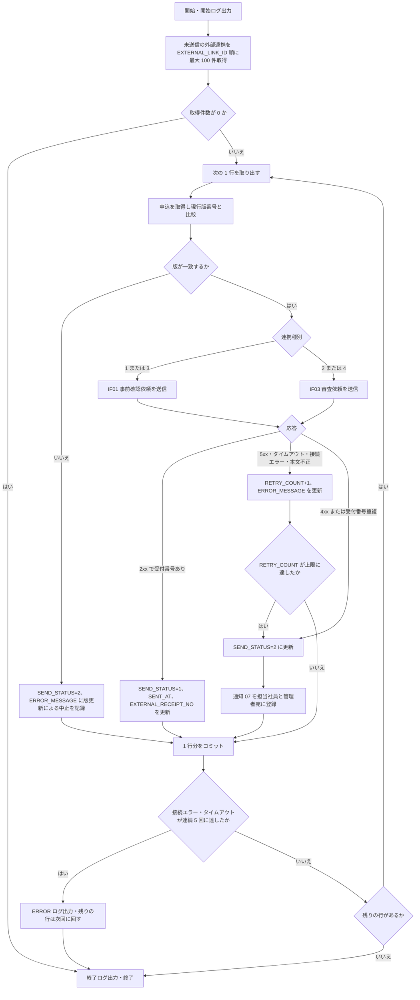

# 13. バッチ・通知設計

| 項目 | 内容 |
| --- | --- |
| 版 | 0.2（ステータス体系の改定を反映） |
| 関連 | [01. システム概要](01-overview.md)（設計方針 6）、[02. システム構成](02-system-architecture.md)、[03. ステータス定義・状態遷移](03-status-transition.md)、[07. テーブル定義](07-table-definition.md)、[08. コード定義](08-code-definition.md)、[09. 機能一覧](09-function-list.md)、[10. 機能詳細](10-function-detail.md)、[11. 画面設計](11-screen-design.md)、[12. 外部インターフェース設計](12-external-interface.md)、[14. 共通仕様](14-common-spec.md)、[99. 未決事項](99-open-issues.md) |
| 前提 | バッチの実行基盤・再送ポリシー・メール文面は仮置き（[99. 未決事項](99-open-issues.md) No.15、24、25）。確定後に本書を更新する |

メール通知と審査担当部門システム（外部システム）への送信は、業務トランザクションの中では通知（T_NOTIFICATION）・外部連携（T_EXTERNAL_LINK）への登録までを F14 の後続処理（[10. 機能詳細 1.5 節](10-function-detail.md#15-後続処理)）として行い、実際の送信は本書のバッチが行う（[01. 設計方針 6](01-overview.md#6-設計方針)）。バッチはレコードを登録せず送るだけとし、例外は BT02 が送信エラー確定時に登録する通知種別 07（送信エラー通知）だけとする。

## 1. バッチ一覧

| バッチID | バッチ名 | 起動方式（仮） | 周期（仮） | 処理対象 | 多重起動防止 | 想定処理時間（仮） | 関連 |
| --- | --- | --- | --- | --- | --- | --- | --- |
| BT01 | 通知送信バッチ | 同一 WAR 内のスケジューラ（ServletContextListener で起動する ScheduledExecutorService） | 1 分ごと | T_NOTIFICATION の SEND_STATUS = 0（未送信）の行。1 回に最大 100 件 | バッチごとに 1 スレッドで実行し、前回実行が終わるまで次を起動しない。取得した行を「処理中」にはしない | 通常は数秒。100 件処理時で 1 分程度 | F06 ほか通知種別 01〜07（[08. 19 章](08-code-definition.md#19-通知種別notification_type)）、SMTP |
| BT02 | 外部連携送信バッチ | 同上 | 1 分ごと | T_EXTERNAL_LINK の SEND_STATUS = 0（未送信）の行。1 回に最大 100 件 | 同上 | 通常は数秒。審査担当部門システム無応答時は 1 件あたり最大 35 秒。連続失敗時は実行を打ち切る | F08、IF01、IF03 |

- ID と名称は [09. 機能一覧](09-function-list.md#バッチ一覧概要) の定義に合わせる。
- BT01 と BT02 は互いに独立したスレッドで動く。同じバッチが 2 つ同時に動くことはないが、BT01 と BT02 が同時に動くことはある（BT02 が登録する通知 07 は次回の BT01 で送られる）。AP サーバは 1 台を前提とし、2 台以上に配置する場合はいずれか 1 台だけでスケジューラを有効にする（設定値 `batch.enabled`）。

## 2. 共通仕様

### 2.1 起動・停止

| 項目 | 内容 |
| --- | --- |
| 起動 | Web アプリ起動時に `BatchScheduler`（ServletContextListener、パッケージ `infra.scheduler`）が `batch.enabled = true` のとき、バッチごとに 1 スレッドの ScheduledExecutorService を作り、`scheduleWithFixedDelay` で登録する。初回は起動の 30 秒後（仮）、以降は前回終了から周期分の間隔を空けて実行する |
| 停止 | Web アプリ停止時に `shutdown()` を呼び、実行中の 1 行が終わるまで最大 30 秒（仮）待つ。待ちきれない場合は `shutdownNow()` で中断する。行ごとにコミットしているため、中断しても未送信の行は次回起動時に処理される |
| 例外 | ジョブの `run()` はすべての例外を捕捉してログに出す。例外を外に投げるとスケジュールが止まるため |
| ジョブ本体 | `NotificationSendJob`（BT01）、`ExternalLinkSendJob`（BT02）はスケジューラに依存しない独立クラスとし、`main` から 1 回実行できるようにする。将来 OS スケジューラ（cron、タスクスケジューラ）や別プロセスへ分離するときは、WAR 側の `batch.enabled` を false にし、同じクラスを外部から起動する。その場合の多重起動防止はジョブ管理側で行い、DB 接続は設定ファイルの接続情報で組み立てる |
| DB 接続 | WAR 内で動く場合は Web アプリと同じ DataSource（JNDI）から接続を取得する |

### 2.2 実行ログ

バッチログは [14. 共通仕様 9 章](14-common-spec.md#9-ログ) のバッチログとして、Web アプリのログとは別ファイルに出力する（Logback の appender を分ける）。ログにはバッチ ID と、行を処理中は通知 ID／外部連携 ID と申込 ID を付ける（MDC）。

| タイミング | レベル | 出力内容 |
| --- | --- | --- |
| 実行開始 | INFO | バッチ ID、開始日時、取得件数 |
| 行の送信成功 | INFO | 通知 ID／外部連携 ID、申込 ID、通知種別／連携種別、所要時間。宛先アドレスはローカル部をマスクする |
| 行の送信失敗（再送待ち） | WARN | ID、再送回数、エラーの要約 |
| 行の送信エラー確定 | ERROR | ID、再送回数、エラー内容。BT02 では通知 07 の登録件数 |
| 版の不一致による送信中止（BT02） | WARN | 外部連携 ID、申込 ID、外部連携の版番号と現行版番号 |
| 基盤障害（SMTP・外部 API に接続できない） | ERROR | 接続先、例外、スタックトレース。実行の打ち切りを明記する |
| 実行終了 | INFO | 処理件数、成功件数、再送待ち件数、送信エラー確定件数、所要時間 |

取得件数が 0 の場合は開始・終了を DEBUG で出力し、INFO には残さない（1 分ごとにログが増えるため）。トークン平文、API キー、SMTP パスワード、メール本文はログに出力しない。

### 2.3 エラー時の継続方針

1. 1 件の送信失敗は、その行の送信状態・再送回数・エラー内容を更新して次の行へ進む。1 件の失敗で実行全体を止めない。
2. 行の更新自体（DB 更新）が失敗した場合はその行をロールバックしてログに出し、次の行へ進む。
3. BT01 は SMTP サーバに接続できない場合、行を更新せずに実行を打ち切り、再送回数は加算しない（仮）。BT02 の接続エラーは [12. 2.6 節](12-external-interface.md#26-タイムアウトリトライ送信側仮) に合わせて行の失敗として数え、接続エラー・タイムアウトが連続 5 回（仮）に達したら残りの行を処理せずに打ち切る。未処理のまま残った行は次回実行で改めて取得する。

### 2.4 トランザクション

- 1 行ごとにトランザクションを開始し、送信結果の反映（と BT02 の通知 07 登録）をコミットする。行の取得は読み取りだけの別トランザクションで行う。
- 送信状態の更新は `WHERE SEND_STATUS = '0' AND ROW_VERSION = 取得時の値` で行う（[14. 共通仕様 2 章](14-common-spec.md#2-排他制御)）。更新件数が 0 の場合（画面から再送操作されたなど）は WARN を出して次の行へ進む。
- 送信は成功したが DB 更新に失敗した場合、行は未送信のままとなり次回に再送される。メールは二重に届くことを許容する。外部連携は送信電文の requestId に外部連携 ID を入れ、審査担当部門システムが同じ requestId を初回の受付番号で応答する前提とする（[12. 2.7 節](12-external-interface.md#27-冪等性)、仮）。
- バッチが更新・登録する行の UPDATED_BY／CREATED_BY はバッチ ID（`BT01`、`BT02`）とする（[07. 共通項目](07-table-definition.md#2-共通項目)）。

### 2.5 設定値一覧（仮）

設定はプロパティファイル（`application.properties`、名称は仮）で管理する。パスワード・API キーは環境変数または配置先ごとの外部ファイルから読み、リポジトリには含めない（[14. 共通仕様 1.1](14-common-spec.md#11-認証)）。

| キー | 既定値（仮） | 説明 |
| --- | --- | --- |
| batch.enabled | true | WAR 内スケジューラの有効／無効 |
| batch.initial-delay-seconds／batch.shutdown-wait-seconds | 30／30 | 起動後の初回実行までの待ち時間／停止時に実行中の行の完了を待つ時間 |
| batch.notification.interval-seconds／max-rows／retry-limit | 60／100／3 | BT01 の周期（前回終了から次回開始まで）／1 回の最大処理件数／再送上限（失敗回数がこの値に達したら送信エラー） |
| batch.external.interval-seconds／max-rows／retry-limit | 60／100／3 | BT02 の周期／1 回の最大処理件数／再送上限 |
| batch.external.abort-after-consecutive-failures | 5 | BT02 で接続エラー・タイムアウトが連続した場合に実行を打ち切る回数 |
| mail.smtp.host／port／starttls | －／587／true | SMTP サーバと STARTTLS の使用 |
| mail.smtp.auth／user／password | false／－／－ | SMTP 認証。パスワードは環境変数 |
| mail.smtp.connection-timeout-ms／timeout-ms | 5000／30000 | SMTP の接続・送受信タイムアウト |
| mail.from.address／mail.from.name／mail.reply-to.address | －／申込管理システム／（空） | 送信元アドレス・表示名（要確認）と返信先。返信先が空なら付けない |
| extapi.base-url／precheck-path／review-path | －／/precheck-requests／/review-requests | 審査担当部門システム API のベース URL と、IF01 事前確認依頼送信・IF03 審査依頼送信のパス（[12. 2.3 節](12-external-interface.md#23-エンドポイント仮)） |
| extapi.api-key | － | 外部 API の API キー（`X-API-Key` ヘッダ）。環境変数 |
| extapi.connect-timeout-ms／read-timeout-ms | 5000／30000 | 外部 API の接続・読取タイムアウト |
| consent.token-expire-days | 14 | 確認用トークンの有効期限（日）。3.4 節 |
| app.applicant-base-url／app.employee-base-url | － | 申込者向け確認 URL のベース URL（例：https://apply.example.com）／社員向け画面リンクのベース URL（社内向け） |
| mail.mode | log | メール送信方式。`log`：送信せずログ出力（開発用）、`smtp`：SMTP 送信 |
| extapi.mode | mock | 外部送信方式。`mock`：送信せず受付番号を採番（開発用。結果は開発支援画面から返す）、`http`：extapi.base-url へ送信 |
| extapi.inbound.api-key／extapi.inbound.allowed-ips | －／－ | IF02／IF04 受信の API キーと接続元 IP 許可リスト（カンマ区切り）。空なら検証しない（開発用） |
| app.external-system-id | EXT01 | 審査担当部門システムからの結果受信をステータス履歴に記録するときの操作者 ID |
| app.dev-tools.enabled | true | 開発支援画面の有効化。本番は false |
| db.url／db.user／db.password／db.pool.max-size／db.startup-wait-seconds | －／－／－／10／120 | JDBC 接続情報、接続プール数、起動時に DB へ接続できるまで待つ秒数 |

## 3. 通知設計

### 3.1 登録契機と宛先

通知は F14 の後続処理（[10. 機能詳細 1.5 節](10-function-detail.md#15-後続処理)）が業務トランザクション内で登録する。通知種別は [08. 19 章](08-code-definition.md#19-通知種別notification_type)、遷移 ID は [03. 6 章](03-status-transition.md#6-ステータス遷移マスタ-初期データ) の値。

| 種別 | 名称 | 登録契機（遷移 ID） | 登録者 | 宛先の決定ルール |
| --- | --- | --- | --- | --- |
| 01 | 申込者確認依頼 | 遷移先が内容確認待ち（10301／20301）：遷移 ID 6（10201 申請・回付先なし）、8（10202 最終承認者の承認）、35（20201 申請・回付先なし）、37（20202 最終承認者の承認）。および SC14「確認依頼メール再送」（10301／10302／20301／20302、[F06 7.3](10-function-detail.md#73-再送)） | F14（F06） | 申込の申込者（T_APPLICATION.APPLICANT_ID）→ M_APPLICANT.MAIL_ADDRESS |
| 02 | 承認依頼 | 申請で申請中へ：遷移 ID 5（10201 → 10202）、21（10501 → 10502）、34（20201 → 20202）、49（20501 → 20502）。最終承認者以外の承認（ステータス遷移なし。F14 は呼ばれず [F05 6.2](10-function-detail.md#62-承認の処理手順) が登録する） | F14／F05 | 承認申請の現在ステップ（T_APPROVAL_REQUEST.CURRENT_STEP_NO）の承認明細の承認者（T_APPROVAL_STEP.APPROVER_EMPLOYEE_ID）→ M_EMPLOYEE.MAIL_ADDRESS。申請時はステップ 1、承認時は +1 した後のステップ |
| 03 | 差戻し通知 | 承認者の差戻し：遷移 ID 7（10202 → 10201）、25（10502 → 10501）、36（20202 → 20201）、50（20502 → 20501） | F14 | 承認申請の申請社員（T_APPROVAL_REQUEST.REQUEST_EMPLOYEE_ID）→ M_EMPLOYEE.MAIL_ADDRESS |
| 04 | 申込者差戻し通知 | 申込者差戻し：遷移 ID 12（10302 → 10201）、41（20302 → 20201） | F14 | 申込の担当社員（T_APPLICATION.OWNER_EMPLOYEE_ID）→ M_EMPLOYEE.MAIL_ADDRESS |
| 05 | 事前確認結果通知 | 事前確認「修正必要」の受信（操作コード 11）：遷移 ID 17（10401 → 10402）、45（20401 → 20402） | F14 | 同上 |
| 06 | 審査結果通知 | 審査完了の受信（操作コード 12）：遷移 ID 27（10601 → 10701）、52（20601 → 20701）。審査差戻しの受信（操作コード 13）：遷移 ID 28（10601 → 10501）、53（20601 → 10701）、54（20601 → 20701） | F14 | 同上 |
| 07 | 送信エラー通知 | 外部連携の送信エラー確定（5.4 節）。ステータス遷移は伴わない | BT02 | 申込の担当社員、および権限 09（管理者）で有効（VALID_FLG = 1）な全社員。宛先 1 件につき通知 1 行を登録し、重複する宛先は 1 行にまとめる |
| 08 | 申込者アカウント通知 | 内容確認待ち（10301／20301）への到達時に申込者のアカウントが未発行のとき（遷移 ID 6、8、35、37。[10. F17](10-function-detail.md#17-f17-申込者アカウント申込者ポータル)） | F14（F17） | 申込の申込者 → M_APPLICANT.MAIL_ADDRESS |
| 09 | パスワード初期化通知 | SC15 メンテナンスで担当者・管理者がパスワードを初期化したとき（[10. F17 17.4](10-function-detail.md#174-パスワードの初期化sc15)） | SC15（F17） | 申込の申込者 → M_APPLICANT.MAIL_ADDRESS |

- 宛先は登録時点のアドレスを TO_ADDRESS に保持し、その後のマスタ変更は反映しない（[07. T_NOTIFICATION](07-table-definition.md#416-通知t_notification)）。
- 通知を登録しない遷移：担当者の確定・修正（1〜4、18〜20、22〜24、30〜33、46〜48）、申込者の確定（10、39）、申込者の修正で内容確認待ちへ戻る 13（同じ申込者同意で継続するため通知 01 は再送しない）、引戻し（9、11、38、40）、同意（14、15、42、43）、事前確認「問題なし」（16、44）、審査申請（26、51）、契約変更開始（29、55）。
- 事前確認「問題なし」と審査申請はメールを送らず、担当者・承認者は SC02 の「自分の操作待ち」で把握する（仮）。
- 通知の送信エラー（BT01）は通知 07 の対象外とし、ログと監視で対応する（4.4 節、6 章）。

### 3.2 プレースホルダ

テンプレートはプロパティファイル（`notification-templates.properties`、仮）に持ち、登録側が `${...}` のプレースホルダを展開して SUBJECT・BODY に保存する。日時は yyyy/MM/dd HH:mm で埋め込む（[14. 共通仕様 5 章](14-common-spec.md#5-日付時刻金額文字)）。

| プレースホルダ | 内容 | 取得元 |
| --- | --- | --- |
| ${applicationNo}／${applicantName}／${ownerName} | 申込番号／申込者名／担当社員名 | T_APPLICATION.APPLICATION_NO、M_APPLICANT.APPLICANT_NAME、M_EMPLOYEE.EMPLOYEE_NAME（担当社員） |
| ${approverName}／${requesterName} | 承認者名／申請社員名 | M_EMPLOYEE.EMPLOYEE_NAME（通知 02 は宛先の承認者、03 は差し戻した承認者と承認申請の申請社員） |
| ${approvalTypeName}／${stepNo}／${finalStepNo} | 承認種別名／宛先のステップ番号／最終ステップ | [08. 9 章](08-code-definition.md#9-承認種別approval_type)、T_APPROVAL_REQUEST.CURRENT_STEP_NO、FINAL_STEP_NO |
| ${statusName} | 遷移後（通知 07 は現在）のステータスの申込受付会社向け表示名 | M_STATUS.STATUS_NAME |
| ${comment} | 承認者の差戻し理由 | T_APPROVAL_STEP.COMMENT |
| ${returnReason} | 申込者の差戻し理由 | T_APPLICANT_CONSENT.RETURN_REASON |
| ${resultReason} | 事前確認の指摘内容／審査差戻しの理由 | T_EXTERNAL_LINK.RESULT_REASON |
| ${reviewedAt}／${reviewedVersionNo} | 審査完了日時／審査完了版番号 | T_APPLICATION.REVIEWED_AT、REVIEWED_VERSION_NO |
| ${occurredAt} | 契機となった操作・受信の日時（通知 07 は送信エラーの確定日時） | T_STATUS_HISTORY.CHANGED_AT（通知 07 は現在日時） |
| ${linkTypeName}／${externalLinkId}／${errorMessage} | 連携種別名／外部連携 ID／送信エラー内容 | [08. 16 章](08-code-definition.md#16-連携種別link_type)、T_EXTERNAL_LINK.EXTERNAL_LINK_ID、ERROR_MESSAGE |
| ${baseUrl}／${token}／${expiresAt} | 申込者向けベース URL／確認用トークン（平文）／有効期限 | app.applicant-base-url、F06 で生成（3.4 節）、T_APPLICANT_CONSENT.TOKEN_EXPIRES_AT |
| ${detailUrl} | 申込詳細（SC03）の URL | app.employee-base-url ＋ `/emp/applications/${applicationId}`（[11. SC03](11-screen-design.md#43-sc03-申込詳細)） |

### 3.3 件名・本文テンプレート（仮）

文面は仮置きで、確定後に差し替える（[99. 未決事項](99-open-issues.md) No.24）。件名の先頭には共通の接頭辞 `[申込管理]` を付ける。本文は text/plain とし、空行を省略して示す。

#### 01 申込者確認依頼（宛先：申込者）

同意種別（T_APPLICANT_CONSENT.CONSENT_TYPE）で文面を分ける。再送時も同じテンプレートを使う。

件名（同意種別 1 新規申込）：`[申込管理] お申込内容のご確認のお願い（申込番号 ${applicationNo}）`

```text
${applicantName} 様
お申込内容をご確認のうえ、以下の URL から同意の手続きをお願いいたします。
確認 URL：${baseUrl}/consent/${token}
有効期限：${expiresAt}
有効期限を過ぎると URL は無効になります。その場合は担当者（${ownerName}）までご連絡ください。
本メールに心当たりがない場合は、お手数ですが破棄してください。
```

件名（同意種別 2 契約変更）：`[申込管理] 契約変更内容のご確認のお願い（申込番号 ${applicationNo}）`

```text
${applicantName} 様
お申込（申込番号 ${applicationNo}）の契約変更内容をご確認のうえ、以下の URL から同意の手続きをお願いいたします。
確認画面では変更前の内容と変更後の内容を並べて表示します。
確認 URL：${baseUrl}/consent/${token}
有効期限：${expiresAt}
有効期限を過ぎると URL は無効になります。その場合は担当者（${ownerName}）までご連絡ください。
本メールに心当たりがない場合は、お手数ですが破棄してください。
```

#### 02 承認依頼（宛先：次の承認者）

件名：`[申込管理] 承認依頼：${approvalTypeName}（申込番号 ${applicationNo}）`

```text
${approverName} 様
以下の申込について ${approvalTypeName} の承認をお願いします（ステップ ${stepNo}／${finalStepNo}）。
申込番号：${applicationNo}　申込者名：${applicantName}　担当者：${ownerName}　申請者：${requesterName}
申込詳細：${detailUrl}
```

最終承認・契約変更最終承認（承認種別 02／04）の最終ステップ（${stepNo} = ${finalStepNo}）宛では、2 行目を「以下の申込について ${approvalTypeName} の内容を確認のうえ、審査担当部門への審査申請をお願いします（ステップ ${stepNo}／${finalStepNo}）。」に置き換える（最終承認者の操作が「審査申請」のため）。

#### 03 差戻し通知（宛先：申請社員）

件名：`[申込管理] 差戻し：${approvalTypeName}（申込番号 ${applicationNo}）`

```text
${requesterName} 様
以下の申込が ${approverName} により差し戻されました（ステータス：${statusName}）。内容を確認のうえ、必要に応じて修正し、再度申請してください。
申込番号：${applicationNo}　申込者名：${applicantName}　差戻し日時：${occurredAt}
差戻し理由：${comment}
申込詳細：${detailUrl}
```

#### 04 申込者差戻し通知（宛先：担当社員）

件名：`[申込管理] 申込者からの差戻し（申込番号 ${applicationNo}）`

```text
${ownerName} 様
以下の申込が申込者により差し戻されました（ステータス：${statusName}）。差戻し理由を確認し、申込者と調整のうえ、内容を修正して再度申請してください。
申込番号：${applicationNo}　申込者名：${applicantName}　差戻し日時：${occurredAt}
差戻し理由：${returnReason}
申込詳細：${detailUrl}
```

#### 05 事前確認結果通知（宛先：担当社員）

件名：`[申込管理] 事前確認結果「修正必要」（申込番号 ${applicationNo}）`

```text
${ownerName} 様
以下の申込について、審査担当部門の事前確認結果が「修正必要」でした（ステータス：${statusName}）。指摘内容を確認し、申込修正画面から修正対応をお願いします。
申込番号：${applicationNo}　申込者名：${applicantName}　受信日時：${occurredAt}
指摘内容：${resultReason}
申込詳細：${detailUrl}
```

#### 06 審査結果通知（宛先：担当社員）

審査完了と審査差戻しで件名・本文を分け、審査差戻しは新規申込（遷移 ID 28）と契約変更（53、54）で本文を分ける。

件名（審査完了：27、52）：`[申込管理] 審査完了（申込番号 ${applicationNo}）`

```text
${ownerName} 様
以下の申込の審査が完了しました（ステータス：${statusName}）。
申込番号：${applicationNo}　申込者名：${applicantName}　審査完了日時：${reviewedAt}
申込詳細：${detailUrl}
```

件名（審査差戻し：28、53、54）：`[申込管理] 審査差戻し（申込番号 ${applicationNo}）`

```text
${ownerName} 様
以下の申込が審査担当部門から差し戻されました（ステータス：${statusName}）。差戻し理由を確認し、必要に応じて修正のうえ、再度最終承認を申請してください。
申込番号：${applicationNo}　申込者名：${applicantName}　受信日時：${occurredAt}
差戻し理由：${resultReason}
申込詳細：${detailUrl}
```

契約変更の審査差戻し（53、54）では 2 行目を「以下の申込の契約変更が審査担当部門から差し戻されました。契約変更の内容は取り消され、契約変更前の審査完了の状態（ステータス：${statusName}、第 ${reviewedVersionNo} 版）に戻っています。差戻し理由を確認のうえ、必要であれば契約変更手続きをやり直してください。」に置き換える（[F13](10-function-detail.md#14-f13-契約変更審査差戻しの復元)）。

#### 08 申込者アカウント通知（宛先：申込者）

件名：`[申込管理] 申込者ページのご案内（申込番号 ${applicationNo}）`

```text
${applicantName} 様
申込番号 ${applicationNo} のお申込について、申込内容の確認・同意などのお手続きを行う申込者ページをご用意しました。
以下の情報でログインしてください。
ログイン URL：${baseUrl}/my/login
ユーザー ID：${loginId}
初期パスワード：${initialPassword}
初回ログイン後に「パスワード変更」からパスワードを変更してください。
本メールに心当たりがない場合は、お手数ですが破棄してください。
```

初期パスワードの平文は本文にだけ含まれ、DB にはハッシュだけを保持する（通知 01 のトークンと同じ扱い。[99. 未決事項 No.49](99-open-issues.md)）。

#### 09 パスワード初期化通知（宛先：申込者）

件名：`[申込管理] 申込者ページのパスワード初期化のご案内（申込番号 ${applicationNo}）`

```text
${applicantName} 様
申込者ページのパスワードを初期化しました。以下の初期パスワードでログインし、「パスワード変更」から新しいパスワードを設定してください。
ログイン URL：${baseUrl}/my/login
ユーザー ID：${loginId}
初期パスワード：${initialPassword}
心当たりがない場合は、担当者（${ownerName}）までご連絡ください。
```

#### 07 送信エラー通知（宛先：担当社員・管理者）

件名：`[申込管理] 審査担当部門システムへの送信エラー（申込番号 ${applicationNo}）`

```text
以下の依頼が再送上限に達したか、審査担当部門システムに受け付けられず、送信エラーになりました。
申込のステータス（${statusName}）は変わらず、再送するまで審査担当部門からの結果は届きません。内容を確認のうえ、申込詳細画面から再送してください。
申込番号：${applicationNo}　連携種別：${linkTypeName}　外部連携 ID：${externalLinkId}
エラー内容：${errorMessage}
確定日時：${occurredAt}
申込詳細：${detailUrl}
```

### 3.4 確認用トークン（通知 01）

| 項目 | 内容 |
| --- | --- |
| 生成 | `SecureRandom` で 32 バイト（256 ビット）の乱数を生成し、Base64URL（パディングなし、43 文字）でエンコードした文字列をトークンとする（[F06 7.2](10-function-detail.md#72-処理手順f14-後続処理)） |
| 保存 | トークンの SHA-256 ハッシュ（16 進 64 文字）だけを T_APPLICANT_CONSENT.ACCESS_TOKEN_HASH に保存する。平文トークンは DB のどの列にも保存しない |
| 通知への埋込み | 平文トークンは通知 01 の本文（`${baseUrl}/consent/${token}`）にだけ含まれる。T_NOTIFICATION.BODY には平文が入るため、本文は画面に表示せず、ログにも出さない（[07. T_NOTIFICATION](07-table-definition.md#416-通知t_notification)） |
| 有効期限 | 発行から 14 日（仮、`consent.token-expire-days`）。T_APPLICANT_CONSENT.TOKEN_EXPIRES_AT に保存し、本文の `${expiresAt}` に埋め込む。期限切れの URL は AP05（E202）になる |
| 無効化 | 引戻し（遷移 ID 9、11、38、40）、全体修正（20、22）、F13 の復元、確認依頼メール再送で CONSENT_STATUS = 9（無効）にする。同意で 2、申込者差戻しで 3 になり、いずれも以後は URL を使えない |
| 再発行 | SC14「確認依頼メール再送」で進行中の申込者同意（CONSENT_STATUS = 1）を 9 にし、新しいトークンで申込者同意と通知 01 を登録する。通知 01 の送信エラー行を SEND_STATUS = 0 に戻して再送する運用はせず、常に再発行する（旧トークンが無効化済みの場合があるため）。10302／20302 で再送した場合、申込者は新しい URL から内容確認（AP01）をやり直す（仮） |
| 検証 | 申込者向け画面の全リクエストで、ハッシュの一致、CONSENT_STATUS = 1、有効期限内、対象の版が現行版であることを確認する（[F07 8.3](10-function-detail.md#83-トークン検証全リクエスト共通)） |

## 4. BT01 通知送信バッチ

### 4.1 概要

T_NOTIFICATION の未送信行を取得し、登録済みの宛先・件名・本文をそのまま Jakarta Mail で SMTP 送信する。件名・本文の組み立てとテンプレートの展開は登録側（F14 後続処理、F05、BT02 の通知 07 登録）で済んでおり、BT01 は本文を加工せず、通知種別による処理の違いも持たない。

### 4.2 処理フロー



### 4.3 処理手順

1. 開始ログを出力する。
2. 未送信の通知を取得する。条件は `SEND_STATUS = '0'`、並び順は `CREATED_AT, NOTIFICATION_ID` の昇順、件数は `batch.notification.max-rows`（100 件、仮）。インデックス IX_T_NOTIFICATION_01 を使う。
3. 取得件数が 0 なら終了する。
4. SMTP サーバへ接続する（1 回の実行で 1 接続を使い回す）。接続できない場合は ERROR ログを出し、行を更新せずに終了する（2.3 節 3）。
5. 取得した行を順に処理する。
   1. メールを組み立てる。From = `mail.from.address`（表示名 `mail.from.name`）、To = TO_ADDRESS、Subject = SUBJECT、本文 = BODY（text/plain、UTF-8）。Reply-To は設定があれば付ける。
   2. 送信し、結果に応じて行を更新してコミットする（4.4 節）。
   3. 停止要求（スレッドの割込み）があれば、残りの行を処理せずに 6 へ進む。
6. SMTP 接続を閉じる。
7. 終了ログ（処理件数、成功、再送待ち、送信エラー確定）を出力する。

### 4.4 送信結果の判定と更新

| 結果 | 判定 | 更新内容 |
| --- | --- | --- |
| 成功 | 例外なく送信が完了した | SEND_STATUS = 1、SENT_AT = 現在日時、ERROR_MESSAGE = 空 |
| 一時的な失敗 | 送信中の I/O エラー、タイムアウト、SMTP 4xx 応答 | RETRY_COUNT = RETRY_COUNT + 1、ERROR_MESSAGE = 例外の要約（1,000 文字まで）。RETRY_COUNT が `retry-limit`（3、仮）に達したら SEND_STATUS = 2、達しなければ 0 のまま（次回実行で再送） |
| 恒久的な失敗 | 宛先アドレスの形式不正、SMTP 5xx 応答（宛先拒否など） | RETRY_COUNT + 1、ERROR_MESSAGE を記録し、即時 SEND_STATUS = 2（再送しても成功しないため。仮） |

- RETRY_COUNT は失敗した送信試行の回数とし、成功時は更新しない（[07. T_NOTIFICATION](07-table-definition.md#416-通知t_notification)）。上限 3 回・周期 1 分のため、一時的な失敗が続いた行は約 3 分で送信エラーになる。送信状態の区分値は [08. 17 章](08-code-definition.md#17-送信状態send_status外部連携通知)。
- 通知の送信エラー（SEND_STATUS = 2）は BT01 では通知しない（通知 07 は外部連携の送信エラー専用）。ERROR ログと監視（6.1 節）、手動再送（6.3 節）で対応する。通知 01 の送信エラーは行の再送ではなく、担当者の確認依頼メール再送（新しいトークンの再発行）で対応する（3.4 節）。

## 5. BT02 外部連携送信バッチ

### 5.1 概要

T_EXTERNAL_LINK の未送信行を取得し、連携種別に応じて IF01（事前確認依頼送信）または IF03（審査依頼送信）で審査担当部門システムへ送る。送信電文の内容・認証・応答形式は [12. 外部インターフェース設計](12-external-interface.md) に従う。外部連携行は F14 の後続処理（[F08 9.2](10-function-detail.md#92-処理手順f14-後続処理)）が登録する。

| 連携種別 | 名称 | 使う IF | 到達ステータス | 登録する遷移 ID | 電文の主な内容 |
| --- | --- | --- | --- | --- | --- |
| 1 | 事前確認依頼 | IF01 事前確認依頼送信 | 10401 | 15（同意・会社区分 2）、19（修正対応の確定・変更基準内） | 現行版の申込内容、基準版（申込者が同意した版）の内容、変更金額倍率 |
| 2 | 審査依頼 | IF03 審査依頼送信 | 10601 | 26（最終承認者の審査申請） | 現行版の申込内容 |
| 3 | 契約変更事前確認依頼 | IF01 事前確認依頼送信 | 20401 | 32（契約変更の確定・変更基準内・会社区分 2）、43（同意・会社区分 2）、47（修正対応の確定・変更基準内） | 連携種別 1 と同じ（基準版は契約変更開始時の審査完了版、または申込者が同意した版） |
| 4 | 契約変更審査依頼 | IF03 審査依頼送信 | 20601 | 51（最終承認者の審査申請） | 現行版の申込内容と、審査完了版（契約変更前の内容） |

- 連携種別の区分値は [08. 16 章](08-code-definition.md#16-連携種別link_type)。事前確認「問題なし」（遷移 ID 16、44）は最終承認申請待ちへ進むだけで、外部連携は登録しない。審査依頼は最終承認者の審査申請でのみ登録する。
- 同じ申込でも依頼のたびに新しい行を作る（修正対応後の再依頼など）。

### 5.2 処理フロー



### 5.3 処理手順

1. 開始ログを出力する。
2. 未送信の外部連携を取得する。条件は `SEND_STATUS = '0'`、並び順は `EXTERNAL_LINK_ID` の昇順、件数は `batch.external.max-rows`（100 件、仮）。インデックス IX_T_EXTERNAL_LINK_01 を使う。同一申込に複数の未送信行がある場合も ID 順（登録順）に送る。
3. 取得件数が 0 なら終了する。
4. 取得した行を順に処理する。
   1. 申込（T_APPLICATION）を取得し、外部連携の VERSION_NO と CURRENT_VERSION_NO を比較する。一致しなければ送信せず、SEND_STATUS = 2、ERROR_MESSAGE = 「版が更新されたため送信中止」で更新してコミットし、次の行へ進む（5.5 節）。
   2. 対象版の申込内容（T_APPLICATION_VERSION）、申込者（M_APPLICANT）、比較元の版（連携種別 1／3 は基準版 T_APPLICATION.BASE_VERSION_NO、4 は審査完了版 REVIEWED_VERSION_NO。2 は不要）を取得し、連携種別に応じて IF01 または IF03 の電文を組み立てる（[12. 3.2 節](12-external-interface.md#32-リクエスト項目)）。requestId に外部連携 ID を入れる。
   3. `X-API-Key` ヘッダを付けて HTTPS で POST する（接続 5 秒、読取 30 秒、仮）。
   4. 応答に応じて行を更新し、必要なら通知 07 を登録してコミットする（5.4 節）。
   5. 接続エラー・タイムアウトが連続 5 回（仮）に達したら、残りの行を処理せずに 5 へ進む。停止要求があった場合も同じ。
5. 終了ログを出力する。

### 5.4 送信結果の判定と更新

| 結果 | 判定 | 更新内容 | 通知 07 |
| --- | --- | --- | --- |
| 成功 | HTTP 2xx で、応答から外部受付番号を取得できた | SEND_STATUS = 1、SENT_AT = 現在日時、EXTERNAL_RECEIPT_NO = 応答の受付番号、ERROR_MESSAGE = 空 | 登録しない |
| 一時的な失敗 | HTTP 5xx、タイムアウト、接続エラー、2xx だが応答本文が不正（受付番号なし、解析不可） | RETRY_COUNT + 1、ERROR_MESSAGE = HTTP ステータスと応答の要約、または例外の要約。RETRY_COUNT が `retry-limit`（3、仮）に達したら SEND_STATUS = 2 | 上限到達時に登録 |
| 恒久的な失敗 | HTTP 4xx（認証エラー、電文不正など）、受付番号が他の外部連携と重複（UK 違反） | RETRY_COUNT + 1、ERROR_MESSAGE を記録し、即時 SEND_STATUS = 2 | 登録 |
| 版の不一致 | 5.5 節 | SEND_STATUS = 2、ERROR_MESSAGE = 「版が更新されたため送信中止」。RETRY_COUNT は変更しない | 登録しない |
| 連続失敗による打ち切り | 接続エラー・タイムアウトが連続 5 回（仮）に達した | その行までは上記のとおり更新し、残りの行は更新せずに次回へ回す | － |

- 判定は [12. 3.5 節](12-external-interface.md#35-http-ステータスと送信結果の扱い) と同じ。2xx で本文が不正な場合も再送するのは、審査担当部門システムが同じ requestId を初回の受付番号で応答する前提（12. 2.7 節）のため。
- 送信エラー（SEND_STATUS = 2）の行は、担当者・管理者が SC03 から再送するまで残る。申込のステータス（10401／10601／20401／20601）は変わらないため、再送するまで審査担当部門からの結果は届かず、申込は事前確認待ち・審査中のまま止まる。

### 5.5 版の一致確認

送信直前に、外部連携の版番号（VERSION_NO）が申込の現行版番号（CURRENT_VERSION_NO）と一致することを確認する。

- 事前確認待ち・審査中（10401／10601／20401／20601）は編集不可で操作主体が審査担当部門のため、通常の操作では未送信のうちに版が進むことはない。本確認は、送信エラー行の手動再送（DB 操作）や運用上のデータ補正で古い行が未送信に戻された場合、および契約変更の審査差戻し（F13）で版が取り消された後に古い行が残っていた場合に、現行版でない内容を審査担当部門へ送らないための防御的なチェックとして残す。
- 中止した行は SEND_STATUS = 2 になるが、通知 07 は登録せず、ERROR_MESSAGE で区別する（現行版の依頼ではないため、担当者が対応すべきエラーではない）。中止した行は現行版の行ではないため、SC14 の「外部連携再送」の対象にならない（[11. SC03](11-screen-design.md#43-sc03-申込詳細) の表示条件）。ERROR_MESSAGE の文言は [12. 3.1 節](12-external-interface.md#31-送信の流れbt02) と同じにする。
- 中止後、現行版の依頼が未登録のまま申込が事前確認待ち・審査中で止まっている場合は運用で対応する（6.3 節）。

### 5.6 通知 07 の登録

送信エラー確定時に、行の更新と同じトランザクションで T_NOTIFICATION を登録する。宛先は申込の担当社員と、権限 09 で有効な全社員（3.1 節）。件名・本文は 3.3 節のテンプレート 07 で、登録時に展開する（${statusName} は申込の現在ステータス、${occurredAt} は確定時の現在日時）。登録した通知は次回の BT01 で送られる。

## 6. 運用

### 6.1 監視項目（仮）

| 項目 | 取得方法 | しきい値（仮） | 一次対応 |
| --- | --- | --- | --- |
| 通知の送信エラー件数 | `T_NOTIFICATION WHERE SEND_STATUS = '2'` の件数 | 1 件以上 | ERROR_MESSAGE を確認し、宛先不正はマスタ修正のうえ再送、SMTP 側の拒否はメール基盤に確認 |
| 外部連携の送信エラー件数 | `T_EXTERNAL_LINK WHERE SEND_STATUS = '2'` かつ ERROR_MESSAGE が版更新による中止でない件数 | 1 件以上 | 通知 07 の内容と IF ログを確認し、審査担当部門と調整のうえ再送 |
| 通知・外部連携の滞留件数 | `SEND_STATUS = '0'` かつ CREATED_AT が 10 分以上前の件数 | 1 件以上 | バッチの停止か、SMTP・審査担当部門システムの障害を疑う。バッチログの終了ログと ERROR ログを確認 |
| 事前確認待ち・審査中の長期滞留 | ステータスが 10401／10601／20401／20601 で、現行版の外部連携に送信済（SEND_STATUS = 1）の行がなく、更新日時が 1 時間以上前の申込件数 | 1 件以上 | 送信エラー行の有無を確認し、再送または依頼の再登録を検討する（6.3 節） |
| バッチの実行間隔 | バッチログの終了ログ（DEBUG を含む）の最終出力時刻 | 5 分以上更新なし | AP サーバの状態を確認し、必要なら再起動 |
| 基盤障害ログ | バッチログの ERROR（SMTP・外部 API 接続不可） | 連続 3 回 | メール基盤・審査担当部門システムの稼働を確認 |

件数の監視は監視ツールから DB へ SQL で確認する（専用の監視 API は設けない、仮）。

### 6.2 障害時の対応

| 障害 | バッチの挙動 | 復旧後 | 手作業 |
| --- | --- | --- | --- |
| SMTP サーバ停止 | BT01 は接続失敗で実行を打ち切り、行を更新しない。未送信行は滞留し、RETRY_COUNT は増えない | 次回実行から自動で送信を再開する。滞留分は 1 回 100 件ずつ、CREATED_AT 順に送られる | なし。ただし通知 01 の有効期限が停止中に切れた場合は担当者が確認依頼メールを再送する |
| SMTP サーバが接続はできるが送信を拒否 | 行ごとに失敗として RETRY_COUNT が増え、3 回で送信エラーになる | 自動再送はされない | 原因解消後に 6.3 節で再送する |
| 審査担当部門システム停止・無応答（接続エラー、タイムアウト、5xx） | 行ごとに失敗として RETRY_COUNT が増え、3 回で送信エラーになり通知 07 が届く。接続エラー・タイムアウトが連続 5 回で当該実行を打ち切り、残りの行は次回に回す | 未送信のまま残った行は自動で再開する。送信エラー行は自動再送されない | 原因解消後に 6.3 節で再送する。長時間の障害が見込まれる場合は `batch.enabled` を false にして止め、再送上限に達するのを避ける（仮） |
| AP サーバ停止・再起動 | 実行中の行は中断される。行ごとにコミットしているため、中断した行は未送信のまま残る | 起動 30 秒後から自動で再開する | 送信成功後・DB 更新前で中断した行は二重送信になる。メールは許容し、外部連携は審査担当部門システム側の requestId による重複検知に委ねる |
| DB 停止 | 行の取得または更新で失敗し、ログを出して実行を打ち切る | 自動で再開する | なし |

### 6.3 手動再送手順

| 対象 | 手順 |
| --- | --- |
| 外部連携の送信エラー行 | 1. 通知 07 または SC03（開発者向け）でエラー内容を確認する。2. 原因（審査担当部門システムの障害、電文不正、認証設定）を解消する。3. 担当者または管理者が SC14 の「外部連携再送」を実行する。システムは対象行を SEND_STATUS = 0、RETRY_COUNT = 0 に更新する（ERROR_MESSAGE は次回の結果で上書き）。4. 次回の BT02 で送信され、結果を SC03 で確認する。再送タイルは常に表示し、現行版の外部連携に送信エラー行がある場合だけ活性になる（[11. SC03](11-screen-design.md#43-sc03-申込詳細)） |
| 通知 02〜07 の送信エラー行 | 1. バッチログでエラー内容を確認する（管理者向け一覧画面は未定）。2. 宛先不正なら社員マスタを修正する（TO_ADDRESS は登録時点のまま。宛先を変える場合は管理者が DB 上で TO_ADDRESS を修正する、仮）。3. 管理者が DB 上で対象行を SEND_STATUS = 0、RETRY_COUNT = 0 に更新する（SQL は運用手順書で定める、仮。画面を設ける場合は SC03 または管理者向け一覧に「通知再送」を追加する）。4. 次回の BT01 で送信される |
| 通知 01 の送信エラー行 | 行の再送はせず、担当者が SC14 の「確認依頼メール再送」（[F06 7.3](10-function-detail.md#73-再送)）で新しいトークンと通知を発行する。エラー行はそのまま残す |
| 版更新により中止した外部連携行 | 再送しない。現行版の依頼が送信済であることを SC03 で確認する。現行版の依頼が存在せず申込が事前確認待ち・審査中で止まっている場合は、管理者が現行版の外部連携行を DB 上で登録する（運用手順書で定める、仮） |

再送の権限は [14. 共通仕様 1.2](14-common-spec.md#12-認可権限) に従う（担当者は担当の申込の確認依頼メール再送・外部連携再送、管理者は外部連携再送）。通知行の再送手段と権限は要確認（7 章）。

### 6.4 ログ保管（仮）

| 項目 | 内容 |
| --- | --- |
| 出力先 | AP サーバのログディレクトリ。バッチログは `batch.log` として Web アプリのログと分ける |
| ローテーション・保持 | 日次でファイル名に日付を付けて gzip 圧縮する。保持期間は 1 年（[14. 共通仕様 9 章](14-common-spec.md#9-ログ)）。30 日を超えたファイルはログサーバまたはファイルサーバへ退避する（仮） |
| 送信結果の証跡 | T_NOTIFICATION・T_EXTERNAL_LINK の送信日時・送信状態・エラー内容が DB 上の証跡になる。テーブルの保持は申込と同じ |

## 7. 確認事項

| No | 確認事項 | 本書の仮置き | 関連 |
| --- | --- | --- | --- |
| 1 | バッチの実行基盤（Tomcat 内スケジューラか、OS スケジューラ／ジョブ管理ツールか）と AP サーバの台数。2 台以上なら多重起動防止を DB のロック等で実装する必要がある | Tomcat 内。ジョブ本体は main から実行できる独立クラス。1 台。2 台以上は 1 台だけ `batch.enabled` | 99 No.25、1 章 |
| 2 | メール文面（件名・本文・署名・敬称）の確定。通知 01 を新規申込と契約変更で分ける扱い、通知 06 を審査完了・審査差戻しで分け、契約変更の審査差戻しで文を置き換える扱い | 3.3 節の仮文面 | 99 No.24 |
| 3 | 送信元アドレス・表示名、返信先（Reply-To）、申込者宛と社員宛で送信元を分けるか、SPF／DKIM の設定 | 単一の送信元 | 99 No.24 |
| 4 | SMTP 接続情報（ホスト、ポート、認証、STARTTLS）とメール基盤側の送信制限（件数／時間） | 2.5 節 | 99 No.24、02 |
| 5 | 再送ポリシー：上限 3 回・周期 1 分、失敗回数の数え方、審査担当部門システムの長時間停止時の扱い（バックオフ、上限の引き上げ） | 3 回、1 分間隔、失敗回数として数え、基盤障害時は加算しない | 99 No.15、07 |
| 6 | 通知の送信エラーを確認・再送する画面（管理者向け一覧、または SC03 への通知一覧追加）の要否と、通知行の再送権限（担当者／管理者） | 画面未定。ログで確認し、再送は管理者の DB 操作 | 99 No.31、11、14 |
| 7 | 通知 01 の送信エラーは行の再送ではなく確認依頼メール再送（新トークン）で対応する扱い。10302／20302 で再送したとき申込者が内容確認（AP01）からやり直す扱い | 再発行。やり直す | 99 No.14、3.4 節 |
| 8 | 確認用 URL の有効期限（14 日）と期限切れ時の運用。期限前の自動リマインド通知を設けるか（設ける場合は通知種別とバッチの追加が必要） | 14 日。担当者の再送に委ね、自動リマインドなし | 99 No.14 |
| 9 | 通知 04〜06 の本文に差戻し理由・指摘内容・審査差戻し理由をそのまま含めてよいか（メールでの開示範囲）。含めない場合は SC03 への誘導だけにする | 含める | 99 No.11、3.3 節 |
| 10 | 通知 07 の管理者宛の範囲（全管理者か、申込の会社区分の管理者か）と、版更新により中止した行に通知 07 を送らない扱い | 全管理者。中止行には送らない | 3.1 節、5.5 節 |
| 11 | 通知 02 で最終承認・契約変更最終承認の最終承認者宛に「審査申請」を促す文面にする扱い。事前確認「問題なし」と審査申請でメールを送らない扱い | 2 行目を置換。送らない | 3.1 節、3.3 節 |
| 12 | 外部 API のタイムアウト値、4xx／5xx の扱い、受付番号を取得できない 2xx の扱い、requestId による重複検知の可否 | 12 の 2.6・2.7・3.5 節と同じ | 99 No.15、12 |
| 13 | 1 回の最大処理件数（100 件）、BT02 の連続失敗による打ち切り回数（5 回）、停止時の待ち時間（30 秒）、送信成功後・DB 更新前で中断した場合の二重送信の許容 | 100 件、5 回、30 秒、許容 | 2.4 節、2.5 節 |
| 14 | バッチログの保管先・退避方法・保持期間 | 1 年、日次ローテーション | 99 No.26、6.4 節 |
| 15 | 申込者向け・社員向けのベース URL（ドメイン、HTTPS）と SC03 の URL 形式 | 設定値で分ける | 11 |
| 16 | 審査管理画面を本システムに持つ場合（99 No.3）、BT02 と通知 05〜07 の要否を見直す | 審査担当部門システム側の画面。BT02 あり | 99 No.3 |
| 17 | [11. 画面設計](11-screen-design.md) は版 0.1（旧ステータス体系）のため、本書が参照する SC03 の操作名（確認依頼メール再送、外部連携再送）・表示条件・URL 形式は同書の改定後に突き合わせる | 09／10 の定義に合わせた | 09、10、11 |
